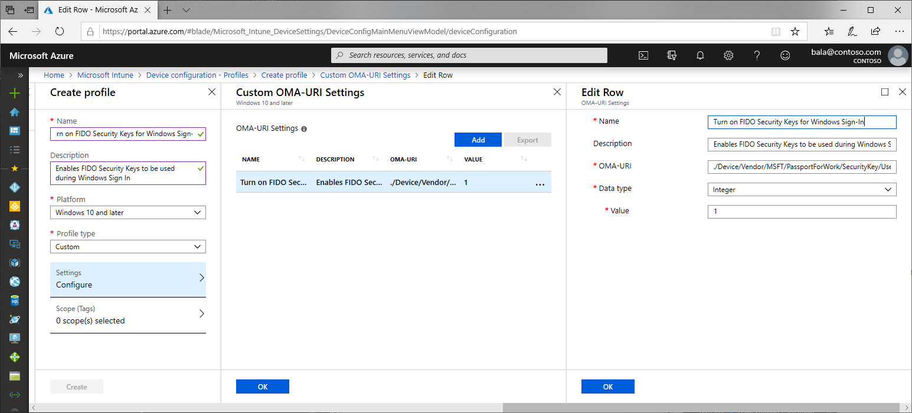
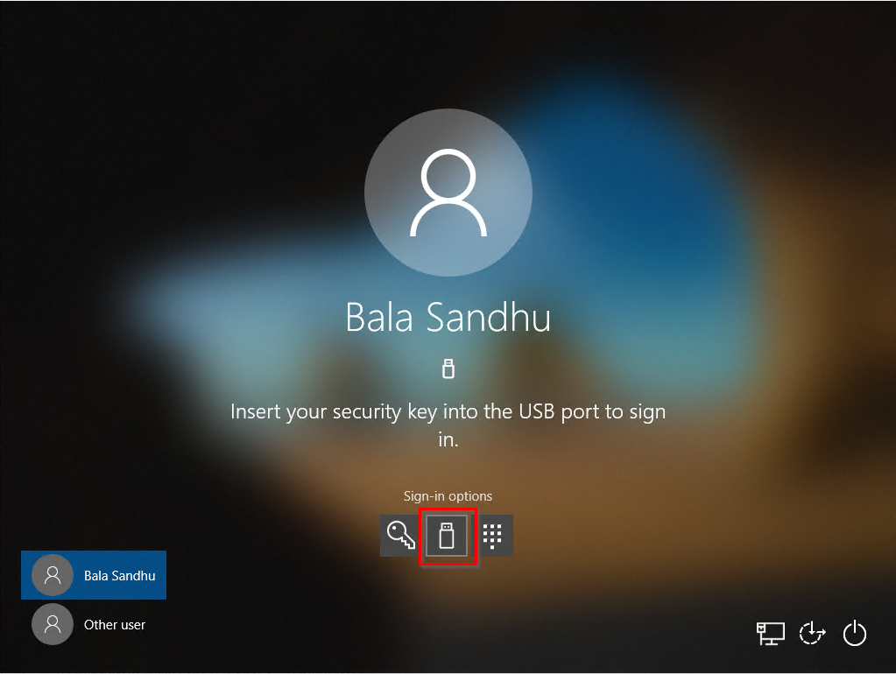

# Enable passwordless security key sign-in to Windows 10 devices with Azure Active Directory (preview)

This document focuses on enabling FIDO2 security key based passwordless authentication with Windows 10 devices. At the end of this article, you will be able to sign in to both your Azure AD and hybrid Azure AD joined Windows 10 devices with your Azure AD account using a FIDO2 security key.

|     |
| --- |
| FIDO2 security keys are a public preview feature of Azure Active Directory. For more information about previews, see  [Supplemental Terms of Use for Microsoft Azure Previews](https://azure.microsoft.com/support/legal/preview-supplemental-terms/)|
|     |

## Requirements

| Device Type | Azure AD joined | Hybrid Azure AD joined |
| --- | --- | --- |
| [Azure Multi-Factor Authentication](howto-mfa-getstarted.md) | X | X |
| [Combined security information registration preview](concept-registration-mfa-sspr-combined.md) | X | X |
| Compatible [FIDO2 security keys](concept-authentication-passwordless.md#fido2-security-keys) | X | X |
| WebAuthN requires Windows 10 version 1809 or higher | X | X |
| [Azure AD joined devices](../devices/concept-azure-ad-join.md) require Windows 10 version 1903 or higher | X |   |
| [Hybrid Azure AD joined devices](../devices/concept-azure-ad-join-hybrid.md) require Windows 10 Insider Build 18945 or higher |   | X |
| Fully patched Windows Server 2016/2019 Domain Controllers. |   | X |
| [Azure AD Connect](../hybrid/how-to-connect-install-roadmap.md#install-azure-ad-connect) version 1.4.32.0 or later |   | X |
| [Microsoft Intune](https://docs.microsoft.com/intune/fundamentals/what-is-intune) (Optional) | X | X |
| Provisioning package (Optional) | X | X |
| Group Policy (Optional) |   | X |

### Unsupported scenarios

The following scenarios aren't supported:

- Windows Server Active Directory Domain Services (AD DS) domain-joined (on-premises only devices) deployment.
- RDP, VDI, and Citrix scenarios using a security key.
- S/MIME using a security key.
- "Run as" using a security key.
- Log in to a server using a security key.
- If you haven't used your security key to sign in to your device while online, you can't use it to sign in or unlock offline.
- Signing in or unlocking a Windows 10 device with a security key containing multiple Azure AD accounts. This scenario utilizes the last account added to the security key. WebAuthN allows users to choose the account they wish to use.
- Unlock a device running Windows 10 version 1809. For the best experience, use Windows 10 version 1903 or higher.

## Prepare devices for preview

Azure AD joined devices that you are piloting during the feature preview with must run Windows 10 version 1809 or higher. The best experience is on Windows 10 version 1903 or higher.

Hybrid Azure AD joined devices must run Windows 10 Insider Build 18945 or newer.

## Enable security keys for Windows sign-in

Organizations may choose to use one or more of the following methods to enable the use of security keys for Windows sign-in based on their organization's requirements:

- [Enable with Intune](#enable-with-intune)
- [Targeted Intune deployment](#targeted-intune-deployment)
- [Enable with a provisioning package](#enable-with-a-provisioning-package)
- [Enable with Group Policy (Hybrid Azure AD joined devices only)](#enable-with-group-policy)

> [!IMPORTANT]
> Organizations with **hybrid Azure AD joined devices** must **also** complete the steps in the article, [Enable FIDO2 authentication to on-premises resources](howto-authentication-passwordless-security-key-on-premises.md) before Windows 10 FIDO2 security key authentication works.
>
> Organizations with **Azure AD joined devices** must do this before their devices can authenticate to on-premises resources with FIDO2 security keys.

### Enable with Intune

To enable the use of security keys using Intune, complete the following steps:

1. Sign in to the [Azure portal](https://portal.azure.com).
1. Browse to **Microsoft Intune** > **Device enrollment** > **Windows enrollment** > **Windows Hello for Business** > **Properties**.
1. Under **Settings**, set **Use security keys for sign-in** to **Enabled**.

Configuration of security keys for sign-in isn't dependent on configuring Windows Hello for Business.

### Targeted Intune deployment

To target specific device groups to enable the credential provider, use the following custom settings via Intune:

1. Sign in to the [Azure portal](https://portal.azure.com).
1. Browse to **Microsoft Intune** > **Device configuration** > **Profiles** > **Create profile**.
1. Configure the new profile with the following settings:
   - Name: Security Keys for Windows Sign-In
   - Description: Enables FIDO Security Keys to be used during Windows Sign In
   - Platform: Windows 10 and later
   - Profile type: Custom
   - Custom OMA-URI Settings:
      - Name: Turn on FIDO Security Keys for Windows Sign-In
      - OMA-URI: ./Device/Vendor/MSFT/PassportForWork/SecurityKey/UseSecurityKeyForSignin
      - Data Type: Integer
      - Value: 1
1. This policy can be assigned to specific users, devices, or groups. For more information, see [Assign user and device profiles in Microsoft Intune](https://docs.microsoft.com/intune/device-profile-assign).

### Enable with a provisioning package

For devices not managed by Intune, a provisioning package can be installed to enable the functionality. The Windows Configuration Designer app can be installed from the [Microsoft Store](https://www.microsoft.com/p/windows-configuration-designer/9nblggh4tx22). Complete the following steps to create a provisioning package:

1. Launch the Windows Configuration Designer.
1. Select **File** > **New project**.
1. Give your project a name and take note of the path where your project is created, then select **Next**.
1. Leave *Provisioning package* selected as the **Selected project workflow** and select **Next**.
1. Select *All Windows desktop editions* under **Choose which settings to view and configure**, then select **Next**.
1. Select **Finish**.
1. In your newly created project, browse to **Runtime settings** > **WindowsHelloForBusiness** > **SecurityKeys** > **UseSecurityKeyForSignIn**.
1. Set **UseSecurityKeyForSignIn** to *Enabled*.
1. Select **Export** > **Provisioning package**
1. Leave the defaults in the **Build** window under **Describe the provisioning package**, then select **Next**.
1. Leave the defaults in the **Build** window under **Select security details for the provisioning package** and select **Next**.
1. Take note of or change the path in the **Build** windows under **Select where to save the provisioning package** and select **Next**.
1. Select **Build** on the **Build the provisioning package** page.
1. Save the two files created (*ppkg* and *cat*) to a location where you can apply them to machines later.
1. To apply the provisioning package you created, see [Apply a provisioning package](https://docs.microsoft.com/windows/configuration/provisioning-packages/provisioning-apply-package).

> [!NOTE]
> Devices running Windows 10 Version 1809 must also enable shared PC mode (*EnableSharedPCMode*). For more information about enabling this functionality, see [Set up a shared or guest PC with Windows 10](https://docs.microsoft.com/windows/configuration/set-up-shared-or-guest-pc).

### Enable with Group Policy

For **hybrid Azure AD joined devices**, organizations can configure the following Group Policy setting to enable FIDO security key sign-in. The setting can be found under **Computer Configuration** > **Administrative Templates** > **System** > **Logon** > **Turn on security key sign-in**:

- Setting this policy to **Enabled** allows users to sign in with security keys.
- Setting this policy to **Disabled** or **Not Configured** stops users from signing in with security keys.

This Group Policy setting requires an updated version of the `credentialprovider.admx` Group Policy template. This new template is available with the next version of Windows Server and with Windows 10 20H1. This setting can be managed with a device running one of these newer versions of Windows or centrally by following the guidance in the support topic, [How to create and manage the Central Store for Group Policy Administrative Templates in Windows](https://support.microsoft.com/help/3087759/how-to-create-and-manage-the-central-store-for-group-policy-administra).

## Sign in with FIDO2 security key

In the example below, a user named Bala Sandhu has already provisioned their FIDO2 security key using the steps in the previous article, [Enable passwordless security key sign in](howto-authentication-passwordless-security-key.md#user-registration-and-management-of-fido2-security-keys). For hybrid Azure AD joined devices, make sure you have also [enabled passwordless security key sign-in to on-premises resources](howto-authentication-passwordless-security-key-on-premises.md). Bala can choose the security key credential provider from the Windows 10 lock screen and insert the security key to sign into Windows.

### Manage security key biometric, PIN, or reset security key

* Windows 10 version 1903 or higher
   * Users can open **Windows Settings** on their device > **Accounts** > **Security Key**
   * Users can change their PIN, update biometrics, or reset their security key

## Troubleshooting and feedback

If you'd like to share feedback or encounter issues while previewing this feature, share via the Windows Feedback Hub app using the following steps:

1. Launch **Feedback Hub** and make sure you're signed in.
1. Submit feedback under the following categorization:
   - Category: Security and Privacy
   - Subcategory: FIDO
1. To capture logs, use the option to **Recreate my Problem**

## Next steps

[Enable access to on-premises resources for Azure AD and hybrid Azure AD joined devices](howto-authentication-passwordless-security-key-on-premises.md)

[Learn more about device registration](../devices/overview.md)

[Learn more about Azure Multi-Factor Authentication](../authentication/howto-mfa-getstarted.md)
