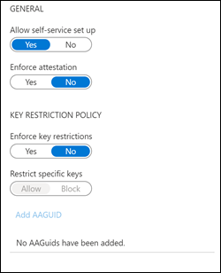
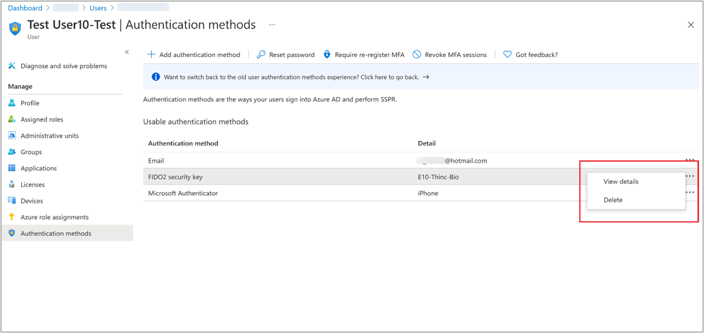
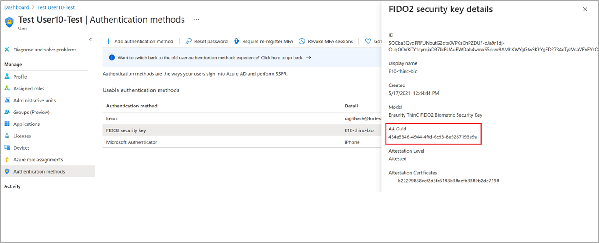
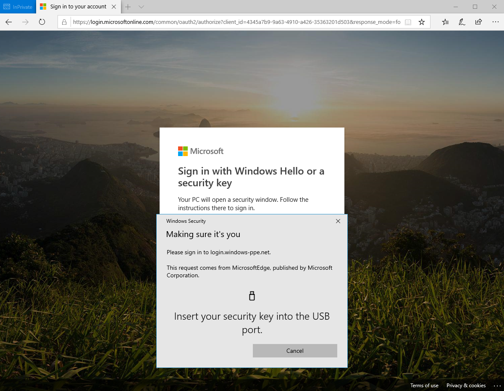

# Enable passwordless security key sign-in 

For enterprises that use passwords today and have a shared PC environment, security keys provide a seamless way for workers to authenticate without entering a username or password. Security keys provide improved productivity for workers, and have better security.

This document focuses on enabling security key based passwordless authentication. At the end of this article, you'll be able to sign in to web-based applications with your Microsoft Entra account using a FIDO2 security key.

## Requirements

- [Microsoft Entra multifactor authentication](howto-mfa-getstarted.md)
- Enable [Combined security information registration](concept-registration-mfa-sspr-combined.md)
- Compatible [FIDO2 security keys](concept-authentication-passwordless.md#fido2-security-keys)
- WebAuthN requires Windows 10 version 1903 or higher

To use security keys for logging in to web apps and services, you must have a browser that supports the WebAuthN protocol. 
These include Microsoft Edge, Chrome, Firefox, and Safari. For more information, see [Browser support of FIDO2 passwordless authentication](fido2-compatibility.md).

## Prepare devices

For devices that are joined to Microsoft Entra ID, the best experience is on Windows 10 version 1903 or higher.

Hybrid-joined devices must run Windows 10 version 2004 or higher.

## Enable passwordless authentication method

### Enable the combined registration experience

Registration features for passwordless authentication methods rely on the combined registration feature. Follow the steps in the article [Enable combined security information registration](howto-registration-mfa-sspr-combined.md), to enable combined registration.

### Enable FIDO2 security key method

[!INCLUDE [portal updates](~/articles/active-directory/includes/portal-update.md)]

1. Sign in to the [Microsoft Entra admin center](https://entra.microsoft.com) as at least an [Authentication Policy Administrator](../roles/permissions-reference.md#authentication-policy-administrator).
1. Browse to **Protection** > **Authentication methods** > **Authentication method policy**.
1. Under the method **FIDO2 Security Key**, click **All users**, or click **Add groups** to select specific groups. *Only security groups are supported*.
1. **Save** the configuration.

   >[!NOTE]
   >If you see an error when you try to save, the cause might be due to the number of users or groups being added. As a workaround, replace the users and groups you are trying to add with a single group, in the same operation, and then click **Save** again.

### FIDO Security Key optional settings 

There are some optional settings on the **Configure** tab to help manage how security keys can be used for sign-in.  

 

- **Allow self-service set up** should remain set to **Yes**. If set to no, your users won't be able to register a FIDO key through MySecurityInfo, even if enabled by Authentication Methods policy.  
- **Enforce attestation** setting to **Yes** requires the FIDO security key metadata to be published and verified with the FIDO Alliance Metadata Service, and also pass Microsoft's additional set of validation testing. For more information, see [What is a Microsoft-compatible security key?](concept-authentication-passwordless.md#fido2-security-key-providers)

**Key Restriction Policy**

- **Enforce key restrictions** should be set to **Yes** only if your organization wants to only allow or disallow certain FIDO security keys, which are identified by their Authenticator Attestation GUID (AAGUID). You can work with your security key provider to determine the AAGUID of a device. If the key is already registered, you can find the AAGUID by viewing the authentication method details of the key for the user. 

  >[!WARNING]
  >Key restrictions set the usability of specific FIDO2 methods for both registration and authentication. If you change key restrictions and remove an AAGUID that you previously allowed, users who previously registered an allowed method can no longer use it for sign-in. 

## Disable a key 

To remove a FIDO2 key associated with a user account, delete the key from the user’s authentication method.

1. Sign in to the [Microsoft Entra admin center](https://entra.microsoft.com) and search for the user account from which the FIDO key is to be removed.
1. Select **Authentication methods** > right-click **FIDO2 security key** and click **Delete**. 

    

## Security key Authenticator Attestation GUID (AAGUID)

The FIDO2 specification requires each security key provider to provide an Authenticator Attestation GUID (AAGUID) during attestation. An AAGUID is a 128-bit identifier indicating the key type, such as the make and model. 

>[!NOTE]
>The manufacturer must ensure that the AAGUID is identical across all substantially identical keys made by that manufacturer, and different (with high probability) from the AAGUIDs of all other types of keys. To ensure, the AAGUID for a given type of security key should be randomly generated. For more information, see [Web Authentication: An API for accessing Public Key Credentials - Level 2 (w3.org)](https://w3c.github.io/webauthn/).

There are two ways to get your AAGUID. You can either ask your security key provider or view the authentication method details of the key per user.

## User registration and management of FIDO2 security keys

1. Browse to [https://myprofile.microsoft.com](https://myprofile.microsoft.com).
1. Sign in if not already.
1. Click **Security Info**.
   1. If the user already has at least one Microsoft Entra multifactor authentication method registered, they can immediately register a FIDO2 security key.
   1. If they don't have at least one Microsoft Entra multifactor authentication method registered, they must add one.
   1. An Administrator can issue a [Temporary Access Pass](howto-authentication-temporary-access-pass.md) to allow the user to register a Passwordless authentication method.
1. Add a FIDO2 Security key by clicking **Add method** and choosing **Security key**.
1. Choose **USB device** or **NFC device**.
1. Have your key ready and choose **Next**.
1. A box will appear and ask the user to create/enter a PIN for your security key, then perform the required gesture for the key, either biometric or touch.
1. The user will be returned to the combined registration experience and asked to provide a meaningful name for the key to identify it easily. Click **Next**.
1. Click **Done** to complete the process.

## Sign in with passwordless credential

In the example below a user has already provisioned their FIDO2 security key. The user can choose to sign in on the web with their FIDO2 security key inside of a supported browser on Windows 10 version 1903 or higher.

## Troubleshooting and feedback

If you'd like to share feedback or encounter issues with this feature, share via the Windows Feedback Hub app using the following steps:

1. Launch **Feedback Hub** and make sure you're signed in.
1. Submit feedback under the following categorization:
   - Category: Security and Privacy
   - Subcategory: FIDO
1. To capture logs, use the option to **Recreate my Problem**.

## Known issues

### Security key provisioning

Administrator provisioning and de-provisioning of security keys isn't available.

### UPN changes

If a user's UPN changes, you can no longer modify FIDO2 security keys to account for the change. The solution for a user with a FIDO2 security key is to sign in to MySecurityInfo, delete the old key, and add a new one.

## Next steps

[FIDO2 security key Windows 10 sign in](howto-authentication-passwordless-security-key-windows.md)

[Enable FIDO2 authentication to on-premises resources](howto-authentication-passwordless-security-key-on-premises.md)

[Learn more about device registration](../devices/overview.md)

[Learn more about Microsoft Entra multifactor authentication](../authentication/howto-mfa-getstarted.md)
