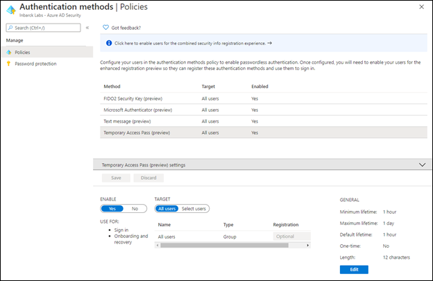
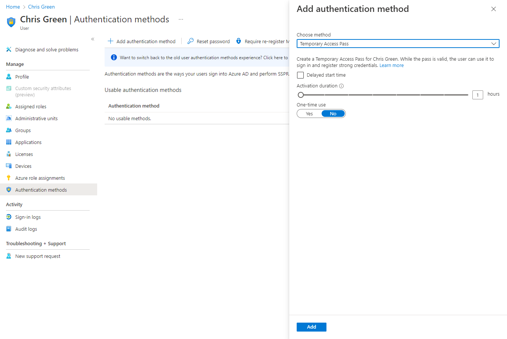
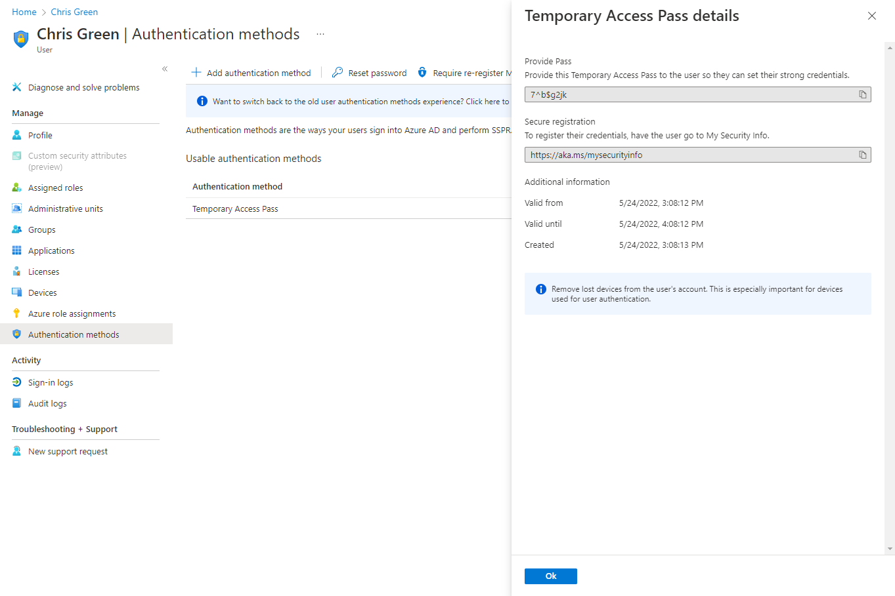
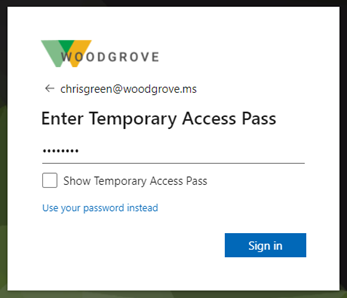
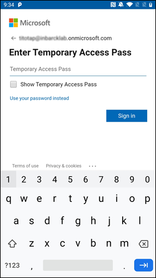
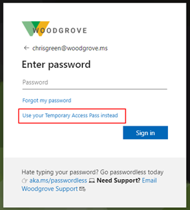

# Configure Temporary Access Pass in Azure AD to register Passwordless authentication methods (Preview)

Passwordless authentication methods, such as FIDO2 and Passwordless Phone Sign-in through the Microsoft Authenticator app, enable users to sign in securely without a password. 
Users can bootstrap Passwordless methods in one of two ways:

- Using existing Azure AD Multi-Factor Authentication methods 
- Using a Temporary Access Pass (TAP) 

A Temporary Access Pass is a time-limited passcode issued by an admin that satisfies strong authentication requirements and can be used to onboard other authentication methods, including Passwordless ones. 
A Temporary Access Pass also makes recovery easier when a user has lost or forgotten their strong authentication factor like a FIDO2 security key or Microsoft Authenticator app, but needs to sign in to register new strong authentication methods.


This article shows you how to enable and use a Temporary Access Pass in Azure AD using the Azure portal. 
You can also perform these actions using the REST APIs. 

>[!NOTE]
>Temporary Access Pass is currently in public preview. Some features might not be supported or have limited capabilities. 

## Enable the Temporary Access Pass policy

A Temporary Access Pass policy defines settings, such as the lifetime of passes created in the tenant, or the users and groups who can use a Temporary Access Pass to sign-in. 
Before anyone can sign in with a Temporary Access Pass, you need to enable the authentication method policy and choose which users and groups can sign in by using a Temporary Access Pass.
Although you can create a Temporary Access Pass for any user, only those included in the policy can sign-in with it.

Global administrator and Authentication Method Policy administrator role holders can update the Temporary Access Pass authentication method policy.
To configure the Temporary Access Pass authentication method policy:

1. Sign in to the Azure portal as a Global admin and click **Azure Active Directory** > **Security** > **Authentication methods** > **Temporary Access Pass**.
1. Click **Yes** to enable the policy, select which users have the policy applied, and any **General** settings.

   

   The default value and the range of allowed values are described in the following table.


   | Setting | Default values | Allowed values | Comments |
   |---|---|---|---|
   | Minimum lifetime | 1 hour | 10 – 43200 Minutes (30 days) | Minimum number of minutes that the Temporary Access Pass is valid. |
   | Maximum lifetime | 24 hours | 10 – 43200 Minutes (30 days) | Maximum number of minutes that the Temporary Access Pass is valid. |
   | Default lifetime | 1 hour | 10 – 43200 Minutes (30 days) | Default values can be override by the individual passes, within the minimum and maximum lifetime configured by the policy. |
   | One-time use | False | True / False | When the policy is set to false, passes in the tenant can be used either once or more than once during its validity (maximum lifetime). By enforcing one-time use in the Temporary Access Pass policy, all passes created in the tenant will be created as one-time use. |
   | Length | 8 | 8-48 characters | Defines the length of the passcode. |

## Create a Temporary Access Pass

After you enable a policy, you can create a Temporary Access Pass for a user in Azure AD. 
These roles can perform the following actions related to a Temporary Access Pass.

- Global administrator can create, delete, view a Temporary Access Pass on any user (except themselves)
- Privileged Authentication administrators can create, delete, view a Temporary Access Pass on admins and members (except themselves)
- Authentication administrators can create, delete, view a Temporary Access Pass on members  (except themselves)
- Global Administrator can view the Temporary Access Pass details on the user (without reading the code itself).

1. Sign in to the Azure portal as either a Global administrator, Privileged Authentication administrator, or Authentication administrator. 
1. Click **Azure Active Directory**, browse to Users, select a user, such as *Chris Green*, then choose **Authentication methods**.
1. If needed, select the option to **Try the new user authentication methods experience**.
1. Select the option to **Add authentication methods**.
1. Below **Choose method**, click **Temporary Access Pass (Preview)**.
1. Define a custom activation time or duration and click **Add**.

   

1. Once added, the details of the Temporary Access Pass are shown. Make a note of the actual Temporary Access Pass value. You provide this value to the user. You can't view this value after you click **Ok**.
   
   

The following commands show how to create and get a Temporary Access Pass by using PowerShell:

```powershell
# Create a Temporary Access Pass for a user
$properties = @{}
$properties.isUsableOnce = $True
$properties.startDateTime = '2021-03-11 06:00:00'
$propertiesJSON = $properties | ConvertTo-Json

New-MgUserAuthenticationTemporaryAccessPassMethod -UserId user2@contoso.com -BodyParameter $propertiesJSON

Id                                   CreatedDateTime       IsUsable IsUsableOnce LifetimeInMinutes MethodUsabilityReason StartDateTime         TemporaryAccessPass
--                                   ---------------       -------- ------------ ----------------- --------------------- -------------         -------------------
c5dbd20a-8b8f-4791-a23f-488fcbde3b38 9/03/2021 11:19:17 PM False    True         60                NotYetValid           11/03/2021 6:00:00 AM TAPRocks!

# Get a user's Temporary Access Pass
Get-MgUserAuthenticationTemporaryAccessPassMethod -UserId user3@contoso.com

Id                                   CreatedDateTime       IsUsable IsUsableOnce LifetimeInMinutes MethodUsabilityReason StartDateTime         TemporaryAccessPass
--                                   ---------------       -------- ------------ ----------------- --------------------- -------------         -------------------
c5dbd20a-8b8f-4791-a23f-488fcbde3b38 9/03/2021 11:19:17 PM False    True         60                NotYetValid           11/03/2021 6:00:00 AM

```

## Use a Temporary Access Pass

The most common use for a Temporary Access Pass is for a user to register authentication details during the first sign-in, without the need to complete additional security prompts. Authentication methods are registered at [https://aka.ms/mysecurityinfo](https://aka.ms/mysecurityinfo). Users can also update existing authentication methods here.

1. Open a web browser to [https://aka.ms/mysecurityinfo](https://aka.ms/mysecurityinfo).
1. Enter the UPN of the account you created the Temporary Access Pass for, such as *tapuser@contoso.com*.
1. If the user is included in the Temporary Access Pass policy, they will see a screen to enter their Temporary Access Pass.
1. Enter the Temporary Access Pass that was displayed in the Azure portal.

   

>[!NOTE]
>For federated domains, a Temporary Access Pass is preferred over federation. A user with a Temporary Access Pass will complete the authentication in Azure AD and will not get redirected to the federated Identity Provider (IdP).

The user is now signed in and can update or register a method such as FIDO2 security key. 
Users who update their authentication methods due to losing their credentials or device should make sure they remove the old authentication methods.
Users can also continue to sign-in by using their password; a TAP doesn’t replace a user’s password.

Users can also use their Temporary Access Pass to register for Passwordless phone sign-in directly from the Authenticator app. For more information, see [Add your work or school account to the Microsoft Authenticator app](../user-help/user-help-auth-app-add-work-school-account.md).



## Delete a Temporary Access Pass

An expired Temporary Access Pass can’t be used. Under the **Authentication methods** for a user, the **Detail** column shows when the Temporary Access Pass expired. You can delete an expired Temporary Access Pass using the following steps:

1. In the Azure AD portal, browse to **Users**, select a user, such as *Tap User*, then choose **Authentication methods**.
1. On the right-hand side of the **Temporary Access Pass (Preview)** authentication method shown in the list, select **Delete**.

You can also use PowerShell:

```powershell
# Remove a user's Temporary Access Pass
Remove-MgUserAuthenticationTemporaryAccessPassMethod -UserId user3@contoso.com -TemporaryAccessPassAuthenticationMethodId c5dbd20a-8b8f-4791-a23f-488fcbde3b38
```

## Replace a Temporary Access Pass 

- A user can only have one Temporary Access Pass. The passcode can be used during the start and end time of the Temporary Access Pass.
- If the user requires a new Temporary Access Pass:
  - If the existing Temporary Access Pass is valid, the admin needs to delete the existing Temporary Access Pass and create a new pass for the user. 
  - If the existing Temporary Access Pass has expired, a new Temporary Access Pass will override the existing Temporary Access Pass.

For more information about NIST standards for onboarding and recovery, see [NIST Special Publication 800-63A](https://pages.nist.gov/800-63-3/sp800-63a.html#sec4).

## Limitations

Keep these limitations in mind:

- When using a one-time Temporary Access Pass to register a Passwordless method such as FIDO2 or Phone sign-in, the user must complete the registration within 10 minutes of sign-in with the one-time Temporary Access Pass. This limitation does not apply to a Temporary Access Pass that can be used more than once.
- Guest users can't sign in with a Temporary Access Pass.
- Temporary Access Pass is in public preview and currently not available in Azure for US Government.
- Users in scope for Self Service Password Reset (SSPR) registration policy *or* [Identity Protection Multi-factor authentication registration policy](../identity-protection/howto-identity-protection-configure-mfa-policy.md) will be required to register authentication methods after they have signed in with a Temporary Access Pass. 
Users in scope for these policies will get redirected to the [Interrupt mode of the combined registration](concept-registration-mfa-sspr-combined.md#combined-registration-modes). This experience does not currently support FIDO2 and Phone Sign-in registration. 
- A Temporary Access Pass cannot be used with the Network Policy Server (NPS) extension and Active Directory Federation Services (AD FS) adapter, or during Windows Setup/Out-of-Box-Experience (OOBE), Autopilot, or to deploy Windows Hello for Business. 
- When Seamless SSO is enabled on the tenant, the users are prompted to enter a password. The **Use your Temporary Access Pass instead** link will be available for the user to sign-in with a Temporary Access Pass.

  

## Troubleshooting    

- If a Temporary Access Pass is not offered to a user during sign-in, check the following:
  - The user is in scope for the Temporary Access Pass authentication method policy.
  - The user has a valid Temporary Access Pass, and if it is one-time use, it wasn’t used yet.
- If **Temporary Access Pass sign in was blocked due to User Credential Policy** appears during sign-in with a Temporary Access Pass, check the following:
  - The user has a multi-use Temporary Access Pass while the authentication method policy requires a one-time Temporary Access Pass.
  - A one-time Temporary Access Pass was already used.
- If Temporary Access Pass sign-in was blocked due to User Credential Policy, check that the user is in scope for the TAP policy.

## Next steps

- [Plan a passwordless authentication deployment in Azure Active Directory](howto-authentication-passwordless-deployment.md)

