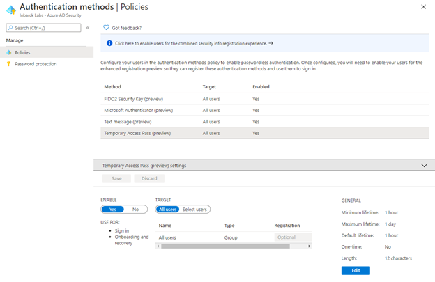
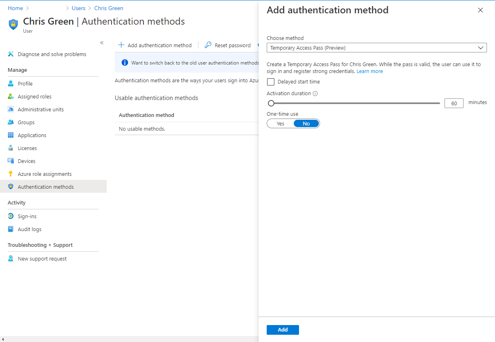
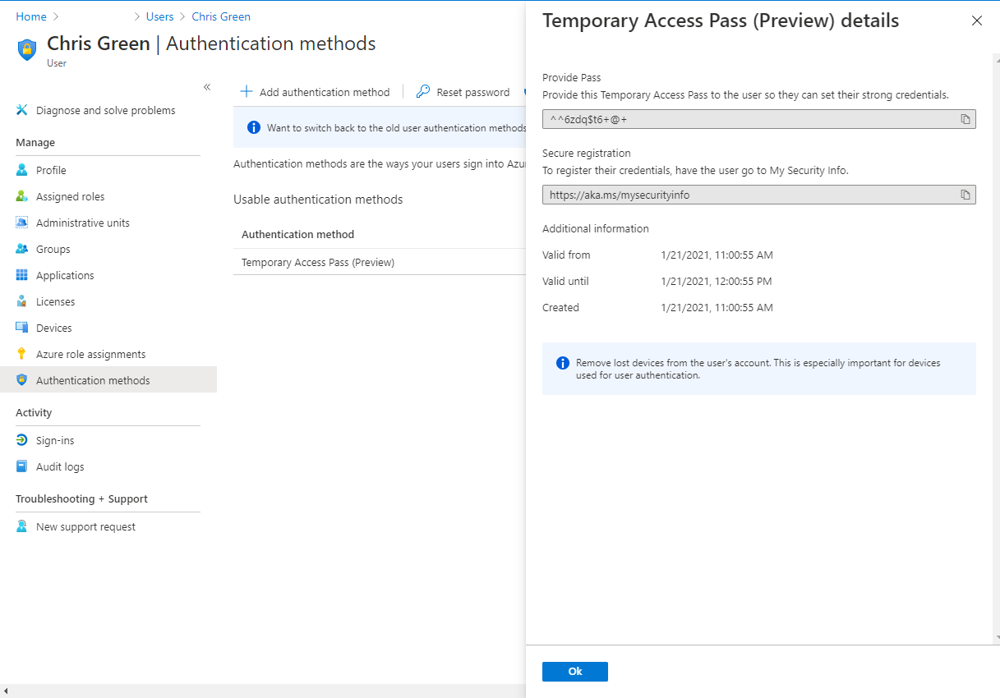
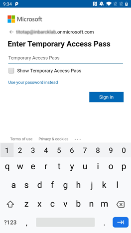

# Configure Temporary Access Pass to register Passwordless credentials 

To use Passwordless credentials, users need to register themselves as a first step. 
If users are already registered for Azure AD Multi-Factor Authentication (MFA), they can use Azure AD MFA to bootstrap their Passwordless credentials. 
In cases where users can’t use Azure AD MFA (for example, phones can’t be used in the facility), you can configure a Temporary Access Pass (TAP) to bootstrap their Passwordless credentials.  

TAP is a time-limited passcode that serves as strong credentials and allows onboarding of Passwordless credentials. 
TAP also makes recovery easier when a user has lost or forgotten their strong authentication factor like a FIDO2 security key or Microsoft Authenticator app, but needs to sign in to register new strong authentication methods. 

This article shows you how to enable and use a TAP in Azure AD using the Azure portal. 
You can also perform these actions using the REST APIs. 

## Enable the TAP policy

A TAP policy defines settings, such as the lifetime of passes created in the tenant, or the users and groups who can use a TAP to sign-in. 
Before anyone can sign in with a TAP, you need to enable the authentication method policy and choose which users and groups can sign in by using a TAP.
Although you can create a TAP for any user, only those included in the policy can sign-in with it.

Global administrator and Authentication Method Policy administrator role holders can update the TAP authentication method policy.
To configure the TAP authentication method policy:

1. Sign in to the Azure portal as a Global admin and click **Azure Active Directory** > **Security** > **Authentication methods** > **Temporary Access Pass**.
1. Click **Yes** to enable the policy, select which users have the policy applied, and any **General** settings described in the following table.

| Setting          | Default values | Allowed values               | Comments                                                                                                                                                                                                                                                                 |   |
|------------------|----------------|------------------------------|--------------------------------------------------------------------------------------------------------------------------------------------------------------------------------------------------------------------------------------------------------------------------|---|
| Minimum lifetime | 1 hour         | 10 – 43200 Minutes (30 days) | Minimum number of minutes that the TAP is valid.                                                                                                                                                                                                                         |   |
| Maximum lifetime | 24 hours       | 10 – 43200 Minutes (30 days) | Maximum number of minutes that the TAP is valid.                                                                                                                                                                                                                         |   |
| Default lifetime | 1 hour         | 10 – 43200 Minutes (30 days) | Default values can be override by the individual passes, within the minimum and maximum lifetime configured by the policy                                                                                                                                                |   |
| One-time use     | False          | True / False                 | When the policy is set to false, passes in the tenant can be used either once or more than once during its validity (maximum lifetime). By enforcing one-time use in the TAP policy, all passes created in the tenant will be created as one-time use. |   |
| Length           | 8              | 8-48 characters              | Defines the length of the passcode.                                                                                                                                                                                                                                      |   |

## Create a TAP in the Azure AD Portal

After you enable a TAP policy, you can create a TAP for a user in Azure AD. 
These roles can perform the following actions related to TAP.

- Global administrator can create, delete, view TAP on any user (except themselves)
- Privileged Authentication administrators can create, delete, view TAP on admins and members (except themselves)
- Authentication administrators can create, delete, view TAP on members  (except   themselves)
- Global Administrator can view the TAP details on the user (without reading the code itself).

To create a TAP:

1. Sign in to  the portal as either a Global administrator, Privileged Authentication administrator, or Authentication administrator. 
1. Click **Azure Active Directory**, browse to Users, select a user, such as *Chris Green*, then choose **Authentication methods**.
1. If needed, select the option to **Try the new user authentication methods experience**.
1. Select the option to **Add authentication methods**.
1. Below **Choose method**, click **Temporary Access Pass (Preview)**.
1. Define a custom activation time or duration and click **Add**.

   

1. Once added, the details of the TAP are shown. Make a note of the actual TAP value. You provide this value to the user. You can't view this value after you click **Ok**.
   
   

## Use a TAP

The most common use for a TAP is for a user to register authentication details during the first sign-in, without the need to complete additional security prompts. Authentication methods are registered at [https://aka.ms/mysecurityinfo](https://aka.ms/mysecurityinfo). Users can also update existing authentication methods here.

1. Open a web browser to [https://aka.ms/mysecurityinfo](https://aka.ms/mysecurityinfo).
1. Enter the UPN of the account you created the TAP for, such as *tapuser@contoso.com*.
1. If the user is included in the TAP policy, they will see a screen to enter their TAP.
1. Enter the TAP that was displayed in the Azure portal.

   

>[!NOTE]
>For federated domains, a TAP is preferred over federation. A user with a TAP will complete the authentication in Azure AD and will not get redirected to the federated Identity Provider (IdP).

The user is now signed in and can update or register a method such as FIDO2 security key. 
Users who update their authentication methods due to losing their credentials or device should make sure they remove the old authentication methods.

Users can also use their TAP to register for Passwordless phone sign-in directly from the Authenticator app. For more information, see [Add your work or school account to the Microsoft Authenticator app](../user-help/user-help-auth-app-add-work-school-account.md).

## Delete a TAP

An expired TAP can’t be used. Under the **Authentication methods** for a user, the **Detail** column shows when the TAP expired. You can delete these expired TAPs using the following steps:

1. In the Azure AD portal, browse to **Users**, select a user, such as *Tap User*, then choose **Authentication methods**.
1. On the right-hand side of the **Temporary Access Pass (Preview)** authentication method shown in the list, select **Delete**.

## Replacing a TAP 

- A user can only have one TAP. The passcode can be used during the start and end time of the TAP.
- If the user requires a new TAP:
  - If the existing TAP is valid, the admin needs to delete the existing TAP and create a new pass for the user. Deleting a valid TAP will revoke the user’s sessions. 
  - If the existing TAP has expired, a new TAP will override the existing TAP and will not revoke the user’s sessions.

For more information about NIST standards for onboarding and recovery, see [NIST Special Publication 800-63A](https://pages.nist.gov/800-63-3/sp800-63a.html#sec4).

## Limitations

Keep these limitations in mind:

- When using a one-time TAP to register a Passwordless method such as FIDO2 or Phone sign-in, the user must complete the registration within 10 minutes of sign-in with the one-time TAP. This limitation does not apply to a TAP that can be used more than once.
- Guest users can't sign in with a TAP.
- Users in scope for Self Service Password Reset (SSPR) registration policy will be required to register one of the SSPR methods after they have signed in with TAP. If the user is only going to use FIDO2 key, exclude them from the SSPR policy or disable the SSPR registration policy. 
- TAP cannot be used with the Network Policy Server (NPS) extension and Active Directory Federation Services (AD FS) adapter.
- When Seamless SSO is enabled on the tenant, the users are prompted to enter a password. The **Use your Temporary Access Pass instead** link will be available for the user to sign-in with TAP.

## Troubleshooting    

- If TAP is not offered to a user during sign-in, check the following:
  - The user is in scope for the TAP authentication method policy.
  - The user has a valid TAP, and if it is one-time use, it wasn’t used yet.
- If **Temporary Access Pass sign in was blocked due to User Credential Policy** appears during sign-in with TAP, check the following:
  - The user has a multi-use TAP while the authentication method policy requires a one-time TAP.
  - A one-time TAP was already used.

## Next steps

Link to APIs

