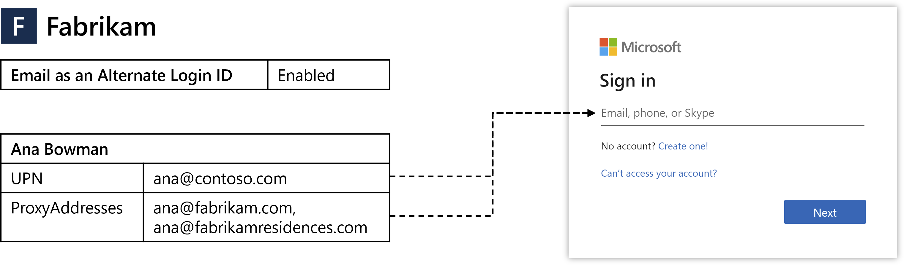
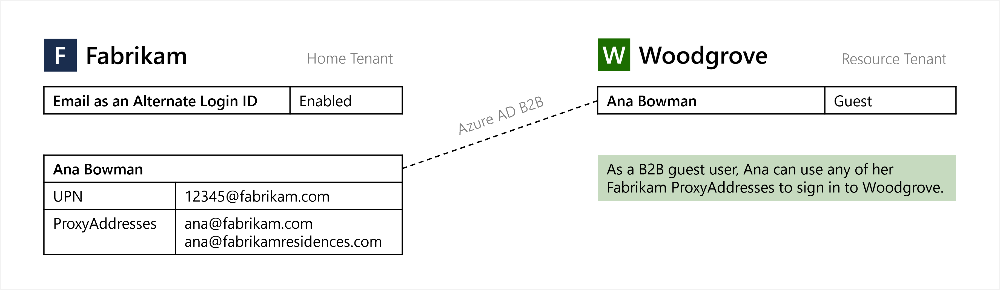
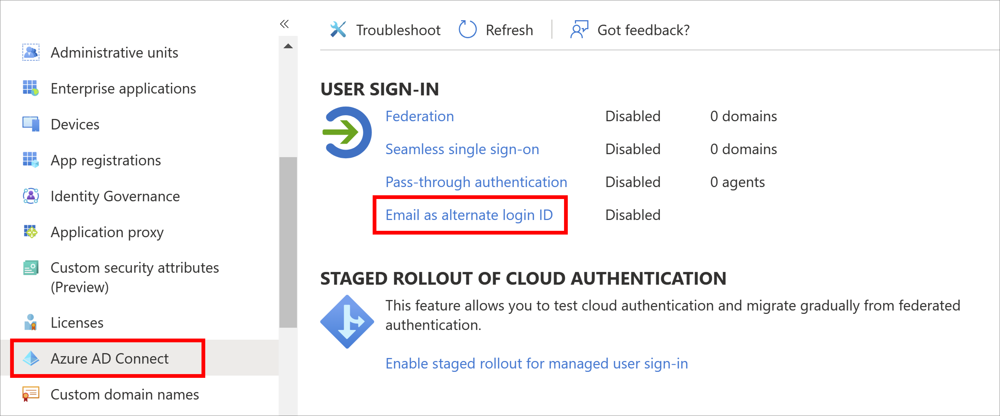
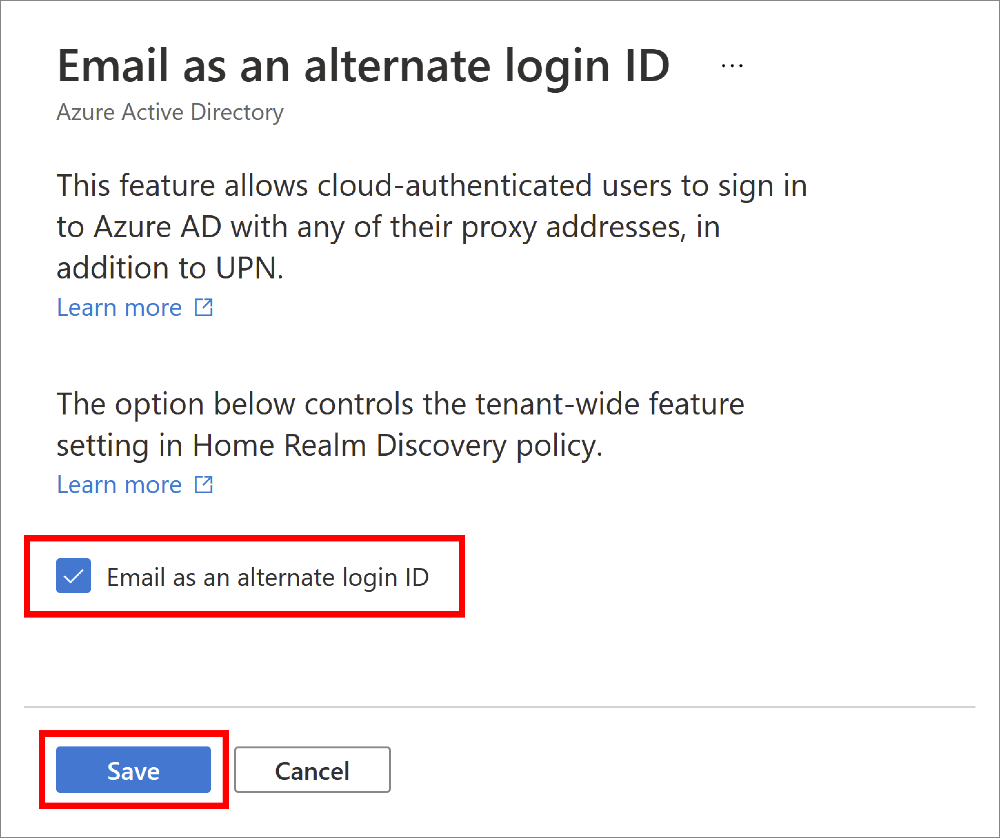

# Sign-in to Azure AD with email as an alternate login ID (Preview)

> [!NOTE]
> Sign-in to Azure AD with email as an alternate login ID is a public preview feature of Azure Active Directory. For more information about previews, see [Supplemental Terms of Use for Microsoft Azure Previews](https://azure.microsoft.com/support/legal/preview-supplemental-terms/).

Many organizations want to let users sign in to Azure Active Directory (Azure AD) using the same credentials as their on-premises directory environment. With this approach, known as hybrid authentication, users only need to remember one set of credentials.

Some organizations haven't moved to hybrid authentication for the following reasons:

* By default, the Azure AD User Principal Name (UPN) is set to the same value as the on-premises UPN.
* Changing the Azure AD UPN creates a mismatch between on-premises and Azure AD environments that could cause problems with certain applications and services.
* Due to business or compliance reasons, the organization doesn't want to use the on-premises UPN to sign in to Azure AD.

To move toward hybrid authentication, you can configure Azure AD to let users sign in with their email as an alternate login ID. For example, if *Contoso* rebranded to *Fabrikam*, rather than continuing to sign in with the legacy `ana@contoso.com` UPN, email as an alternate login ID can be used. To access an application or service, users would sign in to Azure AD using their non-UPN email, such as `ana@fabrikam.com`.



This article shows you how to enable and use email as an alternate login ID.

## Before you begin

Here's what you need to know about email as an alternate login ID:

* The feature is available in Azure AD Free edition and higher.
* The feature enables sign-in with *ProxyAddresses*, in addition to UPN, for cloud-authenticated Azure AD users. More on how this applies to Azure AD business-to-business (B2B) collaboration in the [B2B](#b2b-guest-user-sign-in-with-an-email-address) section.
* When a user signs in with a non-UPN email, the `unique_name` and `preferred_username` claims (if present) in the [ID token](../develop/id-tokens.md) will return the non-UPN email.
    * If the non-UPN email in use becomes stale (no longer belongs to the user), these claims will return the UPN instead.
* The feature supports managed authentication with Password Hash Sync (PHS) or Pass-Through Authentication (PTA).
* There are two options for configuring the feature:
    * [Home Realm Discovery (HRD) policy](#enable-user-sign-in-with-an-email-address) - Use this option to enable the feature for the entire tenant. Global Administrator, Application Administrator, or Cloud Application Administrator role is required.
    * [Staged rollout policy](#enable-staged-rollout-to-test-user-sign-in-with-an-email-address) - Use this option to test the feature with specific Azure AD groups. Global Administrator privileges required. When you first add a security group for staged rollout, you're limited to 200 users to avoid a UX time-out. After you've added the group, you can add more users directly to it, as required.

## Preview limitations

In the current preview state, the following limitations apply to email as an alternate login ID:

* **User experience** - Users may see their UPN, even when they signed-in with their non-UPN email. The following example behavior may be seen:
    * User is prompted to sign in with UPN when directed to Azure AD sign-in with `login_hint=<non-UPN email>`.
    * When a user signs-in with a non-UPN email and enters an incorrect password, the *"Enter your password"* page changes to display the UPN.
    * On some Microsoft sites and apps, such as Microsoft Office, the *Account Manager* control typically displayed in the upper right may display the user's UPN instead of the non-UPN email used to sign in.

* **Unsupported flows** - Some flows are currently not compatible with non-UPN emails, such as the following:
    * Identity Protection doesn't match non-UPN emails with *Leaked Credentials* risk detection. This risk detection uses the UPN to match credentials that have been leaked. For more information, see [How To: Investigate risk](../identity-protection/howto-identity-protection-investigate-risk.md).
    * When a user is signed-in with a non-UPN email, they cannot change their password. Azure AD self-service password reset (SSPR) should work as expected. During SSPR, the user may see their UPN if they verify their identity using a non-UPN email.

* **Unsupported scenarios** - The following scenarios are not supported. Sign-in with non-UPN email for:
    * [Hybrid Azure AD joined devices](../devices/concept-hybrid-join.md)
    * [Azure AD joined devices](../devices/concept-directory-join.md)
    * [Azure AD registered devices](../devices/concept-device-registration.md)
    * [Resource Owner Password Credentials (ROPC)](../develop/v2-oauth-ropc.md)
    * Legacy authentication such as POP3 and SMTP
    * Skype for Business

* **Unsupported apps** - Some third-party applications may not work as expected if they assume that the `unique_name` or `preferred_username` claims are immutable or will always match a specific user attribute, such as UPN.

* **Logging** - Changes made to the feature's configuration in HRD policy are not explicitly shown in the audit logs.

* **Staged rollout policy** - The following limitations apply only when the feature is enabled using staged rollout policy:
    * The feature does not work as expected for users that are included in other staged rollout policies.
    * Staged rollout policy supports a maximum of 10 groups per feature.
    * Staged rollout policy does not support nested groups.
    * Staged rollout policy does not support dynamic groups.
    * Contact objects inside the group will block the group from being added to a staged rollout policy.

* **Duplicate values** - Within a tenant, a cloud-only user's UPN can be the same value as another user's proxy address synced from the on-premises directory. In this scenario, with the feature enabled, the cloud-only user will not be able to sign in with their UPN. More on this issue in the [Troubleshoot](#troubleshoot) section.

## Overview of alternate login ID options
To sign in to Azure AD, users enter a value that uniquely identifies their account. Historically, you could only use the Azure AD UPN as the sign-in identifier.

For organizations where the on-premises UPN is the user's preferred sign-in email, this approach was great. Those organizations would set the Azure AD UPN to the exact same value as the on-premises UPN, and users would have a consistent sign-in experience.

### Alternate Login ID for AD FS

However, in some organizations the on-premises UPN isn't used as a sign-in identifier. In the on-premises environments, you would configure the local AD DS to allow sign-in with an alternate login ID. Setting the Azure AD UPN to the same value as the on-premises UPN isn't an option as Azure AD would then require users to sign in with that value.

### Alternate Login ID in Azure AD Connect

The typical workaround to this issue was to set the Azure AD UPN to the email address the user expects to sign in with. This approach works, though results in different UPNs between the on-premises AD and Azure AD, and this configuration isn't compatible with all Microsoft 365 workloads.

### Email as an Alternate Login ID

A different approach is to synchronize the Azure AD and on-premises UPNs to the same value and then configure Azure AD to allow users to sign in to Azure AD with a verified email. To provide this ability, you define one or more email addresses in the user's *ProxyAddresses* attribute in the on-premises directory. *ProxyAddresses* are then synchronized to Azure AD automatically using Azure AD Connect.


| Option | Description |
|---|---|
| [Alternate Login ID for AD FS](/windows-server/identity/ad-fs/operations/configuring-alternate-login-id) | Enable sign-in with an alternate attribute (such as Mail) for AD FS users. |
| [Alternate Login ID in Azure AD Connect](../hybrid/plan-connect-userprincipalname.md#alternate-login-id) | Synchronize an alternate attribute (such as Mail) as the Azure AD UPN. |
| Email as an Alternate Login ID | Enable sign-in with verified domain *ProxyAddresses* for Azure AD users. |

## Synchronize sign-in email addresses to Azure AD

Traditional Active Directory Domain Services (AD DS) or Active Directory Federation Services (AD FS) authentication happens directly on your network and is handled by your AD DS infrastructure. With hybrid authentication, users can instead sign in directly to Azure AD.

To support this hybrid authentication approach, you synchronize your on-premises AD DS environment to Azure AD using [Azure AD Connect][azure-ad-connect] and configure it to use PHS or PTA. For more information, see [Choose the right authentication method for your Azure AD hybrid identity solution][hybrid-auth-methods].

In both configuration options, the user submits their username and password to Azure AD, which validates the credentials and issues a ticket. When users sign in to Azure AD, it removes the need for your organization to host and manage an AD FS infrastructure.

One of the user attributes that's automatically synchronized by Azure AD Connect is *ProxyAddresses*. If users have an email address defined in the on-premises AD DS environment as part of the *ProxyAddresses* attribute, it's automatically synchronized to Azure AD. This email address can then be used directly in the Azure AD sign-in process as an alternate login ID.

> [!IMPORTANT]
> Only emails in verified domains for the tenant are synchronized to Azure AD. Each Azure AD tenant has one or more verified domains, for which you have proven ownership, and are uniquely bound to your tenant.
>
> For more information, see [Add and verify a custom domain name in Azure AD][verify-domain].

## B2B guest user sign-in with an email address



Email as an alternate login ID applies to [Azure AD B2B collaboration](../external-identities/what-is-b2b.md) under a "bring your own sign-in identifiers" model. When email as an alternate login ID is enabled in the home tenant, Azure AD users can perform guest sign in with non-UPN email on the resource tenant endpoint. No action is required from the resource tenant to enable this functionality.

> [!NOTE]
> When an alternate login ID is used on a resource tenant endpoint that does not have the functionality enabled, the sign-in process will work seamlessly, but SSO will be interrupted.  

## Enable user sign-in with an email address

> [!NOTE]
> This configuration option uses HRD policy. For more information, see [homeRealmDiscoveryPolicy resource type](/graph/api/resources/homeRealmDiscoveryPolicy).

Once users with the *ProxyAddresses* attribute applied are synchronized to Azure AD using Azure AD Connect, you need to enable the feature for users to sign in with email as an alternate login ID for your tenant. This feature tells the Azure AD login servers to not only check the sign-in identifier against UPN values, but also against *ProxyAddresses* values for the email address.

During preview, you currently need *Global Administrator* permissions to enable sign-in with email as an alternate login ID. You can use either Azure portal or Graph PowerShell to set up the feature.

### Azure portal

[!INCLUDE [portal updates](~/articles/active-directory/includes/portal-update.md)]

1. Sign in to the [Azure portal](https://portal.azure.com) as a *Global Administrator*.
1. Search for and select **Azure Active Directory**.
1. From the navigation menu on the left-hand side of the Azure Active Directory window, select **Azure AD Connect > Email as alternate login ID**.

    

1. Click the checkbox next to *Email as an alternate login ID*.
1. Click **Save**.

    

With the policy applied, it can take up to 1 hour to propagate and for users to be able to sign in using their alternate login ID.

### PowerShell

> [!NOTE]
> This configuration option uses HRD policy. For more information, see [homeRealmDiscoveryPolicy resource type](/graph/api/resources/homeRealmDiscoveryPolicy?view=graph-rest-1.0&preserve-view=true).

Once users with the *ProxyAddresses* attribute applied are synchronized to Azure AD using Azure AD Connect, you need to enable the feature for users to sign-in with email as an alternate login ID for your tenant. This feature tells the Azure AD login servers to not only check the sign-in identifier against UPN values, but also against *ProxyAddresses* values for the email address.

You need *Global Administrator* privileges to complete the following steps:

1. Open a PowerShell session as an administrator, then install the *Microsoft.Graph* module using the `Install-Module` cmdlet:

    ```powershell
    Install-Module Microsoft.Graph
    ```

    For more information on installation, see [Install the Microsoft Graph PowerShell SDK](/graph/powershell/installation).

1. Sign-in to your Azure AD tenant using the `Connect-MgGraph` cmdlet:

    ```powershell
    Connect-MgGraph -Scopes "Policy.ReadWrite.ApplicationConfiguration" -TenantId organizations
    ```

    The command will ask you to authenticate using a web browser.

1. Check if a *HomeRealmDiscoveryPolicy* already exists in your tenant using the `Get-MgPolicyHomeRealmDiscoveryPolicy` cmdlet as follows:

    ```powershell
    Get-MgPolicyHomeRealmDiscoveryPolicy
    ```

1. If there's no policy currently configured, the command returns nothing. If a policy is returned, skip this step and move on to the next step to update an existing policy.

    To add the *HomeRealmDiscoveryPolicy* to the tenant, use the `New-MgPolicyHomeRealmDiscoveryPolicy` cmdlet and set the *AlternateIdLogin* attribute to *"Enabled": true* as shown in the following example:

    ```powershell
    $AzureADPolicyDefinition = @(
      @{
         "HomeRealmDiscoveryPolicy" = @{
            "AlternateIdLogin" = @{
               "Enabled" = $true
            }
         }
      } | ConvertTo-JSON -Compress
    )

    $AzureADPolicyParameters = @{
      Definition            = $AzureADPolicyDefinition
      DisplayName           = "BasicAutoAccelerationPolicy"
      AdditionalProperties  = @{ IsOrganizationDefault = $true }
    }

    New-MgPolicyHomeRealmDiscoveryPolicy @AzureADPolicyParameters
    ```

    When the policy has been successfully created, the command returns the policy ID, as shown in the following example output:

    ```powershell
    Definition                                                           DeletedDateTime Description DisplayName                 Id            IsOrganizationDefault
    ----------                                                           --------------- ----------- -----------                 --            ---------------------
    {{"HomeRealmDiscoveryPolicy":{"AlternateIdLogin":{"Enabled":true}}}}                             BasicAutoAccelerationPolicy HRD_POLICY_ID True
    ```

1. If there's already a configured policy, check if the *AlternateIdLogin* attribute is enabled, as shown in the following example policy output:

    ```powershell
    Definition                                                           DeletedDateTime Description DisplayName                 Id            IsOrganizationDefault
    ----------                                                           --------------- ----------- -----------                 --            ---------------------
    {{"HomeRealmDiscoveryPolicy":{"AlternateIdLogin":{"Enabled":true}}}}                             BasicAutoAccelerationPolicy HRD_POLICY_ID True
    ```

    If the policy exists but the *AlternateIdLogin* attribute that isn't present or enabled, or if other attributes exist on the policy you wish to preserve, update the existing policy using the `Update-MgPolicyHomeRealmDiscoveryPolicy` cmdlet.

    > [!IMPORTANT]
    > When you update the policy, make sure you include any old settings and the new *AlternateIdLogin* attribute.

    The following example adds the *AlternateIdLogin* attribute and preserves the *AllowCloudPasswordValidation* attribute that was previously set:

    ```powershell
    $AzureADPolicyDefinition = @(
      @{
         "HomeRealmDiscoveryPolicy" = @{
            "AllowCloudPasswordValidation" = $true
            "AlternateIdLogin" = @{
               "Enabled" = $true
            }
         }
      } | ConvertTo-JSON -Compress
    )

    $AzureADPolicyParameters = @{
      HomeRealmDiscoveryPolicyId = "HRD_POLICY_ID"
      Definition                 = $AzureADPolicyDefinition
      DisplayName                = "BasicAutoAccelerationPolicy"
      AdditionalProperties       = @{ "IsOrganizationDefault" = $true }
    }

    Update-MgPolicyHomeRealmDiscoveryPolicy @AzureADPolicyParameters
    ```

    Confirm that the updated policy shows your changes and that the *AlternateIdLogin* attribute is now enabled:

    ```powershell
    Get-MgPolicyHomeRealmDiscoveryPolicy
    ```

> [!NOTE]
> With the policy applied, it can take up to an hour to propagate and for users to be able to sign-in using email as an alternate login ID.

### Removing policies

To remove an HRD policy, use the `Remove-MgPolicyHomeRealmDiscoveryPolicy` cmdlet:

```powershell
Remove-MgPolicyHomeRealmDiscoveryPolicy -HomeRealmDiscoveryPolicyId "HRD_POLICY_ID"
```

## Enable staged rollout to test user sign-in with an email address  

> [!NOTE]
>This configuration option uses staged rollout policy. For more information, see [featureRolloutPolicy resource type](/graph/api/resources/featurerolloutpolicy).

Staged rollout policy allows tenant administrators to enable features for specific Azure AD groups. It is recommended that tenant administrators use staged rollout to test user sign-in with an email address. When administrators are ready to deploy this feature to their entire tenant, they should use [HRD policy](#enable-user-sign-in-with-an-email-address).  


You need *Global Administrator* permissions to complete the following steps:

1. Open a PowerShell session as an administrator, then install the *AzureADPreview* module using the [Install-Module][Install-Module] cmdlet:

    ```powershell
    Install-Module AzureADPreview
    ```

    If prompted, select **Y** to install NuGet or to install from an untrusted repository.

1. Sign in to your Azure AD tenant as a *Global Administrator* using the [Connect-AzureAD][Connect-AzureAD] cmdlet:

    ```powershell
    Connect-AzureAD
    ```

    The command returns information about your account, environment, and tenant ID.

1. List all existing staged rollout policies using the following cmdlet:
   
   ```powershell
   Get-AzureADMSFeatureRolloutPolicy
   ``` 

1. If there are no existing staged rollout policies for this feature, create a new staged rollout policy and take note of the policy ID:

   ```powershell
   $AzureADMSFeatureRolloutPolicy = @{
      Feature    = "EmailAsAlternateId"
      DisplayName = "EmailAsAlternateId Rollout Policy"
      IsEnabled   = $true
   }
   New-AzureADMSFeatureRolloutPolicy @AzureADMSFeatureRolloutPolicy
   ```

1. Find the directoryObject ID for the group to be added to the staged rollout policy. Note the value returned for the *Id* parameter, because it will be used in the next step.
   
   ```powershell
   Get-AzureADMSGroup -SearchString "Name of group to be added to the staged rollout policy"
   ```

1. Add the group to the staged rollout policy as shown in the following example. Replace the value in the *-Id* parameter with the value returned for the policy ID in step 4 and replace the value in the *-RefObjectId* parameter with the *Id* noted in step 5. It may take up to 1 hour before users in the group can sign in to Azure AD with email as an alternate login ID.

   ```powershell
   Add-AzureADMSFeatureRolloutPolicyDirectoryObject -Id "ROLLOUT_POLICY_ID" -RefObjectId "GROUP_OBJECT_ID"
   ```
   
For new members added to the group, it may take up to 24 hours before they can sign in to Azure AD with email as an alternate login ID.

### Removing groups

To remove a group from a staged rollout policy, run the following command:

```powershell
Remove-AzureADMSFeatureRolloutPolicyDirectoryObject -Id "ROLLOUT_POLICY_ID" -ObjectId "GROUP_OBJECT_ID" 
```

### Removing policies

To remove a staged rollout policy, first disable the policy then remove it from the system:

```powershell
Set-AzureADMSFeatureRolloutPolicy -Id "ROLLOUT_POLICY_ID" -IsEnabled $false 
Remove-AzureADMSFeatureRolloutPolicy -Id "ROLLOUT_POLICY_ID"
```

## Test user sign-in with an email address

To test that users can sign in with email, go to [https://myprofile.microsoft.com][my-profile] and sign in with a non-UPN email, such as `balas@fabrikam.com`. The sign-in experience should look and feel the same as signing-in with the UPN.

## Troubleshoot

If users have trouble signing in with their email address, review the following troubleshooting steps:

1. Make sure it's been at least 1 hour since email as an alternate login ID was enabled. If the user was recently added to a group for staged rollout policy, make sure it's been at least 24 hours since they were added to the group.
1. If using HRD policy, confirm that the Azure AD *HomeRealmDiscoveryPolicy* has the *AlternateIdLogin* definition property set to *"Enabled": true* and the *IsOrganizationDefault* property set to *True*:

    ```powershell
    Get-AzureADPolicy | Where-Object Type -eq "HomeRealmDiscoveryPolicy" | Format-List *
    ```
    If using staged rollout policy, confirm that the Azure AD *FeatureRolloutPolicy* has the *IsEnabled* property set to *True*:

    ```powershell
    Get-AzureADMSFeatureRolloutPolicy
    ```
1. Make sure the user account has their email address set in the *ProxyAddresses* attribute in Azure AD.

### Sign-in logs

:::image type="content" border="true" source="./media/howto-authentication-use-email-signin/email-alternate-login-id-logs.png" alt-text="Screenshot of Azure A D sign-in logs showing email as alternate login ID activity.":::

You can review the [sign-in logs in Azure AD][sign-in-logs] for more information. Sign-ins with email as an alternate login ID will emit `proxyAddress` in the *Sign-in identifier type* field and the inputted username in the *Sign-in identifier* field. 

### Conflicting values between cloud-only and synced users

Within a tenant, a cloud-only user's UPN may take on the same value as another user's proxy address synced from the on-premises directory. In this scenario, with the feature enabled, the cloud-only user will not be able to sign in with their UPN. Here are the steps for detecting instances of this issue.

1. Open a PowerShell session as an administrator, then install the *AzureADPreview* module using the [Install-Module][Install-Module] cmdlet:

    ```powershell
    Install-Module AzureADPreview
    ```

    If prompted, select **Y** to install NuGet or to install from an untrusted repository.

1. Sign in to your Azure AD tenant as a *Global Administrator* using the [Connect-AzureAD][Connect-AzureAD] cmdlet:

    ```powershell
    Connect-AzureAD
    ```

1. Get affected users.

    ```powershell
    # Get all users
    $allUsers = Get-AzureADUser -All $true
    
    # Get list of proxy addresses from all synced users
    $syncedProxyAddresses = $allUsers |
        Where-Object {$_.ImmutableId} |
        Select-Object -ExpandProperty ProxyAddresses |
        ForEach-Object {$_ -Replace "smtp:", ""}
    
    # Get list of user principal names from all cloud-only users
    $cloudOnlyUserPrincipalNames = $allUsers |
        Where-Object {!$_.ImmutableId} |
        Select-Object -ExpandProperty UserPrincipalName
    
    # Get intersection of two lists
    $duplicateValues = $syncedProxyAddresses |
        Where-Object {$cloudOnlyUserPrincipalNames -Contains $_}
    ``` 

1. To output affected users:

    ```powershell
    # Output affected synced users
    $allUsers |
        Where-Object {$_.ImmutableId -And ($_.ProxyAddresses | Where-Object {($duplicateValues | ForEach-Object {"smtp:$_"}) -Contains $_}).Length -GT 0} |
        Select-Object ObjectId, DisplayName, UserPrincipalName, ProxyAddresses, ImmutableId, UserType
    
    # Output affected cloud-only users
    $allUsers |
        Where-Object {!$_.ImmutableId -And $duplicateValues -Contains $_.UserPrincipalName} |
        Select-Object ObjectId, DisplayName, UserPrincipalName, ProxyAddresses, ImmutableId, UserType
    ```

1. To output affected users to CSV:

    ```powershell
    # Output affected users to CSV
    $allUsers |
        Where-Object {
            ($_.ImmutableId -And ($_.ProxyAddresses | Where-Object {($duplicateValues | ForEach-Object {"smtp:$_"}) -Contains $_}).Length -GT 0) -Or
            (!$_.ImmutableId -And $duplicateValues -Contains $_.UserPrincipalName)
        } |
        Select-Object ObjectId, DisplayName, UserPrincipalName, @{n="ProxyAddresses"; e={$_.ProxyAddresses -Join ','}}, @{n="IsSyncedUser"; e={$_.ImmutableId.Length -GT 0}}, UserType |
        Export-Csv -Path .\AffectedUsers.csv -NoTypeInformation
    ```

## Next steps

To learn more about hybrid identity, such as Azure AD App Proxy or Azure AD Domain Services, see [Azure AD hybrid identity for access and management of on-prem workloads][hybrid-overview].

For more information on hybrid identity operations, see [how password hash sync][phs-overview] or [pass-through authentication][pta-overview] synchronization work.

<!-- INTERNAL LINKS -->
[verify-domain]: ../fundamentals/add-custom-domain.md
[hybrid-auth-methods]: ../hybrid/choose-ad-authn.md
[azure-ad-connect]: ../hybrid/whatis-azure-ad-connect.md
[hybrid-overview]: ../hybrid/cloud-governed-management-for-on-premises.md
[phs-overview]: ../hybrid/how-to-connect-password-hash-synchronization.md
[pta-overview]: ../hybrid/how-to-connect-pta-how-it-works.md
[sign-in-logs]: ../reports-monitoring/concept-sign-ins.md

<!-- EXTERNAL LINKS -->
[Install-Module]: /powershell/module/powershellget/install-module
[Connect-AzureAD]: /powershell/module/azuread/connect-azuread
[Get-AzureADPolicy]: /powershell/module/azuread/get-azureadpolicy
[New-AzureADPolicy]: /powershell/module/azuread/new-azureadpolicy
[Set-AzureADPolicy]: /powershell/module/azuread/set-azureadpolicy
[my-profile]: https://myprofile.microsoft.com
