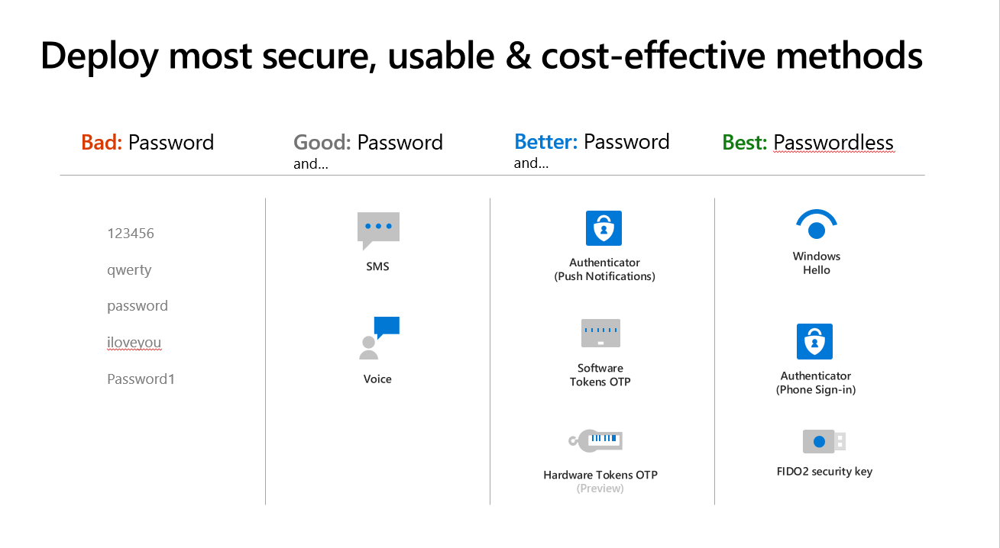

# Plan a Microsoft Entra multifactor authentication deployment 

Microsoft Entra multifactor authentication helps safeguard access to data and applications, providing another layer of security by using a second form of authentication. Organizations can enable multifactor authentication with [Conditional Access](../conditional-access/overview.md) to make the solution fit their specific needs.

This deployment guide shows you how to plan and implement an [Microsoft Entra multifactor authentication](concept-mfa-howitworks.md) roll-out.

<a name='prerequisites-for-deploying-azure-ad-multi-factor-authentication'></a>

## Prerequisites for deploying Microsoft Entra multifactor authentication

Before you begin your deployment, ensure you meet the following prerequisites for your relevant scenarios.

| Scenario | Prerequisite |
|----------|--------------|
|**Cloud-only** identity environment with modern authentication | **No prerequisite tasks** |
|**Hybrid identity** scenarios | Deploy [Microsoft Entra Connect](../hybrid/whatis-hybrid-identity.md) and synchronize user identities between the on-premises Active Directory Domain Services (AD DS) and Microsoft Entra ID. |
| **On-premises legacy applications** published for cloud access| Deploy [Microsoft Entra application proxy](../app-proxy/application-proxy-deployment-plan.md) |

## Choose authentication methods for MFA

There are many methods that can be used for a second-factor authentication. You can choose from the list of available authentication methods, evaluating each in terms of security, usability, and availability.

>[!IMPORTANT]
>Enable more than one MFA method so that users have a backup method available in case their primary method is unavailable. 
Methods include:

- [Windows Hello for Business](/windows/security/identity-protection/hello-for-business/hello-overview)
- [Microsoft Authenticator app](concept-authentication-authenticator-app.md)
- [FIDO2 security key (preview)](concept-authentication-passwordless.md#fido2-security-keys)
- [OATH hardware tokens (preview)](concept-authentication-oath-tokens.md#oath-hardware-tokens-preview)
- [OATH software tokens](concept-authentication-oath-tokens.md#oath-software-tokens)
- [SMS verification](concept-authentication-phone-options.md#mobile-phone-verification)
- [Voice call verification](concept-authentication-phone-options.md)

When choosing authenticating methods that will be used in your tenant consider the security and usability of these methods:



To learn more about the strength and security of these methods and how they work, see the following resources:

- [What authentication and verification methods are available in Microsoft Entra ID?](concept-authentication-methods.md)
- [Video: Choose the right authentication methods to keep your organization safe](https://youtu.be/LB2yj4HSptc)

You can use this [PowerShell script](/samples/azure-samples/azure-mfa-authentication-method-analysis/azure-mfa-authentication-method-analysis/) to analyze users' MFA configurations and suggest the appropriate MFA authentication method. 

For the best flexibility and usability, use the Microsoft Authenticator app. This authentication method provides the best user experience and multiple modes, such as passwordless, MFA push notifications, and OATH codes. The Microsoft Authenticator app also meets the National Institute of Standards and Technology (NIST) [Authenticator Assurance Level 2 requirements](../standards/nist-authenticator-assurance-level-2.md).

You can control the authentication methods available in your tenant. For example, you may want to block some of the least secure methods, such as SMS.

| Authentication method | Manage from | Scoping |
|-----------------------|-------------|---------|
| Microsoft Authenticator (Push notification and passwordless phone sign-in)    | MFA settings or Authentication methods policy | Authenticator passwordless phone sign-in can be scoped to users and groups |
| FIDO2 security key | Authentication methods policy | Can be scoped to users and groups |
| Software or Hardware OATH tokens | MFA settings |     |
| SMS verification | MFA settings <br/>Manage SMS sign-in for primary authentication in authentication policy | SMS sign-in can be scoped to users and groups. |
| Voice calls | Authentication methods policy |       |


## Plan Conditional Access policies

Microsoft Entra multifactor authentication is enforced with Conditional Access policies. These policies allow you to prompt users for MFA when needed for security and stay out of users' way when not needed.


In the Microsoft Entra admin center, you configure Conditional Access policies under **Protection** > **Conditional Access**.

To learn more about creating Conditional Access policies, see [Conditional Access policy to prompt for Microsoft Entra multifactor authentication when a user signs in](tutorial-enable-azure-mfa.md). This helps you to:

- Become familiar with the user interface
- Get a first impression of how Conditional Access works

For end-to-end guidance on Microsoft Entra Conditional Access deployment, see the [Conditional Access deployment plan](../conditional-access/plan-conditional-access.md).

<a name='common-policies-for-azure-ad-multi-factor-authentication'></a>

### Common policies for Microsoft Entra multifactor authentication

Common use cases to require Microsoft Entra multifactor authentication include:

- For [administrators](../conditional-access/howto-conditional-access-policy-admin-mfa.md)
- To [specific applications](tutorial-enable-azure-mfa.md)
- For [all users](../conditional-access/howto-conditional-access-policy-all-users-mfa.md)
- For [Azure management](../conditional-access/howto-conditional-access-policy-azure-management.md)
- From [network locations you don't trust](../conditional-access/howto-conditional-access-policy-all-users-mfa.md)

### Named locations

To manage your Conditional Access policies, the location condition of a Conditional Access policy enables you to tie access controls settings to the network locations of your users. We recommend using [Named Locations](../conditional-access/location-condition.md) so that you can create logical groupings of IP address ranges or countries and regions. This creates a policy for all apps that blocks sign-in from that named location. Be sure to exempt your administrators from this policy.

### Risk-based policies

If your organization uses [Microsoft Entra ID Protection](../identity-protection/overview-identity-protection.md) to detect risk signals, consider using [risk-based policies](../identity-protection/howto-identity-protection-configure-risk-policies.md) instead of named locations. Policies can be created to force password changes when there is a threat of compromised identity or require MFA when a sign-in is deemed [at risk](../identity-protection/howto-identity-protection-configure-risk-policies.md) such as leaked credentials, sign-ins from anonymous IP addresses, and more. 

Risk policies include:

- [Require all users to register for Microsoft Entra multifactor authentication](../identity-protection/howto-identity-protection-configure-mfa-policy.md)
- [Require a password change for users that are high-risk](../identity-protection/howto-identity-protection-configure-risk-policies.md#user-risk-policy-in-conditional-access)
- [Require MFA for users with medium or high sign in risk](../identity-protection/howto-identity-protection-configure-risk-policies.md#sign-in-risk-policy-in-conditional-access)

### Convert users from per-user MFA to Conditional Access based MFA

If your users were enabled using per-user enabled and enforced MFA, the following PowerShell can assist you in making the conversion to Conditional Access based MFA.

Run this PowerShell in an ISE window or save as a `.PS1` file to run locally. The operation can only be done by using the [MSOnline module](/powershell/module/msonline/#msonline). 

```PowerShell
# Sets the MFA requirement state
function Set-MfaState {
    [CmdletBinding()]
    param(
        [Parameter(ValueFromPipelineByPropertyName=$True)]
        $ObjectId,
        [Parameter(ValueFromPipelineByPropertyName=$True)]
        $UserPrincipalName,
        [ValidateSet("Disabled","Enabled","Enforced")]
        $State
    )
    Process {
        Write-Verbose ("Setting MFA state for user '{0}' to '{1}'." -f $ObjectId, $State)
        $Requirements = @()
        if ($State -ne "Disabled") {
            $Requirement =
                [Microsoft.Online.Administration.StrongAuthenticationRequirement]::new()
            $Requirement.RelyingParty = "*"
            $Requirement.State = $State
            $Requirements += $Requirement
        }
        Set-MsolUser -ObjectId $ObjectId -UserPrincipalName $UserPrincipalName `
                     -StrongAuthenticationRequirements $Requirements
    }
}
# Disable MFA for all users
Get-MsolUser -All | Set-MfaState -State Disabled
```

## Plan user session lifetime

When planning your multifactor authentication deployment, it's important to think about how frequently you would like to prompt your users. Asking users for credentials often seems like a sensible thing to do, but it can backfire. If users are trained to enter their credentials without thinking, they can unintentionally supply them to a malicious credential prompt. Microsoft Entra ID has multiple settings that determine how often you need to reauthenticate. Understand the needs of your business and users and configure settings that provide the best balance for your environment.

We recommend using devices with Primary Refresh Tokens (PRT) for improved end user experience and reduce the session lifetime with sign-in frequency policy only on specific business use cases.

For more information, see [Optimize reauthentication prompts and understand session lifetime for Microsoft Entra multifactor authentication](concepts-azure-multi-factor-authentication-prompts-session-lifetime.md).

## Plan user registration

A major step in every multifactor authentication deployment is getting users registered to use Microsoft Entra multifactor authentication. Authentication methods such as Voice and SMS allow pre-registration, while others like the Authenticator App require user interaction. Administrators must determine how users will register their methods. 

<a name='combined-registration-for-sspr-and-azure-ad-mfa'></a>

### Combined registration for SSPR and Microsoft Entra multifactor authentication

[The combined registration experience for Microsoft Entra multifactor authentication and self-service password reset (SSPR)](howto-registration-mfa-sspr-combined.md) enables users to register for both MFA and SSPR in a unified experience. SSPR allows users to reset their password in a secure way using the same methods they use for Microsoft Entra multifactor authentication. To make sure you understand the functionality and end-user experience, see the [Combined security information registration concepts](concept-registration-mfa-sspr-combined.md).

It's critical to inform users about upcoming changes, registration requirements, and any necessary user actions. We provide [communication templates](https://aka.ms/mfatemplates) and [user documentation](https://support.microsoft.com/account-billing/set-up-security-info-from-a-sign-in-page-28180870-c256-4ebf-8bd7-5335571bf9a8) to prepare your users for the new experience and help to ensure a successful rollout. Send users to https://myprofile.microsoft.com to register by selecting the **Security Info** link on that page.

### Registration with Identity Protection

Microsoft Entra ID Protection contributes both a registration policy for and automated risk detection and remediation policies to the Microsoft Entra multifactor authentication story. Policies can be created to force password changes when there is a threat of compromised identity or require MFA when a sign-in is deemed risky.
If you use Microsoft Entra ID Protection, [configure the Microsoft Entra multifactor authentication registration policy](../identity-protection/howto-identity-protection-configure-mfa-policy.md) to prompt your users to register the next time they sign in interactively.

### Registration without Identity Protection

If you don't have licenses that enable Microsoft Entra ID Protection, users are prompted to register the next time that MFA is required at sign-in. 
To require users to use MFA, you can use Conditional Access policies and target frequently used applications like HR systems. 
If a user's password is compromised, it could be used to register for MFA, taking control of their account. We therefore recommend [securing the security registration process with Conditional Access policies](../conditional-access/howto-conditional-access-policy-registration.md) requiring trusted devices and locations. 
You can further secure the process by also requiring a [Temporary Access Pass](howto-authentication-temporary-access-pass.md). A time-limited passcode issued by an admin that satisfies strong authentication requirements and can be used to onboard other authentication methods, including Passwordless ones.

### Increase the security of registered users

If you have users registered for MFA using SMS or voice calls, you may want to move them to more secure methods such as the Microsoft Authenticator app. Microsoft now offers a public preview of functionality that allows you to prompt users to set up the Microsoft Authenticator app during sign-in. You can set these prompts by group, controlling who is prompted, enabling targeted campaigns to move users to the more secure method. 

### Plan recovery scenarios 

As mentioned before, ensure users are registered for more than one MFA method, so that if one is unavailable, they have a backup. 
If the user does not have a backup method available, you can: 

- Provide them a Temporary Access Pass so that they can manage their own authentication methods. You can also provide a Temporary Access Pass to enable temporary access to resources. 
- Update their methods as an administrator. To do so, select the user in the Microsoft Entra admin center, then select **Protection** > **Authentication methods** and update their methods.


## Plan integration with on-premises systems

Applications that authenticate directly with Microsoft Entra ID and have modern authentication (WS-Fed, SAML, OAuth, OpenID Connect) can make use of Conditional Access policies.
Some legacy and on-premises applications do not authenticate directly against Microsoft Entra ID and require additional steps to use Microsoft Entra multifactor authentication. You can integrate them by using Microsoft Entra application proxy or [Network policy services](/windows-server/networking/core-network-guide/core-network-guide#BKMK_optionalfeatures).

### Integrate with AD FS resources

We recommend migrating applications secured with Active Directory Federation Services (AD FS) to Microsoft Entra ID. However, if you are not ready to migrate these to Microsoft Entra ID, you can use the Azure multifactor authentication adapter with AD FS 2016 or newer.

If your organization is federated with Microsoft Entra ID, you can [configure Microsoft Entra multifactor authentication as an authentication provider with AD FS resources](/windows-server/identity/ad-fs/operations/configure-ad-fs-and-azure-mfa) both on-premises and in the cloud.  

<a name='radius-clients-and-azure-ad-multi-factor-authentication'></a>

### RADIUS clients and Microsoft Entra multifactor authentication

For applications that are using RADIUS authentication, we recommend moving client applications to modern protocols such as SAML, OpenID Connect, or OAuth on Microsoft Entra ID. If the application cannot be updated, then you can deploy [Network Policy Server (NPS) with the Azure MFA extension](howto-mfa-nps-extension.md). The network policy server (NPS) extension acts as an adapter between RADIUS-based applications and Microsoft Entra multifactor authentication to provide a second factor of authentication.

#### Common integrations

Many vendors now support SAML authentication for their applications. When possible, we recommend federating these applications with Microsoft Entra ID and enforcing MFA through Conditional Access. If your vendor doesn't support modern authentication – you can use the NPS extension.
Common RADIUS client integrations include applications such as [Remote Desktop Gateways](howto-mfa-nps-extension-rdg.md) and [VPN servers](howto-mfa-nps-extension-vpn.md). 

Others might include:

- Citrix Gateway

  [Citrix Gateway](https://docs.citrix.com/en-us/advanced-concepts/implementation-guides/citrix-gateway-microsoft-azure.html#microsoft-azure-mfa-deployment-methods) supports both RADIUS and NPS extension integration, and a SAML integration.

- Cisco VPN
  - The Cisco VPN supports both RADIUS and [SAML authentication for SSO](../saas-apps/cisco-anyconnect.md).
  - By moving from RADIUS authentication to SAML, you can integrate the Cisco VPN without deploying the NPS extension.

- All VPNs

<a name='deploy-azure-ad-multi-factor-authentication'></a>

## Deploy Microsoft Entra multifactor authentication

Your Microsoft Entra multifactor authentication rollout plan should include a pilot deployment followed by deployment waves that are within your support capacity. Begin your rollout by applying your Conditional Access policies to a small group of pilot users. After evaluating the effect on the pilot users, process used, and registration behaviors, you can either add more groups to the policy or add more users to the existing groups.

Follow the steps below:

1. Meet the necessary prerequisites
1. Configure chosen authentication methods
1. Configure your Conditional Access policies
1. Configure session lifetime settings
1. Configure Microsoft Entra multifactor authentication registration policies 

<a name='manage-azure-ad-multi-factor-authentication'></a>

## Manage Microsoft Entra multifactor authentication
This section provides reporting and troubleshooting information for Microsoft Entra multifactor authentication.

### Reporting and Monitoring

Microsoft Entra ID has reports that provide technical and business insights, follow the progress of your deployment and check if your users are successful at sign-in with MFA. Have your business and technical application owners assume ownership of and consume these reports based on your organization's requirements.

You can monitor authentication method registration and usage across your organization using the [Authentication Methods Activity dashboard](howto-authentication-methods-activity.md). This helps you understand what methods are being registered and how they're being used.

#### Sign-in report to review MFA events

The Microsoft Entra sign-in reports include authentication details for events when a user is prompted for MFA, and if any Conditional Access policies were in use. You can also use PowerShell for reporting on users registered for Microsoft Entra multifactor authentication. 

NPS extension and AD FS logs for cloud MFA activity are now included in the [Sign-in logs](../reports-monitoring/concept-sign-ins.md), and no longer published to the **Activity report**.

For more information, and additional Microsoft Entra multifactor authentication reports, see [Review Microsoft Entra multifactor authentication events](howto-mfa-reporting.md#view-the-azure-ad-sign-ins-report).

<a name='troubleshoot-azure-ad-multi-factor-authentication'></a>

### Troubleshoot Microsoft Entra multifactor authentication
See [Troubleshooting Microsoft Entra multifactor authentication](https://support.microsoft.com/help/2937344/troubleshooting-azure-multi-factor-authentication-issues) for common issues.

## Guided walkthrough

For a guided walkthrough of many of the recommendations in this article, see the [Microsoft 365 Configure multifactor authentication guided walkthrough](https://go.microsoft.com/fwlink/?linkid=2221401).

## Next steps

[Deploy other identity features](../architecture/deployment-plans.md)
