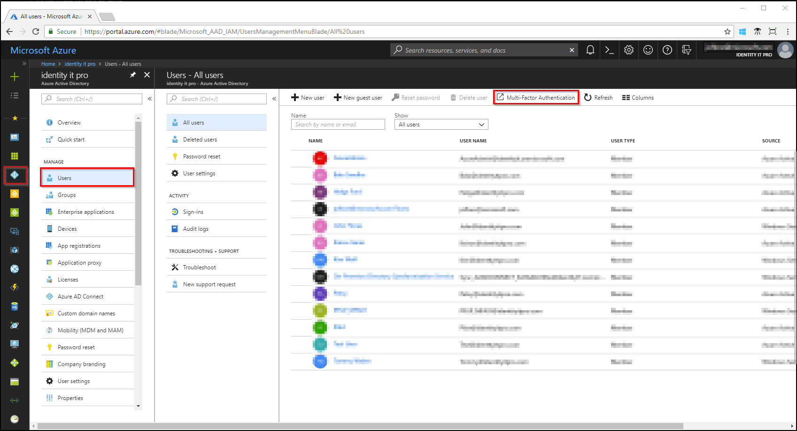
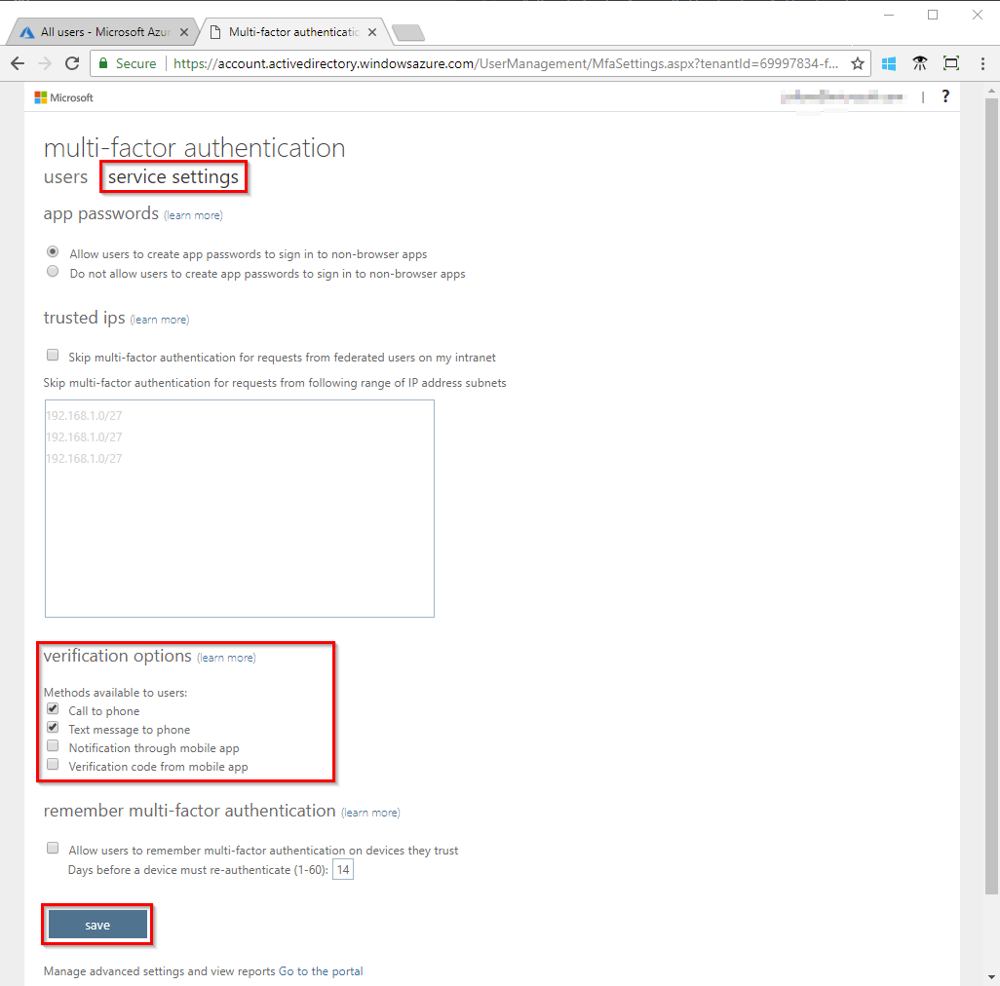
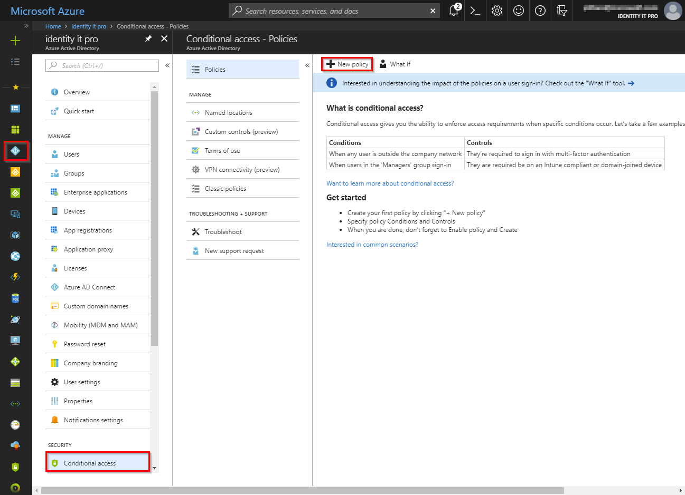

# Deploy cloud-based Azure Multi-Factor Authentication

Getting started with Azure Multi-Factor Authentication (Azure MFA) is a straightforward process.

Before you start, make sure you have the following prerequisites:

* A global administrator account in your Azure AD tenant. If you need help completing this step, see our article [Get started with Azure AD](../get-started-azure-ad.md).
* Correct licenses assigned to users. If you need more information, see the article [How to get Azure Multi-Factor Authentication](concept-mfa-licensing.md).

## Choose how to enable

**Enabled by conditional access policy** - This method is discussed in this article. It is the most flexible means to enable two-step verification for your users. Enabling using conditional access policy only works for Azure MFA in the cloud and is a premium feature of Azure AD.

**Enabled by Azure AD Identity Protection** - This method uses the Azure AD Identity Protection risk policy to require two-step verification based only on sign-in risk for all cloud applications. This method requires Azure Active Directory P2 licensing. More information on this method can be found in [How to configure the user risk policy](../identity-protection/howto-user-risk-policy.md).

**Enabled by changing user state** - This is the traditional method for requiring two-step verification. It works with both Azure MFA in the cloud and Azure MFA Server. Using this method requires users to perform two-step verification **every time** they sign in and overrides conditional access policies. More information on this method can be found in [How to require two-step verification for a user](howto-mfa-userstates.md).

> [!Note]
> More information about licenses and pricing can be found on the [Azure AD](https://azure.microsoft.com/pricing/details/active-directory/
) and [Multi-Factor Authentication](https://azure.microsoft.com/pricing/details/multi-factor-authentication/) pricing pages.

## Choose authentication methods

Enable at least one authentication method for your users based on your organization's requirements. We find that when enabled for users the Microsoft Authenticator app provides the best user experience. If you need to understand which methods are available and how to set them, see the article [What are authentication methods](concept-authentication-methods.md).

## Get users to enroll

Once you enable the conditional access policy, users will be forced to enroll the next time they use an app protected with the policy. If you enable a policy requiring MFA for all users on all cloud apps, this action could cause headaches for your users and your helpdesk. The recommendation is to ask users to register authentication methods beforehand using the registration portal at [https://aka.ms/mfasetup](https://aka.ms/mfasetup). Many organizations find that creating posters, table cards, and email messages helps drive adoption.

## Enable Multi-Factor Authentication with Conditional Access

Sign in to the [Azure portal](https://portal.azure.com) using a global administrator account.

### Choose verification options

Before enabling Azure Multi-Factor Authentication, your organization must determine what verification options they allow. For the purpose of this exercise, you enable call to phone and text message to phone as they are generic options that most are able to use. More information regarding authentication methods, and their usage, can be found in the article, [What are authentication methods?](concept-authentication-methods.md)

1. Browse to **Azure Active Directory**, **Users**, **Multi-Factor Authentication**.

   

1. In the new tab that opens browse to **service settings**.
1. Under **verification options**, check all of the boxes for methods available to users.

   

4. Click on **Save**.
5. Close the **service settings** tab.

### Create conditional access policy

1. Sign in to the [Azure portal](https://portal.azure.com) using a global administrator account.
1. Browse to **Azure Active Directory**, **Conditional access**.
1. Select **New policy**.
1. Provide a meaningful name for your policy.
1. Under **users and groups**:
   * On the **Include** tab, select the **All users** radio button
   * RECOMMENDED: On the **Exclude** tab, check the box for **Users and groups** and choose a group to be used for exclusions when users do not have access to their authentication methods.
   * Click **Done**.
1. Under **Cloud apps**, select the **All cloud apps** radio button.
   * OPTIONALLY: On the **Exclude** tab, choose cloud apps that your organization does not require MFA for.
   * Click **Done**.
1. Under **Conditions** section:
   * OPTIONALLY: If you have enabled Azure Identity Protection, you can choose to evaluate sign-in risk as part of the policy.
   * OPTIONALLY: If you have configured trusted locations or named locations, you can specify to include or exclude those locations from the policy.
1. Under **Grant**, make sure the **Grant access** radio button is selected.
    * Check the box for **Require multi-factor authentication**.
    * Click **Select**.
1. Skip the **Session** section.
1. Set the **Enable policy** toggle to **On**.
1. Click **Create**.

### Test Azure Multi-Factor Authentication

To confirm that your conditional access policy works, test logging in to a resource that should not require MFA and then to the Azure portal that requires MFA.

1. Open a new browser window in InPrivate or incognito mode and browse to [https://account.activedirectory.windowsazure.com](https://account.activedirectory.windowsazure.com).
   * Sign in with the test user created as part of the prerequisites section of this article and note that it should not ask you to complete MFA.
   * Close the browser window.
2. Open a new browser window in InPrivate or incognito mode and browse to [https://portal.azure.com](https://portal.azure.com).
   * Sign in with the test user created as part of the prerequisites section of this article and note that you should now be required to register for and use Azure Multi-Factor Authentication.
   * Close the browser window.

## Next steps

Congratulations, you have set up Azure Multi-Factor Authentication in the cloud.

Why was a user prompted or not prompted to perform MFA? See the section [Azure AD sign-ins report in the Reports in Azure Multi-Factor Authentication document](howto-mfa-reporting.md#azure-ad-sign-ins-report).

To configure additional settings like trusted IPs, custom voice messages, and fraud alerts, see the article [Configure Azure Multi-Factor Authentication settings](howto-mfa-mfasettings.md).

Information about managing user settings for Azure Multi-Factor Authentication can be found in the article [Manage user settings with Azure Multi-Factor Authentication in the cloud](howto-mfa-userdevicesettings.md).

[Enable converged registration for Azure Multi-Factor Authentication and Azure AD self-service password reset](concept-registration-mfa-sspr-converged.md).
