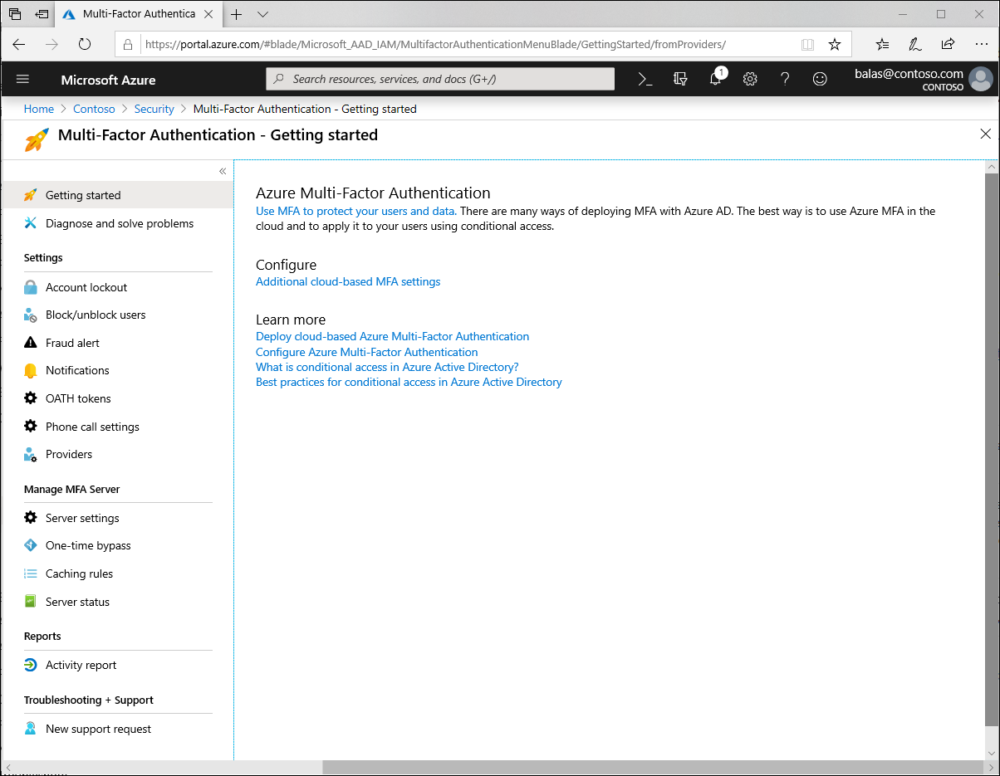
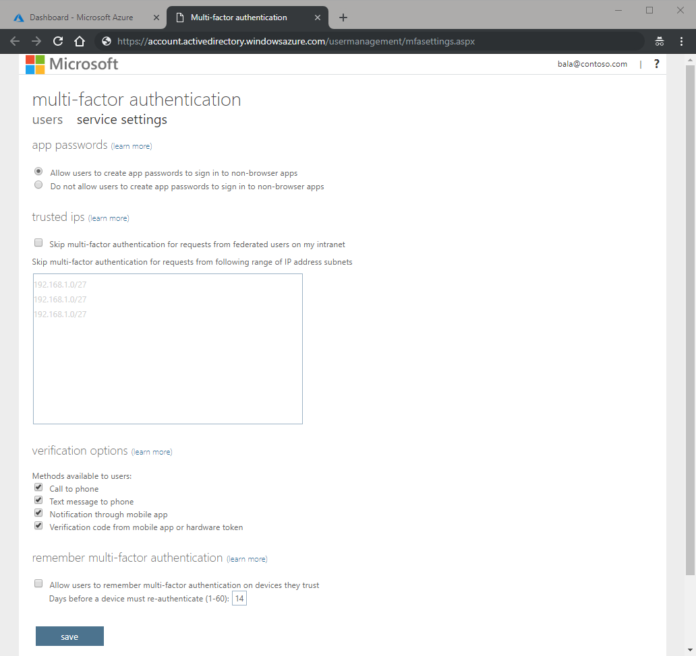

# Configure Azure Multi-Factor Authentication settings

This article helps you to manage Multi-Factor Authentication settings in the Azure portal. It covers various topics that help you to get the most out of Azure Multi-Factor Authentication. Not all of the features are available in every version of Azure Multi-Factor Authentication.

You can access settings related to Azure Multi-Factor Authentication from the Azure portal by browsing to **Azure Active Directory** > **MFA**.

## Settings

Some of these settings apply to MFA Server, Azure MFA, or both.

| Feature | Description |
| ------- | ----------- |
| Account lockout | Temporarily lock accounts in the multi-factor authentication service if there are too many denied authentication attempts in a row. This feature only applies to users who enter a PIN to authenticate. (MFA Server) |
| [Block/unblock users](#block-and-unblock-users) | Used to block specific users from being able to receive Multi-Factor Authentication requests. Any authentication attempts for blocked users are automatically denied. Users remain blocked for 90 days from the time that they are blocked. |
| [Fraud alert](#fraud-alert) | Configure settings related to users ability to report fraudulent verification requests |
| Notifications | Enable notifications of events from MFA Server. |
| [OATH tokens](concept-authentication-methods.md#oath-hardware-tokens-public-preview) | Used in cloud-based Azure MFA environments to manage OATH tokens for users. |
| [Phone call settings](#phone-call-settings) | Configure settings related to phone calls and greetings for cloud and on-premises environments. |
| Providers | This will show any existing authentication providers that you may have associated with your account. New authentication providers may not be created as of September 1, 2018 |

## Manage MFA Server

Settings in this section are for MFA Server only.

| Feature | Description |
| ------- | ----------- |
| Server settings | Download MFA Server and generate activation credentials to initialize your environment |
| [One-time bypass](#one-time-bypass) | Allow a user to authenticate without performing two-step verification for a limited time. |
| [Caching rules](#caching-rules) |  Caching is primarily used when on-premises systems, such as VPN, send multiple verification requests while the first request is still in progress. This feature allows the subsequent requests to succeed automatically, after the user succeeds the first verification in progress. |
| Server status | See the status of your on-premises MFA servers including version, status, IP, and last communication time and date. |

## Activity report

The reporting available here is specific to MFA Server (on-premises). For Azure MFA (cloud) reports see the sign-ins report in Azure AD.

## Block and unblock users

Use the _block and unblock users_ feature to prevent users from receiving authentication requests. Any authentication attempts for blocked users are automatically denied. Users remain blocked for 90 days from the time that they are blocked.

### Block a user

1. Sign in to the [Azure portal](https://portal.azure.com) as an administrator.
2. Browse to **Azure Active Directory** > **MFA** > **Block/unblock users**.
3. Select **Add** to block a user.
4. Select the **Replication Group**. Enter the username for the blocked user as **username\@domain.com**. Enter a comment in the **Reason** field.
5. Select **Add** to finish blocking the user.

### Unblock a user

1. Sign in to the [Azure portal](https://portal.azure.com) as an administrator.
2. Browse to **Azure Active Directory** > **MFA** > **Block/unblock users**.
3. Select **Unblock** in the **Action** column next to the user to unblock.
4. Enter a comment in the **Reason for unblocking** field.
5. Select **Unblock** to finish unblocking the user.

## Fraud alert

Configure the _fraud alert_ feature so that your users can report fraudulent attempts to access their resources. Users can report fraud attempts by using the mobile app or through their phone.

### Turn on fraud alerts

1. Sign in to the [Azure portal](https://portal.azure.com) as an administrator.
2. Browse to **Azure Active Directory** > **MFA** > **Fraud alert**.
3. Set the **Allow users to submit fraud alerts** setting to **On**.
4. Select **Save**.

### Configuration options

* **Block user when fraud is reported**: If a user reports fraud, their account is blocked for 90 days or until an administrator unblocks their account. An administrator can review sign-ins by using the sign-in report, and take appropriate action to prevent future fraud. An administrator can then [unblock](#unblock-a-user) the user's account.
* **Code to report fraud during initial greeting**: When users receive a phone call to perform two-step verification, they normally press **#** to confirm their sign-in. To report fraud, the user enters a code before pressing **#**. This code is **0** by default, but you can customize it.

   >[!NOTE]
   >The default voice greetings from Microsoft instruct users to press **0#** to submit a fraud alert. If you want to use a code other than **0**, record and upload your own custom voice greetings with appropriate instructions for your users.
   >

### View fraud reports

1. Sign in to the [Azure portal](https://portal.azure.com).
2. Select **Azure Active Directory** > **Sign-ins**. The fraud report is now part of the standard Azure AD Sign-ins report.

## Phone call settings

### Caller ID

**MFA caller ID number** - This is the number your users will see on their phone. Only US-based numbers are allowed.

>[!NOTE]
>When Multi-Factor Authentication calls are placed through the public telephone network, sometimes they are routed through a carrier that doesn't support caller ID. Because of this, caller ID is not guaranteed, even though the Multi-Factor Authentication system always sends it.

### Custom voice messages

You can use your own recordings or greetings for two-step verification with the _custom voice messages_ feature. These messages can be used in addition to or to replace the Microsoft recordings.

Before you begin, be aware of the following restrictions:

* The supported file formats are .wav and .mp3.
* The file size limit is 5 MB.
* Authentication messages should be shorter than 20 seconds. Messages that are longer than 20 seconds can cause the verification to fail. The user might not respond before the message finishes and the verification times out.

### Custom message language behavior

When a custom voice message is played to the user, the language of the message depends on these factors:

* The language of the current user.
  * The language detected by the user's browser.
  * Other authentication scenarios may behave differently.
* The language of any available custom messages.
  * This language is chosen by the administrator, when a custom message is added.

For example, if there is only one custom message, with a language of German:

* A user who authenticates in the German language will hear the custom German message.
* A user who authenticates in English will hear the standard English message.

### Set up a custom message

1. Sign in to the [Azure portal](https://portal.azure.com) as an administrator.
1. Browse to **Azure Active Directory** > **MFA** > **Phone call settings**.
1. Select **Add greeting**.
1. Choose the type of greeting.
1. Choose the language.
1. Select an .mp3 or .wav sound file to upload.
1. Select **Add**.

## One-time bypass

The _one-time bypass_ feature allows a user to authenticate a single time without performing two-step verification. The bypass is temporary and expires after a specified number of seconds. In situations where the mobile app or phone is not receiving a notification or phone call, you can allow a one-time bypass so the user can access the desired resource.

### Create a one-time bypass

1. Sign in to the [Azure portal](https://portal.azure.com) as an administrator.
2. Browse to **Azure Active Directory** > **MFA** > **One-time bypass**.
3. Select **Add**.
4. If necessary, select the replication group for the bypass.
5. Enter the username as **username\@domain.com**. Enter the number of seconds that the bypass should last. Enter the reason for the bypass.
6. Select **Add**. The time limit goes into effect immediately. The user needs to sign in before the one-time bypass expires.

### View the one-time bypass report

1. Sign in to the [Azure portal](https://portal.azure.com).
2. Browse to **Azure Active Directory** > **MFA** > **One-time bypass**.

## Caching rules

You can set a time period to allow authentication attempts after a user is authenticated by using the _caching_ feature. Subsequent authentication attempts for the user within the specified time period succeed automatically. Caching is primarily used when on-premises systems, such as VPN, send multiple verification requests while the first request is still in progress. This feature allows the subsequent requests to succeed automatically, after the user succeeds the first verification in progress.

>[!NOTE]
>The caching feature is not intended to be used for sign-ins to Azure Active Directory (Azure AD).

### Set up caching

1. Sign in to the [Azure portal](https://portal.azure.com) as an administrator.
2. Browse to **Azure Active Directory** > **MFA** > **Caching rules**.
3. Select **Add**.
4. Select the **cache type** from the drop-down list. Enter the maximum number of **cache seconds**.
5. If necessary, select an authentication type and specify an application.
6. Select **Add**.

## MFA service settings

Settings for app passwords, trusted IPs, verification options, and remember multi-factor authentication for Azure Multi-Factor Authentication can be found in service settings. Service settings can be accessed from the Azure portal by browsing to **Azure Active Directory** > **MFA** > **Getting started** > **Configure** > **Additional cloud-based MFA settings**.

## App passwords

Some applications, like Office 2010 or earlier and Apple Mail before iOS 11, don't support two-step verification. The apps aren't configured to accept a second verification. To use these applications, take advantage of the _app passwords_ feature. You can use an app password in place of your traditional password to allow an app to bypass two-step verification and continue working.

Modern authentication is supported for the Microsoft Office 2013 clients and later. Office 2013 clients including Outlook, support modern authentication protocols and can be enabled to work with two-step verification. After the client is enabled, app passwords aren't required for the client.

>[!NOTE]
>App passwords do not work with Conditional Access based multi-factor authentication policies and modern authentication.

### Considerations about app passwords

When using app passwords, consider the following important points:

* App passwords are only entered once per application. Users don't have to keep track of the passwords or enter them every time.
* The actual password is automatically generated and is not supplied by the user. The automatically generated password is harder for an attacker to guess and is more secure.
* There is a limit of 40 passwords per user.
* Applications that cache passwords and use them in on-premises scenarios can start to fail because the app password isn't known outside the work or school account. An example of this scenario is Exchange emails that are on-premises, but the archived mail is in the cloud. In this scenario, the same password doesn't work.
* After Multi-Factor Authentication is enabled on a user's account, app passwords can be used with most non-browser clients like Outlook and Microsoft Skype for Business. Administrative actions can't be performed by using app passwords through non-browser applications, such as Windows PowerShell. The actions can't be performed even when the user has an administrative account. To run PowerShell scripts, create a service account with a strong password and don't enable the account for two-step verification.

>[!WARNING]
>App passwords don't work in hybrid environments where clients communicate with both on-premises and cloud auto-discover endpoints. Domain passwords are required to authenticate on-premises. App passwords are required to authenticate with the cloud.

### Guidance for app password names

App password names should reflect the device on which they're used. If you have a laptop that has non-browser applications like Outlook, Word, and Excel, create one app password named **Laptop** for these apps. Create another app password named **Desktop** for the same applications that run on your desktop computer.

>[!NOTE]
>We recommend that you create one app password per device, rather than one app password per application.

### Federated or single sign-on app passwords

Azure AD supports federation, or single sign-on (SSO), with on-premises Windows Server Active Directory Domain Services (AD DS). If your organization is federated with Azure AD and you're using Azure Multi-Factor Authentication, consider the following points about app passwords.

>[!NOTE]
>The following points apply only to federated (SSO) customers.

* App passwords are verified by Azure AD, and therefore, bypass federation. Federation is actively used only when setting up app passwords.
* The Identity Provider (IdP) is not contacted for federated (SSO) users, unlike the passive flow. The app passwords are stored in the work or school account. If a user leaves the company, the user's information flows to the work or school account by using **DirSync** in real time. The disable/deletion of the account can take up to three hours to synchronize, which can delay the disable/deletion of the app password in Azure AD.
* On-premises client Access Control settings aren't honored by the app passwords feature.
* No on-premises authentication logging/auditing capability is available for use with the app passwords feature.
* Some advanced architectures require a combination of credentials for two-step verification with clients. These credentials can include a work or school account username and passwords, and app passwords. The requirements depend on how the authentication is performed. For clients that authenticate against an on-premises infrastructure, a work or school account username and password a required. For clients that authenticate against Azure AD, an app password is required.

  For example, suppose you have the following architecture:

  * Your on-premises instance of Active Directory is federated with Azure AD.
  * You're using Exchange online.
  * You're using Skype for Business on-premises.
  * You're using Azure Multi-Factor Authentication.

  In this scenario, you use the following credentials:

  * To sign in to Skype for Business, use your work or school account username and password.
  * To access the address book from an Outlook client that connects to Exchange online, use an app password.

### Allow users to create app passwords

By default, users can't create app passwords. The app passwords feature must be enabled. To give users the ability to create app passwords, use the following procedure:

1. Sign in to the [Azure portal](https://portal.azure.com).
2. On the left, select **Azure Active Directory** > **Users and groups** > **All users**.
3. Select **Multi-Factor Authentication**.
4. Under Multi-Factor Authentication, select **service settings**.
5. On the **Service Settings** page, select the **Allow users to create app passwords to sign in to non-browser apps** option.

### Create app passwords

Users can create app passwords during their initial registration. The user has the option to create app passwords at the end of the registration process.

Users can also create app passwords after registration. For more information and detailed steps for your users, see [What are app passwords in Azure Multi-Factor Authentication?](../user-help/multi-factor-authentication-end-user-app-passwords.md)

## Trusted IPs

The _Trusted IPs_ feature of Azure Multi-Factor Authentication is used by administrators of a managed or federated tenant. The feature bypasses two-step verification for users who sign in from the company intranet. The feature is available with the full version of Azure Multi-Factor Authentication, and not the free version for administrators. For details on how to get the full version of Azure Multi-Factor Authentication, see [Azure Multi-Factor Authentication](multi-factor-authentication.md).

> [!NOTE]
> MFA trusted IPs and Conditional Access named locations only work with IPV4 addresses.

If your organization deploys the NPS extension to provide MFA to on-premises applications note the source IP address will always appear to be the NPS server the authentication attempt flows through.

| Azure AD tenant type | Trusted IPs feature options |
|:--- |:--- |
| Managed |**Specific range of IP addresses**: Administrators specify a range of IP addresses that can bypass two-step verification for users who sign in from the company intranet.|
| Federated |**All Federated Users**: All federated users who sign in from inside of the organization can bypass two-step verification. The users bypass verification by using a claim that is issued by Active Directory Federation Services (AD FS). **Specific range of IP addresses**: Administrators specify a range of IP addresses that can bypass two-step verification for users who sign in from the company intranet. |

The Trusted IPs bypass works only from inside of the company intranet. If you select the **All Federated Users** option and a user signs in from outside the company intranet, the user has to authenticate by using two-step verification. The process is the same even if the user presents an AD FS claim. 

### End-user experience inside of corpnet

When the Trusted IPs feature is disabled, two-step verification is required for browser flows. App passwords are required for older rich client applications.

When the Trusted IPs feature is enabled, two-step verification is *not* required for browser flows. App passwords are *not* required for older rich client applications, provided that the user hasn't created an app password. After an app password is in use, the password remains required. 

### End-user experience outside corpnet

Regardless of whether the Trusted IPs feature is enabled, two-step verification is required for browser flows. App passwords are required for older rich client applications.

### Enable named locations by using Conditional Access

1. Sign in to the [Azure portal](https://portal.azure.com).
2. On the left, select **Azure Active Directory** > **Conditional Access** > **Named locations**.
3. Select **New location**.
4. Enter a name for the location.
5. Select **Mark as trusted location**.
6. Enter the IP Range in CIDR notation like **192.168.1.1/24**.
7. Select **Create**.

### Enable the Trusted IPs feature by using Conditional Access

1. Sign in to the [Azure portal](https://portal.azure.com).
2. On the left, select **Azure Active Directory** > **Conditional Access** > **Named locations**.
3. Select **Configure MFA trusted IPs**.
4. On the **Service Settings** page, under **Trusted IPs**, choose from any of the following two options:

   * **For requests from federated users originating from my intranet**: To choose this option, select the check box. All federated users who sign in from the corporate network bypass two-step verification by using a claim that is issued by AD FS. Ensure that AD FS has a rule to add the intranet claim to the appropriate traffic. If the rule does not exist, create the following rule in AD FS:

      `c:[Type== "http://schemas.microsoft.com/ws/2012/01/insidecorporatenetwork"] => issue(claim = c);`

   * **For requests from a specific range of public IPs**: To choose this option, enter the IP addresses in the text box by using CIDR notation.
      * For IP addresses that are in the range xxx.xxx.xxx.1 through xxx.xxx.xxx.254, use notation like **xxx.xxx.xxx.0/24**.
      * For a single IP address, use notation like **xxx.xxx.xxx.xxx/32**.
      * Enter up to 50 IP address ranges. Users who sign in from these IP addresses bypass two-step verification.

5. Select **Save**.

### Enable the Trusted IPs feature by using service settings

1. Sign in to the [Azure portal](https://portal.azure.com).
2. On the left, select **Azure Active Directory** > **Users**.
3. Select **Multi-Factor Authentication**.
4. Under Multi-Factor Authentication, select **service settings**.
5. On the **Service Settings** page, under **Trusted IPs**, choose one (or both) of the following two options:

   * **For requests from federated users on my intranet**: To choose this option, select the check box. All federated users who sign in from the corporate network bypass two-step verification by using a claim that is issued by AD FS. Ensure that AD FS has a rule to add the intranet claim to the appropriate traffic. If the rule does not exist, create the following rule in AD FS:

      `c:[Type== "http://schemas.microsoft.com/ws/2012/01/insidecorporatenetwork"] => issue(claim = c);`

   * **For requests from a specified range of IP address subnets**: To choose this option, enter the IP addresses in the text box by using CIDR notation.
      * For IP addresses that are in the range xxx.xxx.xxx.1 through xxx.xxx.xxx.254, use notation like **xxx.xxx.xxx.0/24**.
      * For a single IP address, use notation like **xxx.xxx.xxx.xxx/32**.
      * Enter up to 50 IP address ranges. Users who sign in from these IP addresses bypass two-step verification.

6. Select **Save**.

## Verification methods

You can choose the verification methods that are available for your users. The following table provides a brief overview of the methods.

When your users enroll their accounts for Azure Multi-Factor Authentication, they choose their preferred verification method from the options that you have enabled. Guidance for the user enrollment process is provided in [Set up my account for two-step verification](../user-help/multi-factor-authentication-end-user-first-time.md).

| Method | Description |
|:--- |:--- |
| Call to phone |Places an automated voice call. The user answers the call and presses # in the phone keypad to authenticate. The phone number is not synchronized to on-premises Active Directory. |
| Text message to phone |Sends a text message that contains a verification code. The user is prompted to enter the verification code into the sign-in interface. This process is called one-way SMS. Two-way SMS means that the user must text back a particular code. Two-way SMS is deprecated and not supported after November 14, 2018. Users who are configured for two-way SMS are automatically switched to _call to phone_ verification at that time.|
| Notification through mobile app |Sends a push notification to your phone or registered device. The user views the notification and selects **Verify** to complete verification. The Microsoft Authenticator app is available for [Windows Phone](https://go.microsoft.com/fwlink/?Linkid=825071), [Android](https://go.microsoft.com/fwlink/?Linkid=825072), and [iOS](https://go.microsoft.com/fwlink/?Linkid=825073). |
| Verification code from mobile app or hardware token |The Microsoft Authenticator app generates a new OATH verification code every 30 seconds. The user enters the verification code into the sign-in interface. The Microsoft Authenticator app is available for [Windows Phone](https://go.microsoft.com/fwlink/?Linkid=825071), [Android](https://go.microsoft.com/fwlink/?Linkid=825072), and [iOS](https://go.microsoft.com/fwlink/?Linkid=825073). |

### Enable and disable verification methods

1. Sign in to the [Azure portal](https://portal.azure.com).
2. On the left, select **Azure Active Directory** > **Users and groups** > **All users**.
3. Select **Multi-Factor Authentication**.
4. Under Multi-Factor Authentication, select **service settings**.
5. On the **Service Settings** page, under **verification options**, select/unselect the methods to provide to your users.
6. Click **Save**.

Additional details about the use of authentication methods can be found in the article [What are authentication methods](concept-authentication-methods.md).

## Remember Multi-Factor Authentication

The _remember Multi-Factor Authentication_ feature for devices and browsers that are trusted by the user is a free feature for all Multi-Factor Authentication users. Users can bypass subsequent verifications for a specified number of days, after they've successfully signed-in to a device by using Multi-Factor Authentication. The feature enhances usability by minimizing the number of times a user has to perform two-step verification on the same device.

>[!IMPORTANT]
>If an account or device is compromised, remembering Multi-Factor Authentication for trusted devices can affect security. If a corporate account becomes compromised or a trusted device is lost or stolen, you should [restore Multi-Factor Authentication on all devices](howto-mfa-userdevicesettings.md#restore-mfa-on-all-remembered-devices-for-a-user).
>
>The restore action revokes the trusted status from all devices, and the user is required to perform two-step verification again. You can also instruct your users to restore Multi-Factor Authentication on their own devices with the instructions in [Manage your settings for two-step verification](../user-help/multi-factor-authentication-end-user-manage-settings.md#require-two-step-verification-again-on-a-device-youve-marked-as-trusted).
>

### How the feature works

The remember Multi-Factor Authentication feature sets a persistent cookie on the browser when a user selects the **Don't ask again for X days** option at sign-in. The user isn't prompted again for Multi-Factor Authentication from that same browser until the cookie expires. If the user opens a different browser on the same device or clears their cookies, they're prompted again to verify.

The **Don't ask again for X days** option isn't shown on non-browser applications, regardless of whether the app supports modern authentication. These apps use _refresh tokens_ that provide new access tokens every hour. When a refresh token is validated, Azure AD checks that the last two-step verification occurred within the specified number of days.

The feature reduces the number of authentications on web apps, which normally prompt every time. The feature increases the number of authentications for modern authentication clients that normally prompt every 90 days. May also increase the number of authentications when combined with Conditional Access policies.

>[!IMPORTANT]
>The **remember Multi-Factor Authentication** feature is not compatible with the **keep me signed in** feature of AD FS, when users perform two-step verification for AD FS through Azure Multi-Factor Authentication Server or a third-party multi-factor authentication solution.
>
>If your users select **keep me signed in** on AD FS and also mark their device as trusted for Multi-Factor Authentication, the user isn't automatically verified after the **remember multi-factor authentication** number of days expires. Azure AD requests a fresh two-step verification, but AD FS returns a token with the original Multi-Factor Authentication claim and date, rather than performing two-step verification again. **This reaction sets off a verification loop between Azure AD and AD FS.**
>

### Enable remember Multi-Factor Authentication

1. Sign in to the [Azure portal](https://portal.azure.com).
2. On the left, select **Azure Active Directory** > **Users and groups** > **All users**.
3. Select **Multi-Factor Authentication**.
4. Under Multi-Factor Authentication, select **service settings**.
5. On the **Service Settings** page, **manage remember multi-factor authentication**, select the **Allow users to remember multi-factor authentication on devices they trust** option.
6. Set the number of days to allow trusted devices to bypass two-step verification. The default is 14 days.
7. Select **Save**.

### Mark a device as trusted

After you enable the remember Multi-Factor Authentication feature, users can mark a device as trusted when they sign in by selecting **Don't ask again**.

## Next steps

[Modify Azure AD sign-in page branding](../fundamentals/customize-branding.md)
