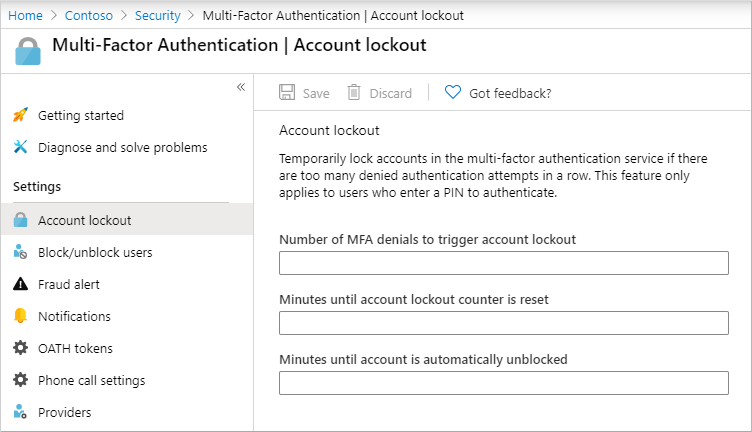
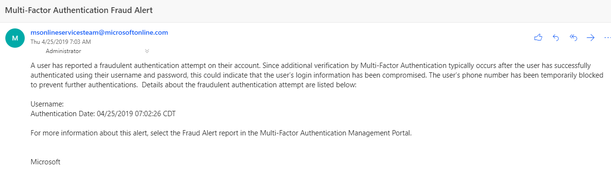

# Configure Azure AD Multi-Factor Authentication settings

To customize the end-user experience for Azure AD Multi-Factor Authentication, you can configure options for settings like the account lockout thresholds or fraud alerts and notifications. Some settings are directly in the Azure portal for Azure Active Directory (Azure AD), and some in a separate Azure AD Multi-Factor Authentication portal.

The following Azure AD Multi-Factor Authentication settings are available in the Azure portal:

| Feature | Description |
| ------- | ----------- |
| [Account lockout](#account-lockout) | Temporarily lock accounts from using Azure AD Multi-Factor Authentication if there are too many denied authentication attempts in a row. This feature only applies to users who enter a PIN to authenticate. (MFA Server) |
| [Block/unblock users](#block-and-unblock-users) | Block specific users from being able to receive Azure AD Multi-Factor Authentication requests. Any authentication attempts for blocked users are automatically denied. Users remain blocked for 90 days from the time that they are blocked or they're manually unblocked. |
| [Fraud alert](#fraud-alert) | Configure settings that allow users to report fraudulent verification requests. |
| [Notifications](#notifications) | Enable notifications of events from MFA Server. |
| [OATH tokens](concept-authentication-oath-tokens.md) | Used in cloud-based Azure AD MFA environments to manage OATH tokens for users. |
| [Phone call settings](#phone-call-settings) | Configure settings related to phone calls and greetings for cloud and on-premises environments. |
| Providers | This will show any existing authentication providers that you may have associated with your account. New authentication providers may not be created as of September 1, 2018 |


## Account lockout

To prevent repeated MFA attempts as part of an attack, the account lockout settings let you specify how many failed attempts to allow before the account becomes locked out for a period of time. The account lockout settings are only applied when a pin code is entered for the MFA prompt.

The following settings are available:

* Number of MFA denials to trigger account lockout
* Minutes until account lockout counter is reset
* Minutes until account is automatically unblocked

To configure account lockout settings, complete the following settings:

1. Sign in to the [Azure portal](https://portal.azure.com) as an administrator.
1. Browse to **Azure Active Directory** > **Security** > **MFA** > **Account lockout**.
1. Enter the require values for your environment, then select **Save**.

    

## Block and unblock users

If a user's device has been lost or stolen, you can block Azure AD Multi-Factor Authentication attempts for the associated account. Any Azure AD Multi-Factor Authentication attempts for blocked users are automatically denied. Users remain blocked for 90 days from the time that they are blocked. We have published a video on [how to block and unblock users in your tenant](https://www.youtube.com/watch?v=WdeE1On4S1o) to show you how to do this.

### Block a user

To block a user, complete the following steps:

1. Browse to **Azure Active Directory** > **Security** > **MFA** > **Block/unblock users**.
1. Select **Add** to block a user.
1. Enter the username for the blocked user as `username@domain.com`, then provide a comment in the *Reason* field.
1. When ready, select **OK** to block the user.

### Unblock a user

To unblock a user, complete the following steps:

1. Browse to **Azure Active Directory** > **Security** > **MFA** > **Block/unblock users**.
1. In the *Action* column next to the desired user, select **Unblock**.
1. Enter a comment in the *Reason for unblocking* field.
1. When ready, select **OK** to unblock the user.

## Fraud alert

The fraud alert feature lets users report fraudulent attempts to access their resources. When an unknown and suspicious MFA prompt is received, users can report the fraud attempt using the Microsoft Authenticator app or through their phone.

The following fraud alert configuration options are available:

* **Automatically block users who report fraud**: If a user reports fraud, the Azure AD MFA authentication attempts for the user  account are blocked for 90 days or until an administrator unblocks their account. An administrator can review sign-ins by using the sign-in report, and take appropriate action to prevent future fraud. An administrator can then [unblock](#unblock-a-user) the user's account.
* **Code to report fraud during initial greeting**: When users receive a phone call to perform multi-factor authentication, they normally press **#** to confirm their sign-in. To report fraud, the user enters a code before pressing **#**. This code is **0** by default, but you can customize it.

   > [!NOTE]
   > The default voice greetings from Microsoft instruct users to press **0#** to submit a fraud alert. If you want to use a code other than **0**, record and upload your own custom voice greetings with appropriate instructions for your users.

To enable and configure fraud alerts, complete the following steps:

1. Browse to **Azure Active Directory** > **Security** > **MFA** > **Fraud alert**.
1. Set the *Allow users to submit fraud alerts* setting to **On**.
1. Configure the *Automatically block users who report fraud* or *Code to report fraud during initial greeting* setting as desired.
1. When ready, select **Save**.

### View fraud reports

Select **Azure Active Directory** > **Sign-ins** > **Authentication Details**. The fraud report is now part of the standard Azure AD Sign-ins report and it will show in the **"Result Detail"** as MFA denied, Fraud Code Entered.
 
## Notifications

Email notifications can be configured when users report fraud alerts. These notifications are typically sent to identity administrators, as the user's account credentials are likely compromised. The following example shows what a fraud alert notification email looks like:



To configure fraud alert notifications, complete the following settings:

1. Browse to **Azure Active Directory** > **Security** > **Multi-Factor Authentication** > **Notifications**.
1. Enter the email address to add into the next box.
1. To remove an existing email address, select the **...** option next to the desired email address, then select **Delete**.
1. When ready, select **Save**.

## OATH tokens

Azure AD supports the use of OATH-TOTP SHA-1 tokens that refresh codes every 30 or 60 seconds. Customers can purchase these tokens from the vendor of their choice.

OATH TOTP hardware tokens typically come with a secret key, or seed, pre-programmed in the token. These keys must be input into Azure AD as described in the following steps. Secret keys are limited to 128 characters, which may not be compatible with all tokens. The secret key can only contain the characters *a-z* or *A-Z* and digits *1-7*, and must be encoded in *Base32*.

Programmable OATH TOTP hardware tokens that can be reseeded can also be set up with Azure AD in the software token setup flow.

OATH hardware tokens are supported as part of a public preview. For more information about previews, see [Supplemental Terms of Use for Microsoft Azure Previews](https://azure.microsoft.com/support/legal/preview-supplemental-terms/)


Once tokens are acquired they must be uploaded in a comma-separated values (CSV) file format including the UPN, serial number, secret key, time interval, manufacturer, and model as shown in the following example:

```csv
upn,serial number,secret key,time interval,manufacturer,model
Helga@contoso.com,1234567,1234567abcdef1234567abcdef,60,Contoso,HardwareKey
```

> [!NOTE]
> Make sure you include the header row in your CSV file.

Once properly formatted as a CSV file, an administrator can then sign in to the Azure portal, navigate to **Azure Active Directory > Security > MFA > OATH tokens**, and upload the resulting CSV file.

Depending on the size of the CSV file, it may take a few minutes to process. Select the **Refresh** button to get the current status. If there are any errors in the file, you can download a CSV file that lists any errors for you to resolve. The field names in the downloaded CSV file are different than the uploaded version.

Once any errors have been addressed, the administrator then can activate each key by selecting **Activate** for the token and entering the OTP displayed on the token.

Users may have a combination of up to five OATH hardware tokens or authenticator applications, such as the Microsoft Authenticator app, configured for use at any time.

## Phone call settings

If users receive phone calls for MFA prompts, you can configure their experience, such as caller ID or voice greeting they hear.

In the United States, if you haven't configured MFA Caller ID, voice calls from Microsoft come from the following numbers. If using spam filters, make sure to exclude these numbers:

* *+1 (866) 539 4191*
* *+1 (855) 330 8653*
* *+1 (877) 668 6536*

> [!NOTE]
> When Azure AD Multi-Factor Authentication calls are placed through the public telephone network, sometimes the calls are routed through a carrier that doesn't support caller ID. Because of this, caller ID isn't guaranteed, even though Azure AD Multi-Factor Authentication always sends it. This applies both to phone calls and to text messages provided by Azure AD Multi-Factor Authentication. If you need to validate that a text message is from Azure AD Multi-Factor Authentication, see [What SMS short codes are used for sending messages?](multi-factor-authentication-faq.md#what-sms-short-codes-are-used-for-sending-sms-messages-to-my-users)

To configure your own caller ID number, complete the following steps:

1. Browse to **Azure Active Directory** > **Security** > **MFA** > **Phone call settings**.
1. Set the **MFA caller ID number** to the number you wish users to see on their phone. Only US-based numbers are allowed.
1. When ready, select **Save**.

### Custom voice messages

You can use your own recordings or greetings for Azure AD Multi-Factor Authentication with the custom voice messages feature. These messages can be used in addition to or to replace the default Microsoft recordings.

Before you begin, be aware of the following restrictions:

* The supported file formats are *.wav* and *.mp3*.
* The file size limit is 1 MB.
* Authentication messages should be shorter than 20 seconds. Messages that are longer than 20 seconds can cause the verification to fail. The user might not respond before the message finishes and the verification times out.

### Custom message language behavior

When a custom voice message is played to the user, the language of the message depends on the following factors:

* The language of the current user.
  * The language detected by the user's browser.
  * Other authentication scenarios may behave differently.
* The language of any available custom messages.
  * This language is chosen by the administrator, when a custom message is added.

For example, if there is only one custom message, with a language of German:

* A user who authenticates in the German language will hear the custom German message.
* A user who authenticates in English will hear the standard English message.

### Custom voice message defaults

The following sample scripts can be used to create your own custom messages. These phrases are the defaults if you don't configure your own custom messages:

| Message name | Script |
| --- | --- |
| Authentication successful | Your sign-in was successfully verified. Goodbye. |
| Extension prompt | Thank you for using Microsoft's sign-in verification system. Please press pound key to continue. |
| Fraud Confirmation | A fraud alert has been submitted. To unblock your account, please contact your company's IT help desk. |
| Fraud greeting (Standard) | Thank you for using Microsoft's sign-in verification system. Please press the pound key to finish your verification. If you did not initiate this verification, someone may be trying to access your account. Please press zero pound to submit a fraud alert. This will notify your company's IT team and block further verification attempts. |
| Fraud reported    A fraud alert has been submitted. | To unblock your account, please contact your company's IT help desk. |
| Activation | Thank you for using the Microsoft's sign-in verification system. Please press the pound key to finish your verification. |
| Authentication denied retry | Verification denied. |
| Retry (Standard) | Thank you for using the Microsoft's sign-in verification system. Please press the pound key to finish your verification. |
| Greeting (Standard) | Thank you for using the Microsoft's sign-in verification system. Please press the pound key to finish your verification. |
| Greeting (PIN) | Thank you for using Microsoft's sign-in verification system. Please enter your PIN followed by the pound key to finish your verification. |
| Fraud greeting (PIN) | Thank you for using Microsoft's sign-in verification system.  Please enter your PIN followed by the pound key to finish your verification. If you did not initiate this verification, someone may be trying to access your account. Please press zero pound to submit a fraud alert. This will notify your company's IT team and block further verification attempts. |
| Retry(PIN) | Thank you for using Microsoft's sign-in verification system. Please enter your PIN followed by the pound key to finish your verification. |
| Extension prompt after digits | If already at this extension, press the pound key to continue. |
| Authentication denied | I'm sorry, we cannot sign you in at this time. Please try again later. |
| Activation greeting (Standard) | Thank you for using the Microsoft's sign-in verification system. Please press the pound key to finish your verification. |
| Activation retry (Standard) | Thank you for using the Microsoft's sign-in verification system. Please press the pound key to finish your verification. |
| Activation greeting (PIN) | Thank you for using Microsoft's sign-in verification system. Please enter your PIN followed by the pound key to finish your verification. |
| Extension prompt before digits | Thank you for using Microsoft's sign-in verification system. Please transfer this call to extension … |

### Set up a custom message

To use your own custom messages, complete the following steps:

1. Browse to **Azure Active Directory** > **Security** > **MFA** > **Phone call settings**.
1. Select **Add greeting**.
1. Choose the **Type** of greeting, such as *Greeting (standard)* or  *Authentication successful*.
1. Select the **Language**, based on the previous section on [custom message language behavior](#custom-message-language-behavior).
1. Browse for and select an *.mp3* or *.wav* sound file to upload.
1. When ready, select **Add**, then **Save**.

## MFA service settings

Settings for app passwords, trusted IPs, verification options, and remember multi-factor authentication for Azure AD Multi-Factor Authentication can be found in service settings. This is more of a legacy portal, and isn't part of the regular Azure AD portal.

Service settings can be accessed from the Azure portal by browsing to **Azure Active Directory** > **Security** > **MFA** > **Getting started** > **Configure** > **Additional cloud-based MFA settings**. A new window or tab opens with additional *service settings* options.

## Trusted IPs

The _Trusted IPs_ feature of Azure AD Multi-Factor Authentication bypasses multi-factor authentication prompts for users who sign in from a defined IP address range. You can set trusted IP ranges for your on-premises environments so when users are in one of those locations, there's no Azure AD Multi-Factor Authentication prompt. The _Trusted IPs_ feature of Azure AD Multi-Factor Authentication requires Azure AD Premium P1 edition. 

> [!NOTE]
> The trusted IPs can include private IP ranges only when you use MFA Server. For cloud-based Azure AD Multi-Factor Authentication, you can only use public IP address ranges.
>
> IPv6 ranges are only supported in the [Named location (preview)](../conditional-access/location-condition.md) interface.

If your organization deploys the NPS extension to provide MFA to on-premises applications note the source IP address will always appear to be the NPS server the authentication attempt flows through.

| Azure AD tenant type | Trusted IP feature options |
|:--- |:--- |
| Managed |**Specific range of IP addresses**: Administrators specify a range of IP addresses that can bypass multi-factor authentication for users who sign in from the company intranet. A maximum of 50 trusted IP ranges can be configured.|
| Federated |**All Federated Users**: All federated users who sign in from inside of the organization can bypass multi-factor authentication. The users bypass verification by using a claim that is issued by Active Directory Federation Services (AD FS).<br/>**Specific range of IP addresses**: Administrators specify a range of IP addresses that can bypass multi-factor authentication for users who sign in from the company intranet. |

Trusted IP bypass works only from inside of the company intranet. If you select the **All Federated Users** option and a user signs in from outside the company intranet, the user has to authenticate by using multi-factor authentication. The process is the same even if the user presents an AD FS claim.

### End-user experience inside of corpnet

When the trusted IPs feature is disabled, multi-factor authentication is required for browser flows. App passwords are required for older rich client applications.

When trusted IPs are used, multi-factor authentication isn't required for browser flows. App passwords aren't required for older rich client applications, provided that the user hasn't created an app password. After an app password is in use, the password remains required.

### End-user experience outside corpnet

Regardless of whether trusted IP are defined, multi-factor authentication is required for browser flows. App passwords are required for older rich client applications.

### Enable named locations by using Conditional Access

You can use Conditional Access rules to define named locations using the following steps:

1. In the Azure portal, search for and select **Azure Active Directory**, then browse to **Security** > **Conditional Access** > **Named locations**.
1. Select **New location**.
1. Enter a name for the location.
1. Select **Mark as trusted location**.
1. Enter the IP Range in CIDR notation for your environment, such as *40.77.182.32/27*.
1. Select **Create**.

### Enable the Trusted IPs feature by using Conditional Access

To enable trusted IPs using Conditional Access policies, complete the following steps:

1. In the Azure portal, search for and select **Azure Active Directory**, then browse to **Security** >  **Conditional Access** > **Named locations**.
1. Select **Configure MFA trusted IPs**.
1. On the **Service Settings** page, under **Trusted IPs**, choose from any of the following two options:

   * **For requests from federated users originating from my intranet**: To choose this option, select the check box. All federated users who sign in from the corporate network bypass multi-factor authentication by using a claim that is issued by AD FS. Ensure that AD FS has a rule to add the intranet claim to the appropriate traffic. If the rule does not exist, create the following rule in AD FS:

      `c:[Type== "http://schemas.microsoft.com/ws/2012/01/insidecorporatenetwork"] => issue(claim = c);`

   * **For requests from a specific range of public IPs**: To choose this option, enter the IP addresses in the text box by using CIDR notation.
      * For IP addresses that are in the range xxx.xxx.xxx.1 through xxx.xxx.xxx.254, use notation like **xxx.xxx.xxx.0/24**.
      * For a single IP address, use notation like **xxx.xxx.xxx.xxx/32**.
      * Enter up to 50 IP address ranges. Users who sign in from these IP addresses bypass multi-factor authentication.

1. Select **Save**.

### Enable the Trusted IPs feature by using service settings

If you don't want to use Conditional Access policies to enable trusted IPs, you can configure the *service settings* for Azure AD Multi-Factor Authentication using the following steps:

1. In the Azure portal, search for and select **Azure Active Directory**, then choose **Users**.
1. Select **Multi-Factor Authentication**.
1. Under Multi-Factor Authentication, select **service settings**.
1. On the **Service Settings** page, under **Trusted IPs**, choose one (or both) of the following two options:

   * **For requests from federated users on my intranet**: To choose this option, select the check box. All federated users who sign in from the corporate network bypass multi-factor authentication by using a claim that is issued by AD FS. Ensure that AD FS has a rule to add the intranet claim to the appropriate traffic. If the rule does not exist, create the following rule in AD FS:

      `c:[Type== "http://schemas.microsoft.com/ws/2012/01/insidecorporatenetwork"] => issue(claim = c);`

   * **For requests from a specified range of IP address subnets**: To choose this option, enter the IP addresses in the text box by using CIDR notation.
      * For IP addresses that are in the range xxx.xxx.xxx.1 through xxx.xxx.xxx.254, use notation like **xxx.xxx.xxx.0/24**.
      * For a single IP address, use notation like **xxx.xxx.xxx.xxx/32**.
      * Enter up to 50 IP address ranges. Users who sign in from these IP addresses bypass multi-factor authentication.

1. Select **Save**.

## Verification methods

You can choose the verification methods that are available for your users in the service settings portal. When your users enroll their accounts for Azure AD Multi-Factor Authentication, they choose their preferred verification method from the options that you have enabled. Guidance for the user enrollment process is provided in [Set up my account for multi-factor authentication](../user-help/multi-factor-authentication-end-user-first-time.md).

The following verification methods are available:

| Method | Description |
|:--- |:--- |
| Call to phone |Places an automated voice call. The user answers the call and presses # in the phone keypad to authenticate. The phone number is not synchronized to on-premises Active Directory. |
| Text message to phone |Sends a text message that contains a verification code. The user is prompted to enter the verification code into the sign-in interface. This process is called one-way SMS. Two-way SMS means that the user must text back a particular code. Two-way SMS is deprecated and not supported after November 14, 2018. Administrators should enable another method for users who previously used two-way SMS.|
| Notification through mobile app |Sends a push notification to your phone or registered device. The user views the notification and selects **Verify** to complete verification. The Microsoft Authenticator app is available for [Windows Phone](https://www.microsoft.com/p/microsoft-authenticator/9nblgggzmcj6), [Android](https://go.microsoft.com/fwlink/?Linkid=825072), and [iOS](https://go.microsoft.com/fwlink/?Linkid=825073). |
| Verification code from mobile app or hardware token |The Microsoft Authenticator app generates a new OATH verification code every 30 seconds. The user enters the verification code into the sign-in interface. The Microsoft Authenticator app is available for [Windows Phone](https://www.microsoft.com/p/microsoft-authenticator/9nblgggzmcj6), [Android](https://go.microsoft.com/fwlink/?Linkid=825072), and [iOS](https://go.microsoft.com/fwlink/?Linkid=825073). |

For more information, see [What authentication and verification methods are available in Azure AD?](concept-authentication-methods.md)

### Enable and disable verification methods

To enable or disable verification methods, complete the following steps:

1. In the Azure portal, search for and select **Azure Active Directory**, then choose **Users**.
1. Select **Multi-Factor Authentication**.
1. Under Multi-Factor Authentication, select **service settings**.
1. On the **Service Settings** page, under **verification options**, select/unselect the methods to provide to your users.
1. Click **Save**.

## Remember Multi-Factor Authentication

The _remember Multi-Factor Authentication_ feature lets users can bypass subsequent verifications for a specified number of days, after they've successfully signed-in to a device by using Multi-Factor Authentication. To enhance usability and minimize the number of times a user has to perform MFA on the same device, select a duration of 90 days or more.

> [!IMPORTANT]
> If an account or device is compromised, remembering Multi-Factor Authentication for trusted devices can affect security. If a corporate account becomes compromised or a trusted device is lost or stolen, you should [Revoke MFA Sessions](howto-mfa-userdevicesettings.md).
>
> The restore action revokes the trusted status from all devices, and the user is required to perform multi-factor authentication again. You can also instruct your users to restore Multi-Factor Authentication on their own devices as noted in [Manage your settings for multi-factor authentication](../user-help/multi-factor-authentication-end-user-manage-settings.md#turn-on-two-factor-verification-prompts-on-a-trusted-device).

### How the feature works

The remember Multi-Factor Authentication feature sets a persistent cookie on the browser when a user selects the **Don't ask again for X days** option at sign-in. The user isn't prompted again for Multi-Factor Authentication from that same browser until the cookie expires. If the user opens a different browser on the same device or clears their cookies, they're prompted again to verify.

The **Don't ask again for X days** option isn't shown on non-browser applications, regardless of whether the app supports modern authentication. These apps use _refresh tokens_ that provide new access tokens every hour. When a refresh token is validated, Azure AD checks that the last multi-factor authentication occurred within the specified number of days.

The feature reduces the number of authentications on web apps, which normally prompt every time. The feature can increase the number of authentications for modern authentication clients that normally prompt every 180 days, if a lower duration is configured. May also increase the number of authentications when combined with Conditional Access policies.

> [!IMPORTANT]
> The **remember Multi-Factor Authentication** feature isn't compatible with the **keep me signed in** feature of AD FS, when users perform multi-factor authentication for AD FS through Azure Multi-Factor Authentication Server or a third-party multi-factor authentication solution.
>
> If your users select **keep me signed in** on AD FS and also mark their device as trusted for Multi-Factor Authentication, the user isn't automatically verified after the **remember multi-factor authentication** number of days expires. Azure AD requests a fresh multi-factor authentication, but AD FS returns a token with the original Multi-Factor Authentication claim and date, rather than performing multi-factor authentication again. **This reaction sets off a verification loop between Azure AD and AD FS.**
>
> The **remember Multi-Factor Authentication** feature is not compatible with B2B users and will not be visible for B2B users when signing into the invited tenants.
>

### Enable remember Multi-Factor Authentication

To enable and configure the option for users to remember their MFA status and bypass prompts, complete the following steps:

1. In the Azure portal, search for and select **Azure Active Directory**, then choose **Users**.
1. Select **Multi-Factor Authentication**.
1. Under Multi-Factor Authentication, select **service settings**.
1. On the **Service Settings** page, under **remember multi-factor authentication**, select the **Allow users to remember multi-factor authentication on devices they trust** option.
1. Set the number of days to allow trusted devices to bypass multi-factor authentication. For the optimal user experience, extend the duration to *90* or more days.
1. Select **Save**.

### Mark a device as trusted

After you enable the remember Multi-Factor Authentication feature, users can mark a device as trusted when they sign in by selecting the option for **Don't ask again**.

## Next steps

To learn more about the available methods for use in Azure AD Multi-Factor Authentication, see [What authentication and verification methods are available in Azure Active Directory?](concept-authentication-methods.md)
