# Integrate your VPN infrastructure with Microsoft Entra multifactor authentication by using the Network Policy Server extension for Azure

The Network Policy Server (NPS) extension for Azure allows organizations to safeguard Remote Authentication Dial-In User Service (RADIUS) client authentication using cloud-based [Microsoft Entra multifactor authentication](howto-mfaserver-nps-rdg.md), which provides two-step verification.

This article provides instructions for integrating NPS infrastructure with MFA by using the NPS extension for Azure. This process enables secure two-step verification for users who attempt to connect to your network by using a VPN.

Network Policy and Access Services gives organizations the ability to:

* Assign a central location for the management and control of network requests to specify:

  * Who can connect

  * What times of day connections are allowed

  * The duration of connections

  * The level of security that clients must use to connect

    Rather than specify policies on each VPN or Remote Desktop Gateway server, do so after they're in a central location. The RADIUS protocol is used to provide centralized Authentication, Authorization, and Accounting (AAA).

* Establish and enforce Network Access Protection (NAP) client health policies that determine whether devices are granted unrestricted or restricted access to network resources.

* Provide a way to enforce authentication and authorization for access to 802.1x-capable wireless access points and Ethernet switches.
  For more information, see [Network Policy Server](/windows-server/networking/technologies/nps/nps-top).

To enhance security and provide a high level of compliance, organizations can integrate NPS with Microsoft Entra multifactor authentication to ensure that users use two-step verification to connect to the virtual port on the VPN server. For users to be granted access, they must provide their username and password combination and other information that they control. This information must be trusted and not easily duplicated. It can include a cell phone number, a landline number, or an application on a mobile device.

Prior to the availability of the NPS extension for Azure, customers who wanted to implement two-step verification for integrated NPS and MFA environments had to configure and maintain a separate MFA server in an on-premises environment. This type of authentication is offered by Remote Desktop Gateway and Azure Multi-Factor Authentication Server using RADIUS.

With the NPS extension for Azure, organizations can secure RADIUS client authentication by deploying either an on-premises based MFA solution or a cloud-based MFA solution.

## Authentication flow

When users connect to a virtual port on a VPN server, they must first authenticate by using a variety of protocols. The protocols allow the use of a combination of user name and password and certificate-based authentication methods.

In addition to authenticating and verifying their identity, users must have the appropriate dial-in permissions. In simple implementations, dial-in permissions that allow access are set directly on the Active Directory user objects.

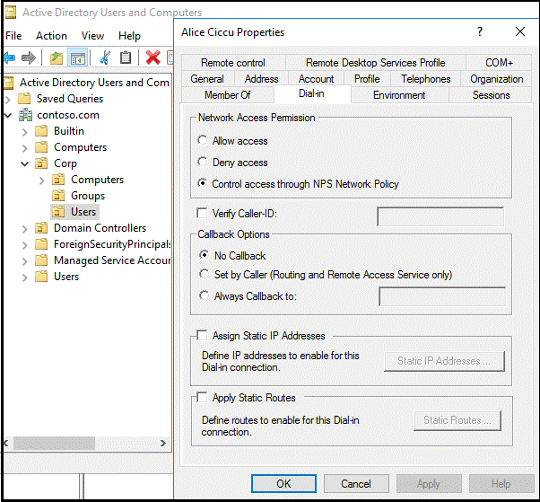

In simple implementations, each VPN server grants or denies access based on policies that are defined on each local VPN server.

In larger and more scalable implementations, the policies that grant or deny VPN access are centralized on RADIUS servers. In these cases, the VPN server acts as an access server (RADIUS client) that forwards connection requests and account messages to a RADIUS server. To connect to the virtual port on the VPN server, users must be authenticated and meet the conditions that are defined centrally on RADIUS servers.

When the NPS extension for Azure is integrated with the NPS, a successful authentication flow results, as follows:

1. The VPN server receives an authentication request from a VPN user that includes the username and password for connecting to a resource, such as a Remote Desktop session.
2. Acting as a RADIUS client, the VPN server converts the request to a RADIUS *Access-Request* message and sends it (with an encrypted password) to the RADIUS server where the NPS extension is installed.
3. The username and password combination is verified in Active Directory. If either the username or password is incorrect, the RADIUS Server sends an *Access-Reject* message.
4. If all conditions, as specified in the NPS Connection Request and Network Policies, are met (for example, time of day or group membership restrictions), the NPS extension triggers a request for secondary authentication with Microsoft Entra multifactor authentication.
5. Microsoft Entra multifactor authentication communicates with Microsoft Entra ID, retrieves the user's details, and performs the secondary authentication by using the method that's configured by the user (cell phone call, text message, or mobile app).
6. When the MFA challenge is successful, Microsoft Entra multifactor authentication communicates the result to the NPS extension.
7. After the connection attempt is both authenticated and authorized, the NPS where the extension is installed sends a RADIUS *Access-Accept* message to the VPN server (RADIUS client).
8. The user is granted access to the virtual port on the VPN server and establishes an encrypted VPN tunnel.

## Prerequisites

This section details the prerequisites that must be completed before you can integrate MFA with the VPN. Before you begin, you must have the following prerequisites in place:

* VPN infrastructure
* Network Policy and Access Services role
* Microsoft Entra multifactor authentication license
* Windows Server software
* Libraries
* Microsoft Entra ID synced with on-premises Active Directory
* Microsoft Entra GUID ID

### VPN infrastructure

This article assumes that you have a working VPN infrastructure that uses Microsoft Windows Server 2016 and that your VPN server is currently not configured to forward connection requests to a RADIUS server. In the article, you configure the VPN infrastructure to use a central RADIUS server.

If you do not have a working VPN infrastructure in place, you can quickly create one by following the guidance in numerous VPN setup tutorials that you can find on the Microsoft and third-party sites.

### The Network Policy and Access Services role

Network Policy and Access Services provides the RADIUS server and client functionality. This article assumes that you have installed the Network Policy and Access Services role on a member server or domain controller in your environment. In this guide, you configure RADIUS for a VPN configuration. Install the Network Policy and Access Services role on a server *other than* your VPN server.

For information about installing the Network Policy and Access Services role service Windows Server 2012 or later, see [Install a NAP Health Policy Server](/previous-versions/windows/it-pro/windows-server-2008-R2-and-2008/dd296890(v=ws.10)). NAP is deprecated in Windows Server 2016. For a description of best practices for NPS, including the recommendation to install NPS on a domain controller, see [Best practices for NPS](/previous-versions/windows/it-pro/windows-server-2008-R2-and-2008/cc771746(v=ws.10)).

<a name='azure-ad-mfa-license'></a>

### Microsoft Entra multifactor authentication License

A license is required for Microsoft Entra multifactor authentication, and it is available through a Microsoft Entra ID P1 or P2, Enterprise Mobility + Security, or a multifactor authentication stand-alone license. Consumption-based licenses for Microsoft Entra multifactor authentication such as per user or per authentication licenses are not compatible with the NPS extension. For more information, see [How to get Microsoft Entra multifactor authentication](concept-mfa-licensing.md). For testing purposes, you can use a trial subscription.

### Windows Server software

The NPS extension requires Windows Server 2008 R2 SP1 or later, with the Network Policy and Access Services role installed. All the steps in this guide were performed with Windows Server 2016.

### Libraries

The following libraries are installed automatically with the NPS extension:

- [Visual C++ Redistributable Packages for Visual Studio 2013 (X64)](https://www.microsoft.com/download/details.aspx?id=40784)
- [Azure AD PowerShell module version 1.1.166.0](https://connect.microsoft.com/site1164/Downloads/DownloadDetails.aspx?DownloadID=59185)

If the Azure Active Directory PowerShell module is not already present, it is installed with a configuration script that you run as part of the setup process. There is no need to install the module ahead of time if it is not already installed.

<a name='azure-active-directory-synced-with-on-premises-active-directory'></a>

### Microsoft Entra ID synced with on-premises Active Directory

To use the NPS extension, on-premises users must be synced with Microsoft Entra ID and enabled for MFA. This guide assumes that on-premises users are synced with Microsoft Entra ID via Microsoft Entra Connect. Instructions for enabling users for MFA are provided below.

For information about Microsoft Entra Connect, see [Integrate your on-premises directories with Microsoft Entra ID](../hybrid/whatis-hybrid-identity.md).

<a name='azure-active-directory-guid-id'></a>

### Microsoft Entra GUID ID

To install the NPS extension, you need to know the GUID of the Microsoft Entra ID. Instructions for finding the GUID of the Microsoft Entra ID are provided in the next section.

## Configure RADIUS for VPN connections

If you have installed the NPS role on a member server, you need to configure it to authenticate and authorize the VPN client that requests VPN connections. 

This section assumes that you have installed the Network Policy and Access Services role but have not configured it for use in your infrastructure.

> [!NOTE]
> If you already have a working VPN server that uses a centralized RADIUS server for authentication, you can skip this section.
>

### Register Server in Active Directory

To function properly in this scenario, the NPS server must be registered in Active Directory.

1. Open Server Manager.

2. In Server Manager, select **Tools**, and then select **Network Policy Server**.

3. In the Network Policy Server console, right-click **NPS (Local)**, and then select **Register server in Active Directory**. Select **OK** two times.

    

4. Leave the console open for the next procedure.

### Use wizard to configure the RADIUS server

You can use a standard (wizard-based) or advanced configuration option to configure the RADIUS server. This section assumes that you're using the wizard-based standard configuration option.

1. In the Network Policy Server console, select **NPS (Local)**.

2. Under **Standard Configuration**, select **RADIUS Server for Dial-Up or VPN Connections**, and then select **Configure VPN or Dial-Up**.

    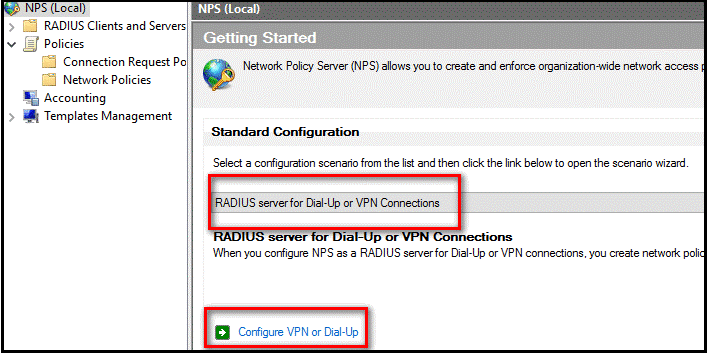

3. In the **Select Dial-up or Virtual Private Network Connections Type** window, select **Virtual Private Network Connections**, and then select **Next**.

    

4. In the **Specify Dial-Up or VPN Server** window, select **Add**.

5. In the **New RADIUS client** window, provide a friendly name, enter the resolvable name or IP address of the VPN server, and then enter a shared secret password. Make the shared secret password long and complex. Record it, because you'll need it in the next section.

    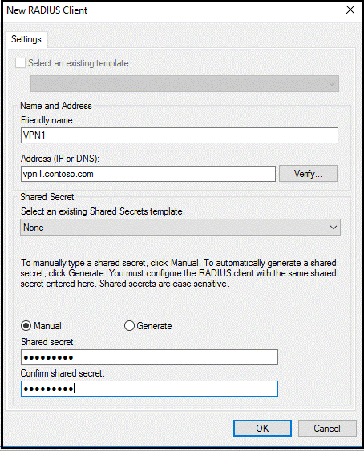

6. Select **OK**, and then select **Next**.

7. In the **Configure Authentication Methods** window, accept the default selection (**Microsoft Encrypted Authentication version 2 [MS-CHAPv2])** or choose another option, and select **Next**.

    > [!NOTE]
    > If you configure Extensible Authentication Protocol (EAP), you must use either Microsoft Challenge-Handshake Authentication Protocol (CHAPv2) or Protected Extensible Authentication Protocol (PEAP). No other EAP is supported.

8. In the **Specify User Groups** window, select **Add**, and then select an appropriate group. If no group exists, leave the selection blank to grant access to all users.

    

9. Select **Next**.

10. In the **Specify IP Filters** window, select **Next**.

11. In the **Specify Encryption Settings** window, accept the default settings, and then select **Next**.

    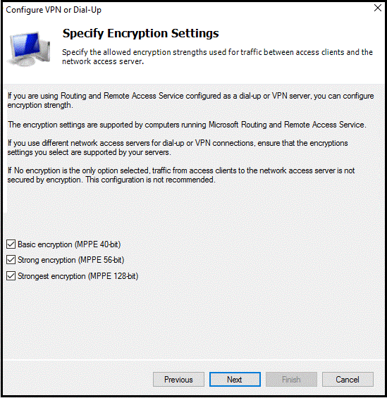

12. In the **Specify a Realm Name** window, leave the realm name blank, accept the default setting, and then select **Next**.

    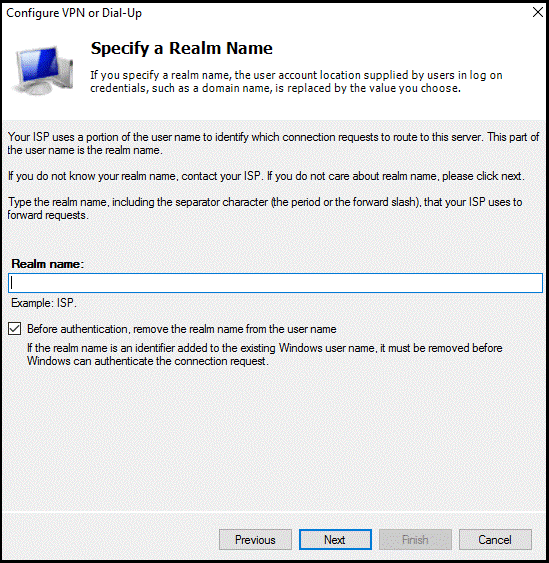

13. In the **Completing New Dial-up or Virtual Private Network Connections and RADIUS clients** window, select **Finish**.

    

### Verify the RADIUS configuration

This section details the configuration you created by using the wizard.

1. On the Network Policy Server, in the NPS (local) console, expand **RADIUS Clients**, and then select **RADIUS Clients**.

2. In the details pane, right-click the RADIUS client that you created, and then select **Properties**. The properties of your RADIUS client (the VPN server) should be like those shown here:

    

3. Select **Cancel**.

4. On the Network Policy Server, in the NPS (local) console, expand **Policies**, and then select **Connection Request Policies**. The VPN Connections policy is displayed as shown in the following image:

    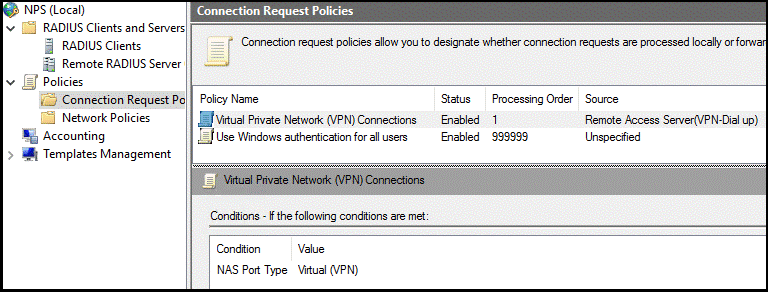

5. Under **Policies**, select **Network Policies**. You should see a Virtual Private Network (VPN) Connections policy that resembles the policy shown in the following image:

    

## Configure your VPN server to use RADIUS authentication

In this section, you configure your VPN server to use RADIUS authentication. The instructions assume that you have a working configuration of a VPN server but have not configured it to use RADIUS authentication. After you configure the VPN server, confirm that your configuration is working as expected.


> [!NOTE]
> If you already have a working VPN server configuration that uses RADIUS authentication, you can skip this section.
>

### Configure authentication provider

1. On the VPN server, open Server Manager.

2. In Server Manager, select **Tools**, and then select **Routing and Remote Access**.

3. In the **Routing and Remote Access** window, right-click **\<server name> (local)**, and then select **Properties**.

4. In the **\<server name> (local) Properties** window, select the **Security** tab.

5. On the **Security** tab, under **Authentication provider**, select **RADIUS Authentication**, and then select **Configure**.

    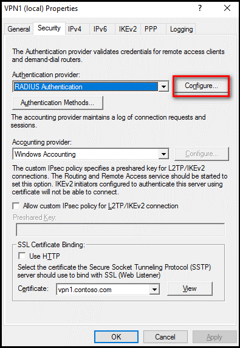

6. In the **RADIUS Authentication** window, select **Add**.

7. In the **Add RADIUS Server** window, do the following:

    1. In the **Server name** box, enter the name or IP address of the RADIUS server that you configured in the previous section.

    1. For the **Shared secret**, select **Change**, and then enter the shared secret password that you created and recorded earlier.

    1. In the **Time-out (seconds)** box, enter a value of **60**. To minimize discarded requests, we recommend that VPN servers are configured with a timeout of at least 60 seconds. If needed, or to reduce discarded requests in the event logs, you can increase the VPN server timeout value to 90 or 120 seconds.

8. Select **OK**.

### Test VPN connectivity

In this section, you confirm that the VPN client is authenticated and authorized by the RADIUS server when you attempt to connect to the VPN virtual port. The instructions assume that you are using Windows 10 as a VPN client.

> [!NOTE]
> If you already configured a VPN client to connect to the VPN server and have saved the settings, you can skip the steps related to configuring and saving a VPN connection object.
>

1. On your VPN client computer, select the **Start** button, and then select the **Settings** button.

2. In the **Windows Settings** window, select **Network & Internet**.

3. Select **VPN**.

4. Select **Add a VPN connection**.

5. In the **Add a VPN connection** window, in the **VPN provider** box, select **Windows (built-in)**, complete the remaining fields, as appropriate, and then select **Save**.

    

6. Go to **Control Panel**, and then select **Network and Sharing Center**.

7. Select **Change adapter settings**.

    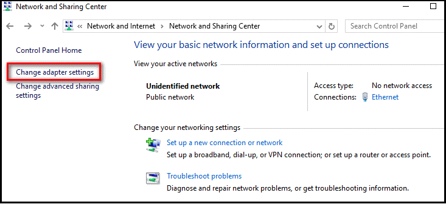

8. Right-click the VPN network connection, and then select **Properties**.

9. In the VPN properties window, select the **Security** tab.

10. On the **Security** tab, ensure that only **Microsoft CHAP Version 2 (MS-CHAP v2)** is selected, and then select **OK**.

    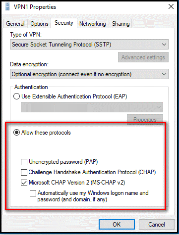

11. Right-click the VPN connection, and then select **Connect**.

12. In the **Settings** window, select **Connect**.  
    A successful connection appears in the Security log, on the RADIUS server, as Event ID 6272, as shown here:

    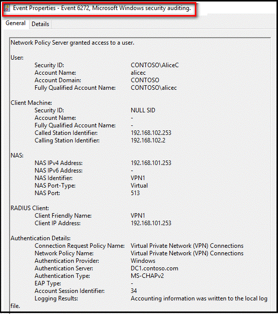

## Troubleshooting RADIUS

Assume that your VPN configuration was working before you configured the VPN server to use a centralized RADIUS server for authentication and authorization. If the configuration was working, it is likely that the issue is caused by a misconfiguration of the RADIUS server or the use of an invalid username or password. For example, if you use the alternate UPN suffix in the username, the sign-in attempt might fail. Use the same account name for best results.

To troubleshoot these issues, an ideal place to start is to examine the Security event logs on the RADIUS server. To save time searching for events, you can use the role-based Network Policy and Access Server custom view in Event Viewer, as shown here. "Event ID 6273" indicates events where the NPS denied access to a user.


<a name='configure-multi-factor-authentication'></a>

## Configure multifactor authentication

For assistance configuring users for multifactor authentication see the articles [Planning a cloud-based Microsoft Entra multifactor authentication deployment](howto-mfa-getstarted.md#plan-conditional-access-policies) and [Set up my account for two-step verification](https://support.microsoft.com/account-billing/how-to-use-the-microsoft-authenticator-app-9783c865-0308-42fb-a519-8cf666fe0acc)

## Install and configure the NPS extension

This section provides instructions for configuring VPN to use MFA for client authentication with the VPN server.

> [!NOTE]
> The REQUIRE_USER_MATCH registry key is case sensitive. All values must be set in UPPER CASE format.
>

After you install and configure the NPS extension, all RADIUS-based client authentication that is processed by this server is required to use MFA. If all your VPN users are not enrolled in Microsoft Entra multifactor authentication, you can do either of the following:

* Set up another RADIUS server to authenticate users who are not configured to use MFA.

* Create a registry entry that allows challenged users to provide a second authentication factor if they are enrolled in Microsoft Entra multifactor authentication.

Create a new string value named _REQUIRE_USER_MATCH in HKLM\SOFTWARE\Microsoft\AzureMfa_, and set the value to *TRUE* or *FALSE*.


If the value is set to *TRUE* or is blank, all authentication requests are subject to an MFA challenge. If the value is set to *FALSE*, MFA challenges are issued only to users who are enrolled in Microsoft Entra multifactor authentication. Use the *FALSE* setting only in testing or in production environments during an onboarding period.


### Obtain the directory tenant ID

[!INCLUDE [portal updates](~/articles/active-directory/includes/portal-update.md)]

As part of the configuration of the NPS extension, you must supply administrator credentials and the ID of your Microsoft Entra tenant. To get the tenant ID, complete the following steps:

1. Sign in to the [Microsoft Entra admin center](https://entra.microsoft.com) as at least an [Global Administrator](../roles/permissions-reference.md#global-administrator).
1. Browse to **Identity** > **Settings**.

   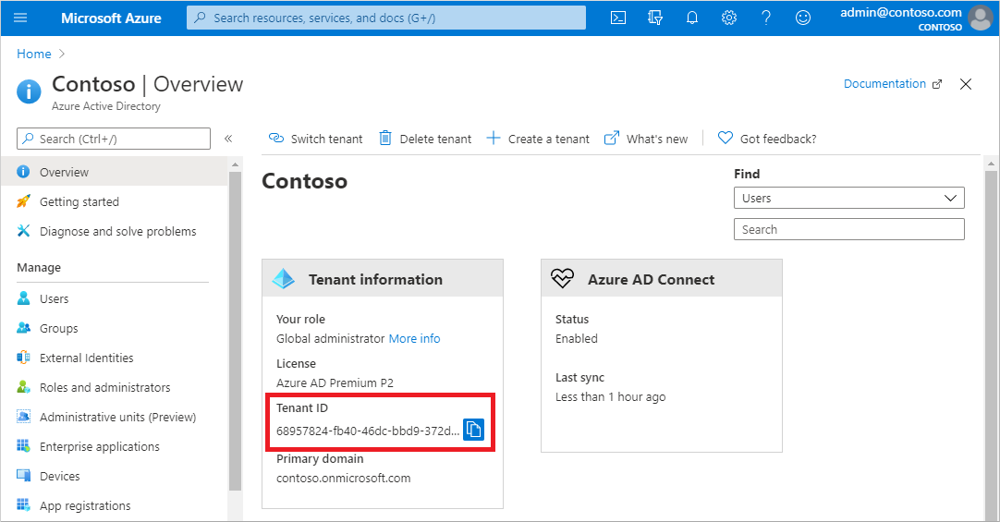

### Install the NPS extension

The NPS extension must be installed on a server that has the Network Policy and Access Services role installed and that functions as the RADIUS server in your design. Do *not* install the NPS extension on your VPN server.

1. Download the NPS extension from [Microsoft Download Center](https://aka.ms/npsmfa).

2. Copy the setup executable file (*NpsExtnForAzureMfaInstaller.exe*) to the NPS server.

3. On the NPS server, double-click **NpsExtnForAzureMfaInstaller.exe** and, if you are prompted, select **Run**.

4. In the **NPS Extension For Microsoft Entra multifactor authentication Setup** window, review the software license terms, select the **I agree to the license terms and conditions** check box, and then select **Install**.

    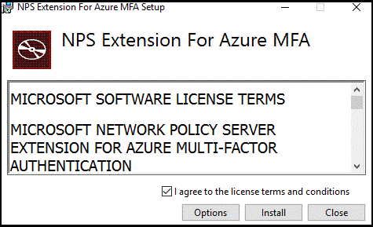

5. In the **NPS Extension For Microsoft Entra multifactor authentication Setup** window, select **Close**.  

    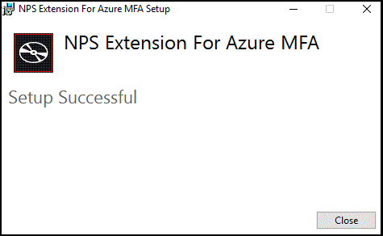

### Configure certificates for use with the NPS extension by using a PowerShell script

To ensure secure communications and assurance, configure certificates for use by the NPS extension. The NPS components include a PowerShell script that configures a self-signed certificate for use with NPS.

The script performs the following actions:

* Creates a self-signed certificate.
* Associates the public key of the certificate to the service principal on Microsoft Entra ID.
* Stores the certificate in the local machine store.
* Grants the network user access to the certificate's private key.
* Restarts the NPS service.

If you want to use your own certificates, you must associate the public key of your certificate with the service principal on Microsoft Entra ID, and so on.

To use the script, provide the extension with your Microsoft Entra administrative credentials and the Microsoft Entra tenant ID that you copied earlier. The account must be in the same Microsoft Entra tenant as you wish to enable the extension for. Run the script on each NPS server where you install the NPS extension.

1. Run Windows PowerShell as an administrator.

2. At the PowerShell command prompt, enter **cd "c:\Program Files\Microsoft\AzureMfa\Config"**, and then select Enter.

3. At the next command prompt, enter **.\AzureMfaNpsExtnConfigSetup.ps1**, and then select Enter. The script checks to see whether the Azure AD PowerShell module is installed. If it is not installed, the script installs the module for you.

    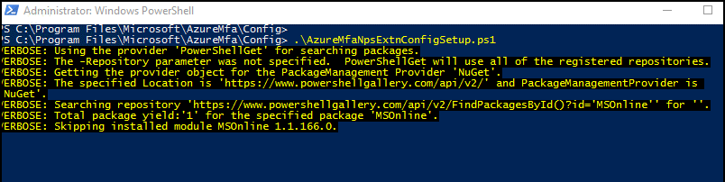

    If you get a security error due to TLS, enable TLS 1.2 using the `[Net.ServicePointManager]::SecurityProtocol = [Net.SecurityProtocolType]::Tls12` command from your PowerShell prompt.
    
    After the script verifies the installation of the PowerShell module, it displays the Azure Active Directory PowerShell module sign-in window.

4. Enter your Microsoft Entra administrator credentials and password, and then select **Sign in**.

    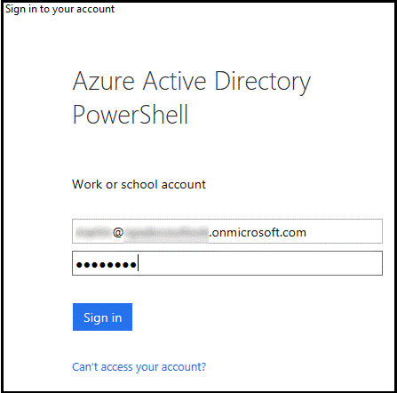

5. At the command prompt, paste the tenant ID that you copied earlier, and then select Enter.

    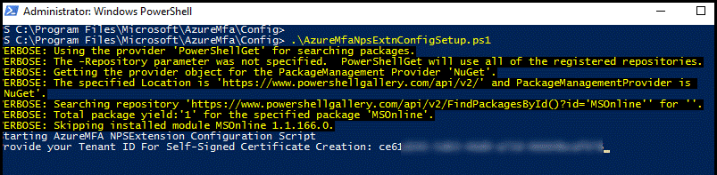

    The script creates a self-signed certificate and performs other configuration changes. The output is like that in the following image:

    

6. Reboot the server.

### Verify the configuration

To verify the configuration, you must establish a new VPN connection with the VPN server. After you've successfully entered your credentials for primary authentication, the VPN connection waits for the secondary authentication to succeed before the connection is established, as shown below.


If you successfully authenticate with the secondary verification method that you previously configured in Microsoft Entra multifactor authentication, you are connected to the resource. However, if the secondary authentication is unsuccessful, you are denied access to the resource.

In the following example, the Microsoft Authenticator app on a Windows Phone provides the secondary authentication:

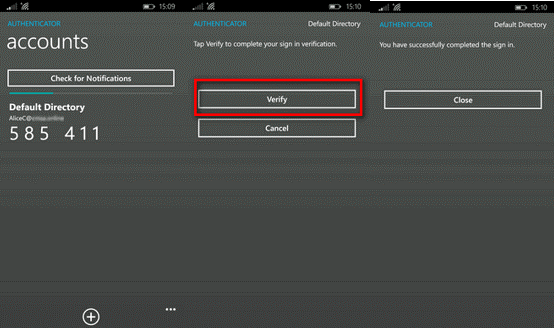

After you've successfully authenticated by using the secondary method, you are granted access to the virtual port on the VPN server. Because you were required to use a secondary authentication method by using a mobile app on a trusted device, the sign-in process is more secure than if it were using only a username and password combination.

### View Event Viewer logs for successful sign-in events

To view successful sign-in events in the Windows Event Viewer logs query the Windows Security log, on the NPS server, by entering the following PowerShell command:

```powershell
Get-WinEvent -Logname Security | where {$_.ID -eq '6272'} | FL
```


You can also view the security log or the Network Policy and Access Services custom view, as shown here:

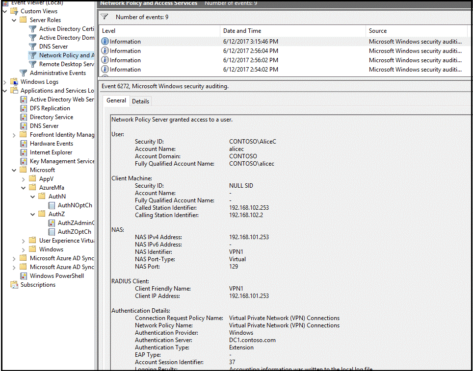

On the server where you installed the NPS extension for Microsoft Entra multifactor authentication, you can find Event Viewer application logs that are specific to the extension at *Application and Services Logs\Microsoft\AzureMfa*.

```powershell
Get-WinEvent -Logname Security | where {$_.ID -eq '6272'} | FL
```

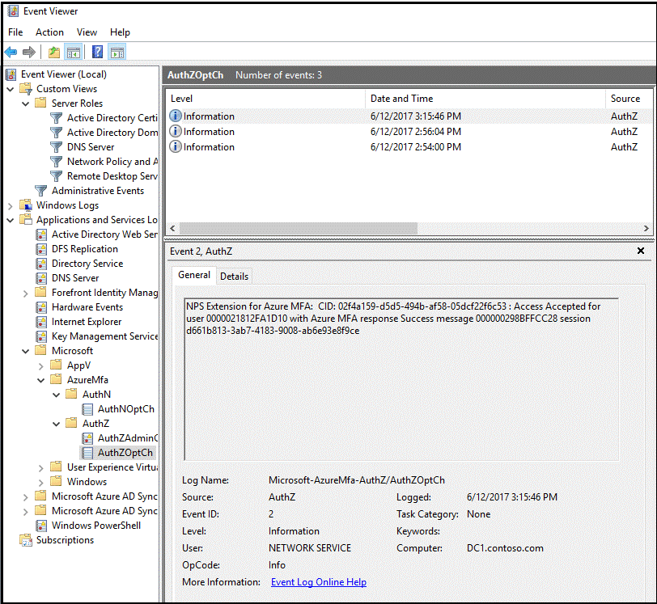

## Troubleshooting guide

If the configuration is not working as expected, begin troubleshooting by verifying that the user is configured to use MFA. Have the user sign in to the [Microsoft Entra admin center](https://entra.microsoft.com). If the user is prompted for secondary authentication and can successfully authenticate, you can eliminate an incorrect configuration of MFA as an issue.

If MFA is working for the user, review the relevant Event Viewer logs. The logs include the security event, Gateway operational, and Microsoft Entra multifactor authentication logs that are discussed in the previous section.

An example of a security log that displays a failed sign-in event (event ID 6273) is shown here:

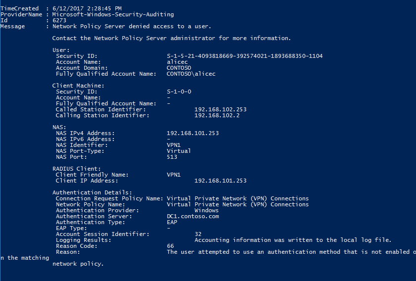

A related event from the Microsoft Entra multifactor authentication log is shown here:

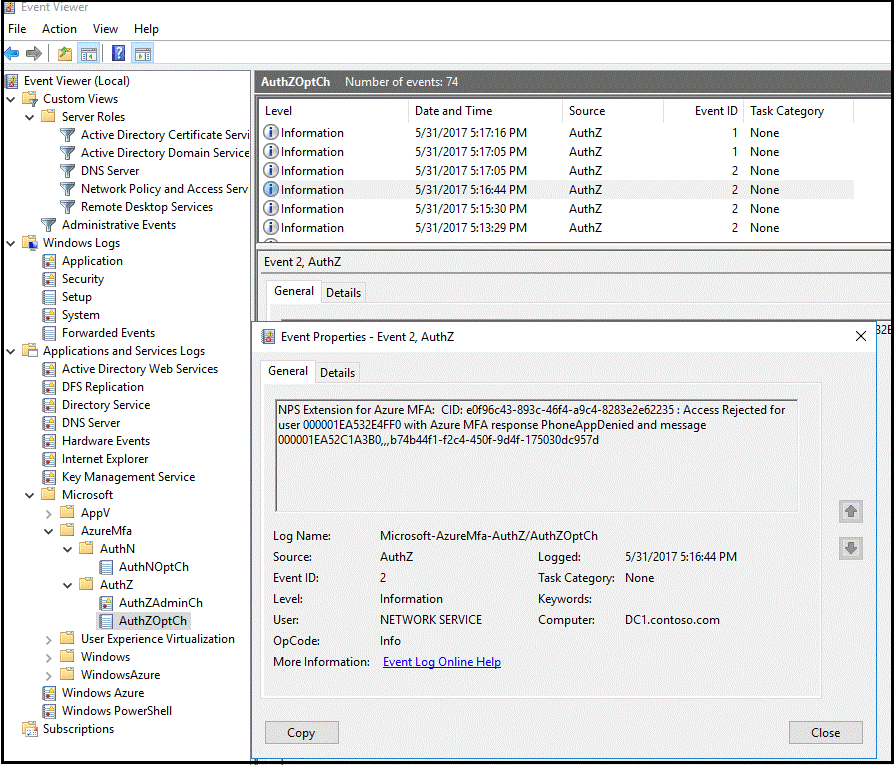

To do advanced troubleshooting, consult the NPS database format log files where the NPS service is installed. The log files are created in the _%SystemRoot%\System32\Logs_ folder as comma-delimited text files. For a description of the log files, see [Interpret NPS Database Format Log Files](/previous-versions/windows/it-pro/windows-server-2008-R2-and-2008/cc771748(v=ws.10)).

The entries in these log files are difficult to interpret unless you export them to a spreadsheet or a database. You can find many Internet Authentication Service (IAS) parsing tools online to assist you in interpreting the log files. The output of one such downloadable [shareware application](https://www.deepsoftware.com/iasviewer) is shown here:


To do additional troubleshooting, you can use a protocol analyzer such as Wireshark or [Microsoft Message Analyzer](/message-analyzer/microsoft-message-analyzer-operating-guide). The following image from Wireshark shows the RADIUS messages between the VPN server and the NPS.

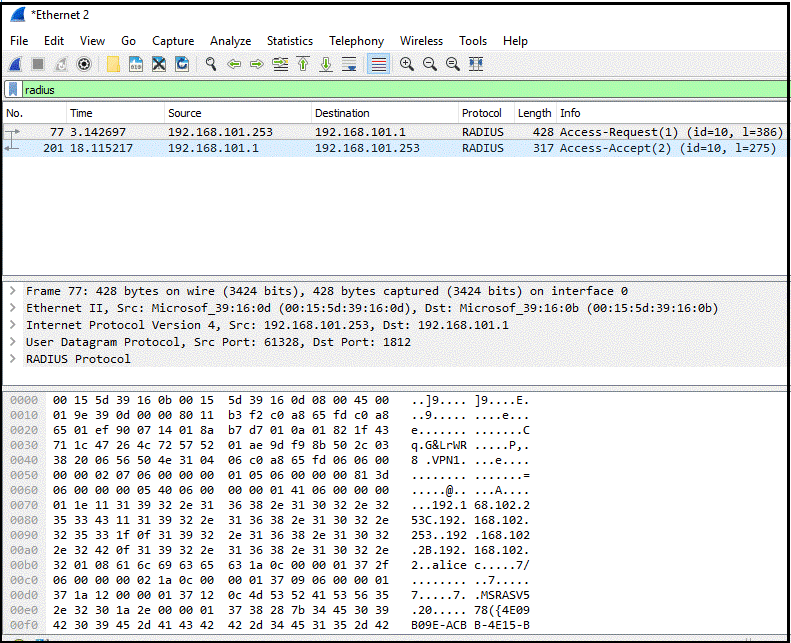

For more information, see [Integrate your existing NPS infrastructure with Microsoft Entra multifactor authentication](howto-mfa-nps-extension.md).

## Next steps

[Get Microsoft Entra multifactor authentication](concept-mfa-licensing.md)

[Remote Desktop Gateway and Azure Multi-Factor Authentication Server using RADIUS](howto-mfaserver-nps-rdg.md)

[Integrate your on-premises directories with Microsoft Entra ID](../hybrid/whatis-hybrid-identity.md)
