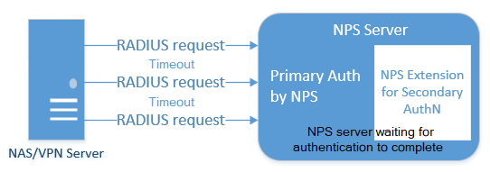
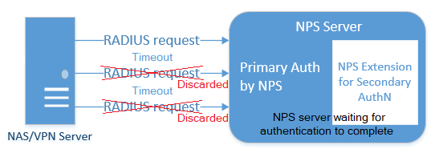
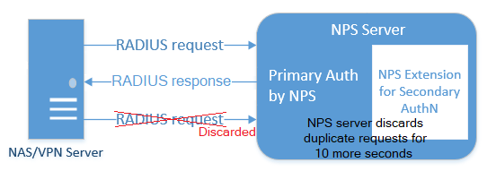

# Integrate your existing Network Policy Server (NPS) infrastructure with Azure AD Multi-Factor Authentication

The Network Policy Server (NPS) extension for Azure AD Multi-Factor Authentication adds cloud-based MFA capabilities to your authentication infrastructure using your existing servers. With the NPS extension, you can add phone call, text message, or phone app verification to your existing authentication flow without having to install, configure, and maintain new servers.

The NPS extension acts as an adapter between RADIUS and cloud-based Azure AD Multi-Factor Authentication to provide a second factor of authentication for federated or synced users.

## How the NPS extension works

When you use the NPS extension for Azure AD Multi-Factor Authentication, the authentication flow includes the following components:

1. **NAS/VPN Server** receives requests from VPN clients and converts them into RADIUS requests to NPS servers.
2. **NPS Server** connects to Active Directory Domain Services (AD DS) to perform the primary authentication for the RADIUS requests and, upon success, passes the request to any installed extensions.
3. **NPS Extension** triggers a request to Azure AD Multi-Factor Authentication for the secondary authentication. Once the extension receives the response, and if the MFA challenge succeeds, it completes the authentication request by providing the NPS server with security tokens that include an MFA claim, issued by Azure STS.
   >[!NOTE]
   >Users must have access to their default authentication method to complete the MFA requirement. They cannot choose an alternative method. Their default authentication method will be used even if it's been disabled in the tenant authentication methods and MFA policies.
1. **Azure AD MFA** communicates with Azure Active Directory (Azure AD) to retrieve the user's details and performs the secondary authentication using a verification method configured to the user.

The following diagram illustrates this high-level authentication request flow:


### RADIUS protocol behavior and the NPS extension

As RADIUS is a UDP protocol, the sender assumes packet loss and awaits a response. After a period of time, the connection may time out. If so, the packet is resent as the sender assumes the packet didn't reach the destination. In the authentication scenario in this article, VPN servers send the request and wait for a response. If the connection times out, the VPN server sends the request again.



The NPS server may not respond to the VPN server's original request before the connection times out as the MFA request may still be being processed. The user may not have successfully responded to the MFA prompt, so the Azure AD Multi-Factor Authentication NPS extension is waiting for that event to complete. In this situation, the NPS server identifies additional VPN server requests as a duplicate request. The NPS server discards these duplicate VPN server requests.



If you look at the NPS server logs, you may see these additional requests being discarded. This behavior is by design to protect the end user from getting multiple requests for a single authentication attempt. Discarded requests in the NPS server event log don't indicate there's a problem with the NPS server or the Azure AD Multi-Factor Authentication NPS extension.

To minimize discarded requests, we recommend that VPN servers are configured with a timeout of at least 60 seconds. If needed, or to reduce discarded requests in the event logs, you can increase the VPN server timeout value to 90 or 120 seconds.

Due to this UDP protocol behavior, the NPS server could receive a duplicate request and send another MFA prompt, even after the user has already responded to the initial request. To avoid this timing condition, the Azure AD Multi-Factor Authentication NPS extension continues to filter and discard duplicate requests for up to 10 seconds after a successful response has been sent to the VPN server.



Again, you may see discarded requests in the NPS server event logs, even when the Azure AD Multi-Factor Authentication prompt was successful. This is expected behavior, and doesn't indicate a problem with the NPS server or Azure AD Multi-Factor Authentication NPS extension.

## Plan your deployment

The NPS extension automatically handles redundancy, so you don't need a special configuration.

You can create as many Azure AD Multi-Factor Authentication-enabled NPS servers as you need. If you do install multiple servers, you should use a difference client certificate for each one of them. Creating a certificate for each server means that you can update each cert individually, and not worry about downtime across all your servers.

VPN servers route authentication requests, so they need to be aware of the new Azure AD Multi-Factor Authentication-enabled NPS servers.

## Prerequisites

The NPS extension is meant to work with your existing infrastructure. Make sure you have the following prerequisites before you begin.

### Licenses

The NPS Extension for Azure AD Multi-Factor Authentication is available to customers with [licenses for Azure AD Multi-Factor Authentication](./concept-mfa-howitworks.md) (included with Azure AD Premium P1 and Premium P2 or Enterprise Mobility + Security). Consumption-based licenses for Azure AD Multi-Factor Authentication, such as per user or per authentication licenses, aren't compatible with the NPS extension.

### Software

Windows Server 2012 or above.

### Libraries

You need to manually install the following library:

- [Visual C++ Redistributable for Visual Studio 2015](https://www.microsoft.com/download/details.aspx?id=48145)

The following libraries are installed automatically with the extension.

- [Visual C++ Redistributable Packages for Visual Studio 2013 (X64)](https://www.microsoft.com/download/details.aspx?id=40784)
- [Microsoft Azure Active Directory Module for Windows PowerShell version 1.1.166.0](https://www.powershellgallery.com/packages/MSOnline/1.1.166.0)

The Microsoft Azure Active Directory Module for Windows PowerShell is also installed through a configuration script you run as part of the setup process, if not already present. There's no need to install this module ahead of time if it's not already installed.

### Azure Active Directory

Everyone using the NPS extension must be synced to Azure AD using Azure AD Connect, and must be registered for MFA.

When you install the extension, you need the *Tenant ID* and admin credentials for your Azure AD tenant. To get the tenant ID, complete the following steps:

1. Sign in to the [Azure portal](https://portal.azure.com) as the global administrator of the Azure tenant.
1. Search for and select the **Azure Active Directory**.
1. On the **Overview** page, the *Tenant information* is shown. Next to the *Tenant ID*, select the **Copy** icon, as shown in the following example screenshot:

   

### Network requirements

The NPS server must be able to communicate with the following URLs over TCP port 443:

* `https:\//login.microsoftonline.com`
* `https:\//credentials.azure.com`

Additionally, connectivity to the following URLs is required to complete the [setup of the adapter using the provided PowerShell script](#run-the-powershell-script):

* `https:\//login.microsoftonline.com`
* `https:\//provisioningapi.microsoftonline.com`
* `https:\//aadcdn.msauth.net`
* `https:\//www.powershellgallery.com`
* `https:\//go.microsoft.com`
* `https:\//aadcdn.msftauthimages.net`

## Prepare your environment

Before you install the NPS extension, prepare you environment to handle the authentication traffic.

### Enable the NPS role on a domain-joined server

The NPS server connects to Azure AD and authenticates the MFA requests. Choose one server for this role. We recommend choosing a server that doesn't handle requests from other services, because the NPS extension throws errors for any requests that aren't RADIUS. The NPS server must be set up as the primary and secondary authentication server for your environment. It can't proxy RADIUS requests to another server.

1. On your server, open **Server Manager**. Select **Add Roles and Features Wizard** from the *Quickstart* menu.
2. For your installation type, choose **Role-based or feature-based installation**.
3. Select the **Network Policy and Access Services** server role. A window may pop up to inform you of additional required features to run this role.
4. Continue through the wizard until the *Confirmation* page. When ready, select **Install**.

It may take a few minutes to install the NPS server role. When finished, continue with the following sections to configure this server to handle incoming RADIUS requests from the VPN solution.

### Configure your VPN solution to communicate with the NPS server

Depending on which VPN solution you use, the steps to configure your RADIUS authentication policy vary. Configure your VPN policy to point to your RADIUS NPS server.

### Sync domain users to the cloud

This step may already be complete on your tenant, but it's good to double-check that Azure AD Connect has synchronized your databases recently.

1. Sign in to the [Azure portal](https://portal.azure.com) as an administrator.
2. Select **Azure Active Directory** > **Azure AD Connect**
3. Verify that your sync status is **Enabled** and that your last sync was less than an hour ago.

If you need to kick off a new round of synchronization, see [Azure AD Connect sync: Scheduler](../hybrid/how-to-connect-sync-feature-scheduler.md#start-the-scheduler).

### Determine which authentication methods your users can use

There are two factors that affect which authentication methods are available with an NPS extension deployment:

* The password encryption algorithm used between the RADIUS client (VPN, Netscaler server, or other) and the NPS servers.
   - **PAP** supports all the authentication methods of Azure AD Multi-Factor Authentication in the cloud: phone call, one-way text message, mobile app notification, OATH hardware tokens, and mobile app verification code.
   - **CHAPV2** and **EAP** support phone call and mobile app notification.  

* The input methods that the client application (VPN, Netscaler server, or other) can handle. For example, does the VPN client have some means to allow the user to type in a verification code from a text or mobile app?

You can [disable unsupported authentication methods](howto-mfa-mfasettings.md#verification-methods) in Azure.

 > [!NOTE]
 > Regardless of the authentication protocol that's used (PAP, CHAP, or EAP), if your MFA method is text-based (SMS, mobile app verification code, or OATH hardware token) and requires the user to enter a code or text in the VPN client UI input field, the authentication might succeed. *But* any RADIUS attributes that are configured in the Network Access Policy are *not* forwarded to the RADIUS client (the Network Access Device, like the VPN gateway). As a result, the VPN client might have more access than you want it to have, or less access or no access.
 >
 > As a workaround, you can run the [CrpUsernameStuffing script](https://github.com/OneMoreNate/CrpUsernameStuffing) to forward RADIUS attributes that are configured in the Network Access Policy and allow MFA when the user's authentication method requires the use of a One-Time Passcode (OTP), such as SMS, a Microsoft Authenticator passcode, or a hardware FOB.

### Register users for MFA

Before you deploy and use the NPS extension, users that are required to perform Azure AD Multi-Factor Authentication need to be registered for MFA. To test the extension as you deploy it, you also need at least one test account that is fully registered for Azure AD Multi-Factor Authentication.

If you need to create and configure a test account, use the following steps:

1. Sign in to [https://aka.ms/mfasetup](https://aka.ms/mfasetup) with a test account.
2. Follow the prompts to set up a verification method.
3. In the Azure portal as an admin user, [create a Conditional Access policy](howto-mfa-getstarted.md#plan-conditional-access-policies) to require multi-factor authentication for the test account.

> [!IMPORTANT]
>
> Make sure that users have successfully registered for Azure AD Multi-Factor Authentication. If users have previously only registered for self-service password reset (SSPR), *StrongAuthenticationMethods* is enabled for their account. Azure AD Multi-Factor Authentication is enforced when *StrongAuthenticationMethods* is configured, even if the user only registered for SSPR.
>
> Combined security registration can be enabled that configures SSPR and Azure AD Multi-Factor Authentication at the same time. For more information, see [Enable combined security information registration in Azure Active Directory](howto-registration-mfa-sspr-combined.md).
>
> You can also [force users to re-register authentication methods](howto-mfa-userdevicesettings.md#manage-user-authentication-options) if they previously only enabled SSPR.
>
> Users who connect to the NPS server using username and password will be required to complete a multi-factor authentication prompt.

## Install the NPS extension

> [!IMPORTANT]
> Install the NPS extension on a different server than the VPN access point.

### Download and install the NPS extension for Azure AD MFA

To download and install the NPS extension, complete the following steps:

1. [Download the NPS Extension](https://aka.ms/npsmfa) from the Microsoft Download Center.
1. Copy the binary to the Network Policy Server you want to configure.
1. Run *setup.exe* and follow the installation instructions. If you encounter errors, make sure that the [libraries from the prerequisite section](#libraries) were successfully installed.

#### Upgrade the NPS extension

If you later upgrade an existing NPS extension install, to avoid a reboot of the underlying server, complete the following steps:

1. Uninstall the existing version.
1. Run the new installer.
1. Restart the *Network Policy Server (IAS)* service.

### Run the PowerShell script

The installer creates a PowerShell script at `C:\Program Files\Microsoft\AzureMfa\Config` (where `C:\` is your installation drive). This PowerShell script performs the following actions each time it's run:

* Creates a self-signed certificate.
* Associates the public key of the certificate to the service principal on Azure AD.
* Stores the certificate in the local machine certificate store.
* Grants access to the certificate's private key to Network User.
* Restarts the NPS service.

Unless you want to use your own certificates (instead of the self-signed certificates that the PowerShell script generates), run the PowerShell script to complete the NPS extension installation. If you install the extension on multiple servers, each server should have its own certificate.

To provide load-balancing capabilities or for redundancy, repeat these steps on additional NPS servers as desired:

1. Open a Windows PowerShell prompt as an administrator.
1. Change directories to where the installer created the PowerShell script:

   ```powershell
   cd "C:\Program Files\Microsoft\AzureMfa\Config"
   ```

1. Run the PowerShell script created by the installer.

   You might be required to first enable TLS 1.2 for PowerShell to be able to connect and download packages properly:
   
   `[Net.ServicePointManager]::SecurityProtocol = [Net.SecurityProtocolType]::Tls12`

   > [!IMPORTANT]
   > For customers that use the Azure Government or Azure China 21Vianet clouds, first edit the `Connect-MsolService` cmdlets in the *AzureMfaNpsExtnConfigSetup.ps1* script to include the *AzureEnvironment* parameters for the required cloud. For example, specify *-AzureEnvironment USGovernment* or *-AzureEnvironment AzureChinaCloud*.
   >
   > For more information, see [Connect-MsolService parameter reference](/powershell/module/msonline/connect-msolservice#parameters).

   ```powershell
   .\AzureMfaNpsExtnConfigSetup.ps1
   ```

1. When prompted, sign in to Azure AD as an administrator.
1. PowerShell prompts for your tenant ID. Use the *Tenant ID* GUID that you copied from the Azure portal in the prerequisites section.
1. A success message is shown when the script is finished.  

If your previous computer certificate has expired, and a new certificate has been generated, you should delete any expired certificates. Having expired certificates can cause issues with the NPS Extension starting.

> [!NOTE]
> If you use your own certificates instead of generating certificates with the PowerShell script, make sure that they align to the NPS naming convention. The subject name must be **CN=\<TenantID\>,OU=Microsoft NPS Extension**.

### Microsoft Azure Government or Azure China 21Vianet additional steps

For customers that use the Azure Government or Azure China 21Vianet clouds, the following additional configuration steps are required on each NPS server.

> [!IMPORTANT]
> Only configure these registry settings if you're an Azure Government or Azure China 21Vianet customer.

1. If you're an Azure Government or Azure China 21Vianet customer, open **Registry Editor** on the NPS server.
1. Navigate to `HKEY_LOCAL_MACHINE\SOFTWARE\Microsoft\AzureMfa`.
1. For Azure Government customers, set the following key values.:

    | Registry key       | Value |
    |--------------------|-----------------------------------|
    | AZURE_MFA_HOSTNAME | strongauthenticationservice.auth.microsoft.us   |
    | AZURE_MFA_RESOURCE_HOSTNAME | adnotifications.windowsazure.us |
    | STS_URL            | https://login.microsoftonline.us/ |

1. For Azure China 21Vianet customers, set the following key values:

    | Registry key       | Value |
    |--------------------|-----------------------------------|
    | AZURE_MFA_HOSTNAME | strongauthenticationservice.auth.microsoft.cn   |
    | AZURE_MFA_RESOURCE_HOSTNAME | adnotifications.windowsazure.cn |
    | STS_URL            | https://login.chinacloudapi.cn/   |

1. Repeat the previous two steps to set the registry key values for each NPS server.
1. Restart the NPS service for each NPS server.

    For minimal impact, take each NPS server out of the NLB rotation one at a time and wait for all connections to drain.

### Certificate rollover

With release *1.0.1.32* of the NPS extension, reading multiple certificates is now supported. This capability helps facilitate rolling certificate updates prior to their expiration. If your organization is running a previous version of the NPS extension, upgrade to version *1.0.1.32* or higher.

Certificates created by the `AzureMfaNpsExtnConfigSetup.ps1` script are valid for 2 years. Monitor certificates for expiration. Certificates for the NPS extension are placed in the *Local Computer* certificate store under *Personal* and are *Issued To* the tenant ID provided to the installation script.

When a certificate is approaching the expiration date, a new certificate should be created to replace it.  This process is accomplished by running the `AzureMfaNpsExtnConfigSetup.ps1` again and keeping the same tenant ID when prompted. This process should be repeated on each NPS server in your environment.

## Configure your NPS extension

With your environment prepared, and the NPS extension now installed on the required servers, you can configure the extension.

This section includes design considerations and suggestions for successful NPS extension deployments.

### Configuration limitations

- The NPS extension for Azure AD Multi-Factor Authentication doesn't include tools to migrate users and settings from MFA Server to the cloud. For this reason, we suggest using the extension for new deployments, rather than existing deployment. If you use the extension on an existing deployment, your users have to perform proof-up again to populate their MFA details in the cloud.  
- The NPS extension uses the UPN from the on-premises AD DS environment to identify the user on Azure AD Multi-Factor Authentication for performing the Secondary Auth. The extension can be configured to use a different identifier like alternate login ID or custom AD DS field other than UPN. For more information, see the article, [Advanced configuration options for the NPS extension for Multi-Factor Authentication](howto-mfa-nps-extension-advanced.md).
- Not all encryption protocols support all verification methods.
   - **PAP** supports phone call, one-way text message, mobile app notification, and mobile app verification code
   - **CHAPV2** and **EAP** support phone call and mobile app notification

### Control RADIUS clients that require MFA

Once you enable MFA for a RADIUS client using the NPS extension, all authentications for this client are required to perform MFA. If you want to enable MFA for some RADIUS clients but not others, you can configure two NPS servers and install the extension on only one of them.

Configure RADIUS clients that you want to require MFA to send requests to the NPS server configured with the extension, and other RADIUS clients to the NPS server not configured with the extension.

### Prepare for users that aren't enrolled for MFA

If you have users that aren't enrolled for MFA, you can determine what happens when they try to authenticate. To control this behavior, use the setting *REQUIRE_USER_MATCH* in the registry path *HKLM\Software\Microsoft\AzureMFA*. This setting has a single configuration option:

| Key | Value | Default |
| --- | ----- | ------- |
| REQUIRE_USER_MATCH | TRUE/FALSE | Not set (equivalent to TRUE) |

This setting determines what to do when a user isn't enrolled for MFA. When the key doesn't exist, is not set, or is set to *TRUE*, and the user isn't enrolled, the extension fails the MFA challenge.

When the key is set to *FALSE* and the user isn't enrolled, authentication proceeds without performing MFA. If a user is enrolled in MFA, they must authenticate with MFA even if *REQUIRE_USER_MATCH* is set to *FALSE*.

You can choose to create this key and set it to *FALSE* while your users are onboarding, and may not all be enrolled for Azure AD Multi-Factor Authentication yet. However, since setting the key permits users that aren't enrolled for MFA to sign in, you should remove this key before going to production.

## Troubleshooting

### NPS extension health check script

The [Azure AD MFA NPS Extension health check script](/samples/azure-samples/azure-mfa-nps-extension-health-check/azure-mfa-nps-extension-health-check/) performs a basic health check when troubleshooting the NPS extension. Run the script and choose one of available options.

### How to fix the error "Service principal was not found" while running `AzureMfaNpsExtnConfigSetup.ps1` script? 

If for any reason the "Azure Multi-Factor Auth Client" service principal was not created in the tenant , it can be manually created by running the `New-MsolServicePrincipal` cmdlet as shown below. 

```powershell
import-module MSOnline
Connect-MsolService
New-MsolServicePrincipal -AppPrincipalId 981f26a1-7f43-403b-a875-f8b09b8cd720 -DisplayName "Azure Multi-Factor Auth Client"
```
Once done , go to the [Azure portal](https://portal.azure.com) > **Azure Active Directory** > **Enterprise Applications** > Search for "Azure Multi-Factor Auth Client" > Check properties for this app > Confirm if the service principal is enabled or disabled > Click on the application entry > Go to Properties of the app > If the option "Enabled for users to sign-in? is set to No in Properties of this app , please set it to Yes.

Run the `AzureMfaNpsExtnConfigSetup.ps1` script again and it should not return the `Service principal was not found` error. 

### How do I verify that the client cert is installed as expected?

Look for the self-signed certificate created by the installer in the cert store, and check that the private key has permissions granted to user *NETWORK SERVICE*. The cert has a subject name of **CN \<tenantid\>, OU = Microsoft NPS Extension**

Self-signed certificates generated by the `AzureMfaNpsExtnConfigSetup.ps1` script have a validity lifetime of two years. When verifying that the certificate is installed, you should also check that the certificate hasn't expired.

### How can I verify that my client certificate is associated to my tenant in Azure AD?

Open PowerShell command prompt and run the following commands:

```powershell
import-module MSOnline
Connect-MsolService
Get-MsolServicePrincipalCredential -AppPrincipalId "981f26a1-7f43-403b-a875-f8b09b8cd720" -ReturnKeyValues 1
```

These commands print all the certificates associating your tenant with your instance of the NPS extension in your PowerShell session. Look for your certificate by exporting your client cert as a *Base-64 encoded X.509(.cer)* file without the private key, and compare it with the list from PowerShell.

The following command will create a file named *npscertificate* at the root of your *C:* drive in format *.cer*.

```powershell
import-module MSOnline
Connect-MsolService
Get-MsolServicePrincipalCredential -AppPrincipalId "981f26a1-7f43-403b-a875-f8b09b8cd720" -ReturnKeyValues 1 | select -ExpandProperty "value" | out-file c:\npscertificate.cer
```

After you run this command, go to the root of your *C:* drive, locate the file, and double-click on it. Go to details, and scroll down to "thumbprint". Compare the thumbprint of the certificate installed on the server to this one. The certificate thumbprints should match.

*Valid-From* and *Valid-Until* timestamps, which are in human-readable form, can be used to filter out obvious misfits if the command returns more than one cert.

### Why cannot I sign in?

Check that your password hasn't expired. The NPS extension doesn't support changing passwords as part of the sign-in workflow. Contact your organization's IT Staff for further assistance.

### Why are my requests failing with security token error?

This error could be due to one of several reasons. Use the following steps to troubleshoot:

1. Restart your NPS server.
2. Verify that client cert is installed as expected.
3. Verify that the certificate is associated with your tenant on Azure AD.
4. Verify that `https://login.microsoftonline.com/` is accessible from the server running the extension.

### Why does authentication fail with an error in HTTP logs stating that the user is not found?

Verify that AD Connect is running, and that the user is present in both the on-premises AD DS environment and in Azure AD.

### Why do I see HTTP connect errors in logs with all my authentications failing?

Verify that https://adnotifications.windowsazure.com, https://strongauthenticationservice.auth.microsoft.com is reachable from the server running the NPS extension.

### Why is authentication not working, despite a valid certificate being present?

If your previous computer certificate has expired, and a new certificate has been generated, delete any expired certificates. Expired certificates can cause issues with the NPS extension starting.

To check if you have a valid certificate, check the local *Computer Account's Certificate Store* using MMC, and ensure the certificate hasn't passed its expiry date. To generate a newly valid certificate, rerun the steps from [Run the PowerShell installer script](#run-the-powershell-script).

### Why do I see discarded requests in the NPS server logs?

A VPN server may send repeated requests to the NPS server if the timeout value is too low. The NPS server detects these duplicate requests and discards them. This behavior is by design, and doesn't indicate a problem with the NPS server or the Azure AD Multi-Factor Authentication NPS extension.

For more information on why you see discarded packets in the NPS server logs, see [RADIUS protocol behavior and the NPS extension](#radius-protocol-behavior-and-the-nps-extension) at the start of this article.

### How do I get Microsoft Authenticator number matching to work with NPS?
Although NPS doesn't support number matching, the latest NPS extension does support time-based one-time password (TOTP) methods such as the TOTP available in Microsoft Authenticator, other software tokens, and hardware FOBs. TOTP sign-in provides better security than the alternative **Approve**/**Deny** experience. Make sure you run the latest version of the [NPS extension](https://www.microsoft.com/download/details.aspx?id=54688). 

After May 8, 2023, when number matching is enabled for all users, anyone who performs a RADIUS connection with NPS extension version 1.2.2216.1 or later will be prompted to sign in with a TOTP method instead. 

Users must have a TOTP authentication method registered to see this behavior. Without a TOTP method registered, users continue to see **Approve**/**Deny**. 
 
Prior to the release of NPS extension version 1.2.2216.1 after May 8, 2023, organizations that run earlier versions of NPS extension can modify the registry to require users to enter a TOTP. For more information, see [NPS extension](how-to-mfa-number-match.md#nps-extension).

## Managing the TLS/SSL Protocols and Cipher Suites

It's recommended that older and weaker cipher suites be disabled or removed unless required by your organization. Information on how to complete this task can be found in the article, [Managing SSL/TLS Protocols and Cipher Suites for AD FS](/windows-server/identity/ad-fs/operations/manage-ssl-protocols-in-ad-fs)

### Additional troubleshooting

Additional troubleshooting guidance and possible solutions can be found in the article, [Resolve error messages from the NPS extension for Azure AD Multi-Factor Authentication](howto-mfa-nps-extension-errors.md).

## Next steps

- [Overview and configuration of Network Policy Server in Windows Server](/windows-server/networking/technologies/nps/nps-top)

- Configure alternate IDs for login, or set up an exception list for IPs that shouldn't perform two-step verification in [Advanced configuration options for the NPS extension for Multi-Factor Authentication](howto-mfa-nps-extension-advanced.md)

- Learn how to integrate [Remote Desktop Gateway](howto-mfa-nps-extension-rdg.md) and [VPN servers](howto-mfa-nps-extension-vpn.md) using the NPS extension

- [Resolve error messages from the NPS extension for Azure AD Multi-Factor Authentication](howto-mfa-nps-extension-errors.md)
