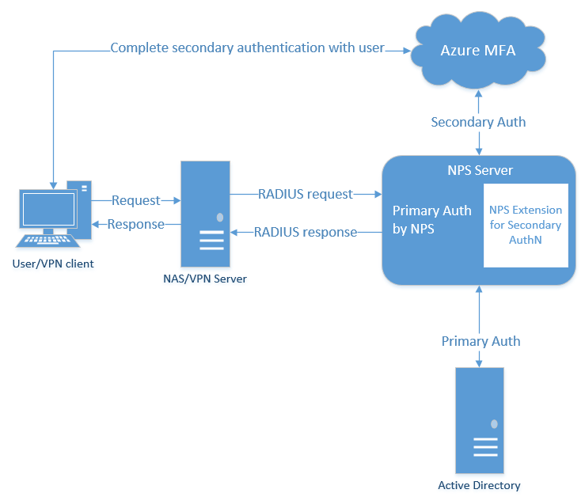
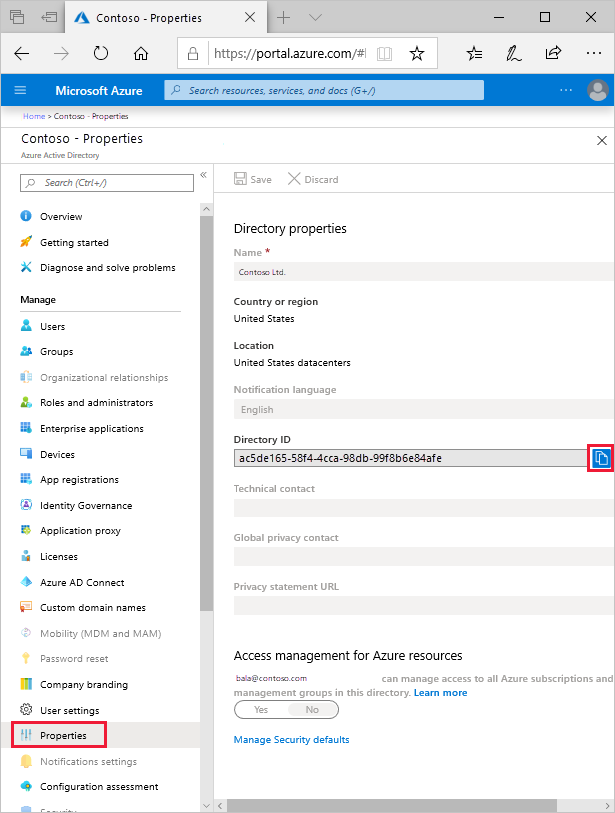

# Integrate your existing NPS infrastructure with Azure Multi-Factor Authentication

The Network Policy Server (NPS) extension for Azure MFA adds cloud-based MFA capabilities to your authentication infrastructure using your existing servers. With the NPS extension, you can add phone call, text message, or phone app verification to your existing authentication flow without having to install, configure, and maintain new servers. 

This extension was created for organizations that want to protect VPN connections without deploying the Azure MFA Server. The NPS extension acts as an adapter between RADIUS and cloud-based Azure MFA to provide a second factor of authentication for federated or synced users.

When using the NPS extension for Azure MFA, the authentication flow includes the following components: 

1. **NAS/VPN Server** receives requests from VPN clients and converts them into RADIUS requests to NPS servers. 
2. **NPS Server** connects to Active Directory to perform the primary authentication for the RADIUS requests and, upon success, passes the request to any installed extensions.  
3. **NPS Extension** triggers a request to Azure MFA for the secondary authentication. Once the extension receives the response, and if the MFA challenge succeeds, it completes the authentication request by providing the NPS server with security tokens that include an MFA claim, issued by Azure STS.  
4. **Azure MFA** communicates with Azure Active Directory to retrieve the user's details and performs the secondary authentication using a verification method configured to the user.

The following diagram illustrates this high-level authentication request flow: 



## Plan your deployment

The NPS extension automatically handles redundancy, so you don't need a special configuration.

You can create as many Azure MFA-enabled NPS servers as you need. If you do install multiple servers, you should use a difference client certificate for each one of them. Creating a cert for each server means that you can update each cert individually, and not worry about downtime across all your servers.

VPN servers route authentication requests, so they need to be aware of the new Azure MFA-enabled NPS servers.

## Prerequisites

The NPS extension is meant to work with your existing infrastructure. Make sure you have the following prerequisites before you begin.

### Licenses

The NPS Extension for Azure MFA is available to customers with [licenses for Azure Multi-Factor Authentication](multi-factor-authentication.md) (included with Azure AD Premium, EMS, or an MFA stand-alone license). Consumption-based licenses for Azure MFA such as per user or per authentication licenses are not compatible with the NPS extension. 

### Software

Windows Server 2008 R2 SP1 or above.

### Libraries

These libraries are installed automatically with the extension.

- [Visual C++ Redistributable Packages for Visual Studio 2013 (X64)](https://www.microsoft.com/download/details.aspx?id=40784)
- [Microsoft Azure Active Directory Module for Windows PowerShell version 1.1.166.0](https://www.powershellgallery.com/packages/MSOnline/1.1.166.0)

The Microsoft Azure Active Directory Module for Windows PowerShell is installed, if it is not already present, through a configuration script you run as part of the setup process. There is no need to install this module ahead of time if it is not already installed.

You need to manually install the following library:

- [Visual C++ Redistributable for Visual Studio 2015](https://www.microsoft.com/download/details.aspx?id=48145)

### Azure Active Directory

Everyone using the NPS extension must be synced to Azure Active Directory using Azure AD Connect, and must be registered for MFA.

When you install the extension, you need the directory ID and admin credentials for your Azure AD tenant. You can find your directory ID in the [Azure portal](https://portal.azure.com). Sign in as an administrator. Search for and select the **Azure Active Directory**, then select **Properties**. Copy the GUID in the **Directory ID** box and save it. You use this GUID as the tenant ID when you install the NPS extension.



### Network requirements

The NPS server needs to be able to communicate with the following URLs over ports 80 and 443.

- https:\//adnotifications.windowsazure.com
- https:\//login.microsoftonline.com
- https:\//credentials.azure.com

Additionally, connectivity to the following URLs is required to complete the [setup of the adapter using the provided PowerShell script](#run-the-powershell-script)

- https:\//login.microsoftonline.com
- https:\//provisioningapi.microsoftonline.com
- https:\//aadcdn.msauth.net

## Prepare your environment

Before you install the NPS extension, you want to prepare you environment to handle the authentication traffic.

### Enable the NPS role on a domain-joined server

The NPS server connects to Azure Active Directory and authenticates the MFA requests. Choose one server for this role. We recommend choosing a server that doesn't handle requests from other services, because the NPS extension throws errors for any requests that aren't RADIUS. The NPS server must be set up as the primary and secondary authentication server for your environment; it cannot proxy RADIUS requests to another server.

1. On your server, open the **Add Roles and Features Wizard** from the Server Manager Quickstart menu.
2. Choose **Role-based or feature-based installation** for your installation type.
3. Select the **Network Policy and Access Services** server role. A window may pop up to inform you of required features to run this role.
4. Continue through the wizard until the Confirmation page. Select **Install**.

Now that you have a server designated for NPS, you should also configure this server to handle incoming RADIUS requests from the VPN solution.

### Configure your VPN solution to communicate with the NPS server

Depending on which VPN solution you use, the steps to configure your RADIUS authentication policy vary. Configure this policy to point to your RADIUS NPS server.

### Sync domain users to the cloud

This step may already be complete on your tenant, but it's good to double-check that Azure AD Connect has synchronized your databases recently.

1. Sign in to the [Azure portal](https://portal.azure.com) as an administrator.
2. Select **Azure Active Directory** > **Azure AD Connect**
3. Verify that your sync status is **Enabled** and that your last sync was less than an hour ago.

If you need to kick off a new round of synchronization, us the instructions in [Azure AD Connect sync: Scheduler](../hybrid/how-to-connect-sync-feature-scheduler.md#start-the-scheduler).

### Determine which authentication methods your users can use

There are two factors that affect which authentication methods are available with an NPS extension deployment:

1. The password encryption algorithm used between the RADIUS client (VPN, Netscaler server, or other) and the NPS servers.
   - **PAP** supports all the authentication methods of Azure MFA in the cloud: phone call, one-way text message, mobile app notification, OATH hardware tokens, and mobile app verification code.
   - **CHAPV2** and **EAP** support phone call and mobile app notification.

      > [!NOTE]
      > When you deploy the NPS extension, use these factors to evaluate which methods are available for your users. If your RADIUS client supports PAP, but the client UX doesn't have input fields for a verification code, then phone call and mobile app notification are the two supported options.
      >
      > In addition, if your VPN client UX does support input field and you have configured Network Access Policy - the authentication might succeed, however none of the RADIUS attributes configured in the Network Policy will be applied to neither the Network Access Device, like the RRAS server, nor the VPN client. As a result, the VPN client might have more access than desired or less to no access.
      >

2. The input methods that the client application (VPN, Netscaler server, or other) can handle. For example, does the VPN client have some means to allow the user to type in a verification code from a text or mobile app?

You can [disable unsupported authentication methods](howto-mfa-mfasettings.md#verification-methods) in Azure.

### Register users for MFA

Before you deploy and use the NPS extension, users that are required to perform two-step verification need to be registered for MFA. More immediately, to test the extension as you deploy it, you need at least one test account that is fully registered for Multi-Factor Authentication.

Use these steps to get a test account started:

1. Sign in to [https://aka.ms/mfasetup](https://aka.ms/mfasetup) with a test account.
2. Follow the prompts to set up a verification method.
3. [Create a Conditional Access policy](howto-mfa-getstarted.md#create-conditional-access-policy) to require multi-factor authentication for the test account.

> [!IMPORTANT]
>
> Make sure that users have successfully registered for Azure Multi-Factor Authentication. If users have previously only registered for self-service password reset (SSPR), *StrongAuthenticationMethods* is enabled for their account. Azure Multi-Factor Authentication is enforced when *StrongAuthenticationMethods* is configured, even if the user only registered for SSPR.
>
> Combined security registration can be enabled that configures SSPR and Azure Multi-Factor Authentication at the same time. For more information, see [Enable combined security information registration in Azure Active Directory](howto-registration-mfa-sspr-combined.md).
>
> You can also [force users to re-register authentication methods](howto-mfa-userdevicesettings.md#manage-user-authentication-options) if they previously only enabled SSPR.

## Install the NPS extension

> [!IMPORTANT]
> Install the NPS extension on a different server than the VPN access point.

### Download and install the NPS extension for Azure MFA

1. [Download the NPS Extension](https://aka.ms/npsmfa) from the Microsoft Download Center.
2. Copy the binary to the Network Policy Server you want to configure.
3. Run *setup.exe* and follow the installation instructions. If you encounter errors, double-check that the two libraries from the prerequisite section were successfully installed.

#### Upgrade the NPS extension

When upgrading an existing NPS extension install, to avoid a reboot of the underlying server complete the following steps:

1. Uninstall the existing version
1. Run the new installer
1. Restart the Network Policy Server (IAS) service

### Run the PowerShell script

The installer creates a PowerShell script in this location: `C:\Program Files\Microsoft\AzureMfa\Config` (where C:\ is your installation drive). This PowerShell script performs the following actions each time it is run:

- Create a self-signed certificate.
- Associate the public key of the certificate to the service principal on Azure AD.
- Store the cert in the local machine cert store.
- Grant access to the certificate's private key to Network User.
- Restart the NPS.

Unless you want to use your own certificates (instead of the self-signed certificates that the PowerShell script generates), run the PowerShell Script to complete the installation. If you install the extension on multiple servers, each one should have its own certificate.

1. Run Windows PowerShell as an administrator.
2. Change directories.

   ```powershell
   cd "C:\Program Files\Microsoft\AzureMfa\Config"
   ```

3. Run the PowerShell script created by the installer.

   > [!IMPORTANT]
   > For customers that use the Azure Government or Azure China 21Vianet clouds, first edit the `Connect-MsolService` cmdlets in the *AzureMfaNpsExtnConfigSetup.ps1* script to include the *AzureEnvironment* parameters for the required cloud. For example, specify *-AzureEnvironment USGovernment* or *-AzureEnvironment AzureChinaCloud*.
   >
   > For more information, see [Connect-MsolService parameter reference](/powershell/module/msonline/connect-msolservice#parameters).

   ```powershell
   .\AzureMfaNpsExtnConfigSetup.ps1
   ```

4. Sign in to Azure AD as an administrator.
5. PowerShell prompts for your tenant ID. Use the Directory ID GUID that you copied from the Azure portal in the prerequisites section.
6. PowerShell shows a success message when the script is finished.  

Repeat these steps on any additional NPS servers that you want to set up for load balancing.

If your previous computer certificate has expired, and a new certificate has been generated, you should delete any expired certificates. Having expired certificates can cause issues with the NPS Extension starting.

> [!NOTE]
> If you use your own certificates instead of generating certificates with the PowerShell script, make sure that they align to the NPS naming convention. The subject name must be **CN=\<TenantID\>,OU=Microsoft NPS Extension**.

### Microsoft Azure Government or Azure China 21Vianet additional steps

For customers that use the Azure Government or Azure China 21Vianet clouds, the following additional configuration steps are required on each NPS server.

> [!IMPORTANT]
> Only configure these registry settings if you're an Azure Government or Azure China 21Vianet customer.

1. If you're an Azure Government or Azure China 21Vianet customer, open **Registry Editor** on the NPS server.
1. Navigate to `HKEY_LOCAL_MACHINE\SOFTWARE\Microsoft\AzureMfa`.
1. For Azure Government customers, set the following key values.:

    | Registry key       | Value |
    |--------------------|-----------------------------------|
    | AZURE_MFA_HOSTNAME | adnotifications.windowsazure.us   |
    | STS_URL            | https://login.microsoftonline.us/ |

1. For Azure China 21Vianet customers, set the following key values:

    | Registry key       | Value |
    |--------------------|-----------------------------------|
    | AZURE_MFA_HOSTNAME | adnotifications.windowsazure.cn   |
    | STS_URL            | https://login.chinacloudapi.cn/   |

1. Repeat the previous two steps to set the registry key values for each NPS server.
1. Restart the NPS service for each NPS server.

    For minimal impact, take each NPS server out of the NLB rotation one at a time and wait for all connections to drain.

### Certificate rollover

With release 1.0.1.32 of the NPS extension, reading multiple certificates is now supported. This capability will help facilitate rolling certificate updates prior to their expiration. If your organization is running a previous version of the NPS extension, you should upgrade to version 1.0.1.32 or higher.

Certificates created by the `AzureMfaNpsExtnConfigSetup.ps1` script are valid for 2 years. IT organizations should monitor certificates for expiration. Certificates for the NPS extension are placed in the Local Computer certificate store under Personal and are Issued To the tenant ID provided to the script.

When a certificate is approaching the expiration date, a new certificate should be created to replace it.  This process is accomplished by running the `AzureMfaNpsExtnConfigSetup.ps1` again and keeping the same tenant ID when prompted. This process should be repeated on each NPS server in your environment.

## Configure your NPS extension

This section includes design considerations and suggestions for successful NPS extension deployments.

### Configuration limitations

- The NPS extension for Azure MFA does not include tools to migrate users and settings from MFA Server to the cloud. For this reason, we suggest using the extension for new deployments, rather than existing deployment. If you use the extension on an existing deployment, your users have to perform proof-up again to populate their MFA details in the cloud.  
- The NPS extension uses the UPN from the on-premises Active directory to identify the user on Azure MFA for performing the Secondary Auth. The extension can be configured to use a different identifier like alternate login ID or custom Active Directory field other than UPN. For more information, see the article, [Advanced configuration options for the NPS extension for Multi-Factor Authentication](howto-mfa-nps-extension-advanced.md).
- Not all encryption protocols support all verification methods.
   - **PAP** supports phone call, one-way text message, mobile app notification, and mobile app verification code
   - **CHAPV2** and **EAP** support phone call and mobile app notification

### Control RADIUS clients that require MFA

Once you enable MFA for a RADIUS client using the NPS Extension, all authentications for this client are required to perform MFA. If you want to enable MFA for some RADIUS clients but not others, you can configure two NPS servers and install the extension on only one of them. Configure RADIUS clients that you want to require MFA to send requests to the NPS server configured with the extension, and other RADIUS clients to the NPS server not configured with the extension.

### Prepare for users that aren't enrolled for MFA

If you have users that aren't enrolled for MFA, you can determine what happens when they try to authenticate. Use the registry setting *REQUIRE_USER_MATCH* in the registry path *HKLM\Software\Microsoft\AzureMFA* to control the feature behavior. This setting has a single configuration option:

| Key | Value | Default |
| --- | ----- | ------- |
| REQUIRE_USER_MATCH | TRUE/FALSE | Not set (equivalent to TRUE) |

The purpose of this setting is to determine what to do when a user is not enrolled for MFA. When the key does not exist, is not set, or is set to TRUE, and the user is not enrolled, then the extension fails the MFA challenge. When the key is set to FALSE and the user is not enrolled, authentication proceeds without performing MFA. If a user is enrolled in MFA, they must authenticate with MFA even if REQUIRE_USER_MATCH is set to FALSE.

You can choose to create this key and set it to FALSE while your users are onboarding, and may not all be enrolled for Azure MFA yet. However, since setting the key permits users that aren't enrolled for MFA to sign in, you should remove this key before going to production.

## Troubleshooting

### NPS extension health check script

The following script is available to perform basic health check steps when troubleshooting the NPS extension.

[MFA_NPS_Troubleshooter.ps1](https://docs.microsoft.com/samples/azure-samples/azure-mfa-nps-extension-health-check/azure-mfa-nps-extension-health-check/)

---

### How do I verify that the client cert is installed as expected?

Look for the self-signed certificate created by the installer in the cert store, and check that the private key has permissions granted to user **NETWORK SERVICE**. The cert has a subject name of **CN \<tenantid\>, OU = Microsoft NPS Extension**

Self-signed certificates generated by the *AzureMfaNpsExtnConfigSetup.ps1* script also have a validity lifetime of two years. When verifying that the certificate is installed, you should also check that the certificate has not expired.

---

### How can I verify that my client cert is associated to my tenant in Azure Active Directory?

Open PowerShell command prompt and run the following commands:

```powershell
import-module MSOnline
Connect-MsolService
Get-MsolServicePrincipalCredential -AppPrincipalId "981f26a1-7f43-403b-a875-f8b09b8cd720" -ReturnKeyValues 1
```

These commands print all the certificates associating your tenant with your instance of the NPS extension in your PowerShell session. Look for your certificate by exporting your client cert as a "Base-64 encoded X.509(.cer)" file without the private key, and compare it with the list from PowerShell.

The following command will create a file named "npscertificate" on your "C:" drive in format .cer.

```powershell
import-module MSOnline
Connect-MsolService
Get-MsolServicePrincipalCredential -AppPrincipalId "981f26a1-7f43-403b-a875-f8b09b8cd720" -ReturnKeyValues 1 | select -ExpandProperty "value" | out-file c:\npscertificate.cer
```

Once you run this command, go to your C drive, locate the file and double-click on it. Go to details and scroll down to "thumbprint", compare the thumbprint of the certificate installed on the server to this one. The certificate thumbprints should match.

Valid-From and Valid-Until timestamps, which are in human-readable form, can be used to filter out obvious misfits if the command returns more than one cert.

---

### Why cannot I sign in?

Check that your password hasn't expired. The NPS Extension does not support changing passwords as part of the sign-in workflow. Contact your organization's IT Staff for further assistance.

---

### Why are my requests failing with ADAL token error?

This error could be due to one of several reasons. Use these steps to help troubleshoot:

1. Restart your NPS server.
2. Verify that client cert is installed as expected.
3. Verify that the certificate is associated with your tenant on Azure AD.
4. Verify that `https://login.microsoftonline.com/` is accessible from the server running the extension.

---

### Why does authentication fail with an error in HTTP logs stating that the user is not found?

Verify that AD Connect is running, and that the user is present in both Windows Active Directory and Azure Active Directory.

---

### Why do I see HTTP connect errors in logs with all my authentications failing?

Verify that https://adnotifications.windowsazure.com is reachable from the server running the NPS extension.

---

### Why is authentication not working, despite a valid certificate being present?

If your previous computer certificate has expired, and a new certificate has been generated, you should delete any expired certificates. Having expired certificates can cause issues with the NPS Extension starting.

To check if you have a valid certificate, check the local Computer Account's Certificate Store using MMC, and ensure the certificate has not passed its expiry date. To generate a newly valid certificate, rerun the steps under the section "[Run the PowerShell script](#run-the-powershell-script)"

## Managing the TLS/SSL Protocols and Cipher Suites

It is recommended that older and weaker cipher suites be disabled or removed unless required by your organization. Information on how to complete this task can be found in the article [Managing SSL/TLS Protocols and Cipher Suites for AD FS](https://docs.microsoft.com/windows-server/identity/ad-fs/operations/manage-ssl-protocols-in-ad-fs)

### Additional troubleshooting

Additional troubleshooting guidance and possible solutions can be found in the article [Resolve error messages from the NPS extension for Azure Multi-Factor Authentication](howto-mfa-nps-extension-errors.md).

## Next steps

- [Overview and configuration of Network Policy Server in Windows Server](https://docs.microsoft.com/windows-server/networking/technologies/nps/nps-top)

- Configure alternate IDs for login, or set up an exception list for IPs that shouldn't perform two-step verification in [Advanced configuration options for the NPS extension for Multi-Factor Authentication](howto-mfa-nps-extension-advanced.md)

- Learn how to integrate [Remote Desktop Gateway](howto-mfa-nps-extension-rdg.md) and [VPN servers](howto-mfa-nps-extension-vpn.md) using the NPS extension

- [Resolve error messages from the NPS extension for Azure Multi-Factor Authentication](howto-mfa-nps-extension-errors.md)
