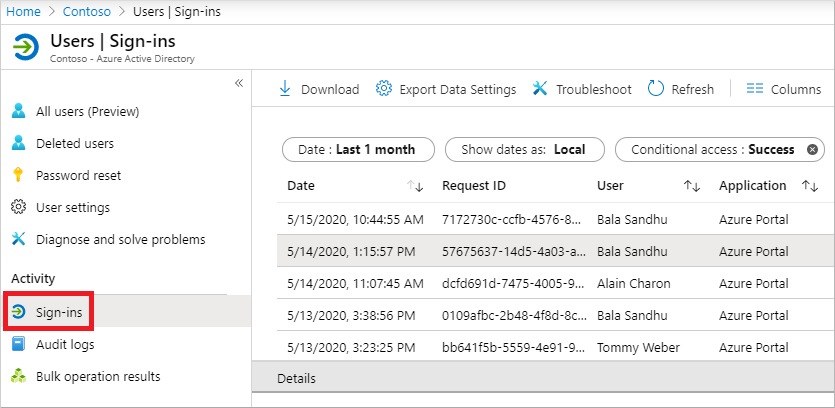

# Use the sign-ins report to review Azure Multi-Factor Authentication events

To review and understand Azure Multi-Factor Authentication events, you can use the Azure Active Directory (Azure AD) sign-ins report. This report shows authentication details for events when a user is prompted for multi-factor authentication, and if any Conditional Access policies were in use. For detailed information on the sign-ins report, see the [overview of sign-in activity reports in Azure AD](../reports-monitoring/concept-sign-ins.md).

This article shows you how to view the Azure AD sign-ins report in the Azure portal, and then the MSOnline V1 PowerShell module.

## View the Azure AD sign-ins report

The sign-ins report provides you with information about the usage of managed applications and user sign-in activities, which includes information about multi-factor authentication (MFA) usage. The MFA data gives you insights into how MFA is working in your organization. It lets you answer questions like the following:

- Was the sign-in challenged with MFA?
- How did the user complete MFA?
- Why was the user unable to complete MFA?
- How many users are challenged for MFA?
- How many users are unable to complete the MFA challenge?
- What are the common MFA issues end users are running into?

To view the sign-in activity report in the [Azure portal](https://portal.azure.com), complete the following steps. You can also query data using the [reporting API](../reports-monitoring/concept-reporting-api.md).

1. Sign in to the [Azure portal](https://portal.azure.com) using an account with *global administrator* permissions.
1. Search for and select **Azure Active Directory**, then choose **Users** from the menu on the left-hand side.
1. Under *Activity* from the menu on the left-hand side, select **Sign-ins**.
1. A list of sign-in events is shown, including the status. You can select an event to view more details.

    The *Authentication Details* or *Conditional Access* tab of the event details shows you the status code or which policy triggered the MFA prompt.

    [](media/howto-mfa-reporting/sign-in-report.png#lightbox)

If available, the authentication is shown, such as text message, Microsoft Authenticator app notification, or phone call.

The following details are shown on the *Authentication Details* window for a sign-in event that show if the MFA request was satisfied or denied:

* If MFA was satisfied, this column provides more information about how MFA was satisfied.
   * completed in the cloud
   * has expired due to the policies configured on tenant
   * registration prompted
   * satisfied by claim in the token
   * satisfied by claim provided by external provider
   * satisfied by strong authentication
   * skipped as flow exercised was Windows broker logon flow
   * skipped due to app password
   * skipped due to location
   * skipped due to registered device
   * skipped due to remembered device
   * successfully completed

* If MFA was denied, this column would provide the reason for denial.
   * authentication in-progress
   * duplicate authentication attempt
   * entered incorrect code too many times
   * invalid authentication
   * invalid mobile app verification code
   * misconfiguration
   * phone call went to voicemail
   * phone number has an invalid format
   * service error
   * unable to reach the user's phone
   * unable to send the mobile app notification to the device
   * unable to send the mobile app notification
   * user declined the authentication
   * user did not respond to mobile app notification
   * user does not have any verification methods registered
   * user entered incorrect code
   * user entered incorrect PIN
   * user hung up the phone call without succeeding the authentication
   * user is blocked
   * user never entered the verification code
   * user not found
   * verification code already used once

## PowerShell reporting on users registered for MFA

First, ensure that you have the [MSOnline V1 PowerShell module](https://docs.microsoft.com/powershell/azure/active-directory/overview?view=azureadps-1.0) installed.

Identify users who have registered for MFA using the PowerShell that follows. This set of commands excludes disabled users since these accounts cannot authenticate against Azure AD:

```powershell
Get-MsolUser -All | Where-Object {$_.StrongAuthenticationMethods -ne $null -and $_.BlockCredential -eq $False} | Select-Object -Property UserPrincipalName
```

Identify users who have not registered for MFA using the PowerShell that follows. This set of commands excludes disabled users since these accounts cannot authenticate against Azure AD:

```powershell
Get-MsolUser -All | Where-Object {$_.StrongAuthenticationMethods.Count -eq 0 -and $_.BlockCredential -eq $False} | Select-Object -Property UserPrincipalName
```

Identify users and output methods registered:

```powershell
Get-MsolUser -All | Select-Object @{N='UserPrincipalName';E={$_.UserPrincipalName}},

@{N='MFA Status';E={if ($_.StrongAuthenticationRequirements.State){$_.StrongAuthenticationRequirements.State} else {"Disabled"}}},

@{N='MFA Methods';E={$_.StrongAuthenticationMethods.methodtype}} | Export-Csv -Path c:\MFA_Report.csv -NoTypeInformation
```

## Downloaded activity reports result codes

The following table can help troubleshoot events using the downloaded version of the activity report from the previous portal steps or PowerShell commands. These result codes don't appear directly in the Azure portal.

| Call Result | Description | Broad description |
| --- | --- | --- |
| SUCCESS_WITH_PIN | PIN Entered | The user entered a PIN.  If authentication succeeded then they entered the correct PIN.  If authentication is denied, then they entered an incorrect PIN or the user is set to Standard mode. |
| SUCCESS_NO_PIN | Only # Entered | If the user is set to PIN mode and the authentication is denied, this means the user did not enter their PIN and only entered #.  If the user is set to Standard mode and the authentication succeeds this means the user only entered # which is the correct thing to do in Standard mode. |
| SUCCESS_WITH_PIN_BUT_TIMEOUT | # Not Pressed After Entry | The user did not send any DTMF digits since # was not entered.  Other digits entered are not sent unless # is entered indicating the completion of the entry. |
|SUCCESS_NO_PIN_BUT_TIMEOUT | No Phone Input - Timed Out | The call was answered, but there was no response.  This typically indicates the call was picked up by voicemail. |
| SUCCESS_PIN_EXPIRED | PIN Expired and Not Changed | The user's PIN is expired and they were prompted to change it, but the PIN change was not successfully completed. |
| SUCCESS_USED_CACHE | Used Cache | Authentication succeeded without a Multi-Factor Authentication call since a previous successful authentication for the same username occurred within the configured cache timeframe. |
| SUCCESS_BYPASSED_AUTH | Bypassed Auth | Authentication succeeded using a One-Time Bypass initiated for the user.  See the Bypassed User History Report for more details on the bypass. |
| SUCCESS_USED_IP_BASED_CACHE | Used IP-based Cache | Authentication succeeded without a Multi-Factor Authentication call since a previous successful authentication for the same username, authentication type, application name, and IP occurred within the configured cache timeframe. |
| SUCCESS_USED_APP_BASED_CACHE | Used App-based Cache | Authentication succeeded without a Multi-Factor Authentication call since a previous successful authentication for the same username, authentication type, and application name within the configured cache timeframe. |
| SUCCESS_INVALID_INPUT | Invalid Phone Input | The response sent from the phone is not valid.  This could be from a fax machine or modem or the user may have entered * as part of their PIN. |
| SUCCESS_USER_BLOCKED | User is Blocked | The user's phone number is blocked.  A blocked number can be initiated by the user during an authentication call or by an administrator using the Azure portal. <br> NOTE:  A blocked number is also a byproduct of a Fraud Alert. |
| SUCCESS_SMS_AUTHENTICATED | Text Message Authenticated | For two-way test message, the user correctly replied with their one-time passcode (OTP) or OTP + PIN. |
| SUCCESS_SMS_SENT | Text Message Sent | For Text Message, the text message containing the one-time passcode (OTP) was successfully sent.  The user will enter the OTP or OTP + PIN in the application to complete the authentication. |
| SUCCESS_PHONE_APP_AUTHENTICATED | Mobile App Authenticated | The user successfully authenticated via the mobile app. |
| SUCCESS_OATH_CODE_PENDING | OATH Code Pending | The user was prompted for their OATH code but didn't respond. |
| SUCCESS_OATH_CODE_VERIFIED | OATH Code Verified | The user entered a valid OATH code when prompted. |
| SUCCESS_FALLBACK_OATH_CODE_VERIFIED | Fallback OATH Code Verified | The user was denied authentication using their primary Multi-Factor Authentication method and then provided a valid OATH code for fallback. |
| SUCCESS_FALLBACK_SECURITY_QUESTIONS_ANSWERED | Fallback Security Questions Answered | The user was denied authentication using their primary Multi-Factor Authentication method and then answered their security questions correctly for fallback. |
| FAILED_PHONE_BUSY | Auth Already In Progress | Multi-Factor Authentication is already processing an authentication for this user.  This is often caused by RADIUS clients that send multiple authentication requests during the same sign-on. |
| CONFIG_ISSUE | Phone Unreachable | Call was attempted, but either could not be placed or was not answered.  This includes busy signal, fast busy signal (disconnected), tri-tones (number no longer in service), timed out while ringing, etc. |
| FAILED_INVALID_PHONENUMBER | Invalid Phone Number Format | The phone number has an invalid format.  Phone numbers must be numeric and must be 10 digits for country code +1 (United States & Canada). |
| FAILED_USER_HUNGUP_ON_US | User Hung Up the Phone | The user answered the phone, but then hung up without pressing any buttons. |
| FAILED_INVALID_EXTENSION | Invalid Extension | The extension contains invalid characters.  Only digits, commas, *, and # are allowed.  An @ prefix may also be used. |
| FAILED_FRAUD_CODE_ENTERED | Fraud Code Entered | The user elected to report fraud during the call resulting in a denied authentication and a blocked phone number.| 
| FAILED_SERVER_ERROR | Unable to Place Call | The Multi-Factor Authentication service was unable to place the call. |
| FAILED_SMS_NOT_SENT | Text Message Could Not Be Sent | The text message could not be sent.  The authentication is denied. |
| FAILED_SMS_OTP_INCORRECT | Text Message OTP Incorrect | The user entered an incorrect one-time passcode (OTP) from the text message they received.  The authentication is denied. |
| FAILED_SMS_OTP_PIN_INCORRECT | Text Message OTP + PIN Incorrect | The user entered an incorrect one-time passcode (OTP) and/or an incorrect user PIN.  The authentication is denied. |
| FAILED_SMS_MAX_OTP_RETRY_REACHED | Exceeded Maximum Text Message OTP Attempts | The user has exceeded the maximum number of one-time passcode (OTP) attempts. |
| FAILED_PHONE_APP_DENIED | Mobile App Denied | The user denied the authentication in the mobile app by pressing the Deny button. |
| FAILED_PHONE_APP_INVALID_PIN | Mobile App Invalid PIN | The user entered an invalid PIN when authenticating in the mobile app. |
| FAILED_PHONE_APP_PIN_NOT_CHANGED | Mobile App PIN Not Changed | The user did not successfully complete a required PIN change in the mobile app. |
| FAILED_FRAUD_REPORTED | Fraud Reported | The user reported fraud in the mobile app. |
| FAILED_PHONE_APP_NO_RESPONSE | Mobile App No Response | The user did not respond to the mobile app authentication request. |
| FAILED_PHONE_APP_ALL_DEVICES_BLOCKED | Mobile App All Devices Blocked | The mobile app devices for this user are no longer responding to notifications and have been blocked. |
| FAILED_PHONE_APP_NOTIFICATION_FAILED | Mobile App Notification Failed | A failure occurred when attempting to send a notification to the mobile app on the user's device. |
| FAILED_PHONE_APP_INVALID_RESULT | Mobile App Invalid Result | The mobile app returned an invalid result. |
| FAILED_OATH_CODE_INCORRECT | OATH Code Incorrect | The user entered an incorrect OATH code.  The authentication is denied. |
| FAILED_OATH_CODE_PIN_INCORRECT | OATH Code + PIN Incorrect | The user entered an incorrect OATH code and/or an incorrect user PIN.  The authentication is denied. |
| FAILED_OATH_CODE_DUPLICATE | Duplicate OATH Code | The user entered an OATH code that was previously used.  The authentication is denied. |
| FAILED_OATH_CODE_OLD | OATH Code Out of Date | The user entered an OATH code that precedes an OATH code that was previously used.  The authentication is denied. |
| FAILED_OATH_TOKEN_TIMEOUT | OATH Code Result Timeout | The user took too long to enter the OATH code and the Multi-Factor Authentication attempt had already timed out. |
| FAILED_SECURITY_QUESTIONS_TIMEOUT | Security Questions Result Timeout | The user took too long to enter answer to security questions and the Multi-Factor Authentication attempt had already timed out. |
| FAILED_AUTH_RESULT_TIMEOUT | Auth Result Timeout | The user took too long to complete the Multi-Factor Authentication attempt. |
| FAILED_AUTHENTICATION_THROTTLED | Authentication Throttled | The Multi-Factor Authentication attempt was throttled by the service. |

## Additional MFA reports

The following additional information and reports are available for MFA events, including those for MFA Server:

| Report | Location | Description |
|:--- |:--- |:--- |
| Blocked User History | Azure AD > Security > MFA > Block/unblock users | Shows the history of requests to block or unblock users. |
| Usage for on-premises components | Azure AD > Security > MFA > Activity Report | Provides information on overall usage for MFA Server through the NPS extension, ADFS, and MFA Server. |
| Bypassed User History | Azure AD > Security > MFA > One-time bypass | Provides a history of MFA Server requests to bypass MFA for a user. |
| Server status | Azure AD > Security > MFA > Server status | Displays the status of MFA Servers associated with your account. |

## Next steps

This article provided an overview of the sign-ins activity report. For more detailed information on what this report contains and understand the data, see [sign-in activity reports in Azure AD](../reports-monitoring/concept-sign-ins.md).
