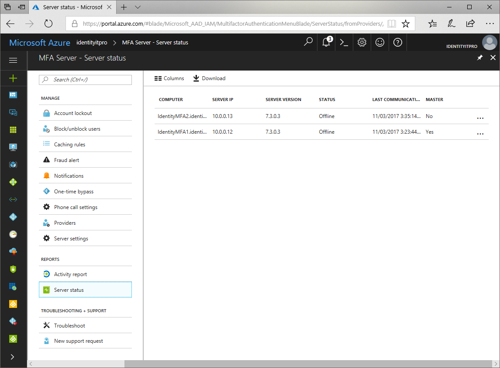
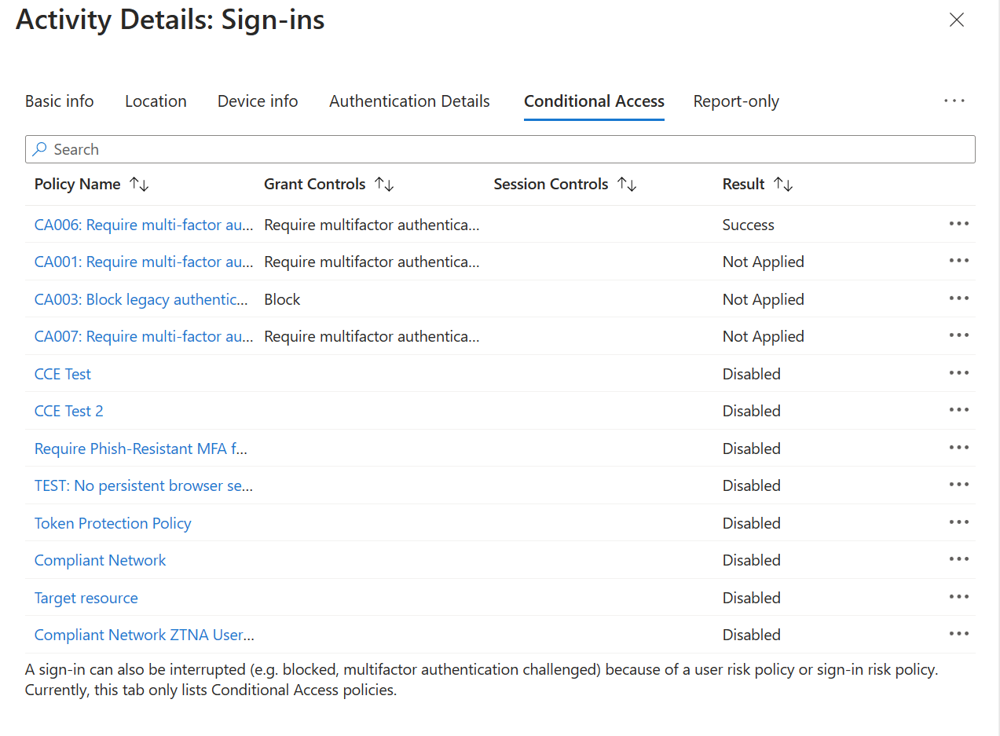

# Reports in Azure Multi-Factor Authentication

Azure Multi-Factor Authentication provides several reports that can be used by you and your organization accessible through the Azure portal. The following table lists the available reports:

| Report | Location | Description |
|:--- |:--- |:--- |
| Blocked User History | Azure AD > MFA Server > Block/unblock users | Shows the history of requests to block or unblock users. |
| Usage and fraud alerts | Azure AD > Sign-ins | Provides information on overall usage, user summary, and user details; as well as a history of fraud alerts submitted during the date range specified. |
| Usage for on-premises components | Azure AD > MFA Server > Activity Report | Provides information on overall usage for MFA through the NPS extension, ADFS, and MFA server. |
| Bypassed User History | Azure AD > MFA Server > One-time bypass | Provides a history of requests to bypass Multi-Factor Authentication for a user. |
| Server status | Azure AD > MFA Server > Server status | Displays the status of Multi-Factor Authentication Servers associated with your account. |

## View MFA reports

1. Sign in to the [Azure portal](https://portal.azure.com).
2. On the left, select **Azure Active Directory** > **MFA Server**.
3. Select the report that you wish to view.

   <center></center>

## Azure AD sign-ins report

With the **sign-ins activity report** in the [Azure portal](https://portal.azure.com), you can get the information you need to determine how your environment is doing.

The sign-ins report can provide you with information about the usage of managed applications and user sign-in activities, which includes information about multi-factor authentication (MFA) usage. The MFA data gives you insights into how MFA is working in your organization. It enables you to answer questions like:

- Was the sign-in challenged with MFA?
- How did the user complete MFA?
- Why was the user unable to complete MFA?
- How many users are challenged for MFA?
- How many users are unable to complete the MFA challenge?
- What are the common MFA issues end users are running into?

This data is available through the [Azure portal](https://portal.azure.com) and the [reporting API](../reports-monitoring/concept-reporting-api.md).



### Sign-ins report structure

The sign-in activity reports for MFA give you access to the following information:

**MFA required:** Whether MFA is required for the sign-in or not. MFA can be required due to per-user MFA, conditional access, or other reasons. Possible values are **Yes** or **No**.

**MFA Result:** More information on whether MFA was satisfied or denied:

- If MFA was satisfied, this column provides more information about how MFA was satisfied.
   - Azure Multi-Factor Authentication
      - completed in the cloud
      - has expired due to the policies configured on tenant
      - registration prompted
      - satisfied by claim in the token
      - satisfied by claim provided by external provider
      - satisfied by strong authentication
      - skipped as flow exercised was Windows broker logon flow
      - skipped due to app password
      - skipped due to location
      - skipped due to registered device
      - skipped due to remembered device
      - successfully completed
   - Redirected to external provider for multi-factor authentication

- If MFA was denied, this column would provide the reason for denial.
   - Azure Multi-Factor Authentication denied;
      - authentication in-progress
      - duplicate authentication attempt
      - entered incorrect code too many times
      - invalid authentication
      - invalid mobile app verification code
      - misconfiguration
      - phone call went to voicemail
      - phone number has an invalid format
      - service error
      - unable to reach the user’s phone
      - unable to send the mobile app notification to the device
      - unable to send the mobile app notification
      - user declined the authentication
      - user did not respond to mobile app notification
      - user does not have any verification methods registered
      - user entered incorrect code
      - user entered incorrect PIN
      - user hung up the phone call without succeeding the authentication
      - user is blocked
      - user never entered the verification code
      - user not found
      - verification code already used once

**MFA authentication method:** The authentication method the user used to complete MFA. Possible values include:

- Text message
- Mobile app notification
- Phone call (Authentication phone)
- Mobile app verification code
- Phone call (Office phone)
- Phone call (Alternate authentication phone)

**MFA authentication detail:** Scrubbed version of the phone number, for example: +X XXXXXXXX64.

**Conditional Access** Find information about conditional access policies that affected the sign-in attempt including:

- Policy name
- Grant controls
- Session controls
- Result

## PowerShell reporting

Identify users who have registered for MFA using the PowerShell that follows.

```Get-MsolUser -All | where {$_.StrongAuthenticationMethods -ne $null} | Select-Object -Property UserPrincipalName```

Identify users who have not registered for MFA using the PowerShell that follows.

```Get-MsolUser -All | where {$_.StrongAuthenticationMethods.Count -eq 0} | Select-Object -Property UserPrincipalName```

## Next steps

* [For Users](../user-help/multi-factor-authentication-end-user.md)
* [Where to deploy](concept-mfa-whichversion.md)
