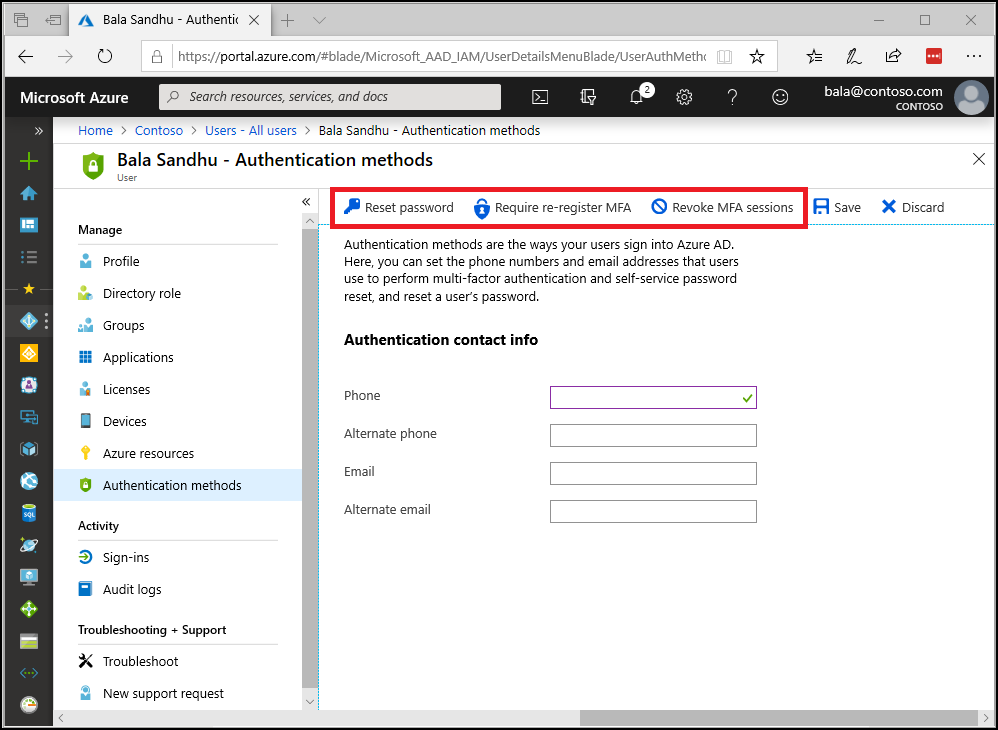

# Manage user settings with Azure Multi-Factor Authentication in the cloud

As an administrator, you can manage the following user and device settings:

* Require users to provide contact methods again
* Delete app passwords
* Require MFA on all trusted devices

## Manage authentication methods

As an administrator assigned the Authentication Administrator role you can require users to reset their password, re-register for MFA, or revoke existing MFA sessions from their user object.

1. Sign in to the [Azure portal](https://portal.azure.com).
1. On the left, select **Azure Active Directory** > **Users** > **All users**.
1. Choose the user you wish to perform an action on and select **Authentication methods**.
   - **Reset Password** will reset the user's password and assign a temporary password that must be changed on the next sign in.
   - **Require Re-register MFA** will make it so that when the user signs in next time, they will be requested to setup a new MFA authentication method.
   - **Revoke MFA Sessions** clears the user's remembered MFA sessions and requires them to perform MFA the next time it is required by the policy on the device.

## Delete users existing app passwords

This setting deletes all of the app passwords that a user has created. Non-browser apps that were associated with these app passwords stop working until a new app password is created. Global administrator permissions are required to perform this action.

### How to delete users existing app passwords

1. Sign in to the [Azure portal](https://portal.azure.com).
2. On the left, select **Azure Active Directory** > **Users** > **All users**.
3. On the right, select **Multi-Factor Authentication** on the toolbar. The multi-factor authentication page opens.
4. Check the box next to the user or users that you wish to manage. A list of quick step options appears on the right.
5. Select **Manage user settings**.
6. Check the box for **Delete all existing app passwords generated by the selected users**.
   
7. Click **save**.
8. Click **close**.

## Next steps

- Get more information about how to [Configure Azure Multi-Factor Authentication settings](howto-mfa-mfasettings.md)
- If your users need help, point them towards the [User guide for two-step verification](../user-help/multi-factor-authentication-end-user.md)
