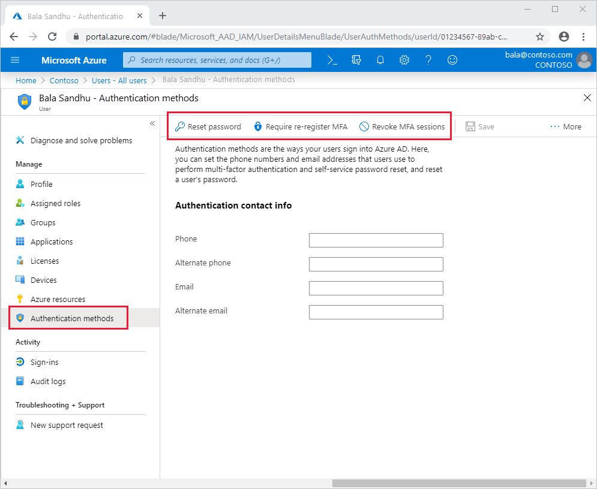

# Manage user settings for Azure Multi-Factor Authentication

To help manage the users of Azure Multi-Factor Authentication, you can require users to reset their password, re-register for MFA, or revoke existing MFA sessions. For users that have defined app passwords, you can also choose to delete these passwords, causing legacy authentication to fail in those applications. These actions may be necessary if you need to provide assistance to a user, or want to reset their security status.

## Manage user authentication options

If you're assigned the *Authentication Administrator* role you can require users to reset their password, re-register for MFA, or revoke existing MFA sessions from their user object. To manage user settings, complete the following steps:

1. Sign in to the [Azure portal](https://portal.azure.com).
1. On the left, select **Azure Active Directory** > **Users** > **All users**.
1. Choose the user you wish to perform an action on and select **Authentication methods**. At the top of the window, then choose one of the following options for the user:
   - **Reset Password** resets the user's password and assigns a temporary password that must be changed on the next sign-in.
   - **Require Re-register MFA** makes it so that when the user signs in next time, they're requested to set up a new MFA authentication method.
   
      > [!NOTE]
      > The user's currently registered authentication methods aren't deleted when an admin requires re-registration for MFA. After a user re-registers for MFA, we recommend they review their security info and delete any previously registered authentication methods that are no longer usable.
   
   - **Revoke MFA Sessions** clears the user's remembered MFA sessions and requires them to perform MFA the next time it's required by the policy on the device.

   

## Delete users existing app passwords

If needed, you can delete all of the app passwords that a user has created. Non-browser apps that were associated with these app passwords stop working until a new app password is created. *Global administrator* permissions are required to perform this action.

To delete a user's app passwords, complete the following steps:

1. Sign in to the [Azure portal](https://portal.azure.com).
1. On the left-hand side, select **Azure Active Directory** > **Users** > **All users**.
1. Select **Multi-Factor Authentication**. You may need to scroll to the right to see this menu option. Select the example screenshot below to see the full Azure portal window and menu location:
    
1. Check the box next to the user or users that you wish to manage. A list of quick step options appears on the right.
1. Select **Manage user settings**, then check the box for **Delete all existing app passwords generated by the selected users**, as shown in the following example:
   
1. Select **save**, then **close**.

## Next steps

This article helped configure individual user settings. To configure Azure Multi-Factor Authentication service settings, see [Configure Azure Multi-Factor Authentication settings](howto-mfa-mfasettings.md)

If your users need help, see the [User guide for Azure Multi-Factor Authentication](../user-help/multi-factor-authentication-end-user.md).
