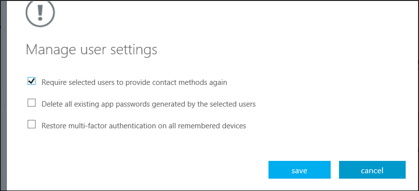

# Manage user settings with Azure Multi-Factor Authentication in the cloud

As an administrator, you can manage the following user and device settings:

* Require users to provide contact methods again
* Delete app passwords
* Require MFA on all trusted devices

## Require users to provide contact methods again

This setting forces the user to complete the registration process again. Non-browser apps continue to work if the user has app passwords for them.  You can delete the users app passwords by also selecting **Delete all existing app passwords generated by the selected users**.

### How to require users to provide contact methods again

1. Sign in to the [Azure portal](https://portal.azure.com).
2. On the left, select **Azure Active Directory** > **Users** > **All users**.
3. On the right, select **Multi-Factor Authentication** on the toolbar. The multi-factor authentication page opens.
4. Check the box next to the user or users that you wish to manage. A list of quick step options appears on the right.
5. Select **Manage user settings**.
6. Check the box for **Require selected users to provide contact methods again**.
   
7. Click **save**.
8. Click **close**.

Organizations can complete these steps with PowerShell using the following as a guide to clear the `StrongAuthenticationMethods` attribute:

```PowerShell
$Upn = "theuser@domain.com"
$noMfaConfig = @()
Set-MsolUser -UserPrincipalName $Upn -StrongAuthenticationMethods $noMfaConfig
```

## Delete users existing app passwords

This setting deletes all of the app passwords that a user has created. Non-browser apps that were associated with these app passwords stop working until a new app password is created.

### How to delete users existing app passwords

1. Sign in to the [Azure portal](https://portal.azure.com).
2. On the left, select **Azure Active Directory** > **Users** > **All users**.
3. On the right, select **Multi-Factor Authentication** on the toolbar. The multi-factor authentication page opens.
4. Check the box next to the user or users that you wish to manage. A list of quick step options appears on the right.
5. Select **Manage user settings**.
6. Check the box for **Delete all existing app passwords generated by the selected users**.
   
7. Click **save**.
8. Click **close**.

## Restore MFA on all remembered devices for a user

One of the configurable features of Azure Multi-Factor Authentication is giving your users the option to mark devices as trusted. For more information, see [Configure Azure Multi-Factor Authentication settings](howto-mfa-mfasettings.md#remember-multi-factor-authentication).

Users can opt out of two-step verification for a configurable number of days on their regular devices. If an account is compromised or a trusted device is lost, you need to be able to remove the trusted status and require two-step verification again.

When checked, **Restore multi-factor authentication on all remembered devices** users are required to perform two-step verification the next time they sign in, even if they marked their device as trusted.

### How to restore MFA on all suspended devices for a user

1. Sign in to the [Azure portal](https://portal.azure.com).
2. On the left, select **Azure Active Directory** > **Users** > **All users**.
3. On the right, select **Multi-Factor Authentication** on the toolbar. The multi-factor authentication page opens.
4. Check the box next to the user or users that you wish to manage. A list of quick step options appears on the right.
5. Select **Manage user settings**.
6. Check the box for **Restore multi-factor authentication on all remembered devices**
   
7. Click **save**.
8. Click **close**.

## Next steps

- Get more information about how to [Configure Azure Multi-Factor Authentication settings](howto-mfa-mfasettings.md)
- If your users need help, point them towards the [User guide for two-step verification](../user-help/multi-factor-authentication-end-user.md)
