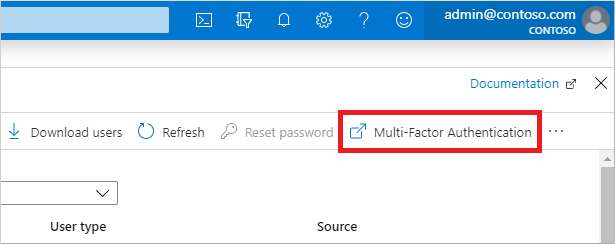
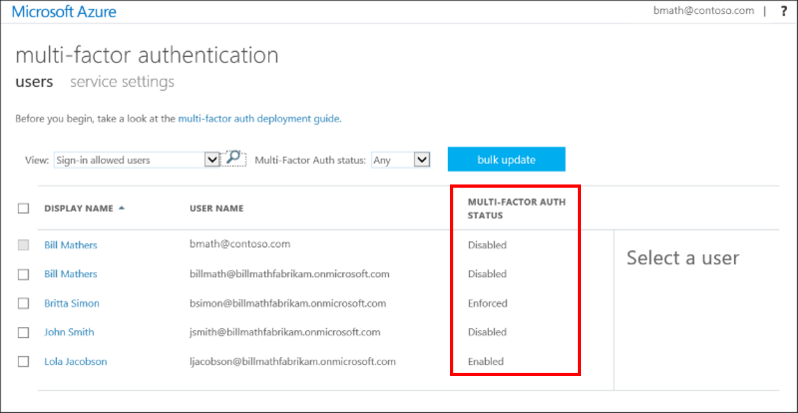
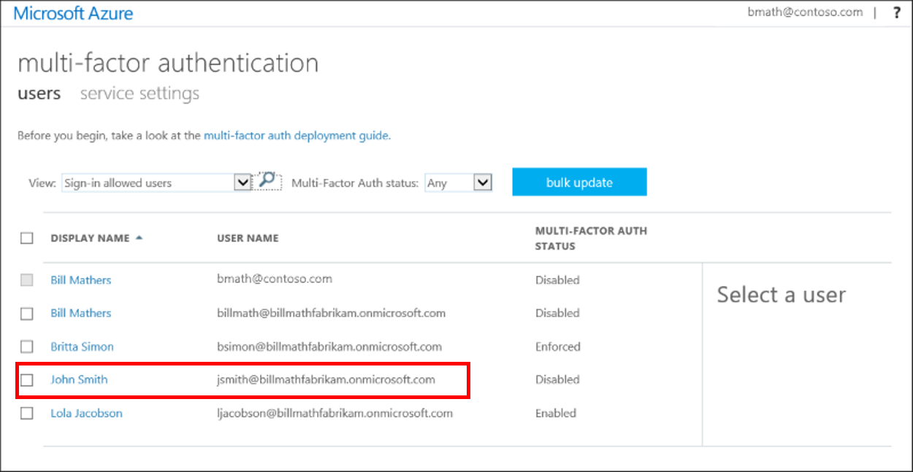

# Enable per-user Azure Multi-Factor Authentication to secure sign-in events

There are two ways to secure user sign-in events by requiring multi-factor authentication in Azure AD. The first, and preferred, option is to set up a Conditional Access policy that requires multi-factor authentication under certain conditions. The second option is to enable each user for Azure Multi-Factor Authentication. When users are enabled individually, they perform multi-factor authentication each time they sign in (with some exceptions, such as when they sign in from trusted IP addresses or when the _remembered devices_ feature is turned on).

> [!NOTE]
> Enabling Azure Multi-Factor Authentication using Conditional Access policies is the recommended approach. Changing user states is no longer recommended unless your licenses don't include Conditional Access as it requires users to perform MFA every time they sign in. To get started using Conditional Access, see [Tutorial: Secure user sign-in events with Azure Multi-Factor Authentication](tutorial-enable-azure-mfa.md).
>
> For Azure AD free tenants without Conditional Access, you can [use security defaults to protect users](../fundamentals/concept-fundamentals-security-defaults.md).

## Azure Multi-Factor Authentication user states

User accounts in Azure Multi-Factor Authentication have the following three distinct states:

> [!IMPORTANT]
> Enabling Azure Multi-Factor Authentication through a Conditional Access policy doesn't change the state of the user. Don't be alarmed if users appear disabled. Conditional Access doesn't change the state.
>
> **You shouldn't enable or enforce users if you're using Conditional Access policies.**

| Status | Description | Non-browser apps affected | Browser apps affected | Modern authentication affected |
|:---:| --- |:---:|:--:|:--:|
| Disabled | The default state for a new user not enrolled in Azure Multi-Factor Authentication. | No | No | No |
| Enabled | The user has been enrolled in Azure Multi-Factor Authentication, but hasn't registered. They receive a prompt to register the next time they sign in. | No.  They continue to work until the registration process is completed. | Yes. After the session expires, Azure Multi-Factor Authentication registration is required.| Yes. After the access token expires, Azure Multi-Factor Authentication registration is required. |
| Enforced | The user has been enrolled and has completed the registration process for Azure Multi-Factor Authentication. | Yes. Apps require app passwords. | Yes. Azure Multi-Factor Authentication is required at login. | Yes. Azure Multi-Factor Authentication is required at login. |

A user's state reflects whether an admin has enrolled them in Azure Multi-Factor Authentication, and whether they completed the registration process.

All users start out *Disabled*. When you enroll users in Azure Multi-Factor Authentication, their state changes to *Enabled*. When enabled users sign in and complete the registration process, their state changes to *Enforced*.

> [!NOTE]
> If MFA is re-enabled on a user object that already has registration details, such as phone or email, then administrators need to have that user re-register MFA via Azure portal or PowerShell. If the user doesn't re-register, their MFA state doesn't transition from *Enabled* to *Enforced* in MFA management UI.

## View the status for a user

Use the following steps to access the Azure portal page where you can view and manage user states:

1. Sign in to the [Azure portal](https://portal.azure.com) as an administrator.
1. Search for and select *Azure Active Directory*, then select **Users** > **All users**.
1. Select **Multi-Factor Authentication**. You may need to scroll to the right to see this menu option. Select the example screenshot below to see the full Azure portal window and menu location:
    [](media/howto-mfa-userstates/selectmfa.png#lightbox)
1. A new page opens that displays the user state, as shown in the following example.
   

## Change the status for a user

To change the Azure Multi-Factor Authentication state for a user, complete the following steps:

1. Use the preceding steps to get to the Azure Multi-Factor Authentication **users** page.
1. Find the user you want to enable for Azure Multi-Factor Authentication. You might need to change the view at the top to **users**.
   
1. Check the box next to the name(s) of the user(s) to change the state for.
1. On the right-hand side, under **quick steps**, choose **Enable** or **Disable**. In the following example, the user *John Smith* has a check next to their name and is being enabled for use:
   

   > [!TIP]
   > *Enabled* users are automatically switched to *Enforced* when they register for Azure Multi-Factor Authentication. Don't manually change the user state to *Enforced*.

1. Confirm your selection in the pop-up window that opens.

After you enable users, notify them via email. Tell the users that a prompt is displayed to ask them to register the next time they sign in. Also, if your organization uses non-browser apps that don't support modern authentication, they need to create app passwords. For more information, see the [Azure Multi-Factor Authentication end-user guide](../user-help/multi-factor-authentication-end-user.md) to help them get started.

## Change state using PowerShell

To change the user state by using [Azure AD PowerShell](/powershell/azure/overview), you change the `$st.State` parameter for a user account. There are three possible states for a user account:

* *Enabled*
* *Enforced*
* *Disabled*  

Don't move users directly to the *Enforced* state. If you do so, non-browser-based apps stop working because the user hasn't gone through Azure Multi-Factor Authentication registration and obtained an [app password](howto-mfa-app-passwords.md).

To get started, install the *MSOnline* module using [Install-Module](/powershell/module/powershellget/install-module) as follows:

```PowerShell
Install-Module MSOnline
```

Next, connect using [Connect-MsolService](/powershell/module/msonline/connect-msolservice):

```PowerShell
Connect-MsolService
```

The following example PowerShell script enables MFA for an individual user named *bsimon@contoso.com*:

```PowerShell
$st = New-Object -TypeName Microsoft.Online.Administration.StrongAuthenticationRequirement
$st.RelyingParty = "*"
$st.State = "Enabled"
$sta = @($st)

# Change the following UserPrincipalName to the user you wish to change state
Set-MsolUser -UserPrincipalName bsimon@contoso.com -StrongAuthenticationRequirements $sta
```

Using PowerShell is a good option when you need to bulk enable users. The following script loops through a list of users and enables MFA on their accounts. Define the user accounts set it in the first line for `$users` as follows:

   ```PowerShell
   # Define your list of users to update state in bulk
   $users = "bsimon@contoso.com","jsmith@contoso.com","ljacobson@contoso.com"

   foreach ($user in $users)
   {
       $st = New-Object -TypeName Microsoft.Online.Administration.StrongAuthenticationRequirement
       $st.RelyingParty = "*"
       $st.State = "Enabled"
       $sta = @($st)
       Set-MsolUser -UserPrincipalName $user -StrongAuthenticationRequirements $sta
   }
   ```

To disable MFA, the following example gets a user with [Get-MsolUser](/powershell/module/msonline/get-msoluser), then removes any *StrongAuthenticationRequirements* set for the defined user using [Set-MsolUser](/powershell/module/msonline/set-msoluser):

```PowerShell
Get-MsolUser -UserPrincipalName bsimon@contoso.com | Set-MsolUser -StrongAuthenticationRequirements @()
```

You could also directly disable MFA for a user using [Set-MsolUser](/powershell/module/msonline/set-msoluser) as follows:

```PowerShell
Set-MsolUser -UserPrincipalName bsimon@contoso.com -StrongAuthenticationRequirements @()
```

## Convert users from per-user MFA to Conditional Access based MFA

The following PowerShell can assist you in making the conversion to Conditional Access based Azure Multi-Factor Authentication.

```PowerShell
# Sets the MFA requirement state
function Set-MfaState {

    [CmdletBinding()]
    param(
        [Parameter(ValueFromPipelineByPropertyName=$True)]
        $ObjectId,
        [Parameter(ValueFromPipelineByPropertyName=$True)]
        $UserPrincipalName,
        [ValidateSet("Disabled","Enabled","Enforced")]
        $State
    )

    Process {
        Write-Verbose ("Setting MFA state for user '{0}' to '{1}'." -f $ObjectId, $State)
        $Requirements = @()
        if ($State -ne "Disabled") {
            $Requirement =
                [Microsoft.Online.Administration.StrongAuthenticationRequirement]::new()
            $Requirement.RelyingParty = "*"
            $Requirement.State = $State
            $Requirements += $Requirement
        }

        Set-MsolUser -ObjectId $ObjectId -UserPrincipalName $UserPrincipalName `
                     -StrongAuthenticationRequirements $Requirements
    }
}

# Disable MFA for all users
Get-MsolUser -All | Set-MfaState -State Disabled
```

> [!NOTE]
> We recently changed the behavior and this PowerShell script. Previously, the script saved off the MFA methods, disabled MFA, and restored the methods. This is no longer necessary now that the default behavior for disable doesn't clear the methods.
>
> If MFA is re-enabled on a user object that already has registration details, such as phone or email, then administrators need to have that user re-register MFA via Azure portal or PowerShell. If the user doesn't re-register, their MFA state doesn't transition from *Enabled* to *Enforced* in MFA management UI.

## Next steps

To configure Azure Multi-Factor Authentication settings like trusted IPs, custom voice messages, and fraud alerts, see  [Configure Azure Multi-Factor Authentication settings](howto-mfa-mfasettings.md). To manage user settings for Azure Multi-Factor Authentication, see [Manage user settings with Azure Multi-Factor Authentication](howto-mfa-userdevicesettings.md).

To understand why a user was prompted or not prompted to perform MFA, see [Azure Multi-Factor Authentication reports](howto-mfa-reporting.md).
