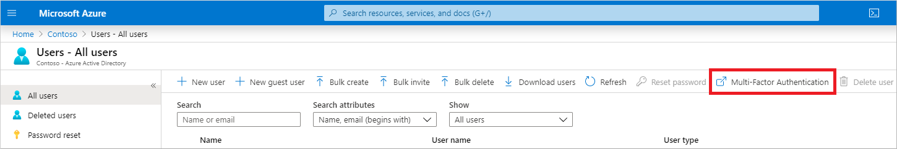

# How to require two-step verification for a user

You can take one of two approaches for requiring two-step verification, both of which require using a global administrator account. The first option is to enable each user for Azure Multi-Factor Authentication (MFA). When users are enabled individually, they perform two-step verification each time they sign in (with some exceptions, such as when they sign in from trusted IP addresses or when the _remembered devices_ feature is turned on). The second option is to set up a Conditional Access policy that requires two-step verification under certain conditions.

> [!TIP]
> Enabling Azure Multi-Factor Authentication using Conditional Access policies is the recommended approach. Changing user states is no longer recommended unless your licenses do not include Conditional Access as it will require users to perform MFA every time they sign in.

## Choose how to enable

**Enabled by changing user state** - This is the traditional method for requiring two-step verification and is discussed in this article. It works with both Azure MFA in the cloud and Azure MFA Server. Using this method requires users to perform two-step verification **every time** they sign in and overrides Conditional Access policies. This is the method used for those with either Office 365 or Microsoft 365 Business licenses as they do not include Conditional Access features.

Enabled by Conditional Access policy - This is the most flexible means to enable two-step verification for your users. Enabling using Conditional Access policy only works for Azure MFA in the cloud and is a premium feature of Azure AD. More information on this method can be found in [Deploy cloud-based Azure Multi-Factor Authentication](howto-mfa-getstarted.md).

Enabled by Azure AD Identity Protection - This method uses the Azure AD Identity Protection risk policy to require two-step verification based only on sign-in risk for all cloud applications. This method requires Azure Active Directory P2 licensing. More information on this method can be found in [Azure Active Directory Identity Protection](../identity-protection/howto-sign-in-risk-policy.md)

> [!Note]
> More information about licenses and pricing can be found on the [Azure AD](https://azure.microsoft.com/pricing/details/active-directory/
) and [Multi-Factor Authentication](https://azure.microsoft.com/pricing/details/multi-factor-authentication/) pricing pages.

## Enable Azure MFA by changing user state

User accounts in Azure Multi-Factor Authentication have the following three distinct states:

| Status | Description | Non-browser apps affected | Browser apps affected | Modern authentication affected |
|:---:|:---:|:---:|:--:|:--:|
| Disabled |The default state for a new user not enrolled in Azure MFA. |No |No |No |
| Enabled |The user has been enrolled in Azure MFA, but has not registered. They receive a prompt to register the next time they sign in. |No.  They continue to work until the registration process is completed. | Yes. After the session expires, Azure MFA registration is required.| Yes. After the access token expires, Azure MFA registration is required. |
| Enforced |The user has been enrolled and has completed the registration process for Azure MFA. |Yes. Apps require app passwords. |Yes. Azure MFA is required at login. | Yes. Azure MFA is required at login. |

A user's state reflects whether an admin has enrolled them in Azure MFA, and whether they completed the registration process.

All users start out *Disabled*. When you enroll users in Azure MFA, their state changes to *Enabled*. When enabled users sign in and complete the registration process, their state changes to *Enforced*.  

### View the status for a user

Use the following steps to access the page where you can view and manage user states:

1. Sign in to the [Azure portal](https://portal.azure.com) as an administrator.
2. Go to **Azure Active Directory** > **Users and groups** > **All users**.
3. Select **Multi-Factor Authentication**.
   
4. A new page that displays the user states opens.
   

### Change the status for a user

1. Use the preceding steps to get to the Azure Multi-Factor Authentication **users** page.
2. Find the user you want to enable for Azure MFA. You might need to change the view at the top.
   
3. Check the box next to their name.
4. On the right, under **quick steps**, choose **Enable** or **Disable**.
   

   > [!TIP]
   > *Enabled* users are automatically switched to *Enforced* when they register for Azure MFA. Do not manually change the user state to *Enforced*.

5. Confirm your selection in the pop-up window that opens.

After you enable users, notify them via email. Tell them that they'll be asked to register the next time they sign in. Also, if your organization uses non-browser apps that don't support modern authentication, they need to create app passwords. You can also include a link to the [Azure MFA end-user guide](../user-help/multi-factor-authentication-end-user.md) to help them get started.

### Use PowerShell

To change the user state by using [Azure AD PowerShell](/powershell/azure/overview), change `$st.State`. There are three possible states:

* Enabled
* Enforced
* Disabled  

Don't move users directly to the *Enforced* state. If you do, non-browser-based apps stop working because the user has not gone through Azure MFA registration and obtained an [app password](howto-mfa-mfasettings.md#app-passwords).

Install the Module first, using:

   ```PowerShell
   Install-Module MSOnline
   ```

> [!TIP]
> Don't forget to connect first using **Connect-MsolService**

This example PowerShell script enables MFA for an individual user:

   ```PowerShell
   Import-Module MSOnline
   $st = New-Object -TypeName Microsoft.Online.Administration.StrongAuthenticationRequirement
   $st.RelyingParty = "*"
   $st.State = "Enabled"
   $sta = @($st)
   Set-MsolUser -UserPrincipalName bsimon@contoso.com -StrongAuthenticationRequirements $sta
   ```

Using PowerShell is a good option when you need to bulk enable users. As an example, the following script loops through a list of users and enables MFA on their accounts:

   ```PowerShell
   $users = "bsimon@contoso.com","jsmith@contoso.com","ljacobson@contoso.com"
   foreach ($user in $users)
   {
       $st = New-Object -TypeName Microsoft.Online.Administration.StrongAuthenticationRequirement
       $st.RelyingParty = "*"
       $st.State = "Enabled"
       $sta = @($st)
       Set-MsolUser -UserPrincipalName $user -StrongAuthenticationRequirements $sta
   }
   ```

To disable MFA, use this script:

   ```PowerShell
   Get-MsolUser -UserPrincipalName user@domain.com | Set-MsolUser -StrongAuthenticationMethods @()
   ```

which can also be shortened to:

   ```PowerShell
   Set-MsolUser -UserPrincipalName user@domain.com -StrongAuthenticationRequirements @()
   ```

### Convert users from per-user MFA to Conditional Access based MFA

The following PowerShell can assist you in making the conversion to Conditional Access based Azure Multi-Factor Authentication.

```PowerShell
# Disable MFA for all users, keeping their MFA methods intact
Get-MsolUser -All | Disable-MFA -KeepMethods

# Enforce MFA for all users
Get-MsolUser -All | Set-MfaState -State Enforced

# Wrapper to disable MFA with the option to keep the MFA
# methods (to avoid having to proof-up again later)
function Disable-Mfa {

    [CmdletBinding()]
    param(
        [Parameter(ValueFromPipeline=$True)]
        $User,
        [switch] $KeepMethods
    )

    Process {

        Write-Verbose ("Disabling MFA for user '{0}'" -f $User.UserPrincipalName)
        $User | Set-MfaState -State Disabled

        if ($KeepMethods) {
            # Restore the MFA methods which got cleared when disabling MFA
            Set-MsolUser -ObjectId $User.ObjectId `
                         -StrongAuthenticationMethods $User.StrongAuthenticationMethods
        }
    }
}

# Sets the MFA requirement state
function Set-MfaState {

    [CmdletBinding()]
    param(
        [Parameter(ValueFromPipelineByPropertyName=$True)]
        $ObjectId,
        [Parameter(ValueFromPipelineByPropertyName=$True)]
        $UserPrincipalName,
        [ValidateSet("Disabled","Enabled","Enforced")]
        $State
    )

    Process {
        Write-Verbose ("Setting MFA state for user '{0}' to '{1}'." -f $ObjectId, $State)
        $Requirements = @()
        if ($State -ne "Disabled") {
            $Requirement =
                [Microsoft.Online.Administration.StrongAuthenticationRequirement]::new()
            $Requirement.RelyingParty = "*"
            $Requirement.State = $State
            $Requirements += $Requirement
        }

        Set-MsolUser -ObjectId $ObjectId -UserPrincipalName $UserPrincipalName `
                     -StrongAuthenticationRequirements $Requirements
    }
}

```

## Next steps

* Why was a user prompted or not prompted to perform MFA? See the section [Azure AD sign-ins report in the Reports in Azure Multi-Factor Authentication document](howto-mfa-reporting.md#azure-ad-sign-ins-report).
* To configure additional settings like trusted IPs, custom voice messages, and fraud alerts, see the article [Configure Azure Multi-Factor Authentication settings](howto-mfa-mfasettings.md)
* Information about managing user settings for Azure Multi-Factor Authentication can be found in the article [Manage user settings with Azure Multi-Factor Authentication in the cloud](howto-mfa-userdevicesettings.md)
