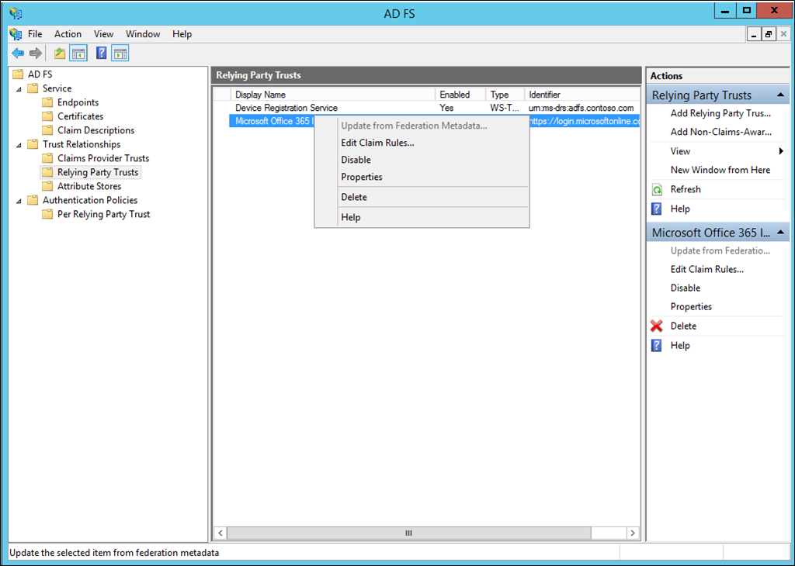
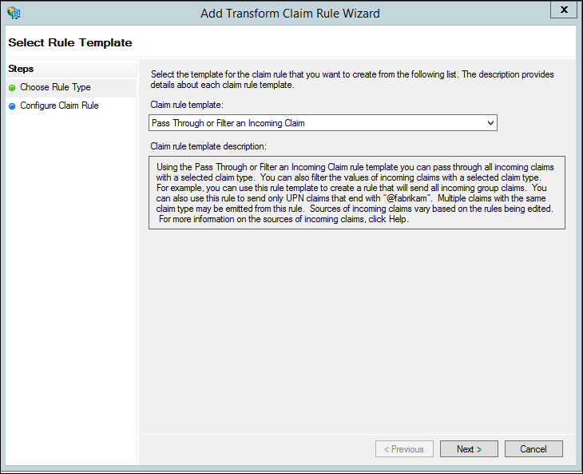

# Configure Azure Multi-Factor Authentication Server to work with AD FS in Windows Server

If you use Active Directory Federation Services (AD FS) and want to secure cloud or on-premises resources, you can configure Azure Multi-Factor Authentication Server to work with AD FS. This configuration triggers two-step verification for high-value endpoints.

In this article, we discuss using Azure Multi-Factor Authentication Server with AD FS in Windows Server 2012 R2 or Windows Server 2016. For more information, read about how to [secure cloud and on-premises resources by using Azure Multi-Factor Authentication Server with AD FS 2.0](howto-mfaserver-adfs-2.md).

> [!IMPORTANT]
> As of July 1, 2019, Microsoft will no longer offer MFA Server for new deployments. New customers who would like to require multi-factor authentication from their users should use cloud-based Azure Multi-Factor Authentication. Existing customers who have activated MFA Server prior to July 1 will be able to download the latest version, future updates and generate activation credentials as usual.

## Secure Windows Server AD FS with Azure Multi-Factor Authentication Server

When you install Azure Multi-Factor Authentication Server, you have the following options:

* Install Azure Multi-Factor Authentication Server locally on the same server as AD FS
* Install the Azure Multi-Factor Authentication adapter locally on the AD FS server, and then install Multi-Factor Authentication Server on a different computer

Before you begin, be aware of the following information:

* You don't have to install Azure Multi-Factor Authentication Server on your AD FS server. However, you must install the Multi-Factor Authentication adapter for AD FS on a Windows Server 2012 R2 or Windows Server 2016 that is running AD FS. You can install the server on a different computer if you install the AD FS adapter separately on your AD FS federation server. See the following procedures to learn how to install the adapter separately.
* If your organization is using text message or mobile app verification methods, the strings defined in Company Settings contain a placeholder, <$*application_name*$>. In MFA Server v7.1, you can provide an application name that replaces this placeholder. In v7.0 or older, this placeholder is not automatically replaced when you use the AD FS adapter. For those older versions, remove the placeholder from the appropriate strings when you secure AD FS.
* The account that you use to sign in must have user rights to create security groups in your Active Directory service.
* The Multi-Factor Authentication AD FS adapter installation wizard creates a security group called PhoneFactor Admins in your instance of Active Directory. It then adds the AD FS service account of your federation service to this group. Verify that the PhoneFactor Admins group was created on your domain controller, and that the AD FS service account is a member of this group. If necessary, manually add the AD FS service account to the PhoneFactor Admins group on your domain controller.
* For information about installing the Web Service SDK with the user portal, see [deploying the user portal for Azure Multi-Factor Authentication Server.](howto-mfaserver-deploy-userportal.md)

### Install Azure Multi-Factor Authentication Server locally on the AD FS server

1. Download and install Azure Multi-Factor Authentication Server on your AD FS server. For installation information, read about [getting started with Azure Multi-Factor Authentication Server](howto-mfaserver-deploy.md).
2. In the Azure Multi-Factor Authentication Server management console, click the **AD FS** icon. Select the options **Allow user enrollment** and **Allow users to select method**.
3. Select any additional options you'd like to specify for your organization.
4. Click **Install AD FS Adapter**.

   

5. If the Active Directory window is displayed, that means two things. Your computer is joined to a domain, and the Active Directory configuration for securing communication between the AD FS adapter and the Multi-Factor Authentication service is incomplete. Click **Next** to automatically complete this configuration, or select the **Skip automatic Active Directory configuration and configure settings manually** check box. Click **Next**.
6. If the Local Group windows is displayed, that means two things. Your computer is not joined to a domain, and the local group configuration for securing communication between the AD FS adapter and the Multi-Factor Authentication service is incomplete. Click **Next** to automatically complete this configuration, or select the **Skip automatic Local Group configuration and configure settings manually** check box. Click **Next**.
7. In the installation wizard, click **Next**. Azure Multi-Factor Authentication Server creates the PhoneFactor Admins group and adds the AD FS service account to the PhoneFactor Admins group.
8. On the **Launch Installer** page, click **Next**.
9. In the Multi-Factor Authentication AD FS adapter installer, click **Next**.
10. Click **Close** when the installation is finished.
11. When the adapter has been installed, you must register it with AD FS. Open Windows PowerShell and run the following command:

    `C:\Program Files\Multi-Factor Authentication Server\Register-MultiFactorAuthenticationAdfsAdapter.ps1`

12. To use your newly registered adapter, edit the global authentication policy in AD FS. In the AD FS management console, go to the **Authentication Policies** node. In the **Multi-factor Authentication** section, click the **Edit** link next to the **Global Settings** section. In the **Edit Global Authentication Policy** window, select **Multi-Factor Authentication** as an additional authentication method, and then click **OK**. The adapter is registered as WindowsAzureMultiFactorAuthentication. Restart the AD FS service for the registration to take effect.

At this point, Multi-Factor Authentication Server is set up to be an additional authentication provider to use with AD FS.

## Install a standalone instance of the AD FS adapter by using the Web Service SDK

1. Install the Web Service SDK on the server that is running Multi-Factor Authentication Server.
2. Copy the following files from the \Program Files\Multi-Factor Authentication Server directory to the server on which you plan to install the AD FS adapter:
   * MultiFactorAuthenticationAdfsAdapterSetup64.msi
   * Register-MultiFactorAuthenticationAdfsAdapter.ps1
   * Unregister-MultiFactorAuthenticationAdfsAdapter.ps1
   * MultiFactorAuthenticationAdfsAdapter.config
3. Run the MultiFactorAuthenticationAdfsAdapterSetup64.msi installation file.
4. In the Multi-Factor Authentication AD FS adapter installer, click **Next** to start the installation.
5. Click **Close** when the installation is finished.

## Edit the MultiFactorAuthenticationAdfsAdapter.config file

Follow these steps to edit the MultiFactorAuthenticationAdfsAdapter.config file:

1. Set the **UseWebServiceSdk** node to **true**.  
2. Set the value for **WebServiceSdkUrl** to the URL of the Multi-Factor Authentication Web Service SDK. For example: *https:\/\/contoso.com/\<certificatename>/MultiFactorAuthWebServiceSdk/PfWsSdk.asmx*, Where *\<certificatename>* is the name of your certificate.  
3. Edit the Register-MultiFactorAuthenticationAdfsAdapter.ps1 script by adding `-ConfigurationFilePath &lt;path&gt;` to the end of the `Register-AdfsAuthenticationProvider` command, where *&lt;path&gt;* is the full path to the MultiFactorAuthenticationAdfsAdapter.config file.

### Configure the Web Service SDK with a username and password

There are two options for configuring the Web Service SDK. The first is with a username and password, the second is with a client certificate. Follow these steps for the first option, or skip ahead for the second.  

1. Set the value for **WebServiceSdkUsername** to an account that is a member of the PhoneFactor Admins security group. Use the &lt;domain&gt;&#92;&lt;user name&gt; format.  
2. Set the value for **WebServiceSdkPassword** to the appropriate account password.

### Configure the Web Service SDK with a client certificate

If you don't want to use a username and password, follow these steps to configure the Web Service SDK with a client certificate.

1. Obtain a client certificate from a certificate authority for the server that is running the Web Service SDK. Learn how to [obtain client certificates](https://technet.microsoft.com/library/cc770328.aspx).  
2. Import the client certificate to the local computer personal certificate store on the server that is running the Web Service SDK. Make sure that the certificate authority's public certificate is in Trusted Root Certificates certificate store.  
3. Export the public and private keys of the client certificate to a .pfx file.  
4. Export the public key in Base64 format to a .cer file.  
5. In Server Manager, verify that the Web Server (IIS)\Web Server\Security\IIS Client Certificate Mapping Authentication feature is installed. If it is not installed, select **Add Roles and Features** to add this feature.  
6. In IIS Manager, double-click **Configuration Editor** in the website that contains the Web Service SDK virtual directory. It is important to select the website, not the virtual directory.  
7. Go to the **system.webServer/security/authentication/iisClientCertificateMappingAuthentication** section.  
8. Set enabled to **true**.  
9. Set oneToOneCertificateMappingsEnabled to **true**.  
10. Click the **...** button next to oneToOneMappings, and then click the **Add** link.  
11. Open the Base64 .cer file you exported earlier. Remove *-----BEGIN CERTIFICATE-----*, *-----END CERTIFICATE-----*, and any line breaks. Copy the resulting string.  
12. Set certificate to the string copied in the preceding step.  
13. Set enabled to **true**.  
14. Set userName to an account that is a member of the PhoneFactor Admins security group. Use the &lt;domain&gt;&#92;&lt;user name&gt; format.  
15. Set the password to the appropriate account password, and then close Configuration Editor.  
16. Click the **Apply** link.  
17. In the Web Service SDK virtual directory, double-click **Authentication**.  
18. Verify that ASP.NET Impersonation and Basic Authentication are set to **Enabled**, and that all other items are set to **Disabled**.  
19. In the Web Service SDK virtual directory, double-click **SSL Settings**.  
20. Set Client Certificates to **Accept**, and then click **Apply**.  
21. Copy the .pfx file you exported earlier to the server that is running the AD FS adapter.  
22. Import the .pfx file to the local computer personal certificate store.  
23. Right-click and select **Manage Private Keys**, and then grant read access to the account you used to sign in to the AD FS service.  
24. Open the client certificate and copy the thumbprint from the **Details** tab.  
25. In the MultiFactorAuthenticationAdfsAdapter.config file, set **WebServiceSdkCertificateThumbprint** to the string copied in the previous step.  

Finally, to register the adapter, run the \Program Files\Multi-Factor Authentication Server\Register-MultiFactorAuthenticationAdfsAdapter.ps1 script in PowerShell. The adapter is registered as WindowsAzureMultiFactorAuthentication. Restart the AD FS service for the registration to take effect.

## Secure Azure AD resources using AD FS

To secure your cloud resource, set up a claims rule so that Active Directory Federation Services emits the multipleauthn claim when a user performs two-step verification successfully. This claim is passed on to Azure AD. Follow this procedure to walk through the steps:

1. Open AD FS Management.
2. On the left, select **Relying Party Trusts**.
3. Right-click on **Microsoft Office 365 Identity Platform** and select **Edit Claim Rules…**

   

4. On Issuance Transform Rules, click **Add Rule.**

   

5. On the Add Transform Claim Rule Wizard, select **Pass Through or Filter an Incoming Claim** from the drop-down and click **Next**.

   

6. Give your rule a name.
7. Select **Authentication Methods References** as the Incoming claim type.
8. Select **Pass through all claim values**.

    

9. Click **Finish**. Close the AD FS Management console.

## Troubleshooting logs

To help with troubleshooting issues with the MFA Server AD FS Adapter use the steps that follow to enable additional logging.

1. In the MFA Server interface, open the AD FS section, and check the **Enable logging** checkbox.
2. On each AD FS server, use **regedit.exe** to create string value registry key `Computer\HKEY_LOCAL_MACHINE\SOFTWARE\WOW6432Node\Positive Networks\PhoneFactor\InstallPath` with value `C:\Program Files\Multi-Factor Authentication Server\` (or other directory of your choice).  **Note, the trailing backslash is important.**
3. Create `C:\Program Files\Multi-Factor Authentication Server\Logs` directory (or other directory as referenced in **Step 2**).
4. Grant Modify access on the Logs directory to the AD FS service account.
5. Restart the AD FS service.
6. Verify that `MultiFactorAuthAdfsAdapter.log` file was created in the Logs directory.

## Related topics

For troubleshooting help, see the [Azure Multi-Factor Authentication FAQs](multi-factor-authentication-faq.md)
