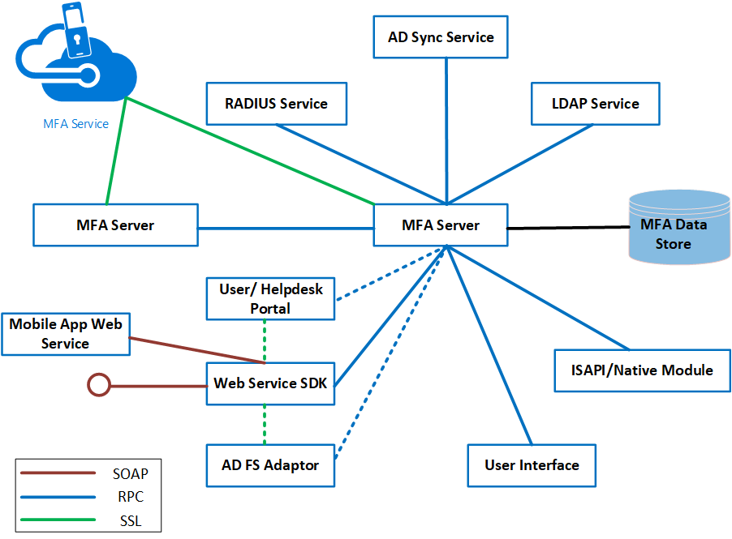
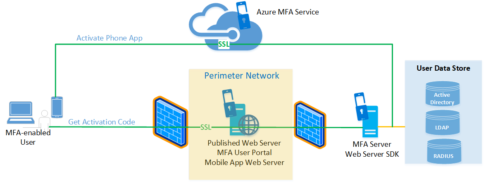
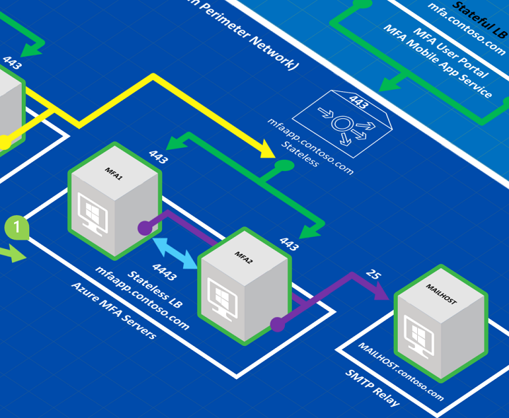
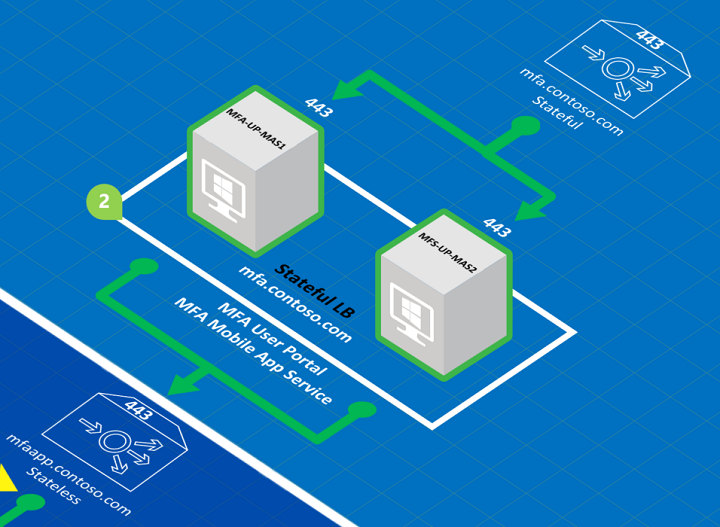

# Configure Azure Multi-Factor Authentication Server for high availability

To achieve high-availability with your Azure Server MFA deployment, you need to deploy multiple MFA servers. This section provides information on a load-balanced design to achieve your high availability targets in you Azure MFS Server deployment.

> [!IMPORTANT]
> As of July 1, 2019, Microsoft will no longer offer MFA Server for new deployments. New customers who would like to require multi-factor authentication from their users should use cloud-based Azure Multi-Factor Authentication. Existing customers who have activated MFA Server prior to July 1 will be able to download the latest version, future updates and generate activation credentials as usual.

## MFA Server overview

The Azure MFA Server service architecture comprises several components as shown in the following diagram:

 

An MFA Server is a Windows Server that has the Azure Multi-Factor Authentication software installed. The MFA Server instance must be activated by the MFA Service in Azure to function. More than one MFA Server can be installed on-premises.

The first MFA Server that is installed is the master MFA Server upon activation by the Azure MFA Service by default. The master MFA server has a writeable copy of the PhoneFactor.pfdata database. Subsequent installations of instances of MFA Server are known as subordinates. The MFA subordinates have a replicated read-only copy of the PhoneFactor.pfdata database. MFA servers replicate information using Remote Procedure Call (RPC). All MFA Severs must collectively either be domain joined or standalone to replicate information.

Both MFA master and subordinate MFA Servers communicate with the MFA Service when two-factor authentication is required. For example, when a user attempts to gain access to an application that requires two-factor authentication, the user will first be authenticated by an identity provider, such as Active Directory (AD).

After successful authentication with AD, the MFA Server will communicate with the MFA Service. The MFA Server waits for notification from the MFA Service to allow or deny the user access to the application.

If the MFA master server goes offline, authentications can still be processed, but operations that require changes to the MFA database cannot be processed. (Examples include: the addition of users, self-service PIN changes, changing user information, or access to the user portal)

## Deployment

Consider the following important points for load balancing Azure MFA Server and its related components.

* **Using RADIUS standard to achieve high availability**. If you are using Azure MFA Servers as RADIUS servers, you can potentially configure one MFA Server as a primary RADIUS authentication target and other Azure MFA Servers as secondary authentication targets. However, this method to achieve high availability may not be practical because you must wait for a time-out period to occur when authentication fails on the primary authentication target before you can be authenticated against the secondary authentication target. It is more efficient to load balance the RADIUS traffic between the RADIUS client and the RADIUS Servers (in this case, the Azure MFA Servers acting as RADIUS servers) so that you can configure the RADIUS clients with a single URL that they can point to.
* **Need to manually promote MFA subordinates**. If the master Azure MFA server goes offline, the secondary Azure MFA Servers continue to process MFA requests. However, until a master MFA server is available, admins can not add users or modify MFA settings, and users can not make changes using the user portal. Promoting an MFA subordinate to the master role is always a manual process.
* **Separability of components**. The Azure MFA Server comprises several components that can be installed on the same Windows Server instance or on different instances. These components include the User Portal, Mobile App Web Service, and the ADFS adapter (agent). This separability makes it possible to use the Web Application Proxy to publish the User Portal and Mobile App Web Server from the perimeter network. Such a configuration adds to the overall security of your design, as shown in the following diagram. The MFA User Portal and Mobile App Web Server may also be deployed in HA load-balanced configurations.

   

* **One-time password (OTP) over SMS (aka one-way SMS) requires the use of sticky sessions if traffic is load-balanced**. One-way SMS is an authentication option that causes the MFA Server to send the users a text message containing an OTP. The user enters the OTP in a prompt window to complete the MFA challenge. If you load balance Azure MFA Servers, the same server that served the initial authentication request must be the server that receives the OTP message from the user; if another MFA Server receives the OTP reply, the authentication challenge fails. For more information, see [One Time Password over SMS Added to Azure MFA Server](https://blogs.technet.microsoft.com/enterprisemobility/2015/03/02/one-time-password-over-sms-added-to-azure-mfa-server).
* **Load-Balanced deployments of the User Portal and Mobile App Web Service require sticky sessions**. If you are load-balancing the MFA User Portal and the Mobile App Web Service, each session needs to stay on the same server.

## High-availability deployment

The following diagram shows a complete HA load-balanced implementation of Azure MFA and its components, along with ADFS for reference.

 

Note the following items for the correspondingly numbered area of the preceding diagram.

1. The two Azure MFA Servers (MFA1 and MFA2) are load balanced (mfaapp.contoso.com) and are configured to use a static port (4443) to replicate the PhoneFactor.pfdata database. The Web Service SDK is installed on each of the MFA Server to enable communication over TCP port 443 with the ADFS servers. The MFA servers are deployed in a stateless load-balanced configuration. However, if you wanted to use OTP over SMS, you must use stateful load balancing.
   

   > [!NOTE]
   > Because RPC uses dynamic ports, it is not recommended to open firewalls up to the range of dynamic ports that RPC can potentially use. If you have a firewall **between** your MFA application servers, you should configure the MFA Server to communicate on a static port for the replication traffic between subordinate and master servers and open that port on your firewall. You can force the static port by creating a DWORD registry value at ```HKEY_LOCAL_MACHINE\SOFTWARE\Wow6432Node\Positive Networks\PhoneFactor``` called ```Pfsvc_ncan_ip_tcp_port``` and setting the value to an available static port. Connections are always initiated by the subordinate MFA Servers to the master, the static port is only required on the master, but since you can promote a subordinate to be the master at any time, you should set the static port on all MFA Servers.

2. The two User Portal/MFA Mobile App servers (MFA-UP-MAS1 and MFA-UP-MAS2) are load balanced in a **stateful** configuration (mfa.contoso.com). Recall that sticky sessions are a requirement for load balancing the MFA User Portal and Mobile App Service.
   
3. The ADFS Server farm is load balanced and published to the Internet through load-balanced ADFS proxies in the perimeter network. Each ADFS Server uses the ADFS agent to communicate with the Azure MFA Servers using a single load-balanced URL (mfaapp.contoso.com) over TCP port 443.

## Next steps

* [Install and configure Azure MFA Server](howto-mfaserver-deploy.md)
