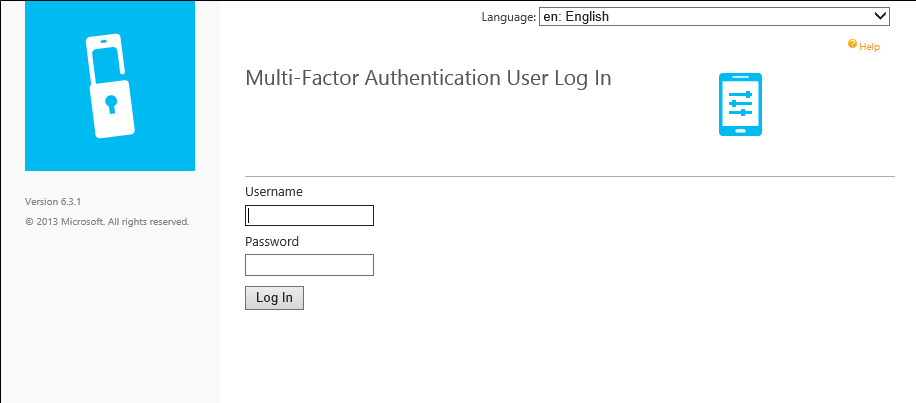
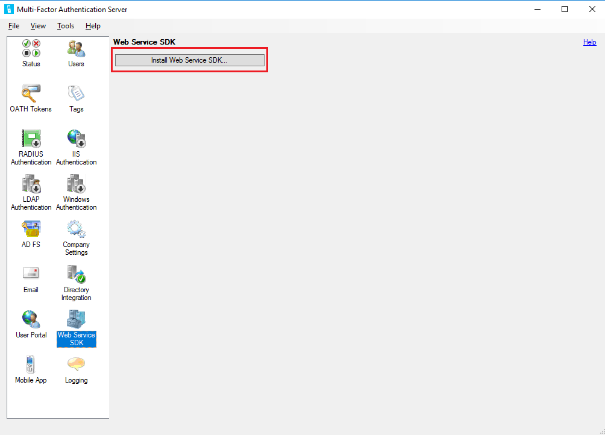
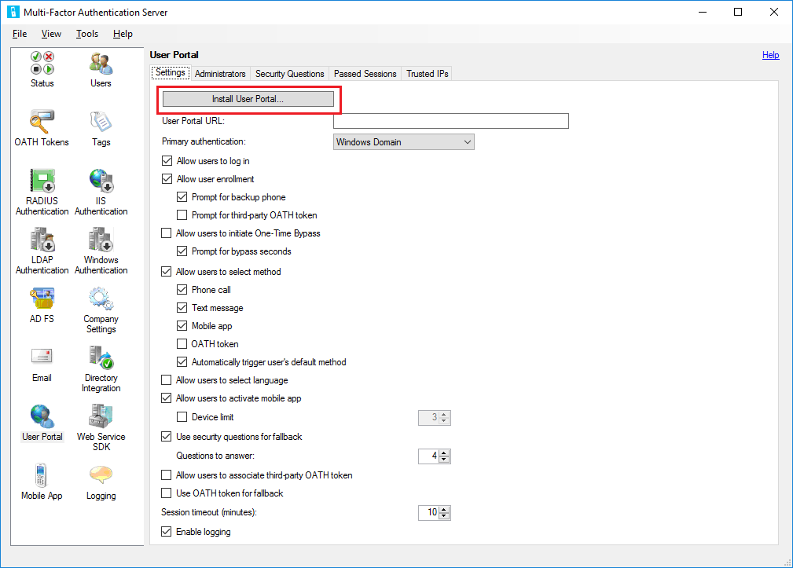
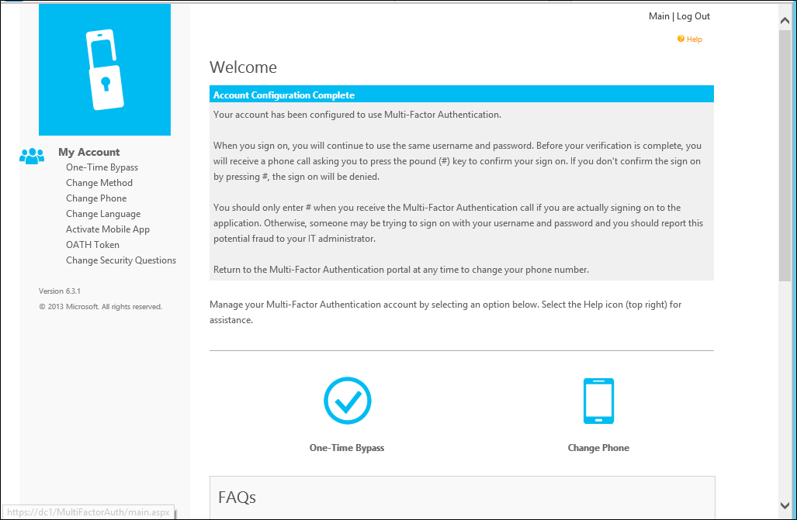
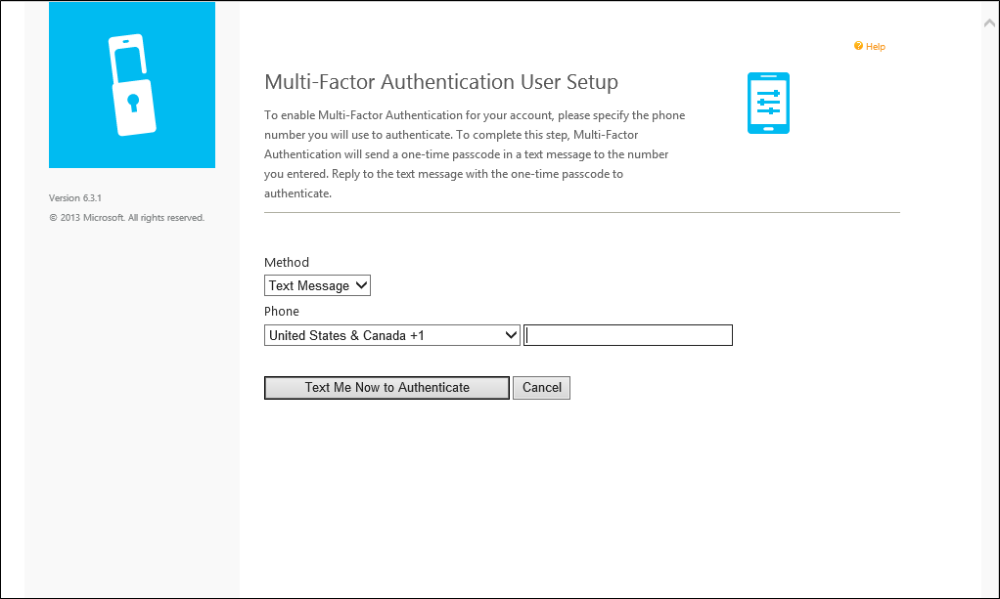
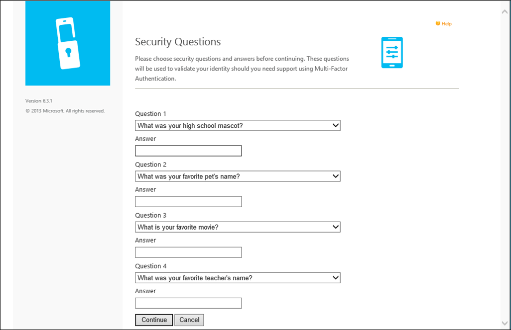

# User portal for the Azure Multi-Factor Authentication Server

The user portal is an IIS web site that allows users to enroll in Azure Multi-Factor Authentication (MFA) and maintain their accounts. A user may change their phone number, change their PIN, or choose to bypass two-step verification during their next sign-on.

Users sign in to the user portal with their normal username and password, then either complete a two-step verification call or answer security questions to complete their authentication. If user enrollment is allowed, users configure their phone number and PIN the first time they sign in to the user portal.

User portal Administrators may be set up and granted permission to add new users and update existing users.

Depending on your environment, you may want to deploy the user portal on the same server as Azure Multi-Factor Authentication Server or on another internet-facing  server.

> [!IMPORTANT]
> As of July 1, 2019, Microsoft will no longer offer MFA Server for new deployments. New customers who would like to require multi-factor authentication from their users should use cloud-based Azure Multi-Factor Authentication. Existing customers who have activated MFA Server prior to July 1 will be able to download the latest version, future updates and generate activation credentials as usual.

> [!NOTE]
> The user portal is only available with Multi-Factor Authentication Server. If you use Multi-Factor Authentication in the cloud, refer your users to the [Set-up your account for two-step verification](../user-help/multi-factor-authentication-end-user-first-time.md) or [Manage your settings for two-step verification](../user-help/multi-factor-authentication-end-user-manage-settings.md).

## Install the web service SDK

In either scenario, if the Azure Multi-Factor Authentication Web Service SDK is **not** already installed on the Azure Multi-Factor Authentication (MFA) Server, complete the steps that follow.

1. Open the Multi-Factor Authentication Server console.
2. Go to the **Web Service SDK** and select **Install Web Service SDK**.
3. Complete the install using the defaults unless you need to change them for some reason.
4. Bind an SSL Certificate to the site in IIS.

If you have questions about configuring an SSL Certificate on an IIS server, see the article [How to Set Up SSL on IIS](https://docs.microsoft.com/iis/manage/configuring-security/how-to-set-up-ssl-on-iis).

The Web Service SDK must be secured with an SSL certificate. A self-signed certificate is okay for this purpose. Import the certificate into the “Trusted Root Certification Authorities” store of the Local Computer account on the User Portal web server so that it trusts that certificate when initiating the SSL connection.

## Deploy the user portal on the same server as the Azure Multi-Factor Authentication Server

The following pre-requisites are required to install the user portal on the **same server** as the Azure Multi-Factor Authentication Server:

* IIS, including ASP.NET, and IIS 6 meta base compatibility (for IIS 7 or higher)
* An account with admin rights for the computer and Domain if applicable. The account needs permissions to create Active Directory security groups.
* Secure the user portal with an SSL certificate.
* Secure the Azure Multi-Factor Authentication Web Service SDK with an SSL certificate.

To deploy the user portal, follow these steps:

1. Open the Azure Multi-Factor Authentication Server console, click the **User Portal** icon in the left menu, then click **Install User Portal**.
2. Complete the install using the defaults unless you need to change them for some reason.
3. Bind an SSL Certificate to the site in IIS

   > [!NOTE]
   > This SSL Certificate is usually a publicly signed SSL Certificate.

4. Open a web browser from any computer and navigate to the URL where the user portal was installed (Example: https://mfa.contoso.com/MultiFactorAuth). Ensure that no certificate warnings or errors are displayed.

If you have questions about configuring an SSL Certificate on an IIS server, see the article [How to Set Up SSL on IIS](https://docs.microsoft.com/iis/manage/configuring-security/how-to-set-up-ssl-on-iis).

## Deploy the user portal on a separate server

If the server where Azure Multi-Factor Authentication Server is running is not internet-facing, you should install the user portal on a **separate, internet-facing server**.

If your organization uses the Microsoft Authenticator app as one of the verification methods, and want to deploy the user portal on its own server, complete the following requirements:

* Use v6.0 or higher of the Azure Multi-Factor Authentication Server.
* Install the user portal on an internet-facing web server running Microsoft internet Information Services (IIS) 6.x or higher.
* When using IIS 6.x, ensure ASP.NET v2.0.50727 is installed, registered, and set to **Allowed**.
* When using IIS 7.x or higher, IIS, including Basic Authentication, ASP.NET, and IIS 6 meta base compatibility.
* Secure the user portal with an SSL certificate.
* Secure the Azure Multi-Factor Authentication Web Service SDK with an SSL certificate.
* Ensure that the user portal can connect to the Azure Multi-Factor Authentication Web Service SDK over SSL.
* Ensure that the user portal can authenticate to the Azure Multi-Factor Authentication Web Service SDK using the credentials of a service account in the "PhoneFactor Admins" security group. This service account and group should exist in Active Directory if the Azure Multi-Factor Authentication Server is running on a domain-joined server. This service account and group exist locally on the Azure Multi-Factor Authentication Server if it is not joined to a domain.

Installing the user portal on a server other than the Azure Multi-Factor Authentication Server requires the following steps:

1. **On the MFA Server**, browse to the installation path (Example: C:\Program Files\Multi-Factor Authentication Server), and copy the file **MultiFactorAuthenticationUserPortalSetup64** to a location accessible to the internet-facing server where you will install it.
2. **On the internet-facing web server**, run the  MultiFactorAuthenticationUserPortalSetup64 install file as an administrator, change the Site if desired and change the Virtual directory to a short name if you would like.
3. Bind an SSL Certificate to the site in IIS.

   > [!NOTE]
   > This SSL Certificate is usually a publicly signed SSL Certificate.

4. Browse to **C:\inetpub\wwwroot\MultiFactorAuth**
5. Edit the Web.Config file in Notepad

    * Find the key **"USE_WEB_SERVICE_SDK"** and change **value="false"** to **value="true"**
    * Find the key **"WEB_SERVICE_SDK_AUTHENTICATION_USERNAME"** and change **value=""** to **value="DOMAIN\User"** where DOMAIN\User is a Service Account that is a part of "PhoneFactor Admins" Group.
    * Find the key **"WEB_SERVICE_SDK_AUTHENTICATION_PASSWORD"** and change **value=""** to **value="Password"** where Password is the password for the Service Account entered in the previous line.
    * Find the value **https://www.contoso.com/MultiFactorAuthWebServiceSdk/PfWsSdk.asmx** and change this placeholder URL to the Web Service SDK URL we installed in step 2.
    * Save the Web.Config file and close Notepad.

6. Open a web browser from any computer and navigate to the URL where the user portal was installed (Example: https://mfa.contoso.com/MultiFactorAuth). Ensure that no certificate warnings or errors are displayed.

If you have questions about configuring an SSL Certificate on an IIS server, see the article [How to Set Up SSL on IIS](https://docs.microsoft.com/iis/manage/configuring-security/how-to-set-up-ssl-on-iis).

## Configure user portal settings in the Azure Multi-Factor Authentication Server

Now that the user portal is installed, you need to configure the Azure Multi-Factor Authentication Server to work with the portal.

1. In the Azure Multi-Factor Authentication Server console, click the **User Portal** icon. On the Settings tab, enter the URL to the user portal in the **User Portal URL** textbox. If email functionality has been enabled, this URL is included in the emails that are sent to users when they are imported into the Azure Multi-Factor Authentication Server.
2. Choose the settings that you want to use in the User Portal. For example, if users are allowed to choose their authentication methods, ensure that **Allow users to select method** is checked, along with the methods they can choose from.
3. Define who should be Administrators on the **Administrators** tab. You can create granular administrative permissions using the checkboxes and dropdowns in the Add/Edit boxes.

Optional configuration:

- **Security Questions** - Define approved security questions for your environment and the language they appear in.
- **Passed Sessions** - Configure user portal integration with a form-based website using MFA.
- **Trusted IPs** - Allow users to skip MFA when authenticating from a list of trusted IPs or ranges.

Azure Multi-Factor Authentication server provides several options for the user portal. The following table provides a list of these options and an explanation of what they are used for.

| User Portal Settings | Description |
|:--- |:--- |
| User Portal URL | Enter the URL of where the portal is being hosted. |
| Primary authentication | Specify the type of authentication to use when signing in to the portal. Either Windows, Radius, or LDAP authentication. |
| Allow users to log in | Allow users to enter a username and password on the sign-in page for the User portal. If this option is not selected, the boxes are grayed out. |
| Allow user enrollment | Allow a user to enroll in Multi-Factor Authentication by taking them to a setup screen that prompts them for additional information such as telephone number. Prompt for backup phone allows users to specify a secondary phone number. Prompt for third-party OATH token allows users to specify a third-party OATH token. |
| Allow users to initiate One-Time Bypass | Allow users to initiate a one-time bypass. If a user sets this option up, it will take effect the next time the user signs in. Prompt for bypass seconds provides the user with a box so they can change the default of 300 seconds. Otherwise, the one-time bypass is only good for 300 seconds. |
| Allow users to select method | Allow users to specify their primary contact method. This method can be phone call, text message, mobile app, or OATH token. |
| Allow users to select language | Allow users to change the language that is used for the phone call, text message, mobile app, or OATH token. |
| Allow users to activate mobile app | Allow users to generate an activation code to complete the mobile app activation process that is used with the server.  You can also set the number of devices they can activate the app on, between 1 and 10. |
| Use security questions for fallback | Allow security questions in case two-step verification fails. You can specify the number of security questions that must be successfully answered. |
| Allow users to associate third-party OATH token | Allow users to specify a third-party OATH token. |
| Use OATH token for fallback | Allow for the use of an OATH token in case two-step verification is not successful. You can also specify the session timeout in minutes. |
| Enable logging | Enable logging on the user portal. The log files are located at: C:\Program Files\Multi-Factor Authentication Server\Logs. |

> [!IMPORTANT]
> Starting in March of 2019 the phone call options will not be available to MFA Server users in free/trial Azure AD tenants. SMS messages are not impacted by this change. Phone call will continue to be available to users in paid Azure AD tenants. This change only impacts free/trial Azure AD tenants.

These settings become visible to the user in the portal once they are enabled and they are signed in to the user portal.

### Self-service user enrollment

If you want your users to sign in and enroll, you must select the **Allow users to log in** and **Allow user enrollment** options under the Settings tab. Remember that the settings you select affect the user sign-in experience.

For example, when a user signs in to the user portal for the first time, they are then taken to the Azure Multi-Factor Authentication User Setup page. Depending on how you have configured Azure Multi-Factor Authentication, the user may be able to select their authentication method.

If they select the Voice Call verification method or have been pre-configured to use that method, the page prompts the user to enter their primary phone number and extension if applicable. They may also be allowed to enter a backup phone number.

If the user is required to use a PIN when they authenticate, the page prompts them to create a PIN. After entering their phone number(s) and PIN (if applicable), the user clicks the **Call Me Now to Authenticate** button. Azure Multi-Factor Authentication performs a phone call verification to the user’s primary phone number. The user must answer the phone call and enter their PIN (if applicable) and press # to move on to the next step of the self-enrollment process.

If the user selects the Text Message verification method or has been pre-configured to use that method, the page prompts the user for their mobile phone number. If the user is required to use a PIN when they authenticate, the page also prompts them to enter a PIN.  After entering their phone number and PIN (if applicable), the user clicks the **Text Me Now to Authenticate** button. Azure Multi-Factor Authentication performs an SMS verification to the user’s mobile phone. The user receives the text message with a one-time-passcode (OTP), then replies to the message with that OTP plus their PIN (if applicable).

If the user selects the Mobile App verification method, the page prompts the user to install the Microsoft Authenticator app on their device and generate an activation code. After installing the app, the user clicks the Generate Activation Code button.

> [!NOTE]
> To use the Microsoft Authenticator app, the user must enable push notifications for their device.

The page then displays an activation code and a URL along with a barcode picture. If the user is required to use a PIN when they authenticate, the page additionally prompts them to enter a PIN. The user enters the activation code and URL into the Microsoft Authenticator app or uses the barcode scanner to scan the barcode picture and clicks the Activate button.

After the activation is complete, the user clicks the **Authenticate Me Now** button. Azure Multi-Factor Authentication performs a verification to the user’s mobile app. The user must enter their PIN (if applicable) and press the Authenticate button in their mobile app to move on to the next step of the self-enrollment process.

If the administrators have configured the Azure Multi-Factor Authentication Server to collect security questions and answers, the user is then taken to the Security Questions page. The user must select four security questions and provide answers to their selected questions.

The user self-enrollment is now complete and the user is signed in to the user portal. Users can sign back in to the user portal at any time in the future to change their phone numbers, PINs, authentication methods, and security questions if changing their methods is allowed by their administrators.

## Next steps

- [Deploy the Azure Multi-Factor Authentication Server Mobile App Web Service](howto-mfaserver-deploy-mobileapp.md)
