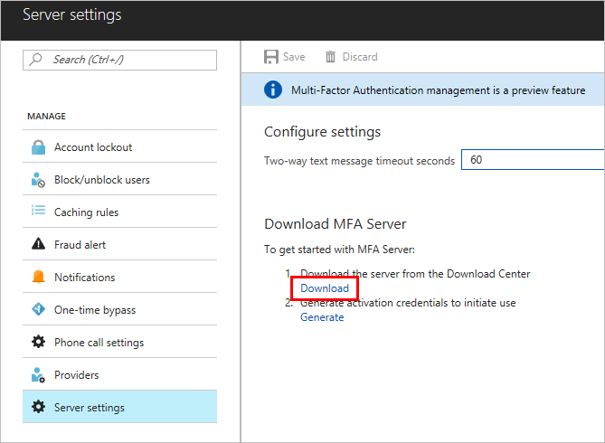
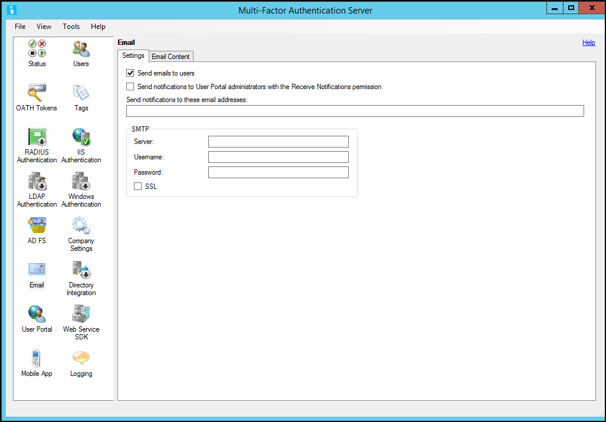
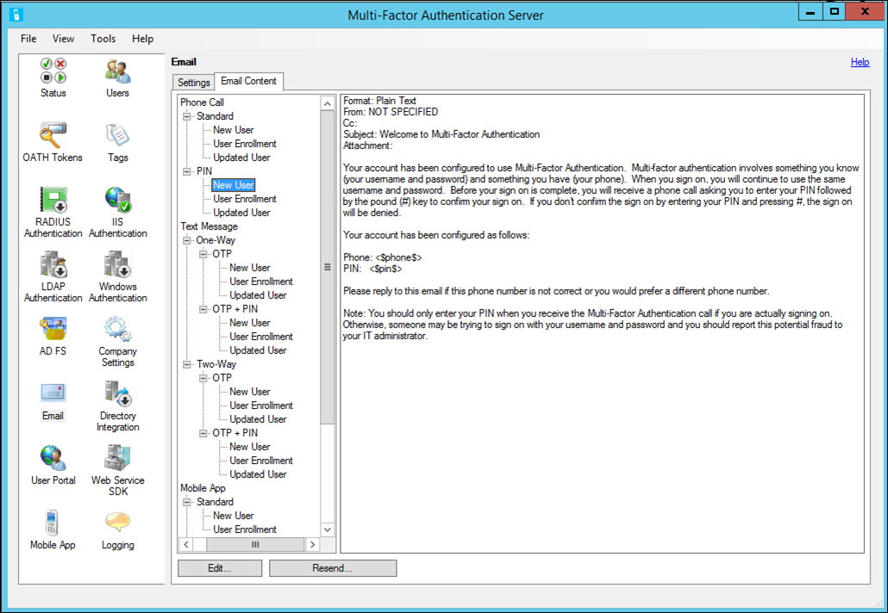
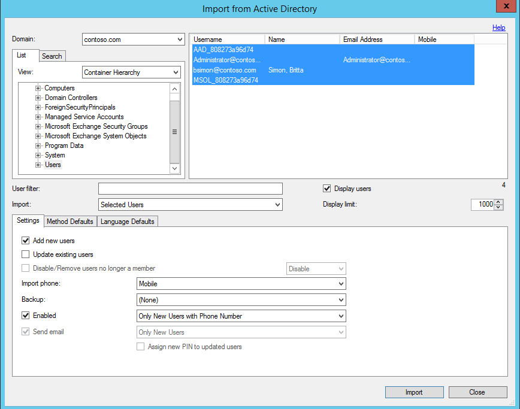

# Getting started with the Azure AD Multi-Factor Authentication Server

This page covers a new installation of the server and setting it up with on-premises Active Directory. If you already have the MFA server installed and are looking to upgrade, see [Upgrade to the latest Azure Multi-Factor Authentication Server](howto-mfaserver-deploy-upgrade.md). If you're looking for information on installing just the web service, see [Deploying the Azure Multi-Factor Authentication Server Mobile App Web Service](howto-mfaserver-deploy-mobileapp.md).

> [!IMPORTANT]
> In September 2022, Microsoft announced deprecation of Azure Multi-Factor Authentication Server. Beginning September 30, 2024, Azure Multi-Factor Authentication Server deployments will no longer service multifactor authentication (MFA) requests, which could cause authentications to fail for your organization. To ensure uninterrupted authentication services and to remain in a supported state, organizations should [migrate their users’ authentication data](how-to-migrate-mfa-server-to-mfa-user-authentication.md) to the cloud-based Azure MFA service by using the latest Migration Utility included in the most recent [Azure MFA Server update](https://www.microsoft.com/download/details.aspx?id=55849). For more information, see [Azure MFA Server Migration](how-to-migrate-mfa-server-to-azure-mfa.md).  

> To get started with cloud-based MFA, see [Tutorial: Secure user sign-in events with Azure Multi-Factor Authentication](tutorial-enable-azure-mfa.md).

## Plan your deployment

Before you download the Azure Multi-Factor Authentication Server, think about what your load and high availability requirements are. Use this information to decide how and where to deploy.

A good guideline for the amount of memory you need is the number of users you expect to authenticate regularly.

| Users | RAM |
| ----- | --- |
| 1-10,000 | 4 GB |
| 10,001-50,000 | 8 GB |
| 50,001-100,000 | 12 GB |
| 100,000-200,001 | 16 GB |
| 200,001+ | 32 GB |

Do you need to set up multiple servers for high availability or load balancing? There are many ways to set up this configuration with Azure MFA Server. When you install your first Azure MFA Server, it becomes the master. Any other servers become subordinate, and automatically synchronize users and configuration with the master. Then, you can configure one primary server and have the rest act as backup, or you can set up load balancing among all the servers.

When a master Azure MFA Server goes offline, the subordinate servers can still process two-step verification requests. However, you can't add new users and existing users can't update their settings until the master is back online or a subordinate gets promoted.

### Prepare your environment

Make sure the server that you're using for Azure Multi-Factor Authentication meets the following requirements. 

| Azure Multi-Factor Authentication Server Requirements | Description |
|:--- |:--- |
| Hardware |<li>200 MB of hard disk space</li><li>x32 or x64 capable processor</li><li>1 GB or greater RAM</li> |
| Software |<li>Windows Server 20221<li>Windows Server 20191</li><li>Windows Server 2016</li><li>Windows Server 2012 R2</li><li>Windows Server 2012</li><li>Windows Server 2008/R2 (with [ESU](/lifecycle/faq/extended-security-updates) only)</li><li>Windows 10</li><li>Windows 8.1, all editions</li><li>Windows 8, all editions</li><li>Windows 7, all editions (with [ESU](/lifecycle/faq/extended-security-updates) only)</li><li>Microsoft .NET 4.0 Framework</li><li>IIS 7.0 or greater if installing the user portal or web service SDK</li> |
| Permissions | Domain Administrator or Enterprise Administrator account to register with Active Directory |

1If Azure MFA Server fails to activate on an Azure VM that runs Windows Server 2019 or later, try using an earlier version of Windows Server.

### Azure MFA Server Components

There are three web components that make up Azure MFA Server:

* Web Service SDK - Enables communication with the other components and is installed on the Azure MFA application server
* User portal - An IIS web site that allows users to enroll in Azure Multi-Factor Authentication (MFA) and maintain their accounts.
* Mobile App Web Service - Enables using a mobile app like the Microsoft Authenticator app for two-step verification.

All three components can be installed on the same server if the server is internet-facing. If breaking up the components, the Web Service SDK is installed on the Azure MFA application server and the User portal and Mobile App Web Service are installed on an internet-facing server.

### Azure Multi-Factor Authentication Server firewall requirements

Each MFA server must be able to communicate on port 443 outbound to the following addresses:

* https://pfd.phonefactor.net
* https://pfd2.phonefactor.net
* https://css.phonefactor.net

If outbound firewalls are restricted on port 443, open the following IP address ranges:

| IP Subnet | Netmask | IP Range |
|:---: |:---: |:---: |
| 134.170.116.0/25 |255.255.255.128 |134.170.116.1 – 134.170.116.126 |
| 134.170.165.0/25 |255.255.255.128 |134.170.165.1 – 134.170.165.126 |
| 70.37.154.128/25 |255.255.255.128 |70.37.154.129 – 70.37.154.254   |
| 52.251.8.48/28   | 255.255.255.240 | 52.251.8.48 - 52.251.8.63     |
| 52.247.73.160/28 | 255.255.255.240 | 52.247.73.160 - 52.247.73.175 |
| 52.159.5.240/28  | 255.255.255.240 | 52.159.5.240 - 52.159.5.255   |
| 52.159.7.16/28   | 255.255.255.240 | 52.159.7.16 - 52.159.7.31     |
| 52.250.84.176/28 | 255.255.255.240 | 52.250.84.176 - 52.250.84.191 |
| 52.250.85.96/28  | 255.255.255.240 | 52.250.85.96 - 52.250.85.111  |

If you aren't using the Event Confirmation feature, and your users aren't using mobile apps to verify from devices on the corporate network, you only need the following ranges:

| IP Subnet | Netmask | IP Range |
|:---: |:---: |:---: |
| 134.170.116.72/29 |255.255.255.248 |134.170.116.72 – 134.170.116.79|
| 134.170.165.72/29 |255.255.255.248 |134.170.165.72 – 134.170.165.79|
| 70.37.154.200/29 |255.255.255.248  |70.37.154.201 – 70.37.154.206  |
| 52.251.8.48/28   | 255.255.255.240 | 52.251.8.48 - 52.251.8.63     |
| 52.247.73.160/28 | 255.255.255.240 | 52.247.73.160 - 52.247.73.175 |
| 52.159.5.240/28  | 255.255.255.240 | 52.159.5.240 - 52.159.5.255   |
| 52.159.7.16/28   | 255.255.255.240 | 52.159.7.16 - 52.159.7.31     |
| 52.250.84.176/28 | 255.255.255.240 | 52.250.84.176 - 52.250.84.191 |
| 52.250.85.96/28  | 255.255.255.240 | 52.250.85.96 - 52.250.85.111  |

## Download the MFA Server

[!INCLUDE [portal updates](~/articles/active-directory/includes/portal-update.md)]

Follow these steps to download the Azure AD Multi-Factor Authentication Server from the Azure portal:

> [!IMPORTANT]
> In September 2022, Microsoft announced deprecation of Azure Multi-Factor Authentication Server. Beginning September 30, 2024, Azure Multi-Factor Authentication Server deployments will no longer service multifactor authentication (MFA) requests, which could cause authentications to fail for your organization. To ensure uninterrupted authentication services and to remain in a supported state, organizations should [migrate their users’ authentication data](how-to-migrate-mfa-server-to-mfa-user-authentication.md) to the cloud-based Azure MFA service by using the latest Migration Utility included in the most recent [Azure MFA Server update](https://www.microsoft.com/download/details.aspx?id=55849). For more information, see [Azure MFA Server Migration](how-to-migrate-mfa-server-to-azure-mfa.md).
>
> To get started with cloud-based MFA, see [Tutorial: Secure user sign-in events with Azure Multi-Factor Authentication](tutorial-enable-azure-mfa.md).
>
> Existing customers that activated MFA Server before July 1, 2019 can download the latest version, future updates, and generate activation credentials as usual. The following steps only work if you were an existing MFA Server customer.

1. Sign in to the [Azure portal](https://portal.azure.com) as an administrator.
2. Search for and select *Azure Active Directory*. Select **Security** > **MFA**.
3. Under **Manager MFA Server**, select **Server settings**.
4. Select **Download** and follow the instructions on the download page to save the installer. 

   

5. Keep this page open as we will refer to it after running the installer.

## Install and configure the MFA Server

Now that you have downloaded the server you can install and configure it. Be sure that the server you are installing it on meets requirements listed in the planning section.

1. Double-click the executable.
2. On the Select Installation Folder screen, make sure that the folder is correct and click **Next**.
   The following libraries are installed:
    * [Visual C++ Redistributable for Visual Studio 2017 (x64)](https://go.microsoft.com/fwlink/?LinkId=746572)
    * [Visual C++ Redistributable for Visual Studio 2017 (x86)](https://go.microsoft.com/fwlink/?LinkId=746571)
3. When the installation finishes, select **Finish**. The configuration wizard starts.
5. Back on the page that you downloaded the server from, click the **Generate Activation Credentials** button. Copy this information into the Azure MFA Server in the boxes provided and click **Activate**.

> [!NOTE]
> Only global administrators are able to generate activation credentials in the Azure portal.

## Send users an email

To ease rollout, allow MFA Server to communicate with your users. MFA Server can send an email to inform them that they have been enrolled for two-step verification.

The email you send should be determined by how you configure your users for two-step verification. For example, if you are able to import phone numbers from the company directory, the email should include the default phone numbers so that users know what to expect. If you do not import phone numbers, or your users are going to use the mobile app, send them an email that directs them to complete their account enrollment. Include a hyperlink to the Azure Multi-Factor Authentication User portal in the email.

The content of the email also varies depending on the method of verification that has been set for the user (phone call, SMS, or mobile app). For example, if the user is required to use a PIN when they authenticate, the email tells them what their initial PIN has been set to. Users are required to change their PIN during their first verification.

### Configure email and email templates

Click the email icon on the left to set up the settings for sending these emails. This page is where you can enter the SMTP information of your mail server and send email by checking the **Send emails to users** check box.

On the Email Content tab, you can see the email templates that are available to choose from. Depending on how you have configured your users to perform two-step verification, choose the template that best suits you.

## Import users from Active Directory

Now that the server is installed you want to add users. You can choose to create them manually, import users from Active Directory, or configure automated synchronization with Active Directory.

### Manual import from Active Directory

1. In the Azure MFA Server, on the left, select **Users**.
2. At the bottom, select **Import from Active Directory**.
3. Now you can either search for individual users or search the AD directory for OUs with users in them. In this case, we specify the users OU.
4. Highlight all the users on the right and click **Import**. You should receive a pop-up telling you that you were successful. Close the import window.

   

### Automated synchronization with Active Directory

1. In the Azure MFA Server, on the left, select **Directory Integration**.
2. Navigate to the **Synchronization** tab.
3. At the bottom, choose **Add**
4. In the **Add Synchronization Item** box that appears choose the Domain, OU **or** security group, Settings, Method Defaults, and Language Defaults for this synchronization task and click **Add**.
5. Check the box labeled **Enable synchronization with Active Directory** and choose a **Synchronization interval** between one minute and 24 hours.

## How the Azure AD Multi-Factor Authentication Server handles user data

When you use the Multi-Factor Authentication (MFA) Server on-premises, a user's data is stored in the on-premises servers. No persistent user data is stored in the cloud. When the user performs a two-step verification, the MFA Server sends data to the Azure MFA cloud service to perform the verification. When these authentication requests are sent to the cloud service, the following fields are sent in the request and logs so that they are available in the customer's authentication/usage reports. Some of the fields are optional so they can be enabled or disabled within the Multi-Factor Authentication Server. The communication from the MFA Server to the MFA cloud service uses SSL/TLS over port 443 outbound. These fields are:

* Unique ID - either username or internal MFA server ID
* First and last name (optional)
* Email address (optional)
* Phone number - when doing a voice call or SMS authentication
* Device token - when doing mobile app authentication
* Authentication mode
* Authentication result
* MFA Server name
* MFA Server IP
* Client IP – if available

In addition to the fields above, the verification result (success/denial) and reason for any denials is also stored with the authentication data and available through the authentication/usage reports.

> [!IMPORTANT]
> Starting in March of 2019 the phone call options will not be available to MFA Server users in free/trial Azure AD tenants. SMS messages are not impacted by this change. Phone call will continue to be available to users in paid Azure AD tenants. This change only impacts free/trial Azure AD tenants.

## Back up and restore Azure MFA Server

Making sure that you have a good backup is an important step to take with any system.

To back up Azure MFA Server, ensure that you have a copy of the **C:\Program Files\Multi-Factor Authentication Server\Data** folder including the **PhoneFactor.pfdata** file. 

In case a restore is needed complete the following steps:

1. Reinstall Azure MFA Server on a new server.
2. Activate the new Azure MFA Server.
3. Stop the **MultiFactorAuth** service.
4. Overwrite the **PhoneFactor.pfdata** with the backed-up copy.
5. Start the **MultiFactorAuth** service.

The new server is now up and running with the original backed-up configuration and user data.

## Managing the TLS/SSL Protocols and Cipher Suites

Once you have upgraded to or installed MFA Server version 8.x or higher, it is recommended that older and weaker cipher suites be disabled or removed unless required by your organization. Information on how to complete this task can be found in the article [Managing SSL/TLS Protocols and Cipher Suites for AD FS](/windows-server/identity/ad-fs/operations/manage-ssl-protocols-in-ad-fs)

## Next steps

- Set up and configure the [User portal](howto-mfaserver-deploy-userportal.md) for user self-service.
- Set up and configure the Azure MFA Server with [Active Directory Federation Service](multi-factor-authentication-get-started-adfs.md), [RADIUS Authentication](howto-mfaserver-dir-radius.md), or [LDAP Authentication](howto-mfaserver-dir-ldap.md).
- Set up and configure [Remote Desktop Gateway and Azure Multi-Factor Authentication Server using RADIUS](howto-mfaserver-nps-rdg.md).
- [Deploy the Azure Multi-Factor Authentication Server Mobile App Web Service](howto-mfaserver-deploy-mobileapp.md).
- [Advanced scenarios with Azure Multi-Factor Authentication and third-party VPNs](howto-mfaserver-nps-vpn.md).
