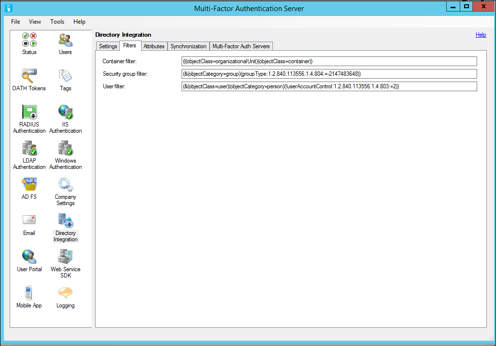
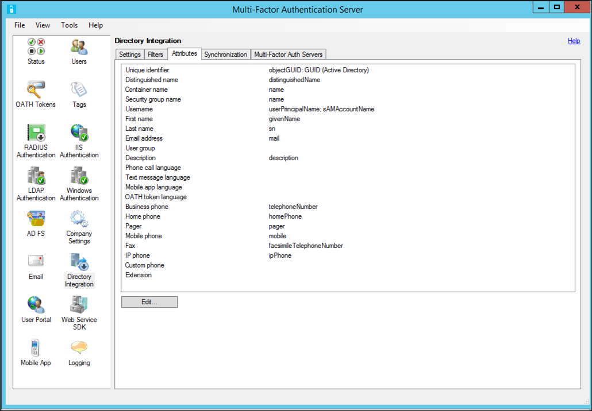
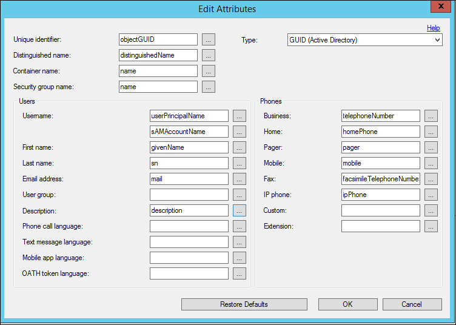
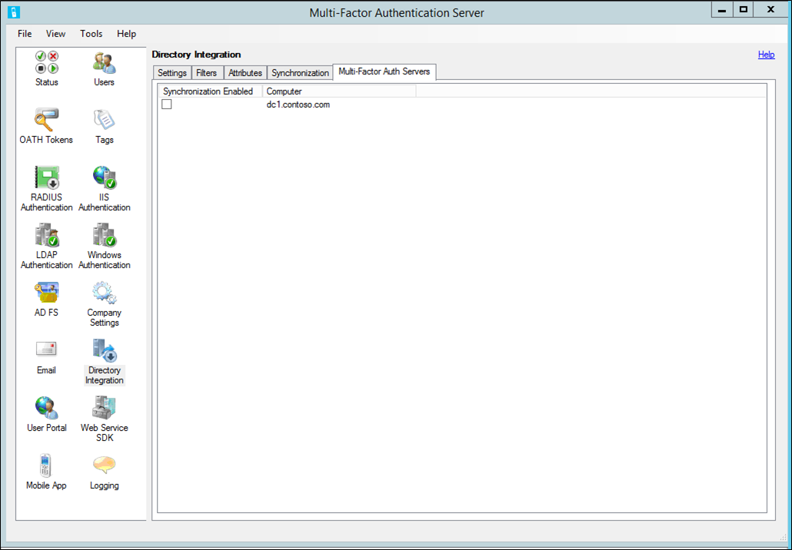

# Directory integration between Azure MFA Server and Active Directory

Use the Directory Integration section of the Azure MFA Server to integrate with Active Directory or another LDAP directory. You can configure attributes to match the directory schema and set up automatic user synchronization.

> [!IMPORTANT]
> In September 2022, Microsoft announced deprecation of Azure Multi-Factor Authentication Server. Beginning September 30, 2024, Azure Multi-Factor Authentication Server deployments will no longer service multifactor authentication (MFA) requests, which could cause authentications to fail for your organization. To ensure uninterrupted authentication services and to remain in a supported state, organizations should [migrate their users’ authentication data](how-to-migrate-mfa-server-to-mfa-user-authentication.md) to the cloud-based Azure MFA service by using the latest Migration Utility included in the most recent [Azure MFA Server update](https://www.microsoft.com/download/details.aspx?id=55849). For more information, see [Azure MFA Server Migration](how-to-migrate-mfa-server-to-azure-mfa.md).
>
> To get started with cloud-based MFA, see [Tutorial: Secure user sign-in events with Azure Multi-Factor Authentication](tutorial-enable-azure-mfa.md).
>

## Settings

By default, the Azure Multi-Factor Authentication (MFA) Server is configured to import or synchronize users from Active Directory.  The Directory Integration tab allows you to override the default behavior and to bind to a different LDAP directory, an ADAM directory, or specific Active Directory domain controller.  It also provides for the use of LDAP Authentication to proxy LDAP or for LDAP Bind as a RADIUS target, pre-authentication for IIS Authentication, or primary authentication for User Portal.  The following table describes the individual settings.

> [!NOTE]
> Directory integration is not guaranteed to work with directories other than Active Directory Domain Services.

| Feature | Description |
| --- | --- |
| Use Active Directory |Select the Use Active Directory option to use Active Directory for importing and synchronization.  This is the default setting.  Note: For Active Directory integration to work properly,join the computer to a domain and sign in with a domain account. |
| Include trusted domains |Check **Include Trusted Domains** to have the agent attempt to connect to domains trusted by the current domain, another domain in the forest, or domains involved in a forest trust.  When not importing or synchronizing users from any of the trusted domains, uncheck the checkbox to improve performance.  The default is checked. |
| Use specific LDAP configuration |Select the Use LDAP option to use the LDAP settings specified for importing and synchronization. Note: When Use LDAP is selected, the user interface changes references from Active Directory to LDAP. |
| Edit button |The Edit button allows the current LDAP configuration settings to modified. |
| Use attribute scope queries |Indicates whether attribute scope queries should be used.  Attribute scope queries allow for efficient directory searches qualifying records based on the entries in another record's attribute.  The Azure Multi-Factor Authentication Server uses attribute scope queries to efficiently query the users that are a member of a security group.    Note:  There are some cases where attribute scope queries are supported, but shouldn't be used.  For example, Active Directory can have issues with attribute scope queries when a security group contains members from more than one domain. In this case, unselect the checkbox. |

The following table describes the LDAP configuration settings.

| Feature | Description |
| --- | --- |
| Server |Enter the hostname or IP address of the server running the LDAP directory.  A backup server may also be specified separated by a semi-colon.  Note: When Bind Type is SSL (TLS), a fully qualified hostname is required. |
| Base DN |Enter the distinguished name of the base directory object from which all directory queries start.  For example, dc=abc,dc=com. |
| Bind type - Queries |Select the appropriate bind type for use when binding to search the LDAP directory.  This is used for imports, synchronization, and username resolution.     Anonymous - An anonymous bind is performed.  Bind DN and Bind Password are not used.  This only works if the LDAP directory allows anonymous binding and permissions allow the querying of the appropriate records and attributes.     Simple - Bind DN and Bind Password are passed as plain text to bind to the LDAP directory.  This is for testing purposes, to verify that the server can be reached and that the bind account has the appropriate access. After the appropriate cert has been installed, use SSL instead.     SSL - Bind DN and Bind Password are encrypted using SSL to bind to the LDAP directory.  Install a cert locally that the LDAP directory trusts.     Windows - Bind Username and Bind Password are used to securely connect to an Active Directory domain controller or ADAM directory.  If Bind Username is left blank, the logged-on user's account is used to bind. |
| Bind type - Authentications |Select the appropriate bind type for use when performing LDAP bind authentication.  See the bind type descriptions under Bind type - Queries.  For example, this allows for Anonymous bind to be used for queries while SSL bind is used to secure LDAP bind authentications. |
| Bind DN or Bind username |Enter the distinguished name of the user record for the account to use when binding to the LDAP directory.  The bind distinguished name is only used when Bind Type is Simple or SSL.    Enter the username of the Windows account to use when binding to the LDAP directory when Bind Type is Windows.  If left blank, the logged-on user's account is used to bind. |
| Bind Password |Enter the bind password for the Bind DN or username being used to bind to the LDAP directory.  To configure the password for the Multi-Factor Auth Server AdSync Service, enable synchronization and ensure that the service is running on the local machine.  The password is saved in the Windows Stored Usernames and Passwords under the account the Multi-Factor Auth Server AdSync Service is running as.  The password is also saved under the account the Multi-Factor Auth Server user interface is running as and under the account the Multi-Factor Auth Server Service is running as.    Since the password is only stored in the local server's Windows Stored Usernames and Passwords, repeat this step on each Multi-Factor Auth Server that needs access to the password. |
| Query size limit |Specify the size limit for the maximum number of users that a directory search returns.  This limit should match the configuration on the LDAP directory.  For large searches where paging is not supported, import and synchronization attempts to retrieve users in batches.  If the size limit specified here is larger than the limit configured on the LDAP directory, some users may be missed. |
| Test button |Click **Test** to test binding to the LDAP server.    You don't need to select the **Use LDAP** option to test binding. This allows the binding to be tested before you use the LDAP configuration. |

## Filters

Filters allow you to set criteria to qualify records when performing a directory search.  By setting the filter, you can scope the objects you want to synchronize.  

Azure Multi-Factor Authentication has the following three filter options:

* **Container filter** - Specify the filter criteria used to qualify container records when performing a directory search.  For Active Directory and ADAM, (|(objectClass=organizationalUnit)(objectClass=container)) is commonly used.  For other LDAP directories, use filter criteria that qualifies each type of container object, depending on the directory schema.   Note:  If left blank, ((objectClass=organizationalUnit)(objectClass=container)) is used by default.
* **Security group filter** - Specify the filter criteria used to qualify security group records when performing a directory search.  For Active Directory and ADAM, (&(objectCategory=group)(groupType:1.2.840.113556.1.4.804:=-2147483648)) is commonly used.  For other LDAP directories, use filter criteria that qualifies each type of security group object, depending on the directory schema.   Note:  If left blank, (&(objectCategory=group)(groupType:1.2.840.113556.1.4.804:=-2147483648)) is used by default.
* **User filter** - Specify the filter criteria used to qualify user records when performing a directory search.  For Active Directory and ADAM, (&(objectClass=user)(objectCategory=person)) is commonly used.  For other LDAP directories, use (objectClass=inetOrgPerson) or something similar, depending on the directory schema.  Note:  If left blank, (&(objectCategory=person)(objectClass=user)) is used by default.

## Attributes

You can customize attributes as necessary for a specific directory.  This allows you to add custom attributes and fine-tune the synchronization to only the attributes that you need. Use the name of the attribute as defined in the directory schema for the value of each attribute field. The following table provides additional information about each feature.

Attributes may be entered manually and are not required to match an attribute in the attribute list.

| Feature | Description |
| --- | --- |
| Unique identifier |Enter the attribute name of the attribute that serves as the unique identifier of container, security group, and user records.  In Active Directory, this is usually objectGUID. Other LDAP implementations may use entryUUID or something similar.  The default is objectGUID. |
| Unique identifier type |Select the type of the unique identifier attribute.  In Active Directory, the objectGUID attribute is of type GUID. Other LDAP implementations may use type ASCII Byte Array or String.  The default is GUID.   It is important to set this type correctly since Synchronization Items are referenced by their Unique Identifier. The Unique Identifier Type is used to directly find the object in the directory.  Setting this type to String when the directory actually stores the value as a byte array of ASCII characters prevents synchronization from functioning properly. |
| Distinguished name |Enter the attribute name of the attribute that contains the distinguished name for each record.  In Active Directory, this is usually distinguishedName. Other LDAP implementations may use entryDN or something similar.  The default is distinguishedName.   If an attribute containing just the distinguished name doesn't exist, the ads path attribute may be used.  The "LDAP://\<server\>/" portion of the path is automatically stripped off, leaving just the distinguished name of the object. |
| Container name |Enter the attribute name of the attribute that contains the name in a container record.  The value of this attribute is displayed in the Container Hierarchy when importing from Active Directory or adding synchronization items.  The default is name.   If different containers use different attributes for their names, use semi-colons to separate multiple container name attributes.  The first container name attribute found on a container object is used to display its name. |
| Security group name |Enter the attribute name of the attribute that contains the name in a security group record.  The value of this attribute is displayed in the Security Group list when importing from Active Directory or adding synchronization items.  The default is name. |
| Username |Enter the attribute name of the attribute that contains the username in a user record.  The value of this attribute is used as the Multi-Factor Auth Server username.  A second attribute may be specified as a backup to the first.  The second attribute is only used if the first attribute does not contain a value for the user.  The defaults are userPrincipalName and sAMAccountName. |
| First name |Enter the attribute name of the attribute that contains the first name in a user record.  The default is givenName. |
| Last name |Enter the attribute name of the attribute that contains the last name in a user record.  The default is sn. |
| Email address |Enter the attribute name of the attribute that contains the email address in a user record.  Email address is used to send welcome and update emails to the user.  The default is mail. |
| User group |Enter the attribute name of the attribute that contains the user group in a user record.  User group can be used to filter users in the agent and on reports in the Multi-Factor Auth Server Management Portal. |
| Description |Enter the attribute name of the attribute that contains the description in a user record.  Description is only used for searching.  The default is description. |
| Phone call language |Enter the attribute name of the attribute that contains the short name of the language to use for voice calls for the user. |
| Text message language |Enter the attribute name of the attribute that contains the short name of the language to use for SMS text messages for the user. |
| Mobile app language |Enter the attribute name of the attribute that contains the short name of the language to use for phone app text messages for the user. |
| OATH token language |Enter the attribute name of the attribute that contains the short name of the language to use for OATH token text messages for the user. |
| Business phone |Enter the attribute name of the attribute that contains the business phone number in a user record.  The default is telephoneNumber. |
| Home phone |Enter the attribute name of the attribute that contains the home phone number in a user record.  The default is homePhone. |
| Pager |Enter the attribute name of the attribute that contains the pager number in a user record.  The default is pager. |
| Mobile phone |Enter the attribute name of the attribute that contains the mobile phone number in a user record.  The default is mobile. |
| Fax |Enter the attribute name of the attribute that contains the fax number in a user record.  The default is facsimileTelephoneNumber. |
| IP phone |Enter the attribute name of the attribute that contains the IP phone number in a user record.  The default is ipPhone. |
| Custom |Enter the attribute name of the attribute that contains a custom phone number in a user record.  The default is blank. |
| Extension |Enter the attribute name of the attribute that contains the phone number extension in a user record.  The value of the extension field is used as the extension to the primary phone number only.  The default is blank.   If the Extension attribute is not specified, extensions can be included as part of the phone attribute. In this case, precede the extension with an 'x' so that it gets parsed correctly.  For example, 555-123-4567 x890 would result in 555-123-4567 as the phone number and 890 as the extension. |
| Restore Defaults button |Click **Restore Defaults** to return all attributes back to their default value.  The defaults should work properly with the normal Active Directory or ADAM schema. |

To edit attributes, click **Edit** on the Attributes tab.  This brings up a window where you can edit the attributes. Select the **...** next to any attribute to open a window where you can choose which attributes to display.

## Synchronization

Synchronization keeps the Azure MFA user database synchronized with the users in Active Directory or another Lightweight Directory Access Protocol (LDAP) directory. The process is similar to importing users manually from Active Directory, but periodically polls for Active Directory user and security group changes to process.  It also disables or removes users that were removed from a container, security group, or Active Directory.

The Multi-Factor Auth ADSync service is a Windows service that performs the periodic polling of Active Directory.  This is not to be confused with Azure AD Sync or Microsoft Entra Connect.  the Multi-Factor Auth ADSync, although built on a similar code base, is specific to the Azure Multi-Factor Authentication Server.  It is installed in a Stopped state and is started by the Multi-Factor Auth Server service when configured to run.  If you have a multi-server Multi-Factor Auth Server configuration, the Multi-Factor Auth ADSync may only be run on a single server.

The Multi-Factor Auth ADSync service uses the DirSync LDAP server extension provided by Microsoft to efficiently poll for changes.  This DirSync control caller must have the "directory get changes" right and DS-Replication-Get-Changes extended control access right.  By default, these rights are assigned to the Administrator and LocalSystem accounts on domain controllers.  The Multi-Factor Auth AdSync service is configured to run as LocalSystem by default.  Therefore it is simplest to run the service on a domain controller.  If you configure the service to always perform a full synchronization, it can run as an account with lesser permissions.  This is less efficient, but requires fewer account privileges.

If the LDAP directory supports and is configured for DirSync, then polling for user and security group changes will work the same as it does with Active Directory.  If the LDAP directory does not support the DirSync control, then a full synchronization is performed during each cycle.

The following table contains additional information on each of the Synchronization tab settings.

| Feature | Description |
| --- | --- |
| Enable synchronization with Active Directory |When checked, the Multi-Factor Auth Server service periodically polls Active Directory for changes.   Note: At least one Synchronization Item must be added and a Synchronize Now must be performed before the Multi-Factor Auth Server service will start processing changes. |
| Synchronize every |Specify the time interval the Multi-Factor Auth Server service will wait between polling and processing changes.    Note: The interval specified is the time between the beginning of each cycle.  If the time processing changes exceed the interval, the service will poll again immediately. |
| Remove users no longer in Active Directory |When checked, the Multi-Factor Auth Server service will process Active Directory deleted user tombstones and remove the related Multi-Factor Auth Server user. |
| Always perform a full synchronization |When checked, the Multi-Factor Auth Server service will always perform a full synchronization.  When unchecked, the Multi-Factor Auth Server service will perform an incremental synchronization by only querying users that have changed.  The default is unchecked.   When unchecked, Azure MFA Server performs incremental synchronization only when the directory supports the DirSync control and the account binding to the directory has permissions to perform DirSync incremental queries.  If the account does not have the appropriate permissions or multiple domains are involved in the synchronization, Azure MFA Server performs a full synchronization. |
| Require administrator approval when more than X users will be disabled or removed |Synchronization items can be configured to disable or remove users who are no longer a member of the item's container or security group.  As a safeguard, administrator approval can be required when the number of users to disable or remove exceeds a threshold.  When checked, approval is required for specified threshold.  The default is 5 and the range is 1 to 999.    Approval is facilitated by first sending an email notification to administrators. The email notification gives instructions for reviewing and approving the disabling and removal of users.  When the Multi-Factor Auth Server user interface is launched, it will prompt for approval. |

The **Synchronize Now** button allows you to run a full synchronization for the synchronization items specified.  A full synchronization is required whenever synchronization items are added, modified, removed, or reordered.  It is also required before the Multi-Factor Auth AdSync service is operational since it sets the starting point from which the service will poll for incremental changes.  If changes have been made to synchronization items but a full synchronization hasn't been performed, you will be prompted to Synchronize Now.

The **Remove** button allows the administrator to delete one or more synchronization items from the Multi-Factor Auth Server synchronization item list.

> [!WARNING]
> Once a synchronization item record has been removed, it cannot be recovered. You will need to add the synchronization item record again if you deleted it by mistake.

The synchronization item or synchronization items have been removed from Multi-Factor Auth Server.  The Multi-Factor Auth Server service will no longer process the synchronization items.

The Move Up and Move Down buttons allow the administrator to change the order of the synchronization items.  The order is important since the same user may be a member of more than one synchronization item (e.g. a container and a security group).  The settings applied to the user during synchronization will come from the first synchronization item in the list to which the user is associated.  Therefore, the synchronization items should be put in priority order.

> [!TIP]
> A full synchronization should be performed after removing synchronization items.  A full synchronization should be performed after ordering synchronization items.  Click **Synchronize Now** to perform a full synchronization.

## Multi-Factor Authentication servers

Additional Multi-Factor Authentication servers may be set up to serve as a backup RADIUS proxy, LDAP proxy, or for IIS Authentication. The Synchronization configuration is shared among all the agents. However, only one of these agents may have the Multi-Factor Authentication server service running. This tab allows you to select the Multi-Factor Authentication server that should be enabled for synchronization.

