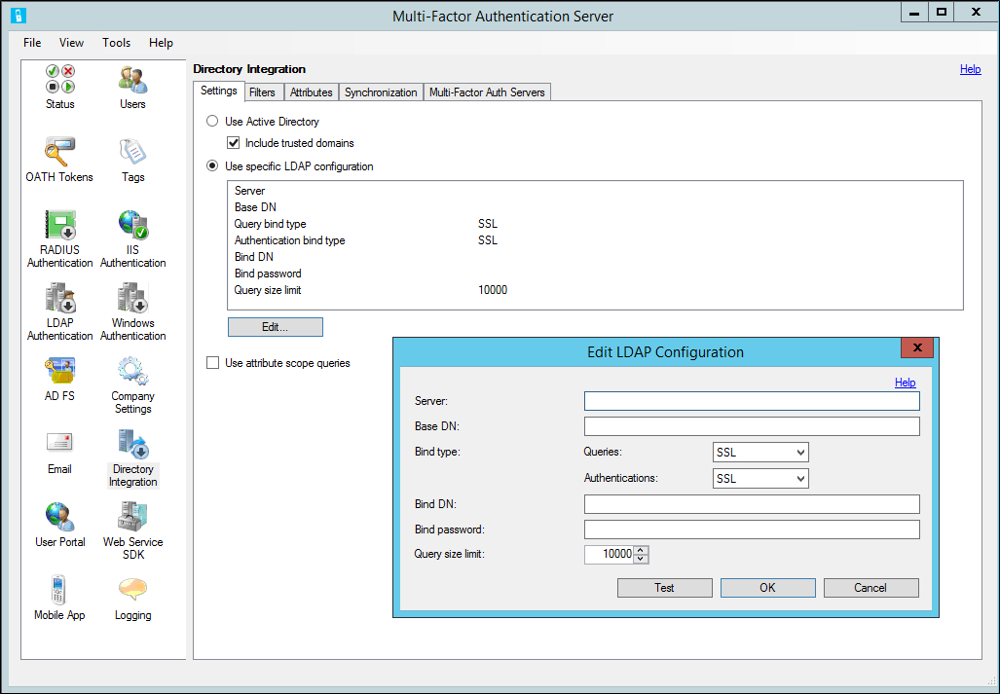

# LDAP authentication and Azure Multi-Factor Authentication Server

By default, the Azure Multi-Factor Authentication Server is configured to import or synchronize users from Active Directory. However, it can be configured to bind to different LDAP directories, such as an ADAM directory, or specific Active Directory domain controller. When connected to a directory via LDAP, the Azure Multi-Factor Authentication Server can act as an LDAP proxy to perform authentications. Azure Multi-Factor Authentication Server can also use LDAP bind as a RADIUS target to pre-authenticate IIS users, or for primary authentication in the Azure Multi-Factor Authentication user portal.

To use Azure Multi-Factor Authentication as an LDAP proxy, insert the Azure Multi-Factor Authentication Server between the LDAP client (for example, VPN appliance, application) and the LDAP directory server. The Azure Multi-Factor Authentication Server must be configured to communicate with both the client servers and the LDAP directory. In this configuration, the Azure Multi-Factor Authentication Server accepts LDAP requests from client servers and applications and forwards them to the target LDAP directory server to validate the primary credentials. If the LDAP directory validates the primary credentials, Azure Multi-Factor Authentication performs a second identity verification and sends a response back to the LDAP client. The entire authentication succeeds only if both the LDAP server authentication and the second-step verification succeed.

> [!IMPORTANT]
> In September 2022, Microsoft announced deprecation of Azure Multi-Factor Authentication Server. Beginning September 30, 2024, Azure Multi-Factor Authentication Server deployments will no longer service multifactor authentication (MFA) requests, which could cause authentications to fail for your organization. To ensure uninterrupted authentication services and to remain in a supported state, organizations should [migrate their users’ authentication data](how-to-migrate-mfa-server-to-mfa-user-authentication.md) to the cloud-based Azure Multi-Factor Authentication service by using the latest Migration Utility included in the most recent [Azure Multi-Factor Authentication Server update](https://www.microsoft.com/download/details.aspx?id=55849). For more information, see [Azure Multi-Factor Authentication Server Migration](how-to-migrate-mfa-server-to-azure-mfa.md).
>
> To get started with cloud-based MFA, see [Tutorial: Secure user sign-in events with Azure Multi-Factor Authentication](tutorial-enable-azure-mfa.md).

## Configure LDAP authentication

To configure LDAP authentication, install the Azure Multi-Factor Authentication Server on a Windows server. Use the following procedure:

### Add an LDAP client

1. In the Azure Multi-Factor Authentication Server, select the LDAP Authentication icon in the left menu.
2. Check the **Enable LDAP Authentication** checkbox.

   

3. On the Clients tab, change the TCP port and SSL (TLS) port if the Azure Multi-Factor Authentication LDAP service should bind to non-standard ports to listen for LDAP requests.
4. If you plan to use LDAPS from the client to the Azure Multi-Factor Authentication Server, an TLS/SSL certificate must be installed on the same server as MFA Server. Click **Browse** next to the SSL (TLS) certificate box, and select a certificate to use for the secure connection.
5. Click **Add**.
6. In the Add LDAP Client dialog box, enter the IP address of the appliance, server, or application that authenticates to the Server and an Application name (optional). The Application name appears in Azure Multi-Factor Authentication reports and may be displayed within SMS or Mobile App authentication messages.
7. Check the **Require Azure Multi-Factor Authentication user match** box if all users have been or will be imported into the Server and subject to two-step verification. If a significant number of users haven't yet been imported into the Server and/or are exempt from two-step verification, leave the box unchecked. See the MFA Server help file for additional information on this feature.

Repeat these steps to add more LDAP clients.

### Configure the LDAP directory connection

When the Azure Multi-Factor Authentication is configured to receive LDAP authentications, it must proxy those authentications to the LDAP directory. Therefore, the Target tab only displays a single, grayed out option to use an LDAP target.

> [!NOTE]
> Directory integration is not guaranteed to work with directories other than Active Directory Domain Services.

1. To configure the LDAP directory connection, click the **Directory Integration** icon.
2. On the Settings tab, select the **Use specific LDAP configuration** radio button.
3. Select **Edit…**
4. In the Edit LDAP Configuration dialog box, populate the fields with the information required to connect to the LDAP directory. Descriptions of the fields are included in the Azure Multi-Factor Authentication Server help file.

    

5. Test the LDAP connection by clicking the **Test** button.
6. If the LDAP connection test was successful, click the **OK** button.
7. Click the **Filters** tab. The Server is pre-configured to load containers, security groups, and users from Active Directory. If binding to a different LDAP directory, you probably need to edit the filters displayed. Click the **Help** link for more information on filters.
8. Click the **Attributes** tab. The Server is pre-configured to map attributes from Active Directory.
9. If you're binding to a different LDAP directory or to change the pre-configured attribute mappings, click **Edit…**
10. In the Edit Attributes dialog box, modify the LDAP attribute mappings for your directory. Attribute names can be typed in or selected by clicking the **…** button next to each field. Click the **Help** link for more information on attributes.
11. Click the **OK** button.
12. Click the **Company Settings** icon and select the **Username Resolution** tab.
13. If you're connecting to Active Directory from a domain-joined server, leave the **Use Windows security identifiers (SIDs) for matching usernames** radio button selected. Otherwise, select the **Use LDAP unique identifier attribute for matching usernames** radio button.

When the **Use LDAP unique identifier attribute for matching usernames** radio button is selected, the Azure Multi-Factor Authentication Server attempts to resolve each username to a unique identifier in the LDAP directory. An LDAP search is performed on the Username attributes defined in the Directory Integration > Attributes tab. When a user authenticates, the username is resolved to the unique identifier in the LDAP directory. The unique identifier is used for matching the user in the Azure Multi-Factor Authentication data file. This allows for case-insensitive comparisons, and long and short username formats.

After you complete these steps, the MFA Server listens on the configured ports for LDAP access requests from the configured clients, and acts as a proxy for those requests to the LDAP directory for authentication.

## Configure LDAP client

To configure the LDAP client, use the guidelines:

* Configure your appliance, server, or application to authenticate via LDAP to the Azure Multi-Factor Authentication Server as though it were your LDAP directory. Use the same settings that you normally use to connect directly to your LDAP directory, but use the Azure Multi-Factor Authentication Server for the server name or IP address.
* Configure the LDAP timeout to 30-60 seconds to provide enough time to validate the user's credentials with the LDAP directory, perform the second-step verification, receive their response, and respond to the LDAP access request.
* If using LDAPS, the appliance or server making the LDAP queries must trust the TLS/SSL certificate installed on the Azure Multi-Factor Authentication Server.
