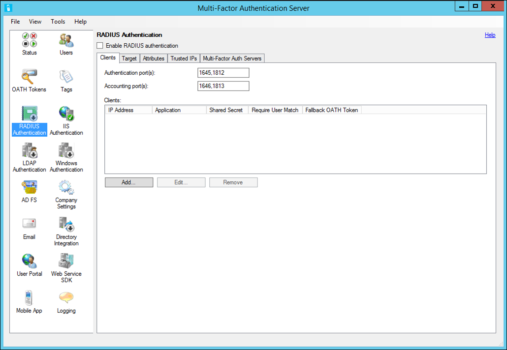

# Integrate RADIUS authentication with Azure Multi-Factor Authentication Server

RADIUS is a standard protocol to accept authentication requests and to process those requests. The Azure Multi-Factor Authentication Server can act as a RADIUS server. Insert it between your RADIUS client (VPN appliance) and your authentication target to add two-step verification. Your authentication target could be Active Directory, an LDAP directory, or another RADIUS server. For Azure multifactor authentication to function, you must configure the Azure MFA Server so that it can communicate with both the client servers and the authentication target. The Azure MFA Server accepts requests from a RADIUS client, validates credentials against the authentication target, adds Azure multifactor authentication, and sends a response back to the RADIUS client. The authentication request only succeeds if both the primary authentication and the Azure multifactor authentication succeed.

> [!IMPORTANT]
> In September 2022, Microsoft announced deprecation of Azure Multi-Factor Authentication Server. Beginning September 30, 2024, Azure Multi-Factor Authentication Server deployments will no longer service multifactor authentication requests, which could cause authentications to fail for your organization. To ensure uninterrupted authentication services and to remain in a supported state, organizations should [migrate their users’ authentication data](how-to-migrate-mfa-server-to-mfa-user-authentication.md) to the cloud-based Azure MFA service by using the latest Migration Utility included in the most recent [Azure MFA Server update](https://www.microsoft.com/download/details.aspx?id=55849). For more information, see [Azure MFA Server Migration](how-to-migrate-mfa-server-to-azure-mfa.md).
>
> To get started with cloud-based MFA, see [Tutorial: Secure user sign-in events with Microsoft Entra multifactor authentication](tutorial-enable-azure-mfa.md).
>
> If you use cloud-based MFA, see [Integrate your existing NPS infrastructure with Azure multifactor authentication](howto-mfa-nps-extension.md).

> [!NOTE]
> The MFA Server only supports PAP (password authentication protocol) and MSCHAPv2 (Microsoft's Challenge-Handshake Authentication Protocol) RADIUS protocols when acting as a RADIUS server.  Other protocols, like EAP (extensible authentication protocol), can be used when the MFA server acts as a RADIUS proxy to another RADIUS server that supports that protocol.
>
> In this configuration, one-way SMS and OATH tokens don't work since the MFA Server can't initiate a successful RADIUS Challenge response using alternative protocols.

## Add a RADIUS client

To configure RADIUS authentication, install the Azure Multi-Factor Authentication Server on a Windows server. If you have an Active Directory environment, the server should be joined to the domain inside the network. Use the following procedure to configure the Azure Multi-Factor Authentication Server:

1. In the Azure Multi-Factor Authentication Server, click the RADIUS Authentication icon in the left menu.
2. Check the **Enable RADIUS authentication** checkbox.
3. On the Clients tab, change the Authentication and Accounting ports if the Azure MFA RADIUS service needs to listen for RADIUS requests on non-standard ports.
4. Click **Add**.
5. Enter the IP address of the appliance/server that will authenticate to the Azure Multi-Factor Authentication Server, an application name (optional), and a shared secret.

   The application name appears in reports and may be displayed within SMS or mobile app authentication messages.

   The shared secret needs to be the same on both the Azure Multi-Factor Authentication Server and appliance/server.

6. Check the **Require multifactor authentication user match** box if all users have been imported into the Server and subject to multifactor authentication. If a significant number of users have not yet been imported into the Server or are exempt from two-step verification, leave the box unchecked.
7. Check the **Enable fallback OATH token** box if you want to use OATH passcodes from mobile verification apps as a backup method.
8. Click **OK**.

Repeat steps 4 through 8 to add as many additional RADIUS clients as you need.

## Configure your RADIUS client

1. Click the **Target** tab.
   * If the Azure MFA Server is installed on a domain-joined server in an Active Directory environment, select **Windows domain**.
   * If users should be authenticated against an LDAP directory, select **LDAP bind**.
      Select the Directory Integration icon and edit the LDAP configuration on the Settings tab so that the Server can bind to your directory. Instructions for configuring LDAP can be found in the [LDAP Proxy configuration guide](howto-mfaserver-dir-ldap.md).
   * If users should be authenticated against another RADIUS server, select **RADIUS server(s)**.
1. Click **Add** to configure the server to which the Azure MFA Server will proxy the RADIUS requests.
1. In the Add RADIUS Server dialog box, enter the IP address of the RADIUS server and a shared secret.

   The shared secret needs to be the same on both the Azure Multi-Factor Authentication Server and RADIUS server. Change the Authentication port and Accounting port if different ports are used by the RADIUS server.

1. Click **OK**.
1. Add the Azure MFA Server as a RADIUS client in the other RADIUS server so that it can process access requests sent to it from the Azure MFA Server. Use the same shared secret configured in the Azure Multi-Factor Authentication Server.

Repeat these steps to add more RADIUS servers. Configure the order in which the Azure MFA Server should call them with the **Move Up** and **Move Down** buttons.

You've successfully configured the Azure Multi-Factor Authentication Server. The Server is now listening on the configured ports for RADIUS access requests from the configured clients.

## RADIUS Client configuration

To configure the RADIUS client, use the guidelines:

* Configure your appliance/server to authenticate via RADIUS to the Azure Multi-Factor Authentication Server's IP address, which acts as the RADIUS server.
* Use the same shared secret that was configured earlier.
* Configure the RADIUS timeout to 60 seconds so that there is time to validate the user's credentials, perform two-step verification, receive their response, and then respond to the RADIUS access request.

## Next steps

Learn how to [integrate with RADIUS authentication](howto-mfa-nps-extension.md) if you have Microsoft Entra multifactor authentication in the cloud. 
