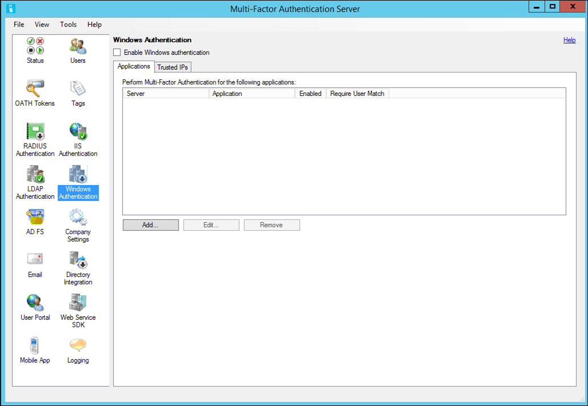

# Windows Authentication and Azure multifactor authentication Server

Use the Windows Authentication section of the Azure multifactor authentication Server to enable and configure Windows authentication for applications. Before you set up Windows Authentication, keep the following list in mind:

* After setup, reboot the Azure multifactor authentication for Terminal Services to take effect.
* If 'Require Azure multifactor authentication user match' is checked and you are not in the user list, you will not be able to log into the machine after reboot.
* Trusted IPs is dependent on whether the application can provide the client IP with the authentication. Currently only Terminal Services is supported.  

> [!IMPORTANT]
> As of July 1, 2019, Microsoft no longer offers MFA Server for new deployments. New customers that want to require multifactor authentication during sign-in events should use cloud-based Microsoft Entra multifactor authentication.
>
> To get started with cloud-based MFA, see [Tutorial: Secure user sign-in events with Microsoft Entra multifactor authentication](tutorial-enable-azure-mfa.md).
>
> Existing customers that activated MFA Server before July 1, 2019 can download the latest version, future updates, and generate activation credentials as usual.

> [!NOTE]
> This feature is not supported to secure Terminal Services on Windows Server 2012 R2.

## To secure an application with Windows Authentication, use the following procedure

1. In the Azure multifactor authentication Server click the Windows Authentication icon.
   
2. Check the **Enable Windows Authentication** checkbox. By default, this box is unchecked.
3. The Applications tab allows the administrator to configure one or more applications for Windows Authentication.
4. Select a server or application – specify whether the server/application is enabled. Click **OK**.
5. Click **Add…**
6. The Trusted IPs tab allows you to skip Azure multifactor authentication for Windows sessions originating from specific IPs. For example, if employees use the application from the office and from home, you may decide you don't want their phones ringing for Azure multifactor authentication while at the office. For this, you would specify the office subnet as Trusted IPs entry.
7. Click **Add…**
8. Select **Single IP** if you would like to skip a single IP address.
9. Select **IP Range** if you would like to skip an entire IP range. Example 10.63.193.1-10.63.193.100.
10. Select **Subnet** if you would like to specify a range of IPs using subnet notation. Enter the subnet's starting IP and pick the appropriate netmask from the drop-down list.
11. Click **OK**.

## Next steps

- [Configure third-party VPN appliances for Azure MFA Server](howto-mfaserver-nps-vpn.md)

- [Augment your existing authentication infrastructure with the NPS extension for Azure MFA](howto-mfa-nps-extension.md)
