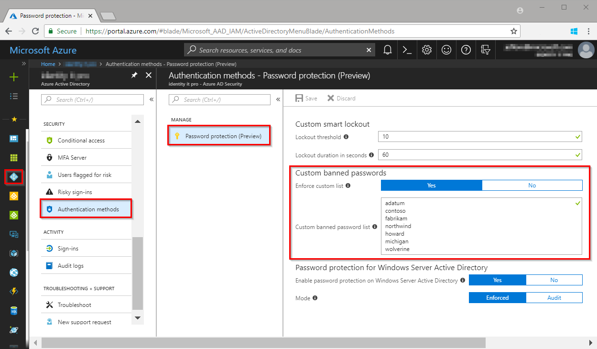

# Configuring the custom banned password list

Many organizations find their users create passwords using common local words such as a school, sports team, or famous person, leaving them easy to guess. Microsoft's custom banned password list allows organizations to add strings to evaluate and block, in addition to the global banned password list, when users and administrators attempt to change or reset a password.

## Add to the custom list

Configuring the custom banned password list requires an Azure Active Directory Premium P1 or P2 license. For more detailed information about Azure Active Directory licensing, see the [Azure Active Directory pricing page](https://azure.microsoft.com/pricing/details/active-directory/).

1. Sign in to the [Azure portal](https://portal.azure.com) and browse to **Azure Active Directory**, **Authentication methods**, then **Password protection**.
1. Set the option **Enforce custom list**, to **Yes**.
1. Add strings to the **Custom banned password list**, one string per line
   * The custom banned password list can contain up to 1000 terms.
   * The custom banned password list is case-insensitive.
   * The custom banned password list considers common character substitution.
      * Example: "o" and "0" or "a" and "\@"
   * The minimum string length is four characters and the maximum is 16 characters.
1. When you have added all strings, click **Save**.

> [!NOTE]
> It may take several hours for updates to the custom banned password list to be applied.

> [!NOTE]
> The custom banned password list is limited to having a maximum of 1000 terms. It is not designed for blocking extremely large lists of passwords. In order to fully leverage the benefits of the custom banned password list, Microsoft recommends that you first review and understand the intended design and usage of the custom banned password list (see [Custom banned password list](concept-password-ban-bad.md#custom-banned-password-list)), and also the password evaluation algorithm (see [How are passwords evaluated](concept-password-ban-bad.md#how-are-passwords-evaluated)).

## How it works

Each time a user or administrator resets or changes an Azure AD password, it flows through the banned password lists to confirm that it is not on a list. This check is included in any passwords set or changed using Azure AD.

## What do users see

When a user attempts to reset a password to something that would be banned, they see one of the following error messages:

* Unfortunately, your password contains a word, phrase, or pattern that makes your password easily guessable. Please try again with a different password.
* Unfortunately, you can't use that password because it contains words or characters that have been blocked by your administrator. Please try again with a different password.

## Next steps

[Conceptual overview of the banned password lists](concept-password-ban-bad.md)

[Conceptual overview of Azure AD password protection](concept-password-ban-bad-on-premises.md)

[Enable on-premises integration with the banned password lists](howto-password-ban-bad-on-premises.md)
