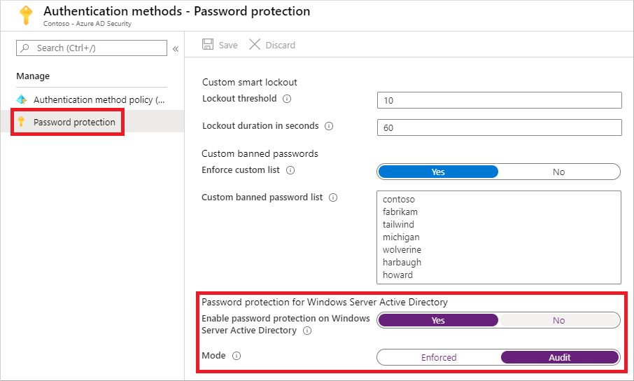

# Enable on-premises Azure Active Directory Password Protection

Users often create passwords that use common local words such as a school, sports team, or famous person. These passwords are easy to guess, and weak against dictionary-based attacks. To enforce strong passwords in your organization, Azure Active Directory (Azure AD) Password Protection provides a global and custom banned password list. A password change request fails if there's a match in these banned password list.

To protect your on-premises Active Directory Domain Services (AD DS) environment, you can install and configure Azure AD Password Protection to work with your on-prem DC. This article shows you how to enable Azure AD Password Protection for your on-premises environment.

For more information on how Azure AD Password Protection works in an on-premises environment, see [How to enforce Azure AD Password Protection for Windows Server Active Directory](concept-password-ban-bad-on-premises.md).

## Before you begin

This article shows you how to enable Azure AD Password Protection for your on-premises environment. Before you complete this article, [install and register the Azure AD Password Protection proxy service and DC agents](howto-password-ban-bad-on-premises-deploy.md) in your on-premises AD DS environment.

## Enable on-premises password protection

1. Sign in to the [Azure portal](https://portal.azure.com) and browse to **Azure Active Directory** > **Security** > **Authentication methods** > **Password protection**.
1. Set the option for **Enable password protection on Windows Server Active Directory** to *Yes*.

    When this setting is set to *No*, all deployed Azure AD Password Protection DC agents go into a quiescent mode where all passwords are accepted as-is. No validation activities are performed, and audit events aren't generated.

1. It's recommended to initially set the **Mode** to *Audit*. After you're comfortable with the feature and the impact on users in your organization, you can switch the **Mode** to *Enforced*. For more information, see the following section on [modes of operation](#modes-of-operation).
1. When ready, select **Save**.

    

## Modes of operation

When you enable on-premises Azure AD Password Protection, you can use either *audit* mode or *enforce* mode. We recommend that initial deployment and testing always start out in audit mode. Entries in the event log should then be monitored to anticipate whether any existing operational processes would be disturbed once *Enforce* mode is enabled.

### Audit mode

*Audit* mode is intended as a way to run the software in a "what if" mode. Each Azure AD Password Protection DC agent service evaluates an incoming password according to the currently active policy.

If the current policy is configured to be in audit mode, "bad" passwords result in event log messages but are processed and updated. This behavior is the only difference between audit and enforce mode. All other operations run the same.

### Enforced Mode

*Enforced* mode is intended as the final configuration. Like when in audit mode, each Azure AD Password Protection DC agent service evaluates incoming passwords according to the currently active policy. When enforced mode is enabled though, a password that's considered insecure according to the policy is rejected.

When a password is rejected in enforced mode by the Azure AD Password Protection DC agent, an end user sees a similar error like they would see if their password was rejected by traditional on-premises password complexity enforcement. For example, a user might see the following traditional error message at the Windows logon or change password screen:

*"Unable to update the password. The value provided for the new password does not meet the length, complexity, or history requirements of the domain."*

This message is only one example of several possible outcomes. The specific error message can vary depending on the actual software or scenario that is attempting to set an insecure password.

Affected end users may need to work with their IT staff to understand the new requirements and to choose secure passwords.

> [!NOTE]
> Azure AD Password Protection has no control over the specific error message displayed by the client machine when a weak password is rejected.

## Next steps

To customize the banned password list for your organization, see [Configure the Azure AD Password Protection custom banned password list](tutorial-configure-custom-password-protection.md).

To monitor on-prem events, see [Monitoring on-prem Azure AD Password Protection](howto-password-ban-bad-on-premises-monitor.md).
