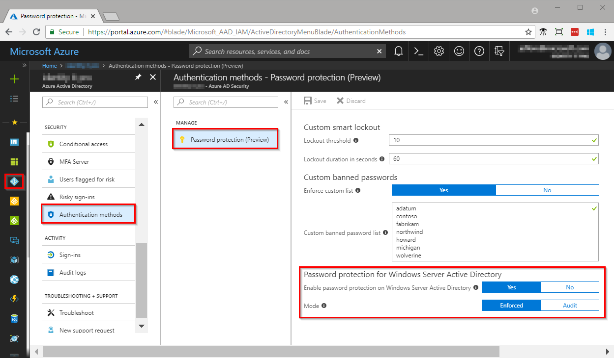

# Preview: Azure AD password protection post-deployment

|     |
| --- |
| Azure AD password protection and the custom banned password list are public preview features of Azure Active Directory. For more information about previews, see  [Supplemental Terms of Use for Microsoft Azure Previews](https://azure.microsoft.com/support/legal/preview-supplemental-terms/)|
|     |

After you have completed the [installation of Azure AD password protection](howto-password-ban-bad-on-premises.md) on-premises, there are a couple items that must be configured in the Azure portal.

## Configure the custom banned password list

Follow the guidance in the article [Configuring the custom banned password list](howto-password-ban-bad.md) for steps to customize the banned password list for your organization.

## Enable password protection

1. Log in to the [Azure portal](https://portal.azure.com) and browse to **Azure Active Directory**, **Authentication methods**, then **Password protection (Preview)**.
1. Set **Enable password protection on Windows Server Active Directory** to **Yes**
1. As mentioned in the [Deployment guide](howto-password-ban-bad-on-premises.md#deployment-strategy), it is recommended to initially set the **Mode** to **Audit**
   * After you are comfortable with the feature, you can switch the **Mode** to **Enforced**
1. Click **Save**



## Audit Mode

Audit mode is intended as a way to run the software in a “what if” mode. Each DC agent service evaluates an incoming password according to the currently active policy. If the current policy is configured to be in Audit mode, “bad” passwords result in event log messages but are accepted. This is the only difference between Audit and Enforce mode; all other operations run the same.

> [!NOTE]
> Microsoft recommends that initial deployment and testing always start out in Audit mode. Events in the event log should then be monitored to try to anticipate whether any existing operational processes would be disturbed once Enforce mode is enabled.

## Enforce Mode

Enforce mode is intended as the final configuration. As in Audit mode above, each DC agent service evaluates incoming passwords according to the currently active policy. If Enforce mode is enabled though, a password that is considered unsecure according to the policy is rejected.

When a password is rejected in Enforce mode by the Azure AD password protection DC Agent, the visible impact seen by an end user is identical to what they would see if their password was rejected by traditional on-premises password complexity enforcement. For example, a user might see the following traditional error message at the logon\change password screen:

“Unable to update the password. The value provided for the new password does not meet the length, complexity, or history requirements of the domain.”

This message is only one example of several possible outcomes. The specific error message can vary depending on the actual software or scenario that is attempting to set an unsecure password.

Affected end users may need to work with their IT staff to understand the new requirements and be more able to choose secure passwords.

## Usage reporting

The `Get-AzureADPasswordProtectionSummaryReport` cmdlet may be used to produce a summary view of activity. An example output of this cmdlet is as follows:

```
Get-AzureADPasswordProtectionSummaryReport -DomainController bplrootdc2
DomainController                : bplrootdc2
PasswordChangesValidated        : 6677
PasswordSetsValidated           : 9
PasswordChangesRejected         : 10868
PasswordSetsRejected            : 34
PasswordChangeAuditOnlyFailures : 213
PasswordSetAuditOnlyFailures    : 3
PasswordChangeErrors            : 0
PasswordSetErrors               : 1
```

The scope of the cmdlet’s reporting may be influenced using one of the –Forest, -Domain, or –DomainController parameters. Not specifying a parameter implies –Forest.

> [!NOTE]
> This cmdlet works by remotely querying each DC agent service’s Admin event log. If the event logs contain large numbers of events, the cmdlet may take a long time to complete. In addition, bulk network queries of large data sets may impact domain controller performance. Therefore, this cmdlet should be used carefully in production environments.

## Next steps

[Troubleshooting and logging information for Azure AD password protection](howto-password-ban-bad-on-premises-troubleshoot.md)
