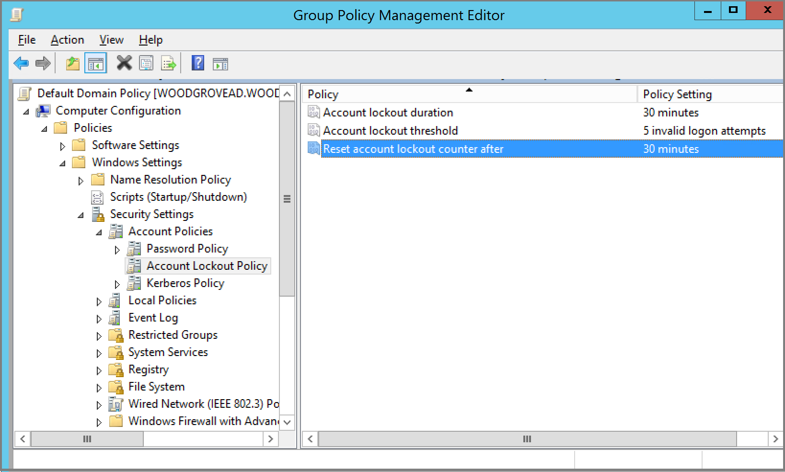
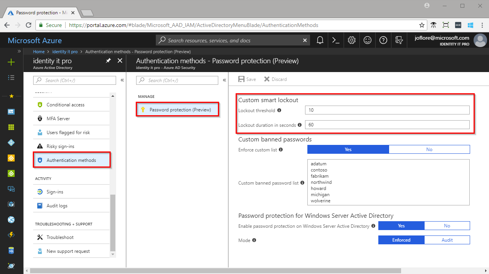

# Azure Active Directory smart lockout

Smart lockout assists in locking out bad actors who are trying to guess your users' passwords or use brute-force methods to get in. It can recognize sign-ins coming from valid users and treat them differently than ones of attackers and other unknown sources. Smart lockout locks out the attackers, while letting your users continue to access their accounts and be productive.

By default, smart lockout locks the account from sign-in attempts for one minute after 10 failed attempts. The account locks again after each subsequent failed sign-in attempt, for one minute at first and longer in subsequent attempts.

Smart lockout tracks the last three bad password hashes to avoid incrementing the lockout counter for the same password. If someone enters the same bad password multiple times, this behavior will not cause the account to lockout.

 > [!NOTE]
 > Hash tracking functionality is not available for customers with pass-through authentication enabled as authentication happens on-premises not in the cloud.

Federated deployments using AD FS 2016 and AF FS 2019 can enable similar benefits using [AD FS Extranet Lockout and Extranet Smart Lockout](https://docs.microsoft.com/windows-server/identity/ad-fs/operations/configure-ad-fs-extranet-smart-lockout-protection).

Smart lockout is always on for all Azure AD customers with these default settings that offer the right mix of security and usability. Customization of the smart lockout settings, with values specific to your organization, requires paid Azure AD licenses for your users.

Using smart lockout does not guarantee that a genuine user will never be locked out. When smart lockout locks a user account, we try our best to not lockout the genuine user. The lockout service attempts to ensure that bad actors can't gain access to a genuine user account.  

* Each Azure Active Directory data center tracks lockout independently. A user will have (threshold_limit * datacenter_count) number of attempts, if the user hits each data center.
* Smart Lockout uses familiar location vs unfamiliar location to differentiate between a bad actor and the genuine user. Unfamiliar and familiar locations will both have separate lockout counters.

Smart lockout can be integrated with hybrid deployments, using password hash sync or pass-through authentication to protect on-premises Active Directory accounts from being locked out by attackers. By setting smart lockout policies in Azure AD appropriately, attacks can be filtered out before they reach on-premises Active Directory.

When using [pass-through authentication](../hybrid/how-to-connect-pta.md), you need to make sure that:

* The Azure AD lockout threshold is **less** than the Active Directory account lockout threshold. Set the values so that the Active Directory account lockout threshold is at least two or three times longer than the Azure AD lockout threshold. 
* The Azure AD lockout duration must be set longer than the Active Directory reset account lockout counter after duration. Be aware that the Azure AD duration is set in seconds, while the AD duration is set in minutes. 

For example, if you want your Azure AD counter to be higher than AD, then Azure AD would be 120 seconds (2 minutes) while your on-premises AD is set to 1 minute (60 seconds).

> [!IMPORTANT]
> Currently, an administrator can't unlock the users' cloud accounts if they have been locked out by the Smart Lockout capability. The administrator must wait for the lockout duration to expire. However, the user can unlock by using self-service password reset (SSPR) from a trusted device or location.

## Verify on-premises account lockout policy

Use the following instructions to verify your on-premises Active Directory account lockout policy:

1. Open the Group Policy Management tool.
2. Edit the group policy that includes your organization's account lockout policy, for example, the **Default Domain Policy**.
3. Browse to **Computer Configuration** > **Policies** > **Windows Settings** > **Security Settings** > **Account Policies** > **Account Lockout Policy**.
4. Verify your **Account lockout threshold** and **Reset account lockout counter after** values.

## Manage Azure AD smart lockout values

Based on your organizational requirements, smart lockout values may need to be customized. Customization of the smart lockout settings, with values specific to your organization, requires paid Azure AD licenses for your users.

To check or modify the smart lockout values for your organization, use the following steps:

1. Sign in to the [Azure portal](https://portal.azure.com).
1. Search for and select *Azure Active Directory*. Select **Security** > **Authentication methods** > **Password protection**.
1. Set the **Lockout threshold**, based on how many failed sign-ins are allowed on an account before its first lockout. The default is 10.
1. Set the **Lockout duration in seconds**, to the length in seconds of each lockout. The default is 60 seconds (one minute).

> [!NOTE]
> If the first sign-in after a lockout also fails, the account locks out again. If an account locks repeatedly, the lockout duration increases.

## How to determine if the Smart lockout feature is working or not

When the smart lockout threshold is triggered, you will get the following message while the account is locked:

**Your account is temporarily locked to prevent unauthorized use. Try again later, and if you still have trouble, contact your admin.**

## Next steps

* [Find out how to ban bad passwords in your organization using Azure AD.](howto-password-ban-bad.md)
* [Configure self-service password reset to allow users to unlock their own accounts.](quickstart-sspr.md)
