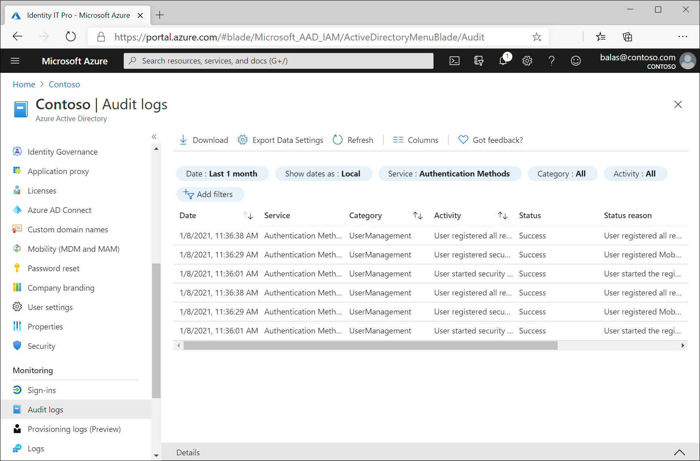

# Troubleshooting combined security information registration

The information in this article is meant to guide admins who are troubleshooting issues reported by users of the combined registration experience.

## Audit logs

The events logged for combined registration are in the Authentication Methods service in the Microsoft Entra audit logs.



The following table lists all audit events generated by combined registration:

| Activity | Status | Reason | Description |
| --- | --- | --- | --- |
| User registered all required security info | Success | User registered all required security info. | This event occurs when a user has successfully completed registration.|
| User registered all required security info | Failure | User canceled security info registration. | This event occurs when a user cancels registration from interrupt mode.|
| User registered security info | Success | User registered *method*. | This event occurs when a user registers an individual method. *Method* can be Authenticator app, Phone, Email, Security questions, App password, Alternate phone, and so on.| 
| User reviewed security info | Success | User successfully reviewed security info. | This event occurs when a user selects **Looks good** on the security info review page.|
| User reviewed security info | Failure | User failed to review security info. | This event occurs when a user selects **Looks good** on the security info review page but something fails on the backend.|
| User deleted security info | Success | User deleted *method*. | This event occurs when a user deletes an individual method. *Method* can be Authenticator app, Phone, Email, Security questions, App password, Alternate phone, and so on.|
| User deleted security info | Failure | User failed to delete *method*. | This event occurs when a user tries to delete a method but the attempt fails for some reason. *Method* can be Authenticator app, Phone, Email, Security questions, App password, Alternate phone, and so on.|
| User changed default security info | Success | User changed the default security info for *method*. | This event occurs when a user changes the default method. *Method* can be Authenticator app notification, A code from my authenticator app or token, Call +X XXXXXXXXXX, Text a code to +X XXXXXXXXX, and so on.|
| User changed default security info | Failure | User failed to change the default security info for *method*. | This event occurs when a user tries to change the default method but the attempt fails for some reason. *Method* can be Authenticator app notification, A code from my authenticator app or token, Call +X XXXXXXXXXX, Text a code to +X XXXXXXXXX, and so on.|

## Troubleshooting interrupt mode

| Symptom | Troubleshooting steps |
| --- | --- |
| I'm not seeing the methods I expected to see. | 1. Check if the user has a Microsoft Entra admin role. If yes, view the SSPR admin policy differences. <br> 2. Determine whether the user is being interrupted because of multifactor authentication registration enforcement or SSPR registration enforcement. See the [flowchart](../../active-directory/authentication/concept-registration-mfa-sspr-combined.md#combined-registration-modes) under "Combined registration modes" to determine which methods should be shown. <br> 3. Determine how recently the multifactor authentication or SSPR policy was changed. If the change was recent, it might take some time for the updated policy to propagate.|

## Troubleshooting manage mode

| Symptom | Troubleshooting steps |
| --- | --- |
| I don't have the option to add a particular method. | 1. Determine whether the method is enabled for multifactor authentication or for SSPR. <br> 2. If the method is enabled, save the policies again and wait 1-2 hours before testing again. <br> 3. If the method is enabled, ensure that the user hasn't already set up the maximum number of that method that they're allowed to set up.|


### How to roll back users

If you, as an admin, want to reset a user's multifactor authentication settings, you can use the PowerShell script provided in the next section. The script will clear the StrongAuthenticationMethods property for a user's mobile app and/or phone number. If you run this script for your users, they'll need to re-register for multifactor authentication if they need it. We recommend testing rollback with one or two users before rolling back all affected users.

The steps that follow will help you roll back a user or group of users.

#### Prerequisites

1. Install the appropriate Azure AD PowerShell modules. In a PowerShell window, run these commands to install the modules:

   ```powershell
   Install-Module -Name MSOnline
   Import-Module MSOnline
   ```

1. Save the list of affected user object IDs to your computer as a text file with one ID per line. Make note of the location of the file.
1. Save the following script to your computer and make note of the location of the script:

   ```powershell
   <# 
   //********************************************************
   //*                                                      *
   //*   Copyright (C) Microsoft. All rights reserved.      *
   //*                                                      *
   //********************************************************
   #>

   param($path)

   # Define Remediation Fn
   function RemediateUser {

       param  
       (
           $ObjectId
       )

       $user = Get-MsolUser -ObjectId $ObjectId

       Write-Host "Checking if user is eligible for rollback: UPN: "  $user.UserPrincipalName  " ObjectId: "  $user.ObjectId -ForegroundColor Yellow

       $hasMfaRelyingParty = $false
       foreach($p in $user.StrongAuthenticationRequirements)
       {
           if ($p.RelyingParty -eq "*")
           {
               $hasMfaRelyingParty = $true
               Write-Host "User was enabled for per-user MFA." -ForegroundColor Yellow
           }
       }

       if ($user.StrongAuthenticationMethods.Count -gt 0 -and -not $hasMfaRelyingParty)
       {
           Write-Host $user.UserPrincipalName " is eligible for rollback" -ForegroundColor Yellow
           Write-Host "Rolling back user ..." -ForegroundColor Yellow
           Reset-MsolStrongAuthenticationMethodByUpn -UserPrincipalName $user.UserPrincipalName
           Write-Host "Successfully rolled back user " $user.UserPrincipalName -ForegroundColor Green
       }
       else
       {
           Write-Host $user.UserPrincipalName " is not eligible for rollback. No action required."
       }

       Write-Host ""
       Start-Sleep -Milliseconds 750
   }

   # Connect
   Import-Module MSOnline
   Connect-MsolService

   foreach($line in Get-Content $path)
   {
       RemediateUser -ObjectId $line
   }
   ```

#### Rollback

In a PowerShell window, run the following command, providing the script and user file locations. Enter global administrator credentials when prompted. The script will output the outcome of each user update operation.

`<script location> -path <user file location>`

## Next steps

* [Learn more about combined registration for self-service password reset and Microsoft Entra multifactor authentication](concept-registration-mfa-sspr-combined.md)
