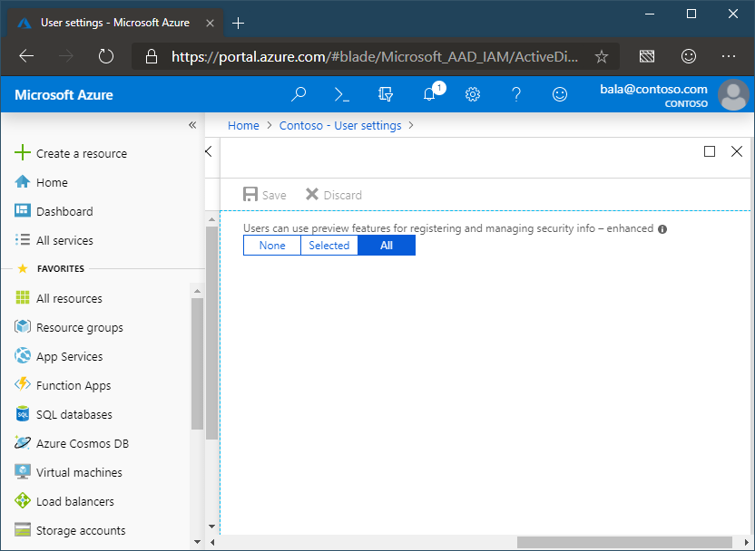

# Enable combined security information registration (preview)

Before enabling the new experience, review the article [Combined security information registration (preview)](concept-registration-mfa-sspr-combined.md) to ensure you understand the functionality and effects of this feature.

|     |
| --- |
| Combined security information registration for Azure Multi-Factor Authentication and Azure Active Directory (Azure AD) self-service password reset is a public preview feature of Azure AD. For more information about previews, see  [Supplemental Terms of Use for Microsoft Azure Previews](https://azure.microsoft.com/support/legal/preview-supplemental-terms/).|
|     |

## Enable combined registration

Complete these steps to enable combined registration:

1. Sign in to the Azure portal as a user administrator or global administrator.
2. Go to **Azure Active Directory** > **User settings** > **Manage settings for access panel preview features**.
3. Under **Users can use preview features for registering and managing security info - refresh**, choose to enable for a **Selected** group of users or for **All** users.

   

> [!IMPORTANT]
> Starting in March 2019, the phone call options won't be available to Multi-Factor Authentication and SSPR users in free/trial Azure AD tenants. SMS messages are not affected by this change. The phone call options will still be available to users in paid Azure AD tenants.

> [!NOTE]
> After you enable combined registration, users who register or confirm their phone number or mobile app through the new experience can use them for Multi-Factor Authentication and SSPR, if those methods are enabled in the Multi-Factor Authentication and SSPR policies. If you then disable this experience, users who go to the previous SSPR registration page at `https:/aka.ms/ssprsetup` will be required to perform multi-factor authentication before they can access the page.

If you have configured the Site to Zone Assignment List in Internet Explorer, the following sites have to be in the same zone:

* [https://login.microsoftonline.com](https://login.microsoftonline.com)
* [https://mysignins.microsoft.com](https://mysignins.microsoft.com)
* [https://account.activedirectory.windowsazure.com](https://account.activedirectory.windowsazure.com)

## Next steps

[Available methods for Multi-Factor Authentication and SSPR](concept-authentication-methods.md)

[Configure self-service password reset](howto-sspr-deployment.md)

[Configure Azure Multi-Factor Authentication](howto-mfa-getstarted.md)

[Troubleshooting combined security info registration](howto-registration-mfa-sspr-combined-troubleshoot.md)