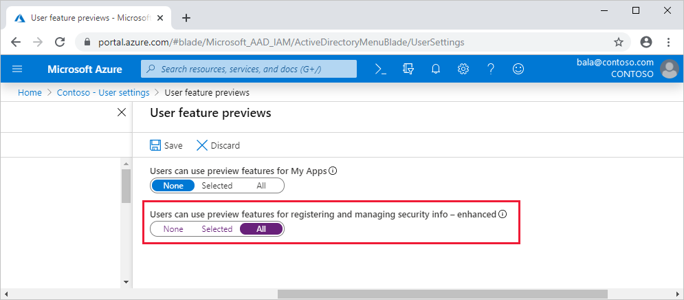

# Enable combined security information registration

Before enabling the new experience, review the article [Combined security information registration](concept-registration-mfa-sspr-combined.md) to ensure you understand the functionality and effects of this feature.

## Enable combined registration

Complete these steps to enable combined registration:

1. Sign in to the Azure portal as a user administrator or global administrator.
2. Go to **Azure Active Directory** > **User settings** > **Manage user feature preview settings**.
3. Under **Users can use preview features for registering and managing security info**, choose to enable for a **Selected** group of users or for **All** users.

   

> [!IMPORTANT]
> Starting in March 2019, the phone call options won't be available to Multi-Factor Authentication and SSPR users in free/trial Azure AD tenants. SMS messages are not affected by this change. The phone call options will still be available to users in paid Azure AD tenants.

> [!NOTE]
> After you enable combined registration, users who register or confirm their phone number or mobile app through the new experience can use them for Multi-Factor Authentication and SSPR, if those methods are enabled in the Multi-Factor Authentication and SSPR policies. If you then disable this experience, users who go to the previous SSPR registration page at `https://aka.ms/ssprsetup` will be required to perform multi-factor authentication before they can access the page.

If you have configured the Site to Zone Assignment List in Internet Explorer, the following sites have to be in the same zone:

* [https://login.microsoftonline.com](https://login.microsoftonline.com)
* [https://mysignins.microsoft.com](https://mysignins.microsoft.com)
* [https://account.activedirectory.windowsazure.com](https://account.activedirectory.windowsazure.com)

## Conditional Access policies for combined registration

Securing when and how users register for Azure Multi-Factor Authentication and self-service password reset is now possible with user actions in Conditional Access policy. This feature is available to organizations who have enabled the [combined registration feature](../authentication/concept-registration-mfa-sspr-combined.md). This functionality may be enabled in organizations where they want users to register for Azure Multi-Factor Authentication and SSPR from a central location such as a trusted network location during HR onboarding. For more information about creating trusted locations in Conditional Access, see the article [What is the location condition in Azure Active Directory Conditional Access?](../conditional-access/location-condition.md#named-locations)

### Create a policy to require registration from a trusted location

The following policy applies to all selected users, who attempt to register using the combined registration experience, and blocks access unless they are connecting from a location marked as trusted network.

1. In the **Azure portal**, browse to **Azure Active Directory** > **Security** > **Conditional Access**
1. Select **New policy**
1. In Name, Enter a Name for this policy. For example, **Combined Security Info Registration on Trusted Networks**
1. Under **Assignments**, click **Users and groups**, and select the users and groups you want this policy to apply to

   > [!WARNING]
   > Users must be enabled for [combined registration](../authentication/howto-registration-mfa-sspr-combined.md).

1. Under **Cloud apps or actions**, select **User actions**, check **Register security information (preview)**
1. Under **Conditions** > **Locations**
   1. Configure **Yes**
   1. Include **Any location**
   1. Exclude **All trusted locations**
   1. Click **Done** on the Locations blade
   1. Click **Done** on the Conditions blade
1. Under **Access controls** > **Grant**
   1. Click **Block access**
   1. Then click **Select**
1. Set **Enable policy** to **On**
1. Then click **Create**

## Next steps

[Force users to re-register authentication methods](howto-mfa-userdevicesettings.md#manage-user-authentication-options)

[Available methods for Multi-Factor Authentication and SSPR](concept-authentication-methods.md)

[Configure self-service password reset](howto-sspr-deployment.md)

[Configure Azure Multi-Factor Authentication](howto-mfa-getstarted.md)

[Troubleshooting combined security info registration](howto-registration-mfa-sspr-combined-troubleshoot.md)

[What is the location condition in Azure Active Directory Conditional Access?](../conditional-access/location-condition.md)
