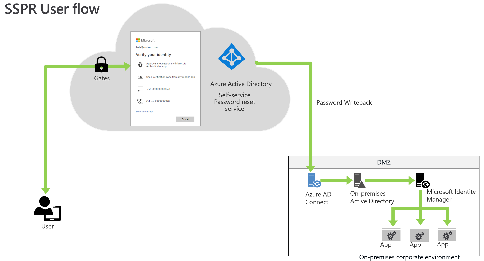
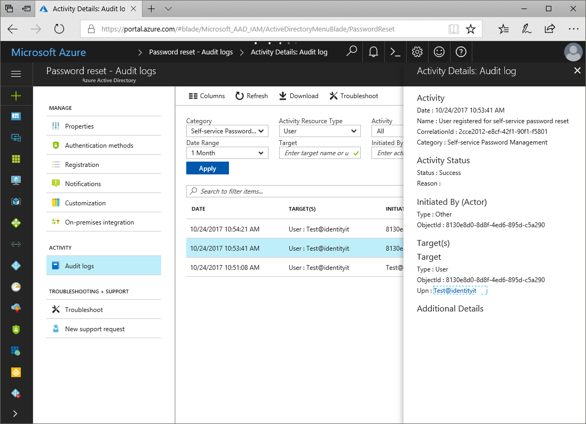

# Plan an Azure Active Directory self-service password reset deployment

> [!IMPORTANT]
> This deployment plan offers guidance and best practices for deploying Azure AD self-service password reset (SSPR).
>
> **If you're an end user and need to get back into your account, go to [https://aka.ms/sspr](https://aka.ms/sspr)**.

[Self-Service Password Reset (SSPR)](https://www.youtube.com/watch?v=pS3XwfxJrMo) is an Azure Active Directory (AD) feature that enables users to reset their passwords without contacting IT staff for help. The users can quickly unblock themselves and continue working no matter where they are or time of day. By allowing the employees to unblock themselves, your organization can reduce the non-productive time and high support costs for most common password-related issues.

SSPR has the following key capabilities:

* Self-service allows end users to reset their expired or non-expired passwords without contacting an administrator or helpdesk for support.
* [Password Writeback](./concept-sspr-writeback.md) allows management of on-premises passwords and resolution of account lockout through the cloud.
* Password management activity reports give administrators insight into password reset and registration activity occurring in their organization.

This deployment guide shows you how to plan and then test an SSPR roll-out.

To quickly see SSPR in action and then come back to understand additional deployment considerations:

> [!div class="nextstepaction"]
> [Enable self-service password reset (SSPR)](tutorial-enable-sspr.md)

> [!TIP]
> As a companion to this article, we recommend using the [Plan your self-service password reset deployment guide](https://go.microsoft.com/fwlink/?linkid=2221501) when signed in to the Microsoft 365 Admin Center. This guide will customize your experience based on your environment. To review best practices without signing in and activating automated setup features, go to the [M365 Setup portal](https://go.microsoft.com/fwlink/?linkid=2221600). 

## Learn about SSPR

Learn more about SSPR. See [How it works: Azure AD self-service password reset](./concept-sspr-howitworks.md).

### Key benefits

The key benefits of enabling SSPR are:

* **Manage cost**. SSPR reduces IT support costs by enabling users to reset passwords on their own. It also reduces the cost of time lost due to lost passwords and lockouts. 

* **Intuitive user experience**. It provides an intuitive one-time user registration process that allows users to reset passwords and unblock accounts on-demand from any device or location. SSPR allows users to get back to work faster and be more productive.

* **Flexibility and security**. SSPR enables enterprises to access the security and flexibility that a cloud platform provides. Administrators can change settings to accommodate new security requirements and roll these changes out to users without disrupting their sign-in.

* **Robust auditing and usage tracking**. An organization can ensure that the business systems remain secure while its users reset their own passwords. Robust audit logs include information of each step of the password reset process. These logs are available from an API and enable the user to import the data into a Security Incident and Event Monitoring (SIEM) system of choice.

### Licensing

Azure Active Directory is licensed per-user meaning each user requires an appropriate license for the features they use. We recommend group-based licensing for SSPR. 

To compare editions and features and enable group or user-based licensing, see [Licensing requirements for Azure AD self-service password reset](./concept-sspr-licensing.md).

For more information about pricing, see [Azure Active Directory pricing](https://www.microsoft.com/security/business/identity-access-management/azure-ad-pricing).

### Prerequisites

* A working Azure AD tenant with at least a trial license enabled. If needed, [create one for free](https://azure.microsoft.com/free/?WT.mc_id=A261C142F).

* An account with Global Administrator privileges.

### Guided walkthrough

For a guided walkthrough of many of the recommendations in this article, see the [Plan your self-service password reset deployment](https://go.microsoft.com/fwlink/?linkid=2221501) guide when signed in to the Microsoft 365 Admin Center.  To review best practices without signing in and activating automated setup features, go to the [M365 Setup portal](https://go.microsoft.com/fwlink/?linkid=2221600).

### Training resources

| Resources| Link and Description |
| - | - |
| Videos| [Empower your users with better IT scalability](https://youtu.be/g9RpRnylxS8) 
| |[What is self-service password reset?](https://youtu.be/hc97Yx5PJiM)|
| |[Deploying self-service password reset](https://www.youtube.com/watch?v=Pa0eyqjEjvQ&index=18&list=PLLasX02E8BPBm1xNMRdvP6GtA6otQUqp0)|
| |[How to enable and configure SSPR in Azure AD](https://www.youtube.com/watch?v=rA8TvhNcCvQ)|
| |[How to configure self-service password reset for users in Azure AD?](https://azure.microsoft.com/resources/videos/self-service-password-reset-azure-ad/) |
| |[How to [prepare users to] register [their] security information for Azure Active Directory](https://youtu.be/gXuh0XS18wA) |
| Online courses|[Managing Identities in Microsoft Azure Active Directory](https://www.pluralsight.com/courses/microsoft-azure-active-directory-managing-identities) Use SSPR to give your users a modern, protected experience. See especially the "[Managing Azure Active Directory Users and Groups](https://app.pluralsight.com/library/courses/microsoft-azure-active-directory-managing-identities/table-of-contents)" module. |
|Pluralsight Paid courses |[The Issues of Identity and Access Management](https://www.pluralsight.com/courses/identity-access-management-issues) Learn about IAM and security issues to be aware of in your organization. See especially the "Other Authentication Methods" module.|
| |[Getting Started with the Microsoft Enterprise Mobility Suite](https://www.pluralsight.com/courses/microsoft-enterprise-mobility-suite-getting-started) Learn the best practices for extending on-premises assets to the cloud in a manner that allows for authentication, authorization, encryption, and a secured mobile experience. See especially the "Configuring Advanced Features of Microsoft Azure Active Directory Premium" module.
|Tutorials |[Complete an Azure AD self-service password reset pilot roll out](./tutorial-enable-sspr.md) |
| |[Enabling password writeback](./tutorial-enable-sspr-writeback.md) |
| |[Azure AD password reset from the login screen for Windows 10](./howto-sspr-windows.md) |
| FAQ|[Password management frequently asked questions](./passwords-faq.yml) |

### Solution architecture

The following example describes the password reset solution architecture for common hybrid environments.

Description of workflow

To reset the password, users go to the [password reset portal](https://aka.ms/sspr). They must verify the previously registered authentication method or methods to prove their identity. If they successfully reset the password, they begin the reset process.

* For cloud-only users, SSPR stores the new password in Azure AD. 

* For hybrid users, SSPR writes back the password to the on-prem Active Directory via the Azure AD Connect service. 

Note: For users who have [Password hash synchronization (PHS)](../hybrid/whatis-phs.md) disabled, SSPR stores the passwords in the on-prem Active Directory only.

### Best practices

You can help users register quickly by deploying SSPR alongside another popular application or service in the organization. This action will generate a large volume of sign-ins and will drive registration.

Before deploying SSPR, you may opt to determine the number and the average cost of each password reset call. You can use this data post deployment to show the value SSPR is bringing to the organization.

### Combined registration for SSPR and Azure AD Multi-Factor Authentication

> [!NOTE]
> Starting on August 15th 2020, all new Azure AD tenants will be automatically enabled for combined registration. Tenants created after this date will be unable to utilize the legacy registration workflows.
> After Sept. 30th, 2022, all existing Azure AD tenants will be automatically enabled for combined registration.

We recommend that organizations use the [combined registration experience for Azure AD Multi-Factor Authentication and self-service password reset (SSPR)](howto-registration-mfa-sspr-combined.md). SSPR allows users to reset their password in a secure way using the same methods they use for Azure AD Multi-Factor Authentication. Combined registration is a single step for end users. To make sure you understand the functionality and end-user experience, see the [Combined security information registration concepts](concept-registration-mfa-sspr-combined.md).

It's critical to inform users about upcoming changes, registration requirements, and any necessary user actions. We provide [communication templates](https://aka.ms/mfatemplates) and [user documentation](https://support.microsoft.com/account-billing/set-up-security-info-from-a-sign-in-page-28180870-c256-4ebf-8bd7-5335571bf9a8) to prepare your users for the new experience and help to ensure a successful rollout. Send users to https://myprofile.microsoft.com to register by selecting the **Security Info** link on that page.

## Plan the deployment project

Consider your organizational needs while you determine the strategy for this deployment in your environment.

### Engage the right stakeholders

When technology projects fail, they typically do so due to mismatched expectations on impact, outcomes, and responsibilities. To avoid these pitfalls, [ensure that you are engaging the right stakeholders](../fundamentals/deployment-plans.md) and that stakeholder roles in the project are well understood by documenting the stakeholders and their project input and accountabilities.

#### Required administrator roles

| Business Role/Persona| Azure AD Role (if necessary) |
| - | - |
| Level 1 helpdesk| Password administrator |
| Level 2 helpdesk| User administrator |
| SSPR administrator| Global administrator |

### Plan a pilot

We recommend that the initial configuration of SSPR is in a test environment. Start with a pilot group by enabling SSPR for a subset of users in your organization. See [Best practices for a pilot](../fundamentals/deployment-plans.md).

To create a group, see how to [create a group and add members in Azure Active Directory](../fundamentals/active-directory-groups-create-azure-portal.md). 

## Plan configuration

The following settings are required to enable SSPR along with recommended values.

| Area | Setting | Value |
| --- | --- | --- |
| **SSPR Properties** | Self-service password reset enabled | **Selected** group for pilot / **All** for production |
| **Authentication methods** | Authentication methods required to register | Always 1 more than required for reset |
|   | Authentication methods required to reset | One or two |
| **Registration** | Require users to register when signing in | Yes |
|   | Number of days before users are asked to reconfirm their authentication information | 90 – 180 days |
| **Notifications** | Notify users on password resets | Yes |
|   | Notify all admins when other admins reset their password | Yes |
| **Customization** | Customize helpdesk link | Yes |
|   | Custom helpdesk email or URL | Support site or email address |
| **On-premises integration** | Write back passwords to on-premises AD | Yes |
|   | Allow users to unlock account without resetting password | Yes |

### SSPR properties

When enabling SSPR, choose an appropriate security group in the pilot environment.

* To enforce SSPR registration for everyone, we recommend using the **All** option.
* Otherwise, select the appropriate Azure AD or AD security group.

### Authentication methods

When SSPR is enabled, users can only reset their password if they have data present in the authentication methods that the administrator has enabled. Methods include phone, Authenticator app notification, security questions, etc. For more information, see [What are authentication methods?](./concept-authentication-methods.md).

We recommend the following authentication method settings:

* Set the **Authentication methods required to register** to at least one more than the number required to reset. Allowing multiple authentications gives users flexibility when they need to reset.

* Set **Number of methods required to reset** to a level appropriate to your organization. One requires the least friction, while two may increase your security posture. 

Note: The user must have the authentication methods configured in the [Password policies and restrictions in Azure Active Directory](./concept-sspr-policy.md).

### Registration settings

Set **Require users to register when signing in** to **Yes**. This setting requires users to register when signing in, ensuring that all users are protected.

Set **Number of days before users is asked to reconfirm their authentication information** to between **90** and **180** days, unless your organization has a business need for a shorter time frame.

### Notifications settings

Configure both the **Notify users on password resets** and the **Notify all admins when other admins reset their password** to **Yes**. Selecting **Yes** on both increases security by ensuring that users are aware when their password is reset. It also ensures that all admins are aware when an admin changes a password. If users or admins receive a notification and they haven't initiated the change, they can immediately report a potential security issue.

> [!NOTE]
> Email notifications from the SSPR service will be sent from the following addresses based on the Azure cloud you are working with: 
> - Public: msonlineservicesteam@microsoft.com
> - China: msonlineservicesteam@oe.21vianet.com 
> - Government: msonlineservicesteam@azureadnotifications.us
> 
> If you observe issues in receiving notifications, please check your spam settings. 

### Customization settings

It's critical to customize the helpdesk email or URL to ensure users who experience problems can get help immediately. Set this option to a common helpdesk email address or web page that your users are familiar with. 

For more information, see [Customize the Azure AD functionality for self-service password reset](./howto-sspr-customization.md).

### Password Writeback

**Password Writeback** is enabled with [Azure AD Connect](../hybrid/whatis-hybrid-identity.md) and writes password resets in the cloud back to an existing on-premises directory in real time. For more information, see [What is Password Writeback?](./concept-sspr-writeback.md)

We recommend the following settings:

* Ensure that **Write back passwords to on-premises AD** is set to **Yes**. 
* Set the **Allow users to unlock account without resetting password** to **Yes**.

By default, Azure AD unlocks accounts when it performs a password reset.

### Administrator password setting

Administrator accounts have elevated permissions. The on-premises enterprise or domain administrators can't reset their passwords through SSPR. On-premises admin accounts have the following restrictions:

* Can only change their password in their on-prem environment.
* Can never use the secret questions and answers as a method to reset their password.

We recommend that you don't sync your on-prem Active Directory admin accounts with Azure AD.

### Environments with multiple identity management systems

Some environments have multiple identity management systems. On-premises identity managers like Oracle IAM and SiteMinder, require synchronization with AD for passwords. You can do this using a tool like the Password Change Notification Service (PCNS) with Microsoft Identity Manager (MIM). To find information on this more complex scenario, see the article [Deploy the MIM Password Change Notification Service on a domain controller](/microsoft-identity-manager/deploying-mim-password-change-notification-service-on-domain-controller).

## Plan Testing and Support

At each stage of your deployment from initial pilot groups through organization-wide, ensure that results are as expected.

### Plan testing

To ensure that your deployment works as expected, plan a set of test cases to validate the implementation. To assess the test cases, you need a non-administrator test user with a password. If you need to create a user, see [Add new users to Azure Active Directory](../fundamentals/add-users-azure-active-directory.md).

The following table includes useful test scenarios you can use to document your organizations expected results based on your policies.
 

| Business case| Expected results |
| - | - |
| SSPR portal is accessible from within the corporate network| Determined by your organization |
| SSPR portal is accessible from outside the corporate network| Determined by your organization |
| Reset user password from browser when user is not enabled for password reset| User is not able to access the password reset flow |
| Reset user password from browser when user has not registered for password reset| User is not able to access the password reset flow |
| User signs in when enforced to do password reset registration| Prompts the user to register security information |
| User signs in when password reset registration is complete| Prompts the user to register security information |
| SSPR portal is accessible when the user does not have a license| Is accessible |
| Reset user password from Windows 10 Azure AD joined or hybrid Azure AD joined device lock screen| User can reset password |
| SSPR registration and usage data are available to administrators in near real time| Is available via audit logs |

You can also refer to [Complete out an Azure AD self-service password reset pilot roll](./tutorial-enable-sspr.md). In this tutorial, you will enable a pilot roll out of SSPR in your organization and test using a non-administrator account.

### Plan support

While SSPR does not typically create user issues, it is important to prepare support staff to deal with issues that may arise. While an administrator can reset the password for end users through the Azure portal, it is better to help resolve the issue via a self-service support process.

To enable your support team's success, you can create a FAQ based on questions you receive from your users. Here are a few examples:

| Scenarios| Description |
| - | - |
| User doesn't have any registered authentication methods available| A user is trying to reset their password but doesn't have any of the authentication methods that they registered available (Example: they left their cell phone at home and can't access email) |
| User isn't receiving a text or call on their office or cell phone| A user is trying to verify their identity via text or call but isn't receiving a text/call. |
| User can't access the password reset portal| A user wants to reset their password but isn't enabled for password reset and can't access the page to update passwords. |
| User can't set a new password| A user completes verification during the password reset flow but can't set a new password. |
| User doesn't see a Reset Password link on a Windows 10 device| A user is trying to reset password from the Windows 10 lock screen, but the device is either not joined to Azure AD, or the Microsoft Intune device policy isn't enabled |

### Plan rollback

To roll back the deployment:

* For a single user, remove the user from the security group 

* For a group, remove the group from SSPR configuration

* For everyone, disable SSPR for the Azure AD tenant

## Deploy SSPR

Before deploying, ensure that you have done the following:

1. Determined the appropriate [configuration settings](#plan-configuration).

2. Identified the users and groups for the [pilot](#plan-a-pilot) and production environments.

3. [Determined configuration settings](#plan-configuration) for registration and self-service.

4. [Configured password writeback](#password-writeback) if you have a hybrid environment.

**You're now ready to deploy SSPR!**

See [Enable self-service password reset](./tutorial-enable-sspr.md#enable-self-service-password-reset) for complete step-by-step directions on configuring the following areas.

1. [Authentication methods](./concept-authentication-methods.md)

1. [Registration settings](./concept-registration-mfa-sspr-combined.md)

1. [Notifications settings](#notifications-settings)

1. [Customization settings](./howto-sspr-customization.md)

1. [On-premises integration](./tutorial-enable-sspr-writeback.md)

### Enable SSPR in Windows
For machines running Windows 7, 8, 8.1, and 10 you can [enable users to reset their password at the Windows sign in screen](./howto-sspr-windows.md)

## Manage SSPR

Azure AD can provide additional information on your SSPR performance through audits and reports.

### Password management activity reports 

You can use pre-built reports on Azure portal to measure the SSPR performance. If you're appropriately licensed, you can also create custom queries. For more information, see [Reporting options for Azure AD password management](./howto-sspr-reporting.md)

> [!NOTE]
>  You must be [a global administrator](../roles/permissions-reference.md), and you must opt-in for this data to be gathered for your organization. To opt in, you must visit the Reporting tab or the audit logs on the Azure portal at least once. Until then, the data doesn't collect for your organization.

Audit logs for registration and password reset are available for 30 days. If security auditing within your corporation requires longer retention, the logs need to be exported and consumed into a SIEM tool such as [Microsoft Sentinel](../../sentinel/connect-azure-active-directory.md), Splunk, or ArcSight.

### Authentication methods- Usage and Insights

[Usage and insights](./howto-authentication-methods-activity.md) enable you to understand how authentication methods for features like Azure AD MFA and SSPR are working in your organization. This reporting capability provides your organization with the means to understand what methods register and how to use them.

### Troubleshoot

* Refer to [Troubleshoot self-service password reset](./troubleshoot-sspr.md) 

* Follow [Password management frequently asked questions](./passwords-faq.yml) 

### Helpful documentation

* [What are authentication methods?](./concept-authentication-methods.md)

* [How it works: Azure AD self-service password reset?](./concept-sspr-howitworks.md)

* [Customize the Azure AD functionality for self-service password reset](./howto-sspr-customization.md)

* [Password policies and restrictions in Azure Active Directory](./concept-sspr-policy.md)

* [What is Password Writeback?](./concept-sspr-writeback.md)

## Next steps

* To get started deploying SSPR, see [Enable Azure AD self-service password reset](tutorial-enable-sspr.md)

* [Consider implementing Azure AD password protection](./concept-password-ban-bad.md)

* [Consider implementing Azure AD Smart Lockout](./howto-password-smart-lockout.md)
