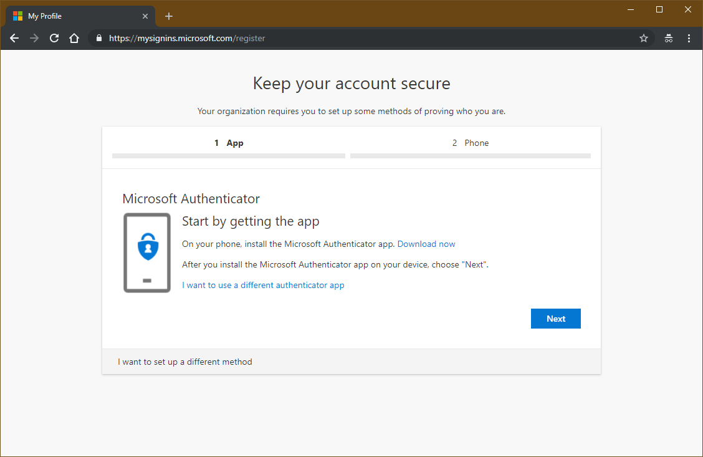

# Deploy Azure AD self-service password reset

Self-service password reset (SSPR) is an Azure Active Directory feature that enables employees to reset their passwords without needing to contact IT staff. Employees must register for or be registered for self-service password reset before using the service. During registration, the employee chooses one or more authentication methods enabled by their organization.

SSPR enables employees to quickly get unblocked and continue working no matter where they are or the time of day. By allowing users to unblock themselves, your organization can reduce the non-productive time and high support costs for most common password-related issues.

Help users get registered quickly by deploying SSPR alongside another application or service in your organization. This action will generate a large volume of sign-ins and will drive registration.

Before deploying SSPR, organizations may want to determine how many password reset related help desk calls happen over time and the average cost of each call. They can use this data post deployment to show the value SSPR is bringing to your organization.  

## How SSPR works

1. When a user attempts to reset a password, they must verify their previously registered authentication method or methods to prove their identity.
1. Then the user enters a new password.
   1. For cloud-only users, the new password is stored in Azure Active Directory. For more information, see the article [How SSPR works](concept-sspr-howitworks.md#how-does-the-password-reset-portal-work).
   1. For hybrid users, the password is written back to the on-premises Active Directory via the Azure AD Connect service. For more information, see the article [What is password writeback](concept-sspr-writeback.md#how-password-writeback-works).

## Licensing considerations

Azure Active Directory is license per-user meaning each user has to have an appropriate license for the features they utilize.

- Self-service password reset for cloud-only users is available with Azure AD Basic or above.
- Self-service password reset with on-premises writeback for hybrid environments requires Azure AD Premium P1 or above.

More information about licensing can be found on the [Azure Active Directory pricing page](https://azure.microsoft.com/pricing/details/active-directory/)

## Enable combined registration for SSPR and MFA

Microsoft recommends that organizations enable the combined registration experience for SSPR and multi-factor authentication. When you enable this combined registration experience, users need only select their registration information once to enable both features.

The combined registration experience does not require organizations to enable both SSPR and Azure Multi-Factor Authentication to use. The combined registration experience provides organizations a better user experience compared to the traditional individual components. More information about combined registration, and how to enable, can be found in the article [Combined security information registration (preview)](concept-registration-mfa-sspr-combined.md)

## Plan the configuration

The following settings are required to enable SSPR along with recommended values.

| Area | Setting | Value |
| --- | --- | --- |
| **SSPR Properties** | Self-service password reset enabled | **Selected** group for pilot / **All** for production |
| **Authentication methods** | Authentication methods required to register | Always 1 more than required for reset |
|   | Authentication methods required to reset | One or two |
| **Registration** | Require users to register when signing in | Yes |
|   | Number of days before users are asked to re-confirm their authentication information | 90 – 180 days |
| **Notifications** | Notify users on password resets | Yes |
|   | Notify all admins when other admins reset their password | Yes |
| **Customization** | Customize helpdesk link | Yes |
|   | Custom helpdesk email or URL | Support site or email address |
| **On-premises integration** | Write back passwords to on-premises AD | Yes |
|   | Allow users to unlock account without resetting password | Yes |

### SSPR properties recommendations

When enabling Self-service password reset, choose a security group to be used during the pilot.

When you plan to launch the service more broadly, we recommend using the All option to enforce SSPR for everyone in the organization. If you cannot set to all, select the appropriate Azure AD Security group or AD group synced to Azure AD.

### Authentication methods

Set Authentication methods required to register to at least one more than the number required to reset. Allowing multiple gives users flexibility when they need to reset.

Set **Number of methods required to reset** to a level appropriate to your organization. One requires the least friction, while two may increase your security posture.

See [What are authentication methods](concept-authentication-methods.md) for detailed information on which authentication methods are available for SSPR, pre-defined security questions, and how to create customized security questions.

### Registration settings

Set **Require users to register when signing in** to **Yes**. This setting means that the users are forced to register when signing in, ensuring that all users are protected.

Set **Number of days before users are asked to re-confirm their authentication information** to between **90** and **180** days, unless your organization has a business need for a shorter time frame.

### Notifications settings

Configure both the **Notify users on password resets** and the **Notify all admins when other admins reset their password** to **Yes**. Selecting **Yes** on both increases security by ensuring that users are aware when their password has been reset, and that all admins are aware when an admin changes a password. If users or admins receive such a notification and they have not initiated the change, they can immediately report a potential security breach.

### Customization

It’s critical to customize the **helpdesk email or URL** to ensure users who experience problems can quickly get help. Set this option to a common helpdesk email address or web page that your users are familiar with.

### On-premises integration

If you have a hybrid environment, ensure that **Write back passwords to on-premises AD** is set to **Yes**. Also set the Allow users to unlock account without resetting password to Yes, as it gives them more flexibility.

### Changing/Resetting passwords of administrators

Administrator accounts are special accounts with elevated permissions. To secure them, the following restrictions apply to changing passwords of administrators:

- On-premises enterprise administrators or domain administrators cannot reset their password through SSPR. They can only change their password in their on-premises environment. Thus, we recommend not syncing on-prem AD admin accounts to Azure AD.
- An administrator cannot use secret Questions & Answers as a method to reset password.

### Environments with multiple identity management systems

If there are multiple identity management systems within an environment such as on-premises identity managers like Oracle AM, SiteMinder, or other systems, then passwords written to Active Directory may need to be synchronized to the other systems using a tool like the Password Change Notification Service (PCNS) with Microsoft Identity Manager (MIM). To find information on this more complex scenario, see the article [Deploy the MIM Password Change Notification Service on a domain controller](https://docs.microsoft.com/microsoft-identity-manager/deploying-mim-password-change-notification-service-on-domain-controller).

## Plan deployment and support for SSPR

### Engage the right stakeholders

When technology projects fail, they typically do so due to mismatched expectations on impact, outcomes, and responsibilities. To avoid these pitfalls, ensure that you are engaging the right stakeholders, and that stakeholder roles in the project are well understood by documenting the stakeholders and their project input and accountability.

### Communications plan

Communication is critical to the success of any new service. Proactively communicate with your users how to use the service and what they can do to get help if something doesn’t work as expected. Review the [Self-service password reset rollout materials on the Microsoft download center](https://www.microsoft.com/download/details.aspx?id=56768) for ideas on how to plan your end-user communication strategy.

### Testing plan

To ensure that your deployment works as expected, you should plan out a set of test cases you will use to validate the implementation. The following table includes some useful test scenarios you can use to document your organizations expected results based on your policies.

| Business case | Expected result |
| --- | --- |
| SSPR portal is accessible from within the corporate network | Determined by your organization |
| SSPR portal is accessible from outside the corporate network | Determined by your organization |
| Reset user password from browser when user is not enabled for password reset | User is not able to access the password reset flow |
| Reset user password from browser when user has not registered for password reset | User is not able to access the password reset flow |
| User signs in when password reset registration is enforced | User is prompted to register security information |
| User signs in when password reset registration has been completed | User is not prompted to register security information |
| SSPR portal is accessible when the user does not have a license | Is accessible |
| Reset user password from Windows 10 AADJ or H+AADJ device lock screen after user has registered | User can reset password |
| SSPR registration and usage data are available to administrators in near real time | Is available via audit logs |

### Support plan

While SSPR does not typically create user issues, it is important to have support staff prepared to deal with issues that may arise.

While an administrator can change or reset the password for end users through the Azure AD portal, it is better to help resolve the issue via a self-service support process.

In the operational guide section of this document, create a list of support cases and their likely causes, and create a guide for resolution.

### Auditing and reporting

After deployment, many organizations want to know how or if self-service password reset (SSPR) is really being used. The reporting feature that Azure Active Directory (Azure AD) provides helps you answer questions by using prebuilt reports.

Audit logs for registration and password reset are available for 30 days. Therefore, if security auditing within a corporation requires longer retention, the logs need to be exported and consumed into a SIEM tool such as [Azure Sentinel](../../sentinel/connect-azure-active-directory.md), Splunk, or ArcSight.

In a table, like the one below, document the backup schedule, the system, and the responsible parties. You may not need separate auditing and reporting backups, but you should have a separate backup from which you can recover from an issue.

|   | Frequency of download | Target system | Responsible party |
| --- | --- | --- | --- |
| Auditing backup |   |   |   |
| Reporting backup |   |   |   |
| Disaster recovery backup |   |   |   |

## Implementation

Implementation occurs in three stages:

- Configure users and licenses
- Configure Azure AD SSPR for registration and self-service
- Configure Azure AD Connect for password writeback

### Communicate the change

Begin implementation of the communications plan that you developed in the planning phase.

### Ensure groups are created and populated

Reference the Planning password authentication methods section and ensure the group(s) for the pilot or production implementation are available, and all appropriate users are added to the groups.

### Apply licenses

The groups you are going to implement must have the Azure AD premium license assigned to them. You can assign licenses directly to the group, or you can use existing license policies such as through PowerShell or Group-Based Licensing.

Information about assigning licenses to groups of users can be found in the article, [Assign licenses to users by group membership in Azure Active Directory](../users-groups-roles/licensing-groups-assign.md).

### Configure SSPR

#### Enable groups for SSPR

1. Access the Azure portal with an administrator account.
1. Select All Services, and in the Filter box, type Azure Active Directory, and then select Azure Active Directory.
1. On the Active Directory blade, select Password reset.
1. In the properties pane, select Selected. If you want all users enabled, Select All.
1. In the Default password reset policy blade, type the name of the first group, select it, and then click Select at the bottom of the screen, and select Save at the top of the screen.
1. Repeat this process for each group.

#### Configure the authentication methods

Reference your planning from the Planning Password Authentication Methods section of this document.

1. Select Registration, under Require user to register when signing in, select Yes, and then set the number of days before expiration, and then select Save.
1. Select Notification, and configure per your plan, and then select Save.
1. Select Customization, and configure per your plan, and then select Save.
1. Select On-premises integration, and configure per your plan, and then select Save.

### Enable SSPR in Windows

Windows 10 devices running version 1803 or higher that are either Azure AD joined or hybrid Azure AD joined can reset their passwords at the Windows login screen. Information and steps to configure this capability can be found in the article [Azure AD password reset from the login screen](tutorial-sspr-windows.md)

### Configure password writeback

Steps to configure password writeback for your organization can be found in the article [How-to: Configure password writeback](howto-sspr-writeback.md).

## Manage SSPR

Required roles to manage features associated with self-service password reset.

| Business role/persona | Azure AD Role (if necessary) |
| :---: | :---: |
| Level 1 Helpdesk | Password administrator |
| Level 2 Helpdesk | User administrator |
| SSPR Administrator | Global administrator |

### Support scenarios

To enable your support team success, you can create an FAQ based on questions you receive from your users. The following table contains common support scenarios.

| Scenarios | Description |
| --- | --- |
| User does not have any registered authentication methods available | A user is trying to reset their password but does not have any of the authentication methods that they registered available (Example: they left their cell phone at home and can’t access email) |
| User is not receiving a text or call on their office or mobile phone | A user is trying to verify their identity via text or call but is not receiving a text/call. |
| User cannot access the password reset portal | A user wants to reset their password but is not enabled for password reset and therefore cannot access the page to update passwords. |
| User cannot set a new password | A user completes verification during the password reset flow but cannot set a new password. |
| User does not see a Reset Password link on a Windows 10 device | A user is trying to reset password from the Windows 10 lock screen, but the device is either not joined to Azure AD, or the Intune device policy is not enabled |

You may also want to include information such as the following for additional troubleshooting.

- Which groups are enabled for SSPR.
- Which authentication methods are configured.
- The access policies related to on or of the corporate network.
- Troubleshooting steps for common scenarios.

You can also refer to our online documentation on troubleshooting self-service password reset to understand general troubleshooting steps for the most common SSPR scenarios.

## Next steps

- [Consider implementing Azure AD password protection](concept-password-ban-bad.md)

- [Consider implementing Azure AD Smart Lockout](howto-password-smart-lockout.md)
