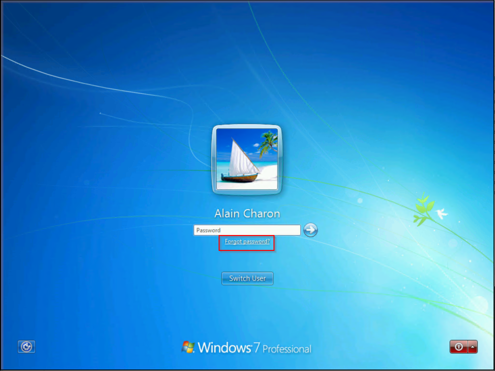
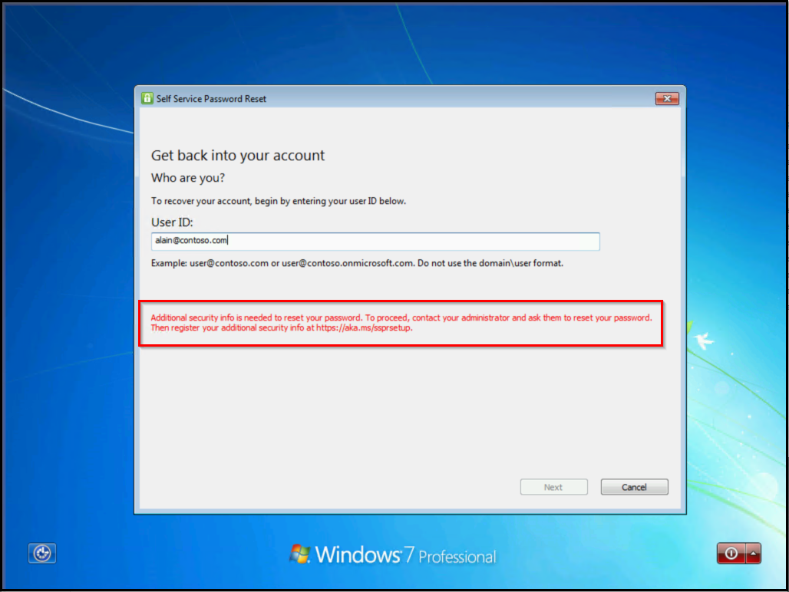

# How to: Enable password reset from Windows 7, 8, and 8.1

As an administrator you have enabled self-service password reset (SSPR), but users keep calling the helpdesk to reset their password because they can't get to a browser window to access the [SSPR portal](https://aka.ms/sspr). For Windows 10 machines, you can enable the "Reset password" link at the logon screen using the tutorial [Azure AD password reset from the login screen](tutorial-sspr-windows.md), the following guidance, will help you to enable Windows 7, 8, and 8.1 users to reset their password using SSPR at the Windows logon screen.

Unlike Windows 10 machines, Windows 7, 8, and 8.1 machines do not have an Azure AD domain-joined or Active Directory domain-joined requirement for password reset.



## Prerequisites

* Azure AD self-service password reset must be enabled.
* Patched Windows 7 or Windows 8.1 Operating System.
* TLS 1.2 enabled using the guidance found in [Transport Layer Security (TLS) registry settings](https://docs.microsoft.com/windows-server/security/tls/tls-registry-settings#tls-12).

> [!WARNING]
> TLS 1.2 must be enabled, not just set to auto negotiate.

## Install

1. Download the appropriate installer for the version of Windows you would like to enable.

   1. Software is available on the Microsoft download center at [https://aka.ms/sspraddin](https://aka.ms/sspraddin)

1. Sign in to the machine where you would like to install, and run the installer.
1. After installation, a reboot is highly recommended.
1. After the reboot, at the logon screen choose a user and click "Forgot password?" to initiate the password reset workflow.
1. Complete the workflow following the onscreen steps to reset your password.


### Silent installation

* For silent install, use the command “msiexec /i SsprWindowsLogon.PROD.msi /qn”
* For silent uninstall, use the command “msiexec /x SsprWindowsLogon.PROD.msi /qn”

## Caveats

You must register for SSPR before you will be able to use the "Forgot password" link.



Using the Microsoft Authenticator app for notifications and codes to reset your password does not work in this initial release. Users must have alternate methods registered that meet the requirements of your policy.

## Troubleshooting

Events will be logged both on the machine and in Azure AD.

Azure AD Events will include information about the IP address and ClientType where the password reset occurred.


If additional logging is required, a registry key on the machine can be changed to enable verbose logging. Enable verbose logging for troubleshooting purposes only.

```
HKLM\SOFTWARE\Microsoft\Windows\CurrentVersion\Authentication\Credential Providers\{86D2F0AC-2171-46CF-9998-4E33B3D7FD4F}
```

* To enable verbose logging, create a REG_DWORD: “EnableLogging”, and set it to 1.
* To disable verbose logging, change the REG_DWORD “EnableLogging” to 0.

## Next steps

[Enable Windows 10 users to reset their password at the logon screen](tutorial-sspr-windows.md)