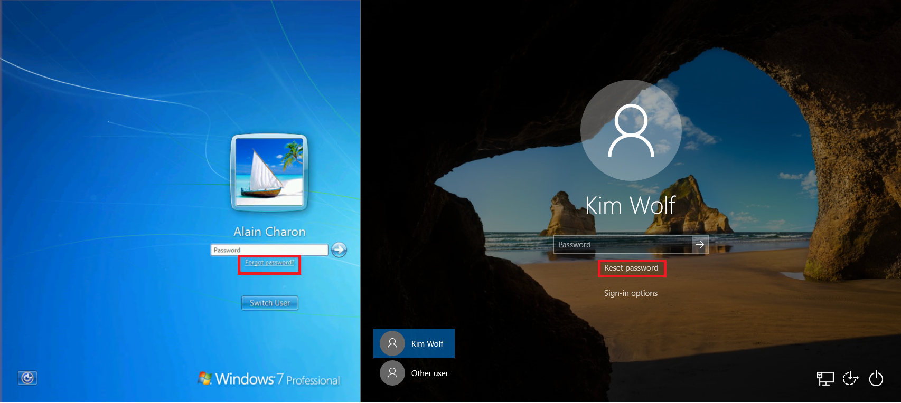
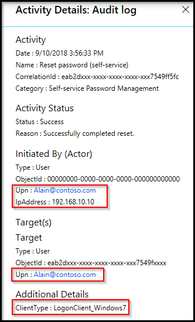
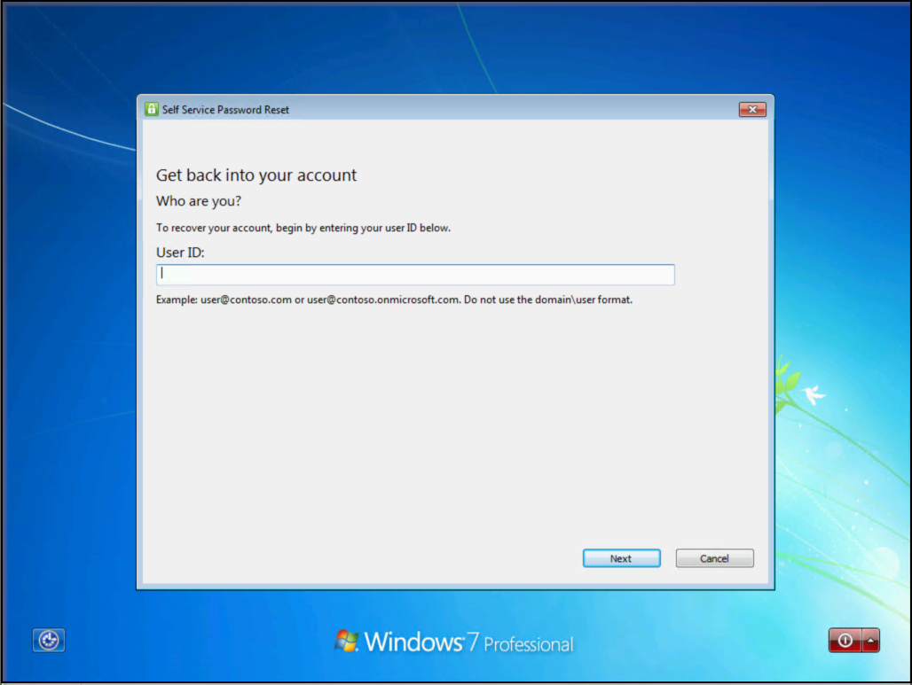

# Enable Microsoft Entra self-service password reset at the Windows sign-in screen

Self-service password reset (SSPR) gives users in Microsoft Entra ID the ability to change or reset their password, with no administrator or help desk involvement. Typically, users open a web browser on another device to access the [SSPR portal](https://aka.ms/sspr). To improve the experience on computers that run Windows 7, 8, 8.1, 10, and 11 you can enable users to reset their password at the Windows sign-in screen.



> [!IMPORTANT]
> This tutorial shows an administrator how to enable SSPR for Windows devices in an enterprise.
>
> If your IT team hasn't enabled the ability to use SSPR from your Windows device or you have problems during sign-in, reach out to your helpdesk for additional assistance.

## General limitations

The following limitations apply to using SSPR from the Windows sign-in screen:

- Password reset isn't currently supported from a Remote Desktop or from Hyper-V enhanced sessions.
- Some third party credential providers are known to cause problems with this feature.
- Disabling UAC via modification of [EnableLUA registry key](/openspecs/windows_protocols/ms-gpsb/958053ae-5397-4f96-977f-b7700ee461ec) is known to cause issues.
- This feature doesn't work for networks with 802.1x network authentication deployed and the option "Perform immediately before user logon". For networks with 802.1x network authentication deployed, it's recommended to use machine authentication to enable this feature.
- Microsoft Entra hybrid joined machines must have network connectivity line of sight to a domain controller to use the new password and update cached credentials. This means that devices must either be on the organization's internal network or on a VPN with network access to an on-premises domain controller.
- If using an image, prior to running sysprep ensure that the web cache is cleared for the built-in Administrator prior to performing the CopyProfile step. More information about this step can be found in the support article [Performance poor when using custom default user profile](https://support.microsoft.com/help/4056823/performance-issue-with-custom-default-user-profile).
- The following settings are known to interfere with the ability to use and reset passwords on Windows 10 devices:
    - If lock screen notifications are turned off, **Reset password** won't work.
    - *HideFastUserSwitching* is set to enabled or 1
    - *DontDisplayLastUserName* is set to enabled or 1
    - *NoLockScreen* is set to enabled or 1
    - *BlockNonAdminUserInstall* is set to enabled or 1
    - *EnableLostMode* is set on the device
    - Explorer.exe is replaced with a custom shell
    - Interactive logon: Require smart card is set to enabled or 1
- The combination of the following specific three settings can cause this feature to not work.
    - Interactive logon: Do not require CTRL+ALT+DEL = Disabled (only for Windows 10 version 1710 and earlier)
    - *DisableLockScreenAppNotifications* = 1 or Enabled
    - Windows SKU is Home edition

> [!NOTE]
> These limitations also apply to Windows Hello for Business PIN reset from the device lock screen.
>

## Windows 11 and Windows 10 password reset

To configure a Windows 11 or Windows 10 device for SSPR at the sign-in screen, review the following prerequisites and configuration steps.

### Windows 11 and Windows 10 prerequisites

- Sign in to the [Microsoft Entra admin center](https://entra.microsoft.com) as at least an [Authentication Policy Administrator](../roles/permissions-reference.md#authentication-policy-administrator) and [enable Microsoft Entra self-service password reset](tutorial-enable-sspr.md).
- Users must register for SSPR before using this feature at [https://aka.ms/ssprsetup](https://aka.ms/ssprsetup)
    - Not unique to using SSPR from the Windows sign-in screen, all users must provide the authentication contact information before they can reset their password.
- Network proxy requirements:
    - Port 443 to `passwordreset.microsoftonline.com` and `ajax.aspnetcdn.com`
    - Windows 10 devices require a machine-level proxy configuration or scoped proxy configuration for the temporary defaultuser1 account used to perform SSPR (see [Troubleshooting](#proxy-configurations-for-windows-password-reset) section for more details).
- Run at least Windows 10, version April 2018 Update (v1803), and the devices must be either:
    - Microsoft Entra joined
    - Microsoft Entra hybrid joined

### Enable for Windows 11 and Windows 10 using Microsoft Intune

Deploying the configuration change to enable SSPR from the login screen using Microsoft Intune is the most flexible method. Microsoft Intune allows you to deploy the configuration change to a specific group of machines you define. This method requires Microsoft Intune enrollment of the device.

#### Create a device configuration policy in Microsoft Intune

1. Sign in to the [Microsoft Intune admin center](https://go.microsoft.com/fwlink/?linkid=2109431).
1. Create a new device configuration profile by going to **Device configuration** > **Profiles**, then select **+ Create Profile**
   - For **Platform** choose *Windows 10 and later*
   - For **Profile type**, choose Templates then select the Custom template below
1. Select **Create**, then provide a meaningful name for the profile, such as *Windows 11 sign-in screen SSPR*

    Optionally, provide a meaningful description of the profile, then select **Next**.
1. Under *Configuration settings*, select **Add** and provide the following OMA-URI setting to enable the reset password link:
      - Provide a meaningful name to explain what the setting is doing, such as *Add SSPR link*.
      - Optionally provide a meaningful description of the setting.
      - **OMA-URI** set to `./Device/Vendor/MSFT/Policy/Config/Authentication/AllowAadPasswordReset`
      - **Data type** set to **Integer**
      - **Value** set to **1**

    Select **Add**, then **Next**.
1. The policy can be assigned to specific users, devices, or groups. Assign the profile as desired for your environment, ideally to a test group of devices first, then select **Next**.

    For more information, see [Assign user and device profiles in Microsoft Intune](/mem/intune/configuration/device-profile-assign).

1. Configure applicability rules as desired for your environment, such as to *Assign profile if OS edition is Windows 10 Enterprise*, then select **Next**.
1. Review your profile, then select **Create**.

### Enable for Windows 11 and Windows 10 using the Registry

To enable SSPR at the sign-in screen using a registry key, complete the following steps:

1. Sign in to the Windows PC using administrative credentials.
1. Press **Windows** + **R** to open the *Run* dialog, then run **regedit** as an administrator
1. Set the following registry key:

    ```cmd
    HKEY_LOCAL_MACHINE\SOFTWARE\Policies\Microsoft\AzureADAccount
       "AllowPasswordReset"=dword:00000001
    ```

### Troubleshooting Windows 11 and Windows 10 password reset

If you have problems with using SSPR from the Windows sign-in screen, the Microsoft Entra audit log includes information about the IP address and *ClientType* where the password reset occurred, as shown in the following example output:



When users reset their password from the sign-in screen of a Windows 11 or 10 device, a low-privilege temporary account called `defaultuser1` is created. This account is used to keep the password reset process secure.

The account itself has a randomly generated password, which is validated against an organizations password policy, doesn't show up for device sign-in, and is automatically removed after the user resets their password. Multiple `defaultuser` profiles may exist but can be safely ignored.

#### Proxy configurations for Windows password reset

During the password reset, SSPR creates a temporary local user account to connect to `https://passwordreset.microsoftonline.com/n/passwordreset`. When a proxy is configured for user authentication, it may fail with the error **"Something went wrong. Please, try again later."** This is because the local user account is not authorized to use the authenticated proxy. 

In this case, you can use one of the following workarounds:

- Configure a machine-wide proxy setting that doesn't depend on the type of user logged into the machine. For example, you can enable the Group Policy **Make proxy settings per-machine (rather than per-user)** for the workstations.
- You can also use Per-User proxy configuration for SSPR if you modify the registry template for the Default Account. The commands are as follows:
    
    ```cmd
    reg load "hku\Default" "C:\Users\Default\NTUSER.DAT"
    reg add "hku\Default\SOFTWARE\Microsoft\Windows\CurrentVersion\Internet Settings" /v ProxyEnable /t REG_DWORD /d "1" /f
    reg add "hku\Default\SOFTWARE\Microsoft\Windows\CurrentVersion\Internet Settings" /v ProxyServer /t REG_SZ /d "<your proxy:port>" /f
    reg unload "hku\Default"
    ```

- The error **"Something went wrong"** can also occur when anything interrupts connectivity to URL `https://passwordreset.microsoftonline.com/n/passwordreset`. For example, this error can occur when antivirus software runs on the workstation without exclusions for URLs `passwordreset.microsoftonline.com`, `ajax.aspnetcdn.com`, and `ocsp.digicert.com`. Disable this software temporarily to test if the issue is resolved or not.


## Windows 7, 8, and 8.1 password reset

To configure a Windows 7, 8, or 8.1 device for SSPR at the sign-in screen, review the following prerequisites and configuration steps.

### Windows 7, 8, and 8.1 prerequisites

- Sign in to the [Microsoft Entra admin center](https://entra.microsoft.com) as at least an [Authentication Policy Administrator](../roles/permissions-reference.md#authentication-policy-administrator) and [enable Microsoft Entra self-service password reset](tutorial-enable-sspr.md).
- Users must register for SSPR before using this feature at [https://aka.ms/ssprsetup](https://aka.ms/ssprsetup)
    - Not unique to using SSPR from the Windows sign-in screen, all users must provide the authentication contact information before they can reset their password.
- Network proxy requirements:
    - Port 443 to `passwordreset.microsoftonline.com`
- Patched Windows 7 or Windows 8.1 Operating System.
- TLS 1.2 enabled using the guidance found in [Transport Layer Security (TLS) registry settings](/windows-server/security/tls/tls-registry-settings#tls-12).
- If more than one 3rd party credential provider is enabled on your machine, users see more than one user profile on the login screen.

> [!WARNING]
> TLS 1.2 must be enabled, not just set to auto negotiate.

### Install

For Windows 7, 8, and 8.1, a small component must be installed on the machine to enable SSPR at the sign-in screen. To install this SSPR component, complete the following steps:

1. Download the appropriate installer for the version of Windows you would like to enable.

    The software installer is available on the Microsoft download center at [https://aka.ms/sspraddin](https://aka.ms/sspraddin)
1. Sign in to the machine where you would like to install, and run the installer.
1. After installation, a reboot is highly recommended.
1. After the reboot, at the sign-in screen choose a user and select "Forgot password?" to initiate the password reset workflow.
1. Complete the workflow following the onscreen steps to reset your password.



#### Silent installation

The SSPR component can be installed or uninstalled without prompts using the following commands:

- For silent install, use the command "msiexec /i SsprWindowsLogon.PROD.msi /qn"
- For silent uninstall, use the command "msiexec /x SsprWindowsLogon.PROD.msi /qn"

#### Troubleshooting Windows 7, 8, and 8.1 password reset

If you have problems with using SSPR from the Windows sign-in screen, events are logged both on the machine and in Microsoft Entra ID. Microsoft Entra events include information about the IP address and ClientType where the password reset occurred, as shown in the following example output:


If additional logging is required, a registry key on the machine can be changed to enable verbose logging. Enable verbose logging for troubleshooting purposes only using the following registry key value:

```cmd
HKLM\SOFTWARE\Microsoft\Windows\CurrentVersion\Authentication\Credential Providers\{86D2F0AC-2171-46CF-9998-4E33B3D7FD4F}
```

- To enable verbose logging, create a `REG_DWORD: "EnableLogging"`, and set it to 1.
- To disable verbose logging, change the `REG_DWORD: "EnableLogging"` to 0.
- Review the debug logging in the Application event log under source AADPasswordResetCredentialProvider.

## What do users see

With SSPR configured for your Windows devices, what changes for the user? How do they know that they can reset their password at the login screen? The following example screenshots show the additional options for a user to reset their password using SSPR:


When users attempt to sign in, they see a **Reset password** or **Forgot password** link that opens the self-service password reset experience at the login screen. This functionality allows users to reset their password without having to use another device to access a web browser.

More information for users on using this feature can be found in [Reset your work or school password](https://support.microsoft.com/account-billing/reset-your-work-or-school-password-using-security-info-23dde81f-08bb-4776-ba72-e6b72b9dda9e)

## Next steps

To simplify the user registration experience, you can [pre-populate user authentication contact information for SSPR](howto-sspr-authenticationdata.md).
