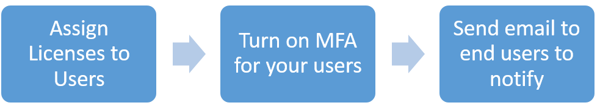
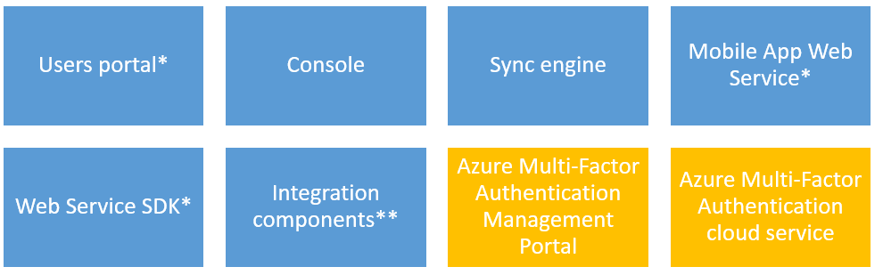

# Security guidance for using Azure Multi-Factor Authentication with Azure AD accounts

Two-step verification is the preferred choice for most organizations that want to enhance their authentication process. Azure Multi-Factor Authentication (MFA) helps companies meet their security and compliance requirements while providing a simple sign-in experience for their users. This article covers some tips that you should consider when planning for the adoption of Azure MFA.

## Deploy Azure MFA in the cloud

There are two ways to [enable Azure MFA for all your users](howto-mfa-getstarted.md).

* Buy licenses for each user (Either Azure MFA, Azure AD Premium, or Enterprise Mobility + Security)
* Create a Multi-Factor Auth Provider and pay per-user or per-authentication

### Licenses

If you have Azure AD Premium or Enterprise Mobility + Security licenses, you already have Azure MFA. Your organization doesn't need anything additional to extend the two-step verification capability to all users. You only need to assign a license to a user, and then you can turn on MFA.

When setting up Multi-Factor Authentication, consider the following tips:

* Do not create a per-authentication Multi-Factor Auth Provider. If you do, you could end up paying for verification requests from users that already have licenses.
* If you don't have enough licenses for all your users, you can create a per-user Multi-Factor Auth Provider to cover the rest of your organization. 
* Azure AD Connect is only required if you are synchronizing your on-premises Active Directory environment with an Azure AD directory. If you use an Azure AD directory that is not synchronized with an on-premises instance of Active Directory, you do not need Azure AD Connect.

### Multi-Factor Auth Provider

If you don't have licenses that include Azure MFA, then you can [create an MFA Auth Provider](concept-mfa-authprovider.md).

When creating the Auth Provider, you need to select a directory and consider the following details:

* You do not need an Azure AD directory to create a Multi-Factor Auth Provider, but you get more functionality with one. The following features are enabled when you associate the Auth Provider with an Azure AD directory:
  * Extend two-step verification to all your users
  * Offer your global administrators additional features, such as the management portal, custom greetings, and reports.
* If you synchronize your on-premises Active Directory environment with an Azure AD directory, you need DirSync or AAD Sync. If you use an Azure AD directory that is not synchronized with an on-premises instance of Active Directory, you do not need DirSync or AAD Sync.
* Choose the consumption model that best suits your business. Once you select the usage model, you can’t change it. The two models are:
  * Per authentication: charges you for each verification. Use this model if you want two-step verification for anyone that accesses a certain app, not for specific users.
  * Per enabled user: charges you for each user that you enable for Azure MFA. Use this model if you have some users with Azure AD Premium or Enterprise Mobility Suite licenses, and some without.

### Supportability

Since most users are accustomed to using only passwords to authenticate, it is important that your company brings awareness to all users regarding this process. This awareness can reduce the likelihood that users call your help desk for minor issues related to MFA. However, there are some scenarios where temporarily disabling MFA is necessary. Use the following guidelines to understand how to handle those scenarios:

* Train your technical support staff to handle scenarios where the user can't sign in because the mobile app or phone is not receiving a notification or phone call. Technical support can [enable a one-time bypass](howto-mfa-mfasettings.md#one-time-bypass) to allow a user to authenticate a single time by "bypassing" two-step verification. The bypass is temporary and expires after a specified number of seconds.
* Consider the [Trusted IPs capability](howto-mfa-mfasettings.md#trusted-ips) in Azure MFA as a way to minimize two-step verification. With this feature, administrators of a managed or federated tenant can bypass two-step verification for users that are signing in from the company’s local intranet. The features are available for Azure AD tenants that have Azure AD Premium, Enterprise Mobility Suite, or Azure Multi-Factor Authentication licenses.

## Best Practices for an on-premises deployment

If your company decided to leverage its own infrastructure to enable MFA, then you need to [deploy an Azure Multi-Factor Authentication Server on-premises](howto-mfaserver-deploy.md). The MFA Server components are shown in the following diagram:

\*Not installed by default
\**Installed but not enabled by default

Azure Multi-Factor Authentication Server can secure cloud resources and on-premises resources by using federation. You must have AD FS and have it federated with your Azure AD tenant.
When setting up Multi-Factor Authentication Server, consider the following details:

* If you are securing Azure AD resources using Active Directory Federation Services (AD FS), then the first verification step is performed on-premises using AD FS. The second step is performed on-premises by honoring the claim.
* You don't have to install the Azure Multi-Factor Authentication Server your AD FS federation server. However, the Multi-Factor Authentication Adapter for AD FS must be installed on a Windows Server 2012 R2 running AD FS. You can install the server on a different computer, as long as it is a supported version, and install the AD FS adapter separately on your AD FS federation server. 
* The Multi-Factor Authentication AD FS Adapter installation wizard creates a security group called PhoneFactor Admins in your Active Directory, and then adds your AD FS service account to this group. Verify that the PhoneFactor Admins group was created on your domain controller, and that the AD FS service account is a member of this group. If necessary, add the AD FS service account to the PhoneFactor Admins group on your domain controller manually.

### User Portal

The user portal allows self-service capabilities and provides a full set of user administration capabilities. It runs in an Internet Information Server (IIS) web site. Use the following guidelines to configure this component:

* Use IIS 6 or greater
* Install and register ASP.NET v2.0.507207
* Ensure that this server can be deployed in a perimeter network

### App Passwords

If your organization is federated for SSO with Azure AD and you are going to be using Azure MFA, then be aware of the following details:

* The app password is verified by Azure AD and therefore bypasses federation. Federation is only used when setting up app passwords.
* For federated (SSO) users, passwords are stored in the organizational ID. If the user leaves the company, that info has to flow to organizational ID using DirSync. Account disable/deletion may take up to three hours to sync, which delays disable/deletion of app passwords in Azure AD.
* On-premises Client Access Control settings are not honored by App Password.
* No on-premises authentication logging/auditing capability is available for app passwords.
* Certain advanced architectural designs may require using a combination of organizational username and passwords and app passwords when using two-step verification with clients, depending on where they authenticate. For clients that authenticate against an on-premises infrastructure, you would use an organizational username and password. For clients that authenticate against Azure AD, you would use the app password.
* By default, users cannot create app passwords. If you need to allow users to create app passwords, select the **Allow users to create app passwords to sign into non-browser applications** option.

## Additional Considerations

Use this list for additional considerations and guidance for each component that is deployed on-premises:

* Set up Azure Multi-Factor Authentication with [Active Directory Federation Service](multi-factor-authentication-get-started-adfs.md).
* Set up and configure the Azure MFA Server with [RADIUS Authentication](howto-mfaserver-dir-radius.md).
* Set up and configure the Azure MFA Server with [IIS Authentication](howto-mfaserver-iis.md).
* Set up and configure the Azure MFA Server with [Windows Authentication](howto-mfaserver-windows.md).
* Set up and configure the Azure MFA Server with [LDAP Authentication](howto-mfaserver-dir-ldap.md).
* Set up and configure the Azure MFA Server with [Remote Desktop Gateway and Azure Multi-Factor Authentication Server using RADIUS](howto-mfaserver-nps-rdg.md).
* Set up and configure synchronization between the Azure MFA Server and [Windows Server Active Directory](howto-mfaserver-dir-ad.md).
* [Deploy the Azure Multi-Factor Authentication Server Mobile App Web Service](howto-mfaserver-deploy-mobileapp.md).
* [Advanced VPN Configuration with Azure Multi-Factor Authentication](howto-mfaserver-nps-vpn.md) for Cisco ASA, Citrix Netscaler, and Juniper/Pulse Secure VPN appliances using LDAP or RADIUS.

## Next steps

While this article highlights some best practices for Azure MFA, there are other resources that you can also use while planning your MFA deployment. The list below has some key articles that can assist you during this process:

* [Reports in Azure Multi-Factor Authentication](howto-mfa-reporting.md)
* [The two-step verification registration experience](../user-help/multi-factor-authentication-end-user-first-time.md)
* [Azure Multi-Factor Authentication FAQ](multi-factor-authentication-faq.md)
