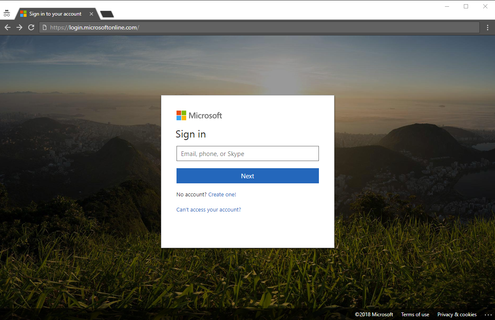

# What methods are available for authentication?

We hear reports in the news, passwords being stolen, and identities being compromised. Requiring a second factor in addition to a password immediately increases the security of your organization. Microsoft Azure Active Directory (Azure AD) includes features, like Azure Multi-Factor Authentication (Azure MFA) and Azure AD self-service password reset (SSPR), to help administrators protect their organizations and users with additional authentication methods.

There are many scenarios that include: signing in to an application, resetting their password, enabling Windows Hello, and others, your users may be asked to provide additional verification that they are who they say they are.

Additional verification may come in the form of authentication methods such as:

* A code provided in an email or text message
* A phone call
* A notification or code on their phone
* Answers to security questions

Azure MFA and Azure AD self-service password reset give administrators control over configuration, policy, monitoring, and reporting using Azure AD and the Azure portal to protect their organizations.

## Self-service password reset

Self-service password reset provides your users the ability to reset their password, with no administrator intervention, when and where they need to.

> [!VIDEO https://www.youtube.com/embed/hc97Yx5PJiM]

Self-service password reset includes:

* **Password change:** I know my password but want to change it to something new.
* **Password reset:** I can't sign in and want to reset my password using one or more approved authentication methods.
* **Account unlock:** I can't sign in because my account is locked out and I want to unlock using one or more approved authentication methods.

## Multi-Factor Authentication

Azure Multi-Factor Authentication (MFA) is Microsoft's two-step verification solution. Using administrator approved authentication methods, Azure MFA helps safeguard your access to data and applications, while meeting the demand for a simple sign-in process.

## License requirements

[!INCLUDE [Active Directory P1 license](../../../includes/active-directory-p1-license.md)]

## Next steps

The next step is to dive in and configure self-service password reset and Azure Multi-Factor Authentication.

To get started with self-service password reset, see the [enable SSPR quickstart article](quickstart-sspr.md).

Learn more about self-service password reset in the article, [How it works: Azure AD self-service password reset](concept-sspr-howitworks.md)

Learn more about Azure Multi-Factor Authentication in the article, [How it works: Azure Multi-Factor Authentication](concept-mfa-howitworks.md)
