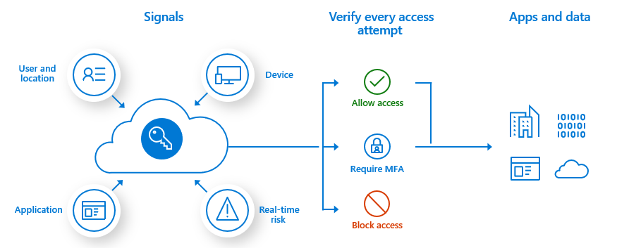
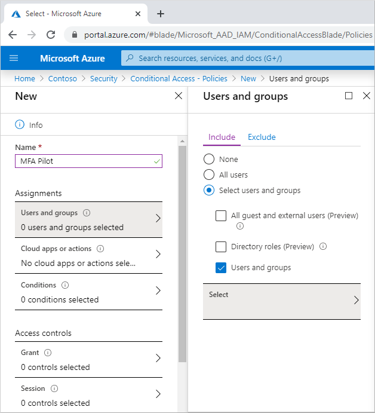
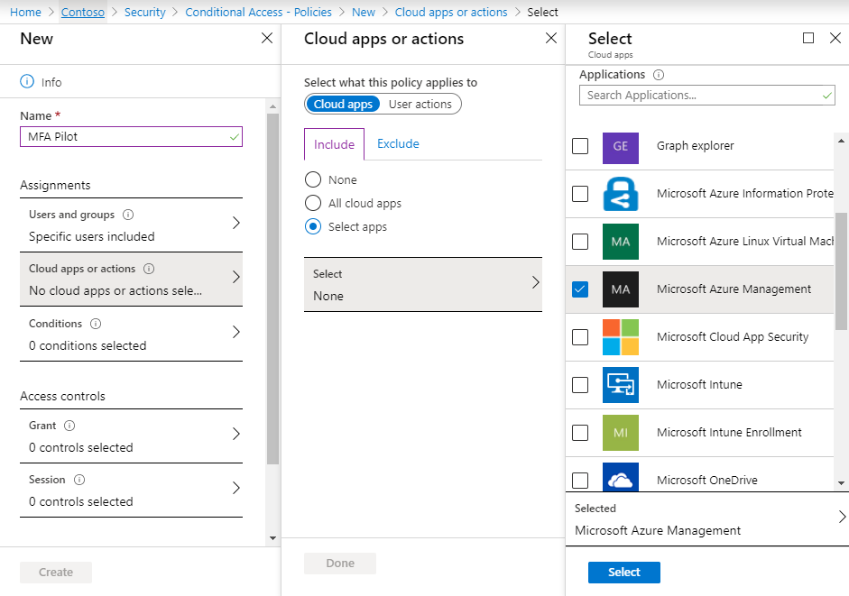
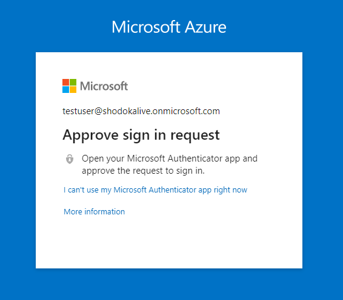

# Tutorial: Secure user sign-in events with Azure Multi-Factor Authentication

Multi-factor authentication (MFA) is a process where a user is prompted during a sign-in event for additional forms of identification. This prompt could be to enter a code on their cellphone or to provide a fingerprint scan. When you require a second form of authentication, security is increased as this additional factor isn't something that's easy for an attacker to obtain or duplicate.

Azure Multi-Factor Authentication and Conditional Access policies give the flexibility to enable MFA for users during specific sign-in events.

In this tutorial you learn how to:

> [!div class="checklist"]
> * Create a Conditional Access policy to enable Azure Multi-Factor Authentication for a group of users
> * Configure the policy conditions that prompt for MFA
> * Test the MFA process as a user

## Prerequisites

To complete this tutorial, you need the following resources and privileges:

* A working Azure AD tenant with Azure AD Premium or trial license enabled.
    * If needed, [create one for free](https://azure.microsoft.com/free/?WT.mc_id=A261C142F).
* An account with *global administrator* privileges.
* A non-administrator user with a password you know, such as *testuser*. You test the end-user Azure Multi-Factor Authentication experience using this account in this tutorial.
    * If you need to create a user, see [Quickstart: Add new users to Azure Active Directory](../add-users-azure-active-directory.md).
* A group that the non-administrator user is a member of, such as *MFA-Test-Group*. You enable Azure Multi-Factor Authentication for this group in this tutorial.
    * If you need to create a group, see how to [Create a group and add members in Azure Active Directory](../active-directory-groups-create-azure-portal.md).

## Create a Conditional Access policy

The recommended way to enable and use Azure Multi-Factor Authentication is with Conditional Access policies. Conditional Access lets you create and define policies that react to sign in events and request additional actions before a user is granted access to an application or service.

Conditional Access policies can be granular and specific, with the goal to empower users to be productive wherever and whenever, but also protect your organization. In this tutorial, let's create a basic Conditional Access policy to prompt for MFA when a user signs in to the Azure portal. In a later tutorial in this series, you configure Azure Multi-Factor Authentication using a risk-based Conditional Access policy.

First, create a Conditional Access policy and assign your test group of users as follows:

1. Sign in to the [Azure portal](https://portal.azure.com) using an account with *global administrator* permissions.
1. Search for and select **Azure Active Directory**, then choose **Security** from the menu on the left-hand side.
1. Select **Conditional Access**, then choose **+ New policy**.
1. Enter a name for the policy, such as *MFA Pilot*.
1. Under **Assignments**, choose **Users and groups**, then the **Select users and groups** radio button.
1. Check the box for **Users and groups**, then **Select** to browse the available Azure AD users and groups.
1. Browse for and select your Azure AD group, such as *MFA-Test-Group*, then choose **Select**.

    

1. To apply the Conditional Access policy for the group, select **Done**.

## Configure the conditions for multi-factor authentication

With the Conditional Access policy created and a test group of users assigned, now define the cloud apps or actions that trigger the policy. These cloud apps or actions are the scenarios you decide require additional processing, such as to prompt for MFA. For example, you could decide that access to a financial application or use of management tools requires as an additional verification prompt.

For this tutorial, configure the Conditional Access policy to require MFA when a user signs in to the Azure portal.

1. Select **Cloud apps or actions**. You can choose to apply the Conditional Access policy to *All cloud apps* or *Select apps*. To provide flexibility, you can also exclude certain apps from the policy.

    For this tutorial, on the *Include* page, choose the **Select apps** radio button.

1. Choose **Select**, then browse the list of available sign-in events that can be used.

    For this tutorial, choose **Microsoft Azure Management** so the policy applies to sign-in events to the Azure portal.

1. To apply the select apps, choose **Select**, then **Done**.

    

Access controls let you define the requirements for a user to be granted access, such as needing an approved client app or using a device that's Hybrid Azure AD joined. In this tutorial, configure the access controls to require MFA during a sign-in event to the Azure portal.

1. Under *Access controls*, choose **Grant**, then make sure the **Grant access** radio button is selected.
1. Check the box for **Require multi-factor authentication**, then choose **Select**.

Conditional Access policies can be set to *Report-only* if you want to see how the configuration would impact users, or *Off* if you don't want to the use policy right now. As a test group of users was targeted for this tutorial, lets enable the policy and then test Azure Multi-Factor Authentication.

1. Set the *Enable policy* toggle to **On**.
1. To apply the Conditional Access policy, select **Create**.

## Test Azure Multi-Factor Authentication

Let's see your Conditional Access policy and Azure Multi-Factor Authentication in action. First, sign in to a resource that doesn't require MFA as follows:

1. Open a new browser window in InPrivate or incognito mode and browse to [https://account.activedirectory.windowsazure.com](https://account.activedirectory.windowsazure.com)
1. Sign in with your non-administrator test user, such as *testuser*. There's no prompt for you to complete MFA.
1. Close the browser window.

Now sign in to the Azure portal. As the Azure portal was configured in the Conditional Access policy to require additional verification, you get an Azure Multi-Factor Authentication prompt.

1. Open a new browser window in InPrivate or incognito mode and browse to [https://portal.azure.com](https://portal.azure.com).
1. Sign in with your non-administrator test user, such as *testuser*. You're required to register for and use Azure Multi-Factor Authentication. Follow the prompts to complete the process and verify you successfully sign in to the Azure portal.

    

1. Close the browser window.

## Clean up resources

If you no longer want to use the Conditional Access policy to enable Azure Multi-Factor Authentication configured as part of this tutorial, delete the policy using the following steps:

1. Sign in to the [Azure portal](https://portal.azure.com).
1. Search for and select **Azure Active Directory**, then choose **Security** from the menu on the left-hand side.
1. Select **Conditional access**, then choose the policy you created, such as *MFA Pilot*
1. Choose **Delete**, then confirm you wish to delete the policy.

## Next steps

In this tutorial, you enabled Azure Multi-Factor Authentication using Conditional Access policies for a selected group of users. You learned how to:

> [!div class="checklist"]
> * Create a Conditional Access policy to enable Azure Multi-Factor Authentication for a group of Azure AD users
> * Configure the policy conditions that prompt for MFA
> * Test the MFA process as a user

> [!div class="nextstepaction"]
> [Enable password writeback for self-service password reset (SSPR)](tutorial-enable-writeback.md)
