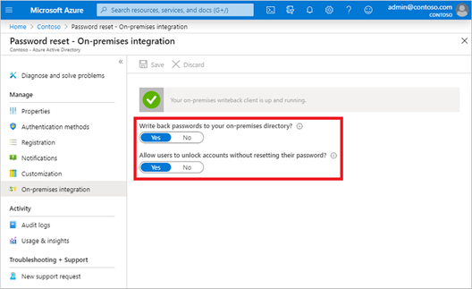

# Tutorial: Enable cloud sync self-service password reset writeback to an on-premises environment (preview)

Azure Active Directory Connect cloud sync can synchronize Azure AD password changes in real time between users in disconnected on-premises Active Directory Domain Services (AD DS) domains. The public preview of Azure AD Connect cloud sync can run side-by-side with [Azure Active Directory Connect](tutorial-enable-sspr-writeback.md) at the domain level to simplify password writeback for additional scenarios, such as users who are in disconnected domains because of a company split or merge. You can configure each service in different domains to target different sets of users depending on their needs. Azure Active Directory Connect cloud sync uses the lightweight Azure AD cloud provisioning agent to simplify the setup for self-service password reset (SSPR) writeback and provide a secure way to send password changes in the cloud back to an on-premises directory. 

Azure Active Directory Connect cloud sync self-service password reset writeback is supported as part of a public preview. For more information about previews, see [Supplemental Terms of Use for Microsoft Azure Previews](https://azure.microsoft.com/support/legal/preview-supplemental-terms/).

## Prerequisites 

- An Azure AD tenant with at least an Azure AD Premium P1 or trial license enabled. If needed, [create one for free](https://azure.microsoft.com/free/?WT.mc_id=A261C142F). 
- An account with either:
  - [Authentication Policy Administrator](../roles/permissions-reference.md#authentication-policy-administrator) and [Hybrid Identity Administrator](../roles/permissions-reference.md#hybrid-identity-administrator) roles
  - [Global Administrator](../roles/permissions-reference.md#global-administrator) role 
- Azure AD configured for self-service password reset. If needed, complete this tutorial to enable Azure AD SSPR. 
- An on-premises AD DS environment configured with Azure AD Connect cloud sync version 1.1.587 or later. Learn how to [identify the agent's current version](../cloud-sync/how-to-automatic-upgrade.md). If needed, configure Azure AD Connect cloud sync using [this tutorial](tutorial-enable-sspr.md). 
- Enabling password writeback in Azure AD Connect cloud sync requires executing signed PowerShell scripts.
  - Ensure that the PowerShell execution policy will allow running of scripts. 
  - The recommended execution policy during installation is "RemoteSigned". 
  - For more information about setting the PowerShell execution policy, see [Set-ExecutionPolicy](/powershell/module/microsoft.powershell.security/set-executionpolicy). 


## Deployment steps

1. [Configure Azure AD Connect cloud sync service account permissions](#configure-azure-ad-connect-cloud-sync-service-account-permissions)
1. [Enable password writeback in Azure AD Connect cloud sync](#enable-password-writeback-in-azure-ad-connect-cloud-sync)
1. [Enable password writeback for SSPR](#enable-password-writeback-for-sspr)
 
### Configure Azure AD Connect cloud sync service account permissions 

Permissions for cloud sync are configured by default. If permissions need to be reset, see [Troubleshooting](#troubleshooting) for more details about the specific permissions required for password writeback and how to set them by using PowerShell. 

### Enable password writeback in Azure AD Connect cloud sync

For public preview, you need to enable password writeback in Azure AD Connect cloud sync by running `Set-AADCloudSyncPasswordWritebackConfiguration` on any server with the provisioning agent. You will need global administrator credentials: 

```powershell
Import-Module 'C:\\Program Files\\Microsoft Azure AD Connect Provisioning Agent\\Microsoft.CloudSync.Powershell.dll' 
Set-AADCloudSyncPasswordWritebackConfiguration -Enable $true -Credential $(Get-Credential)
``` 

### Enable password writeback for SSPR 

With password writeback enabled in Azure AD Connect cloud sync, now verify, and configure Azure AD self-service password reset (SSPR) for password writeback. When you enable SSPR to use password writeback, users who change or reset their password have that updated password synchronized back to the on-premises AD DS environment as well. 

To verify and enable password writeback in SSPR, complete the following steps: 

1. Sign into the Azure portal using a [Hybrid Identity Administrator](../roles/permissions-reference.md#hybrid-identity-administrator) account. 
1. Navigate to Azure Active Directory, select **Password reset**, then choose **On-premises integration**. 
1. Verify the Azure AD Connect cloud sync agent set up is complete.
1. Set **Write back passwords to your on-premises directory?** to **Yes**. 
1. Set **Allow users to unlock accounts without resetting their password?** to **Yes**.
   
   

1. When ready, select **Save**. 

## Clean up resources

If you no longer want to use the SSPR password writeback functionality you have configured as part of this document, complete the following steps: 

1. Sign into the Azure portal using a [Hybrid Identity Administrator](../roles/permissions-reference.md#hybrid-identity-administrator) account. 
1. Search for and select Azure Active Directory, select **Password reset**, then choose **On-premises integration**. 
1. Set **Write back passwords to your on-premises directory?** to **No**. 
1. Set **Allow users to unlock accounts without resetting their password?** to **No**. 

From your Azure AD Connect cloud sync server, run `Set-AADCloudSyncPasswordWritebackConfiguration` using Hybrid Identity Administrator credentials to disable password writeback with Azure AD Connect cloud sync. 

```powershell
Import-Module ‘C:\\Program Files\\Microsoft Azure AD Connect Provisioning Agent\\Microsoft.CloudSync.Powershell.dll’ 
Set-AADCloudSyncPasswordWritebackConfiguration -Enable $false -Credential $(Get-Credential)
```

## Supported operations

Passwords are written back in the following situations for end-users and administrators.


| Account        | Supported operations | 
|----------------|------------------------|
| End users      |  Any end-user self-service voluntary change password operation.<br>Any end-user self-service force change password operation, for example, password expiration.<br>Any end-user self-service password reset that originates from the password reset portal. |
| Administrators |  Any administrator self-service voluntary change password operation.<br>Any administrator self-service force change password operation, for example, password expiration.<br>Any administrator self-service password reset that originates from the password reset portal.<br> Any administrator-initiated end-user password reset from the Azure portal.<br>Any administrator-initiated end-user password reset from the Microsoft Graph API.                       |

## Unsupported operations

Passwords aren't written back in the following situations.

| Account        | Unsupported operations | 
|----------------|------------------------|
| End users      | Any end user resetting their own password by using PowerShell cmdlets or the Microsoft Graph API.                        |
| Administrators | Any administrator-initiated end-user password reset by using PowerShell cmdlets.<br>Any administrator-initiated end-user password reset from the Microsoft 365 admin center.<br>Any administrator cannot use password reset tool to reset their own password, or any other Administrator in Azure AD for password writeback.                        |

## Validation scenarios

Try the following operations to validate scenarios using password writeback. All validation scenarios require cloud sync is installed and the user is in scope for password writeback.  


|Scenario|Details |
|--------|--------|
| Reset password from the login page | Have two users from disconnected domains and forests perform SSPR. You could also have Azure AD Connect and cloud sync deployed side-by-side and have one user in the scope of cloud sync configuration and another in scope of Azure AD Connect and have those users reset their password. |
| Force expired password change | Have two users from disconnected domains and forests change expired passwords. You could also have Azure AD Connect and cloud sync deployed side-by-side and have one user in the scope of cloud sync configuration and another in scope of Azure AD Connect. |
| Regular password change | Have two users from disconnected domains and forests perform routine password change. You could also have Azure AD Connect and cloud sync side by side and have one user in the scope of cloud sync config and another in scope of Azure AD Connect.  |
| Admin reset user password | Have two users disconnected domains and forests reset their password from the Azure Admin Portal or Frontline worker portal. You could also have Azure AD Connect and cloud sync side by side and have one user in the scope of cloud sync config and another in scope of Azure AD Connect  |
| Self-service account unlock | Have two users from disconnected domains and forests unlock accounts in the SSPR portal resetting the password. You could also have Azure AD Connect and cloud sync side by side and have one user in the scope of cloud sync config and another in scope of Azure AD Connect. |

## Troubleshooting

The Azure AD Connect cloud sync group Managed Service Account should have the following permissions set to writeback the passwords by default: 

- Reset password
- Write permissions on lockoutTime
- Write permissions on pwdLastSet
- Extended rights for "Unexpire Password" on the root object of each domain in that forest, if not already set. 

If these permissions are not set, you can set the PasswordWriteBack permission on the service account by using the Set-AADCloudSyncPermissions cmdlet and on-premises enterprise administrator credentials: 

```powershell
Import-Module ‘C:\\Program Files\\Microsoft Azure AD Connect Provisioning Agent\\Microsoft.CloudSync.Powershell.dll’ 
Set-AADCloudSyncPermissions -PermissionType PasswordWriteBack -EACredential $(Get-Credential)
```

After you have updated the permissions, it may take up to an hour or more for these permissions to replicate to all the objects in your directory. 

If you don't assign these permissions, writeback may appear to be configured correctly, but users may encounter errors when they update their on-premises passwords from the cloud. Permissions must be applied to “This object and all descendant objects” for "Unexpire Password" to appear. 

If passwords for some user accounts aren't written back to the on-premises directory, make sure that inheritance isn't disabled for the account in the on-prem AD DS environment. Write permissions for passwords must be applied to descendant objects for the feature to work correctly. 

Password policies in the on-premises AD DS environment may prevent password resets from being correctly processed. If you are testing this feature and want to reset password for users more than once per day, the group policy for Minimum password age must be set to 0. This setting can be found under Computer Configuration > Policies > Windows Settings > Security Settings > Account Policies within gpmc.msc. 

If you update the group policy, wait for the updated policy to replicate, or use the gpupdate /force command. 

For passwords to be changed immediately, Minimum password age must be set to 0. However, if users adhere to the on-premises policies, and the Minimum password age is set to a value greater than zero, password writeback will not work after the on-premises policies are evaluated. 

For more information about how to validate or set up the appropriate permissions, see [Configure account permissions for Azure AD Connect](tutorial-enable-sspr-writeback.md#configure-account-permissions-for-azure-ad-connect). 

## Next steps

- For more information about cloud sync and a comparison between Azure AD Connect and cloud sync, see [What is Azure AD Connect cloud sync?](../cloud-sync/what-is-cloud-sync.md)
- For a tutorial about setting up password writeback by using Azure AD Connect, see [Tutorial: Enable Azure Active Directory self-service password reset writeback to an on-premises environment](tutorial-enable-sspr-writeback.md).
