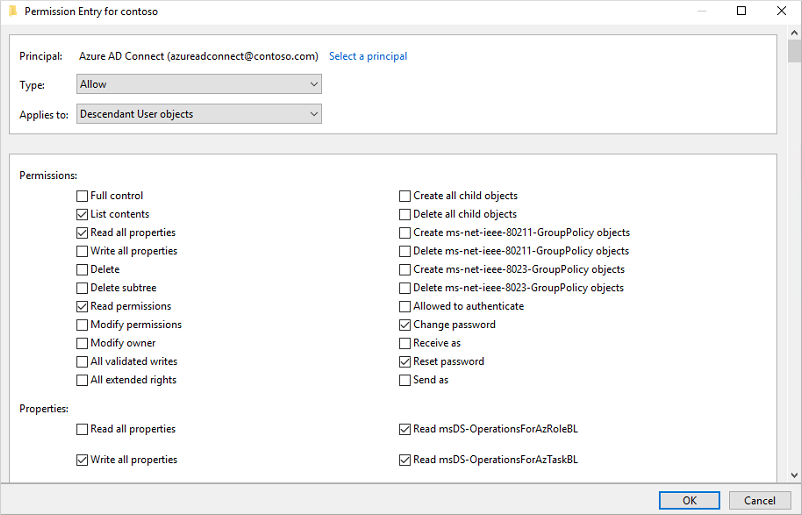
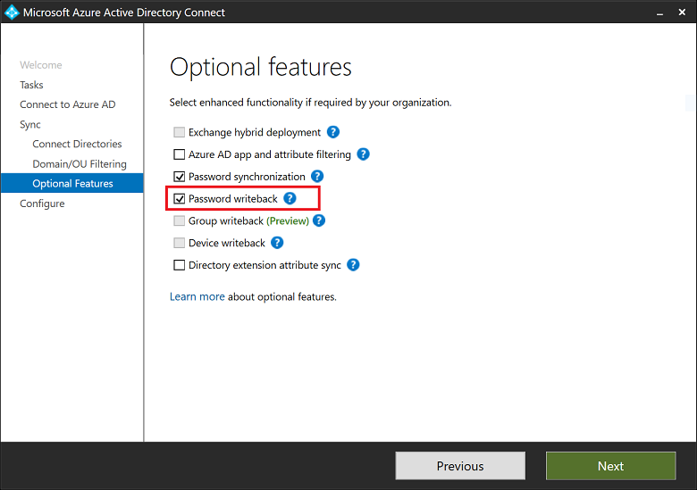
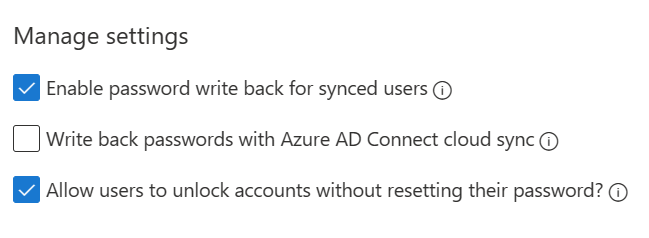

# Tutorial: Enable Microsoft Entra self-service password reset writeback to an on-premises environment

With Microsoft Entra self-service password reset (SSPR), users can update their password or unlock their account using a web browser. We recommend this video on [How to enable and configure SSPR in Microsoft Entra ID](https://www.youtube.com/watch?v=rA8TvhNcCvQ). In a hybrid environment where Microsoft Entra ID is connected to an on-premises Active Directory Domain Services (AD DS) environment, this scenario can cause passwords to be different between the two directories.

Password writeback can be used to synchronize password changes in Microsoft Entra back to your on-premises AD DS environment. Microsoft Entra Connect provides a secure mechanism to send these password changes back to an existing on-premises directory from Microsoft Entra ID.

> [!IMPORTANT]
> This tutorial shows an administrator how to enable self-service password reset back to an on-premises environment. If you're an end user already registered for self-service password reset and need to get back into your account, go to https://aka.ms/sspr.
>
> If your IT team hasn't enabled the ability to reset your own password, reach out to your helpdesk for additional assistance.

In this tutorial, you learn how to:

> [!div class="checklist"]
> * Configure the required permissions for password writeback
> * Enable the password writeback option in Microsoft Entra Connect
> * Enable password writeback in Microsoft Entra SSPR

## Prerequisites

To complete this tutorial, you need the following resources and privileges:

* A working Microsoft Entra tenant with at least a Microsoft Entra ID P1 or trial license enabled.
    * If needed, [create one for free](https://azure.microsoft.com/free/?WT.mc_id=A261C142F).
    * For more information, see [Licensing requirements for Microsoft Entra SSPR](concept-sspr-licensing.md).
* An account with [Hybrid Identity Administrator](../roles/permissions-reference.md#hybrid-identity-administrator).  
* Microsoft Entra ID configured for self-service password reset.
    * If needed, [complete the previous tutorial to enable Microsoft Entra SSPR](tutorial-enable-sspr.md).
* An existing on-premises AD DS environment configured with a current version of Microsoft Entra Connect.
    * If needed, configure Microsoft Entra Connect using the [Express](../hybrid/connect/how-to-connect-install-express.md) or [Custom](../hybrid/connect/how-to-connect-install-custom.md) settings.
    * To use password writeback, domain controllers can run any supported version of Windows Server.

## Configure account permissions for Microsoft Entra Connect

Microsoft Entra Connect lets you synchronize users, groups, and credential between an on-premises AD DS environment and Microsoft Entra ID. You typically install Microsoft Entra Connect on a Windows Server 2016 or later computer that's joined to the on-premises AD DS domain.

To correctly work with SSPR writeback, the account specified in Microsoft Entra Connect must have the appropriate permissions and options set. If you're not sure which account is currently in use, open Microsoft Entra Connect and select the **View current configuration** option. The account that you need to add permissions to is listed under **Synchronized Directories**. The following permissions and options must be set on the account:

* **Reset password**
* **Change password**
* **Write permissions** on `lockoutTime`
* **Write permissions** on `pwdLastSet`
* **Extended rights** for "Unexpire Password" on the root object of *each domain* in that forest, if not already set.

If you don't assign these permissions, writeback may appear to be configured correctly, but users encounter errors when they manage their on-premises passwords from the cloud. When setting "Unexpire Password" permissions in Active Directory, it must be applied to **This object and all descendant objects**, **This object only**, or **All descendant objects**, or the "Unexpire Password" permission can't be displayed.

> [!TIP]
>
> If passwords for some user accounts aren't written back to the on-premises directory, make sure that inheritance isn't disabled for the account in the on-prem AD DS environment. Write permissions for passwords must be applied to descendant objects for the feature to work correctly.

To set up the appropriate permissions for password writeback to occur, complete the following steps:

1. In your on-premises AD DS environment, open **Active Directory Users and Computers** with an account that has the appropriate *domain administrator* permissions.
1. From the **View** menu, make sure that **Advanced features** are turned on.
1. In the left panel, right-select the object that represents the root of the domain and select **Properties** > **Security** > **Advanced**.
1. From the **Permissions** tab, select **Add**.
1. For **Principal**, select the account that permissions should be applied to (the account used by Microsoft Entra Connect).
1. In the **Applies to** drop-down list, select **Descendant User objects**.
1. Under *Permissions*, select the box for the following option:
    * **Reset password**
1. Under *Properties*, select the boxes for the following options. Scroll through the list to find these options, which may already be set by default:
    * **Write lockoutTime**
    * **Write pwdLastSet**

    

1. When ready, select **Apply / OK** to apply the changes.
1. From the **Permissions** tab, select **Add**.
1. For **Principal**, select the account that permissions should be applied to (the account used by Microsoft Entra Connect).
1. In the **Applies to** drop-down list, select **This object and all descendant objects**
1. Under *Permissions*, select the box for the following option:
   * **Unexpire Password**
1. When ready, select **Apply / OK** to apply the changes and exit any open dialog boxes.

When you update permissions, it might take up to an hour or more for these permissions to replicate to all the objects in your directory.

Password policies in the on-premises AD DS environment may prevent password resets from being correctly processed. For password writeback to work most efficiently, the group policy for *Minimum password age* must be set to 0. This setting can be found under **Computer Configuration > Policies > Windows Settings > Security Settings > Account Policies** within `gpmc.msc`.

If you update the group policy, wait for the updated policy to replicate, or use the `gpupdate /force` command.

> [!Note]
> If you need to allow users to change or reset passwords more than one time per day, *Minimum password age* must be set to 0. Password writeback will work after on-premises password policies are successfully evaluated.

## Enable password writeback in Microsoft Entra Connect

One of the configuration options in Microsoft Entra Connect is for password writeback. When this option is enabled, password change events cause Microsoft Entra Connect to synchronize the updated credentials back to the on-premises AD DS environment.

To enable SSPR writeback, first enable the writeback option in Microsoft Entra Connect. From your Microsoft Entra Connect server, complete the following steps:

1. Sign in to your Microsoft Entra Connect server and start the **Microsoft Entra Connect** configuration wizard.
1. On the **Welcome** page, select **Configure**.
1. On the **Additional tasks** page, select **Customize synchronization options**, and then select **Next**.
1. On the **Connect to Microsoft Entra ID** page, enter a Global Administrator credential for your Azure tenant, and then select **Next**.
1. On the **Connect directories** and **Domain/OU** filtering pages, select **Next**.
1. On the **Optional features** page, select the box next to **Password writeback** and select **Next**.

    

1. On the **Directory extensions** page, select **Next**.
1. On the **Ready to configure** page, select **Configure** and wait for the process to finish.
1. When you see the configuration finish, select **Exit**.

## Enable password writeback for SSPR

[!INCLUDE [portal updates](~/articles/active-directory/includes/portal-update.md)]

With password writeback enabled in Microsoft Entra Connect, now configure Microsoft Entra SSPR for writeback. SSPR can be configured to writeback through Microsoft Entra Connect Sync agents and Microsoft Entra Connect provisioning agents (cloud sync). When you enable SSPR to use password writeback, users who change or reset their password have that updated password synchronized back to the on-premises AD DS environment as well.

To enable password writeback in SSPR, complete the following steps:

1. Sign in to the [Microsoft Entra admin center](https://entra.microsoft.com) as [Global Administrator](../roles/permissions-reference.md#global-administrator). 
1. Browse to **Protection** > **Password reset**, then choose **On-premises integration**.
1. Check the option for **Write back passwords to your on-premises directory** .
1. (optional) If Microsoft Entra Connect provisioning agents are detected, you can additionally check the option for **Write back passwords with Microsoft Entra Connect cloud sync**.   
3. Check the option for **Allow users to unlock accounts without resetting their password** to *Yes*.

   > [!div class="mx-imgBorder"]
   > 

1. When ready, select **Save**.

## Clean up resources

If you no longer want to use the SSPR writeback functionality you have configured as part of this tutorial, complete the following steps:

1. Sign in to the [Microsoft Entra admin center](https://entra.microsoft.com) as [Global Administrator](../roles/permissions-reference.md#global-administrator).
1. Browse to **Protection** > **Password reset**, then choose **On-premises integration**.
1. Uncheck the option for **Write back passwords to your on-premises directory**.
1. Uncheck the option for **Write back passwords with Microsoft Entra Connect cloud sync**.
1. Uncheck the option for **Allow users to unlock accounts without resetting their password**.
1. When ready, select **Save**.

If you no longer want to use the Microsoft Entra Connect cloud sync for SSPR writeback functionality but want to continue using Microsoft Entra Connect Sync agent for writebacks complete the following steps:
1. Sign in to the [Microsoft Entra admin center](https://entra.microsoft.com) as [Global Administrator](../roles/permissions-reference.md#global-administrator).
1. Browse to **Protection** > **Password reset**, then choose **On-premises integration**.
1. Uncheck the option for **Write back passwords with Microsoft Entra Connect cloud sync**.
1. When ready, select **Save**.

If you no longer want to use any password functionality, complete the following steps from your Microsoft Entra Connect server:

1. Sign in to your Microsoft Entra Connect server and start the **Microsoft Entra Connect** configuration wizard.
1. On the **Welcome** page, select **Configure**.
1. On the **Additional tasks** page, select **Customize synchronization options**, and then select **Next**.
1. On the **Connect to Microsoft Entra ID** page, enter a global administrator credential for your Azure tenant, and then select **Next**.
1. On the **Connect directories** and **Domain/OU** filtering pages, select **Next**.
1. On the **Optional features** page, deselect the box next to **Password writeback** and select **Next**.
1. On the **Ready to configure** page, select **Configure** and wait for the process to finish.
1. When you see the configuration finish, select **Exit**.

> [!IMPORTANT]
> Enabling password writeback for the first time may trigger password change events 656 and 657, even if a password change has not occurred. This is because all password hashes are re-synchronized after a password hash synchronization cycle has run.

## Next steps

In this tutorial, you enabled Microsoft Entra SSPR writeback to an on-premises AD DS environment. You learned how to:

> [!div class="checklist"]
> * Configure the required permissions for password writeback
> * Enable the password writeback option in Microsoft Entra Connect
> * Enable password writeback in Microsoft Entra SSPR

> [!div class="nextstepaction"]
> [Evaluate risk at sign in](tutorial-risk-based-sspr-mfa.md)
