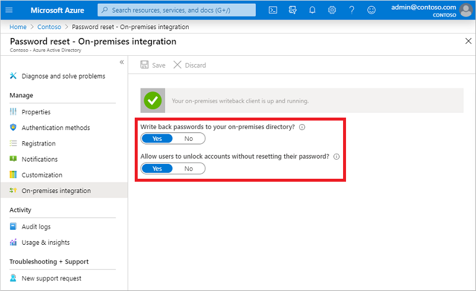

# Tutorial: Enable Azure Active Directory self-service password reset writeback to an on-premises environment

With Azure Active Directory (Azure AD) self-service password reset (SSPR), users can update their password or unlock their account using a web browser. In a hybrid environment where Azure AD is connected to an on-premises Active Directory Domain Services (AD DS) environment, this scenario can cause passwords to be different between the two directories.

Password writeback can be used to synchronize password changes in Azure AD back to your on-premises AD DS environment. Azure AD Connect provides a secure mechanism to send these password changes back to an existing on-premises directory from Azure AD.

In this tutorial, you learn how to:

> [!div class="checklist"]
> * Configure the required permissions for password writeback
> * Enable the password writeback option in Azure AD Connect
> * Enable password writeback in Azure AD SSPR

## Prerequisites

To complete this tutorial, you need the following resources and privileges:

* A working Azure AD tenant with at least an Azure AD Premium P2 trial license enabled.
    * If needed, [create one for free](https://azure.microsoft.com/free/?WT.mc_id=A261C142F).
    * For more information, see [Licensing requirements for Azure AD SSPR](concept-sspr-licensing.md).
* An account with *global administrator* privileges.
* Azure AD configured for self-service password reset.
    * If needed, [complete the previous tutorial to enable Azure AD SSPR](tutorial-enable-sspr.md).
* An existing on-premises AD DS environment configured with a current version of Azure AD Connect.
    * If needed, configure Azure AD Connect using the [Express](../hybrid/how-to-connect-install-express.md) or [Custom](../hybrid/how-to-connect-install-custom.md) settings.
    * To use Password Writeback, your Domain Controllers must be Windows Server 2008 R2 or later.

## Configure account permissions for Azure AD Connect

Azure AD Connect lets you synchronize users, groups, and credential between an on-premises AD DS environment and Azure AD. You typically install Azure AD Connect on a Windows Server 2012 or later computer that's joined to the on-premises AD DS domain.

To correctly work with SSPR writeback, the account specified in Azure AD Connect must have the appropriate permissions and options set. If you're not sure which account is currently in use, open Azure AD Connect and select the **View current configuration** option. The account that you need to add permissions to is listed under **Synchronized Directories**. The following permissions and options must be set on the account:

* **Reset password**
* **Write permissions** on `lockoutTime`
* **Write permissions** on `pwdLastSet`
* **Extended rights** for "Unexpire Password" on either:
   * The root object of *each domain* in that forest
   * The user organizational units (OUs) you want to be in scope for SSPR

If don't assign these permissions, writeback appears to be configured correctly, but users encounter errors when they manage their on-premises passwords from the cloud. Permissions must be applied to **This object and all descendant objects** for "Unexpire Password" to appear.  

> [!TIP]
>
> If passwords for some user accounts aren't written back to the on-premises directory, make sure that inheritance isn't disabled for the account in the on-prem AD DS environment. Write permissions for passwords must be applied to descendant objects for the feature to work correctly.

To set up the appropriate permissions for password writeback to occur, complete the following steps:

1. In your on-premises AD DS environment, open **Active Directory Users and Computers** with an account that has the appropriate *domain administrator* permissions.
1. From the **View** menu, make sure that **Advanced features** are turned on.
1. In the left panel, right-select the object that represents the root of the domain and select **Properties** > **Security** > **Advanced**.
1. From the **Permissions** tab, select **Add**.
1. For **Principal**, select the account that permissions should be applied to (the account used by Azure AD Connect).
1. In the **Applies to** drop-down list, select **Descendant User objects**.
1. Under *Permissions*, select the box for the following option:
    * **Reset password**
1. Under *Properties*, select the boxes for the following options. You need to scroll through the list to find these options, which may already be set by default:
    * **Write lockoutTime**
    * **Write pwdLastSet**

    

1. When ready, select **Apply / OK** to apply the changes and exit any open dialog boxes.

When you update permissions, it might take up to an hour or more for these permissions to replicate to all the objects in your directory.

Password policies in the on-premises AD DS environment may prevent password resets from being correctly processed. For password writeback to work most efficiently, the group policy for *Minimum password age* must be set to 0. This setting can be found under **Computer Configuration > Policies > Windows Settings > Security Settings > Account Policies** within `gpedit.msc`.

If you update the group policy, wait for the updated policy to replicate, or use the `gpupdate /force` command.

> [!Note]
> In order for passwords to be changed immediately, password writeback must be set to 0. However, if users adhere to the on-premises policies, and the *Minimum password age* is set to a value greater than zero, password writeback will still work after the on-premises policies are evaluated. 

## Enable password writeback in Azure AD Connect

One of the configuration options in Azure AD Connect is for password writeback. When this option is enabled, password change events cause Azure AD Connect to synchronize the updated credentials back to the on-premises AD DS environment.

To enable self-service password reset writeback, first enable the writeback option in Azure AD Connect. From your Azure AD Connect server, complete the following steps:

1. Sign in to your Azure AD Connect server and start the **Azure AD Connect** configuration wizard.
1. On the **Welcome** page, select **Configure**.
1. On the **Additional tasks** page, select **Customize synchronization options**, and then select **Next**.
1. On the **Connect to Azure AD** page, enter a global administrator credential for your Azure tenant, and then select **Next**.
1. On the **Connect directories** and **Domain/OU** filtering pages, select **Next**.
1. On the **Optional features** page, select the box next to **Password writeback** and select **Next**.

    

1. On the **Ready to configure** page, select **Configure** and wait for the process to finish.
1. When you see the configuration finish, select **Exit**.

## Enable password writeback for SSPR

With password writeback enabled in Azure AD Connect, now configure Azure AD SSPR for writeback. When you enable SSPR to use password writeback, users who change or reset their password have that updated password synchronized back to the on-premises AD DS environment as well.

To enable password writeback in SSPR, complete the following steps:

1. Sign in to the [Azure portal](https://portal.azure.com) using a global administrator account.
1. Search for and select **Azure Active Directory**, select **Password reset**, then choose **On-premises integration**.
1. Set the option for **Write back passwords to your on-premises directory?** to *Yes*.
1. Set the option for **Allow users to unlock accounts without resetting their password?** to *Yes*.

    

1. When ready, select **Save**.

## Clean up resources

If you no longer want to use the SSPR writeback functionality you have configured as part of this tutorial, complete the following steps:

1. Sign in to the [Azure portal](https://portal.azure.com).
1. Search for and select **Azure Active Directory**, select **Password reset**, then choose **On-premises integration**.
1. Set the option for **Write back passwords to your on-premises directory?** to *No*.
1. Set the option for **Allow users to unlock accounts without resetting their password?** to *No*.

If you no longer want to use any password functionality, complete the following steps from your Azure AD Connect server:

1. Sign in to your Azure AD Connect server and start the **Azure AD Connect** configuration wizard.
1. On the **Welcome** page, select **Configure**.
1. On the **Additional tasks** page, select **Customize synchronization options**, and then select **Next**.
1. On the **Connect to Azure AD** page, enter a global administrator credential for your Azure tenant, and then select **Next**.
1. On the **Connect directories** and **Domain/OU** filtering pages, select **Next**.
1. On the **Optional features** page, deselect the box next to **Password writeback** and select **Next**.
1. On the **Ready to configure** page, select **Configure** and wait for the process to finish.
1. When you see the configuration finish, select **Exit**.

## Next steps

In this tutorial, you enabled Azure AD SSPR writeback to an on-premises AD DS environment. You learned how to:

> [!div class="checklist"]
> * Configure the required permissions for password writeback
> * Enable the password writeback option in Azure AD Connect
> * Enable password writeback in Azure AD SSPR

> [!div class="nextstepaction"]
> [Evaluate risk at sign in](tutorial-risk-based-sspr-mfa.md)
