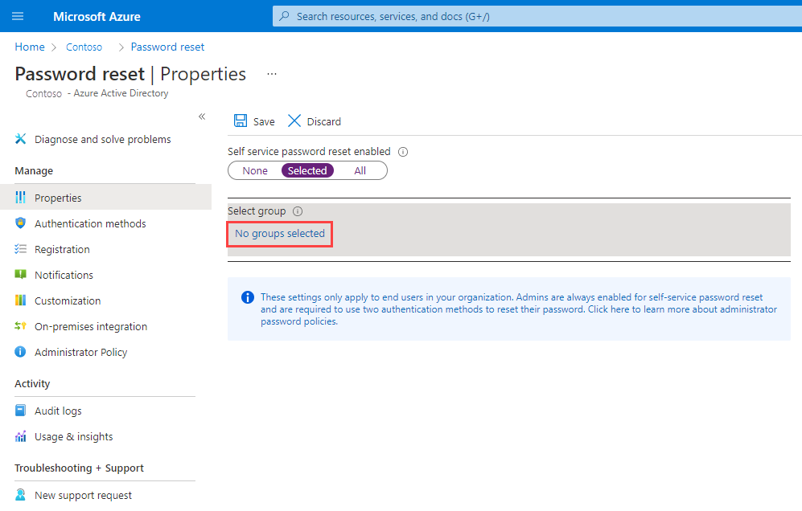
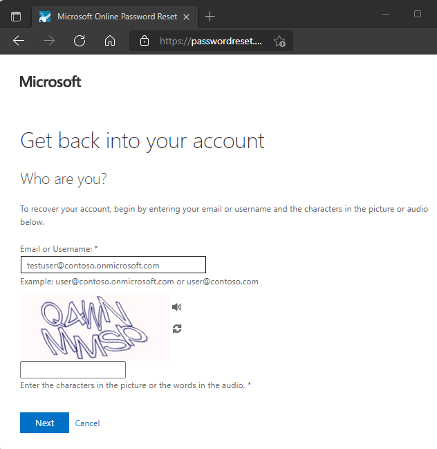

# Tutorial: Enable users to unlock their account or reset passwords using Azure Active Directory self-service password reset

Azure Active Directory (Azure AD) self-service password reset (SSPR) gives users the ability to change or reset their password, with no administrator or help desk involvement. If a user's account is locked or they forget their password, they can follow prompts to unblock themselves and get back to work. This ability reduces help desk calls and loss of productivity when a user can't sign in to their device or an application.

> [!IMPORTANT]
> This quickstart shows an administrator how to enable self-service password reset. If you're an end user already registered for self-service password reset and need to get back into your account, go to https://aka.ms/sspr.
>
> If your IT team hasn't enabled the ability to reset your own password, reach out to your helpdesk for additional assistance.

In this tutorial you learn how to:

> [!div class="checklist"]
> * Enable self-service password reset for a group of Azure AD users
> * Configure authentication methods and registration options
> * Test the SSPR process as a user

## Prerequisites

To complete this tutorial, you need the following resources and privileges:

* A working Azure AD tenant with at least a trial license enabled.
    * If needed, [create one for free](https://azure.microsoft.com/free/?WT.mc_id=A261C142F).
* An account with *Global Administrator* privileges.
* A non-administrator user with a password you know, such as *testuser*. You test the end-user SSPR experience using this account in this tutorial.
    * If you need to create a user, see [Quickstart: Add new users to Azure Active Directory](../add-users-azure-active-directory.md).
* A group that the non-administrator user is a member of, such as *SSPR-Test-Group*. You enable SSPR for this group in this tutorial.
    * If you need to create a group, see how to [Create a group and add members in Azure Active Directory](../active-directory-groups-create-azure-portal.md).

## Enable self-service password reset

Azure AD lets you enable SSPR for *None*, *Selected*, or *All* users. This granular ability lets you choose a subset of users to test the SSPR registration process and workflow. When you're comfortable with the process and can communicate the requirements with a broader set of users, you can select a group of users to enable for SSPR. Or, you can enable SSPR for everyone in the Azure AD tenant.

> [!NOTE]
>
> Only one Azure AD group can currently be enabled for SSPR using the Azure portal. As part of a wider deployment of SSPR, nested groups are supported. Make sure that the users in the group(s) you choose have the appropriate licenses assigned. There's currently no validation process of these licensing requirements.

In this tutorial, configure SSPR for a set of users in a test group. In the following example, the group *SSPR-Test-Group* is used. Provide your own Azure AD group as needed:

1. Sign in to the [Azure portal](https://portal.azure.com) using an account with *global administrator* permissions.
1. Search for and select **Azure Active Directory**, then choose **Password reset** from the menu on the left-hand side.
1. From the **Properties** page, under the option *Self service password reset enabled*, choose **Select group**
1. Browse for and select your Azure AD group, such as *SSPR-Test-Group*, then choose *Select*.

    

1. To enable SSPR for the select users, select **Save**.

## Select authentication methods and registration options

When users need to unlock their account or reset their password, they're prompted for an additional confirmation method. This additional authentication factor makes sure that only approved SSPR events are completed. You can choose which authentication methods to allow, based on the registration information the user provides.

1. On the **Authentication methods** page from the menu in the left-hand side, set the **Number of methods required to reset** to *1*.

    To improve security, you can increase the number of authentication methods required for SSPR.

1. Choose the **Methods available to users** that your organization wants to allow. For this tutorial, check the boxes to enable the following methods:

    * *Mobile app notification*
    * *Mobile app code*
    * *Email*
    * *Mobile phone*
    * *Office phone*

1. To apply the authentication methods, select **Save**.

Before users can unlock their account or reset a password, they must register their contact information. This contact information is used for the different authentication methods configured in the previous steps.

An administrator can manually provide this contact information, or users can go to a registration portal to provide the information themselves. In this tutorial, configure the users to be prompted for registration when they next sign in.

1. On the **Registration** page from the menu in the left-hand side, select *Yes* for **Require users to register when signing in**.
1. It's important that contact information is kept up to date. If the contact information is outdated when an SSPR event is started, the user may not be able to unlock their account or reset their password.

    Set **Number of days before users are asked to reconfirm their authentication information** to *180*.
1. To apply the registration settings, select **Save**.

## Configure notifications and customizations

To keep users informed about account activity, you can configure e-mail notifications to be sent when an SSPR event happens. These notifications can cover both regular user accounts and admin accounts. For admin accounts, this notification provides an additional layer of awareness when a privileged administrator account password is reset using SSPR.

1. On the **Notifications** page from the menu in the left-hand side, configure the following options:

   * Set **Notify users on password resets** option to *Yes*.
   * Set **Notify all admins when other admins reset their password** to *Yes*.

1. To apply the notification preferences, select **Save**.

If users need additional help with the SSPR process, you can customize the link for "Contact your administrator". This link is used in the SSPR registration process and when a user unlocks their account or resets their password. To make sure your users get the support needed, it's highly recommended to provide a custom helpdesk email or URL.

1. On the **Customization** page from the menu in the left-hand side, set *Customize helpdesk link* to **Yes**.
1. In the **Custom helpdesk email or URL** field, provide an email address or web page URL where your users can get additional help from your organization, such as *`https://support.contoso.com/`*
1. To apply the custom link, select **Save**.

## Test self-service password reset

With SSPR enabled and configured, test the SSPR process with a user that's part of the group you selected in the previous section, such as *Test-SSPR-Group*. In the following example, the *testuser* account is used. Provide your own user account that's part of the group you enabled for SSPR in the first section of this tutorial.

> [!NOTE]
> When you test the self-service password reset, use a non-administrator account. Admins are always enabled for self-service password reset and are required to use two authentication methods to reset their password.

1. To see the manual registration process, open a new browser window in InPrivate or incognito mode, and browse to [https://aka.ms/ssprsetup](https://aka.ms/ssprsetup). Users should be directed to this registration portal when they next sign-in.
1. Sign in with a non-administrator test user, such as *testuser*, and register your authentication methods contact information.
1. Once complete, select the button marked **Looks good** and close the browser window.
1. Open a new browser window in InPrivate or incognito mode, and browse to [https://aka.ms/sspr](https://aka.ms/sspr).
1. Enter your non-administrator test users' account information, such as *testuser*, the characters from the CAPTCHA, and then select **Next**.

    

1. Follow the verification steps to reset your password. When complete, you should receive an e-mail notification that your password was reset.

## Clean up resources

In a following tutorial in this series, you configure password writeback. This feature writes password changes from Azure AD SSPR back to an on-premises AD environment. If you want to continue with this tutorial series to configure password writeback, don't disable SSPR now.

If you no longer want to use the SSPR functionality you have configured as part of this tutorial, set the SSPR status to **None** using the following steps:

1. Sign in to the [Azure portal](https://portal.azure.com).
1. Search for and select **Azure Active Directory**, then choose **Password reset** from the menu on the left-hand side.
1. From the **Properties** page, under the option *Self service password reset enabled*, choose **None**.
1. To apply the SSPR change, select **Save**.

## Next steps

In this tutorial, you enabled Azure AD self-service password reset for a selected group of users. You learned how to:

> [!div class="checklist"]
> * Enable self-service password reset for a group of Azure AD users
> * Configure authentication methods and registration options
> * Test the SSPR process as a user

> [!div class="nextstepaction"]
> [Enable Azure Multi-Factor Authentication](tutorial-mfa-applications.md)
