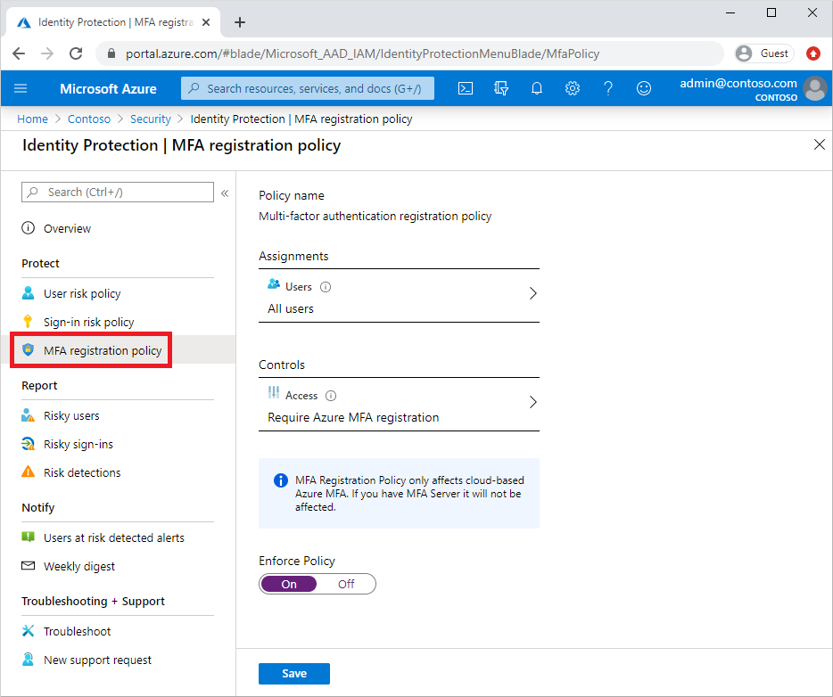
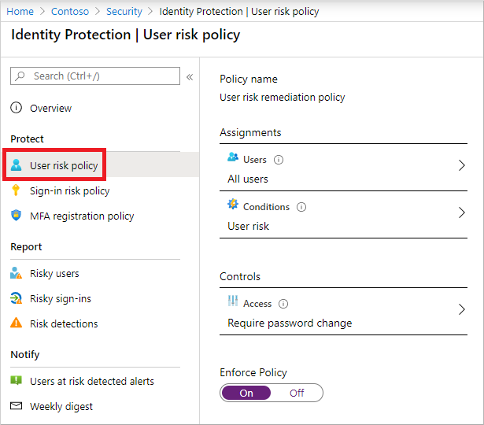
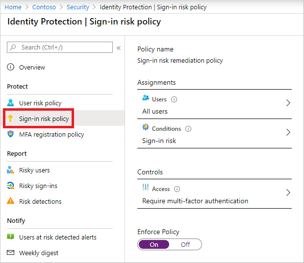

# Tutorial: Use risk detections for user sign-ins to trigger Microsoft Entra multifactor authentication or password changes

To protect your users, you can configure risk-based policies in Microsoft Entra ID that automatically respond to risky behaviors. Microsoft Entra ID Protection policies can automatically block a sign-in attempt or require additional action, such as require a password change or prompt for Microsoft Entra multifactor authentication. These policies work with existing Microsoft Entra Conditional Access policies as an extra layer of protection for your organization. Users may never trigger a risky behavior in one of these policies, but your organization is protected if an attempt to compromise your security is made.

> [!IMPORTANT]
> This tutorial shows an administrator how to enable risk-based Microsoft Entra multifactor authentication.
>
> If your IT team hasn't enabled the ability to use Microsoft Entra multifactor authentication or you have problems during sign-in, reach out to your helpdesk for additional assistance.

In this tutorial, you learn how to:

> [!div class="checklist"]
> * Understand the available policies for Microsoft Entra ID Protection
> * Enable Microsoft Entra multifactor authentication registration
> * Enable risk-based password changes
> * Enable risk-based multifactor authentication
> * Test risk-based policies for user sign-in attempts

## Prerequisites

To complete this tutorial, you need the following resources and privileges:

* A working Microsoft Entra tenant with at least a Microsoft Entra ID P2 or trial license enabled.
    * If needed, [create one for free](https://azure.microsoft.com/free/?WT.mc_id=A261C142F).
* An account with *Global Administrator* privileges.
* Microsoft Entra ID configured for self-service password reset and Microsoft Entra multifactor authentication
    * If needed, [complete the tutorial to enable Microsoft Entra SSPR](tutorial-enable-sspr.md).
    * If needed, [complete the tutorial to enable Microsoft Entra multifactor authentication](tutorial-enable-azure-mfa.md).

## Overview of Microsoft Entra ID Protection

Each day, Microsoft collects and analyses trillions of anonymized signals as part of user sign-in attempts. These signals help build patterns of good user sign-in behavior, and identify potential risky sign-in attempts. Microsoft Entra ID Protection can review user sign-in attempts and take additional action if there's suspicious behavior:

Some of the following actions may trigger Microsoft Entra ID Protection risk detection:

* Users with leaked credentials.
* Sign-ins from anonymous IP addresses.
* Impossible travel to atypical locations.
* Sign-ins from infected devices.
* Sign-ins from IP addresses with suspicious activity.
* Sign-ins from unfamiliar locations.

The following three policies are available in Microsoft Entra ID Protection to protect users and respond to suspicious activity. You can choose to turn the policy enforcement on or off, select users or groups for the policy to apply to, and decide if you want to block access at sign-in or prompt for additional action.

* User risk policy
    * Identifies and responds to user accounts that may have compromised credentials. Can prompt the user to create a new password.
* Sign in risk policy
    * Identifies and responds to suspicious sign-in attempts. Can prompt the user to provide additional forms of verification using Microsoft Entra multifactor authentication.
* MFA registration policy
    * Makes sure users are registered for Microsoft Entra multifactor authentication. If a sign-in risk policy prompts for MFA, the user must already be registered for Microsoft Entra multifactor authentication.

When you enable a policy user or sign in risk policy, you can also choose the threshold for risk level - *low and above*, *medium and above*, or *high*. This flexibility lets you decide how aggressive you want to be in enforcing any controls for suspicious sign-in events.

For more information about Microsoft Entra ID Protection, see [What is Microsoft Entra ID Protection?](../identity-protection/overview-identity-protection.md)

## Enable MFA registration policy

[!INCLUDE [portal updates](~/articles/active-directory/includes/portal-update.md)]

Microsoft Entra ID Protection includes a default policy that can help get users registered for Microsoft Entra multifactor authentication. If you use additional policies to protect sign-in events, you would need users to have already registered for MFA. When you enable this policy, it doesn't require users to perform MFA at each sign-in event. The policy only checks the registration status for a user and asks them to pre-register if needed.

It's recommended to enable the MFA registration policy for users that are to be enabled for additional Microsoft Entra ID Protection policies. To enable this policy, complete the following steps:

1. Sign in to the [Microsoft Entra admin center](https://entra.microsoft.com) as at least an [Authentication Policy Administrator](../roles/permissions-reference.md#authentication-policy-administrator).
1. Browse to **Protection** > **Multifactor authentication** > **MFA registration policy**.
1. By default, the policy applies to *All users*. If desired, select **Assignments**, then choose the users or groups to apply the policy on.
1. Under *Controls*, select **Access**. Make sure the option for *Require Microsoft Entra multifactor authentication registration* is checked, then choose **Select**.
1. Set **Enforce Policy** to *On*, then select **Save**.

    

## Enable user risk policy for password change

Microsoft works with researchers, law enforcement, various security teams at Microsoft, and other trusted sources to find username and password pairs. When one of these pairs matches an account in your environment, a risk-based password change can be requested. This policy and action requires the user update their password before they can sign in to make sure any previously exposed credentials no longer work.

To enable this policy, complete the following steps:

1. Select the **User risk policy** from the menu on the left-hand side.
1. By default, the policy applies to *All users*. If desired, select **Assignments**, then choose the users or groups to apply the policy on.
1. Under *Conditions*, choose  **Select conditions > Select a risk level**, then choose *Medium and above*.
1. Choose **Select**, then **Done**.
1. Under *Access*, select **Access**. Make sure the option for **Allow access** and *Require password change* is checked, then choose **Select**.
1. Set **Enforce Policy** to *On*, then select **Save**.

    

## Enable sign-in risk policy for MFA

Most users have a normal behavior that can be tracked. When they fall outside of this norm, it could be risky to allow them to successfully sign in. Instead, you may want to block that user, or ask them to perform a multifactor authentication. If the user successfully completes the MFA challenge, you can consider it a valid sign-in attempt and grant access to the application or service.

To enable this policy, complete the following steps:

1. Select the **Sign-in risk policy** from the menu on the left-hand side.
1. By default, the policy applies to *All users*. If desired, select **Assignments**, then choose the users or groups to apply the policy on.
1. Under *Conditions*, choose  **Select conditions > Select a risk level**, then choose *Medium and above*.
1. Choose **Select**, then **Done**.
1. Under *Access*, choose **Select a control**. Make sure the option for **Allow access** and *Require multifactor authentication* is checked, then choose **Select**.
1. Set **Enforce Policy** to *On*, then select **Save**.

    

## Test risky sign events

Most user sign-in events won't trigger the risk-based policies configured in the previous steps. A user may never see a prompt for additional MFA or to reset their password. If their credentials remain secure and their behavior consistent, their sign-in events would be successful.

To test the Microsoft Entra ID Protection policies created in the previous steps, you need a way to simulate risky behavior or potential attacks. The steps to do these tests vary based on the Microsoft Entra ID Protection policy you want to validate. For more information on scenarios and steps, see [Simulate risk detections in Microsoft Entra ID Protection](../identity-protection/howto-identity-protection-simulate-risk.md).

## Clean up resources

If you have completed tests and no longer want to have the risk-based policies enabled, return to each policy you want to disable and set **Enforce Policy** to *Off*.

## Next steps

In this tutorial, you enabled risk-based user policies for Microsoft Entra ID Protection. You learned how to:

> [!div class="checklist"]
> * Understand the available policies for Microsoft Entra ID Protection
> * Enable Microsoft Entra multifactor authentication registration
> * Enable risk-based password changes
> * Enable risk-based multifactor authentication
> * Test risk-based policies for user sign-in attempts

> [!div class="nextstepaction"]
> [Learn more about Microsoft Entra ID Protection](../identity-protection/overview-identity-protection.md)
