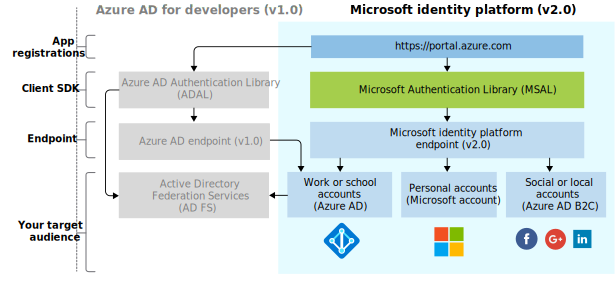

# Evolution of Microsoft identity platform

The [Microsoft identity platform](../develop/index.yml) is an evolution of the Azure Active Directory (Azure AD) developer platform. It allows developers to build applications that sign in users, get tokens to call APIs, such as Microsoft Graph, or APIs that developers have built. It consists of an authentication service, open-source libraries, application registration, and configuration (through a developer portal and application API), full developer documentation, quickstart samples, code samples, tutorials, how-to guides, and other developer content. The Microsoft identity platform supports industry standard protocols such as OAuth 2.0 and OpenID Connect.

Many developers have previously worked with the Azure AD v1.0 platform to authenticate Microsoft work and school accounts by requesting tokens from the Azure AD v1.0 endpoint, using Azure AD Authentication Library (ADAL), Azure portal for application registration and configuration, and the Microsoft Graph API for programmatic application configuration.

With the unified Microsoft identity platform (v2.0), you can write code once and authenticate any Microsoft identity into your application. For several platforms, the fully supported open-source Microsoft Authentication Library (MSAL) is recommended for use against the identity platform endpoints. MSAL is simple to use, provides great single sign-on (SSO) experiences for your users, helps you achieve high reliability and performance, and is developed using Microsoft Secure Development Lifecycle (SDL). When calling APIs, you can configure your application to take advantage of incremental consent, which allows you to delay the request for consent for more invasive scopes until the application's usage warrants this at runtime.  MSAL also supports Azure Active Directory B2C, so your customers use their preferred social, enterprise, or local account identities to get single sign-on access to your applications and APIs.

With Microsoft identity platform, expand your reach to these kinds of users:

- Work and school accounts (Microsoft Entra ID provisioned accounts)
- Personal accounts (such as Outlook.com or Hotmail.com)
- Your customers who bring their own email or social identity (such as LinkedIn, Facebook, Google) via MSAL and Azure AD B2C

You can use the Azure portal to register and configure your application, and use the Microsoft Graph API for programmatic application configuration.

Update your application at your own pace. Applications built with ADAL libraries continue to be supported. Mixed application portfolios, that consist of applications built with ADAL and applications built with MSAL libraries, are also supported. This means that applications using the latest ADAL and the latest MSAL will deliver SSO across the portfolio, provided by the shared token cache between these libraries. Applications updated from ADAL to MSAL will maintain user sign-in state upon upgrade.

## Microsoft identity platform experience

The following diagram shows the Microsoft identity experience at a high level, including the app registration experience, SDKs, endpoints, and supported identities.

### App registration experience

The Azure portal **[App registrations](https://go.microsoft.com/fwlink/?linkid=2083908)** experience is the one portal experience for managing all applications you've integrated with Microsoft identity platform. If you have been using the Application Registration Portal, start using the Azure portal app registration experience instead.

For integration with Azure AD B2C (when authenticating social or local identities), you'll need to register your application in an Azure AD B2C tenant. This experience is also part of the Azure portal.

Use the [Application API](/graph/api/resources/application) to programmatically configure your applications integrated with Microsoft identity platform for authenticating any Microsoft identity.

### MSAL libraries

You can use the MSAL library to build applications that authenticate all Microsoft identities. The MSAL libraries in .NET and JavaScript are generally available. MSAL libraries for iOS and Android are in preview and suitable for use in a production environment. We provide the same production level support for MSAL libraries in preview as we do for versions of MSAL and ADAL that are generally available.

You can also use the MSAL libraries to integrate your application with Azure AD B2C.

### Microsoft identity platform endpoint

Microsoft identity platform (v2.0) endpoint is OIDC certified. It works with the Microsoft Authentication Libraries (MSAL) or any other standards-compliant library. It implements human readable scopes, in accordance with industry standards.

## Next steps

Learn more in the [Microsoft identity platform documentation](../develop/index.yml).
