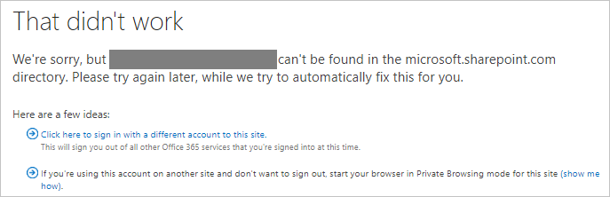
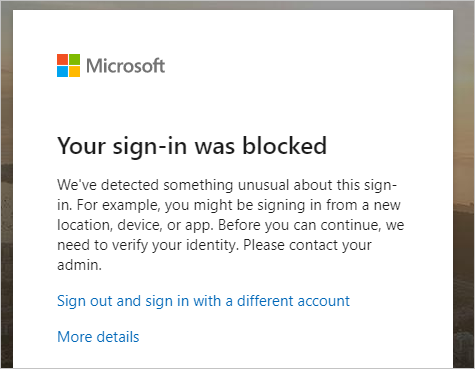
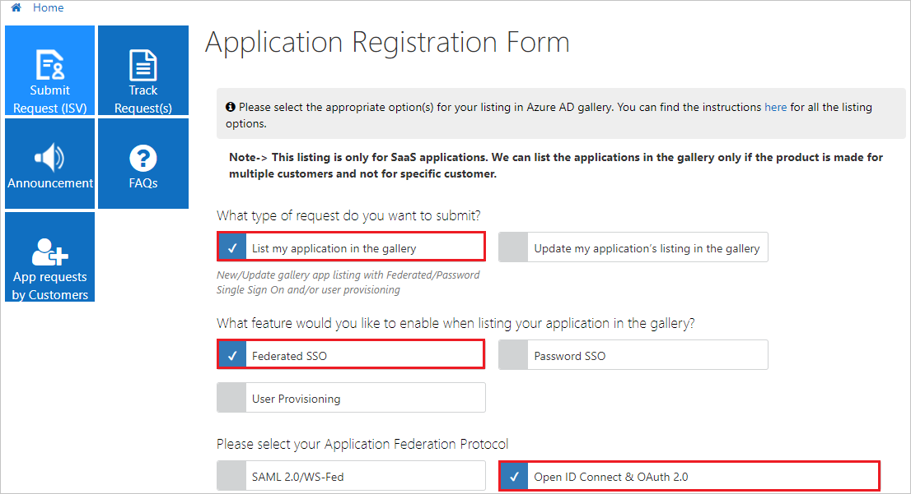
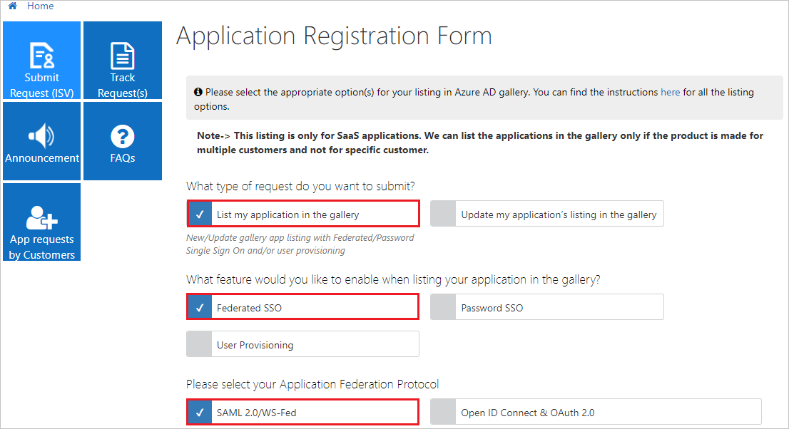
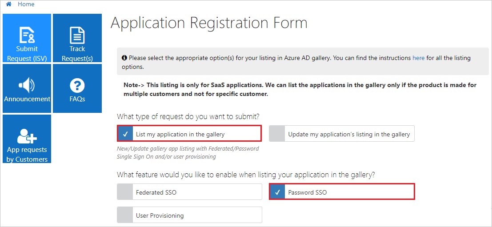
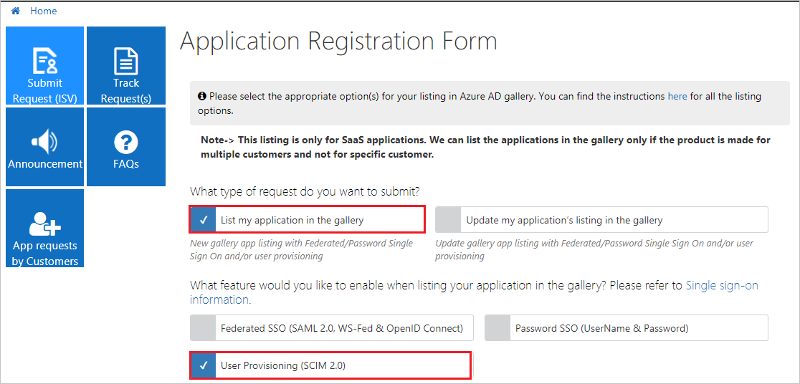
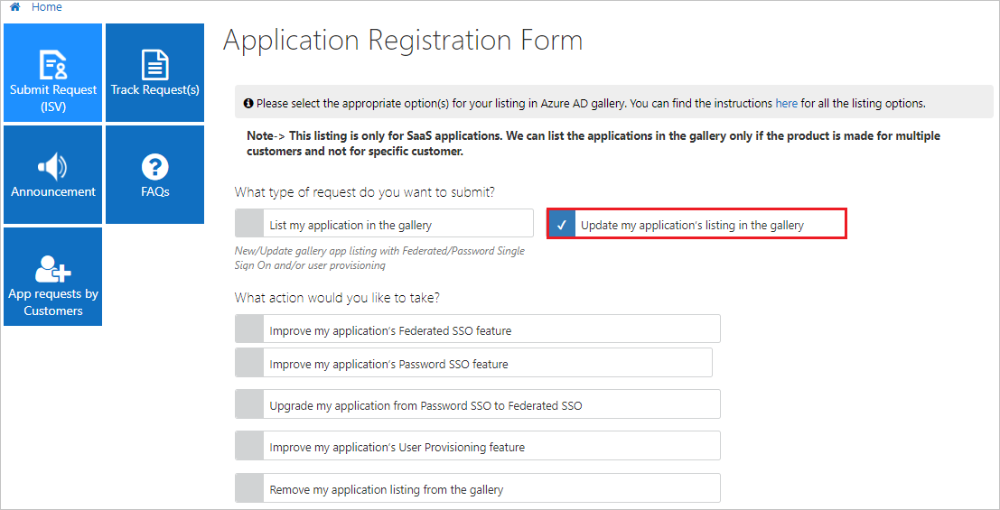
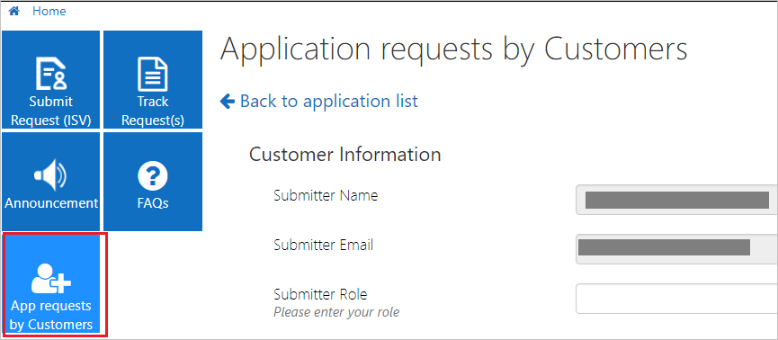

# List your application in the Azure Active Directory application gallery

[!INCLUDE [active-directory-azuread-dev](../../../includes/active-directory-azuread-dev.md)]

This article shows how to list an application in the Azure Active Directory (Azure AD) application gallery, implement single sign-on (SSO), and manage the listing.

## What is the Azure AD application gallery?

- Customers find the best possible single sign-on experience.
- Configuration of the application is simple and minimal.
- A quick search finds your application in the gallery.
- Free, Basic, and Premium Azure AD customers can all use this integration.
- Mutual customers get a step-by-step configuration tutorial.
- Customers who use the System for Cross-domain Identity Management ([SCIM](https://techcommunity.microsoft.com/t5/Identity-Standards-Blog/Provisioning-with-SCIM-getting-started/ba-p/880010)) can use provisioning for the same app.

## Prerequisites

- For federated applications (Open ID and SAML/WS-Fed), the application must support the software-as-a-service (SaaS) model for getting listed in the Azure AD app gallery. The enterprise gallery applications must support multiple customer configurations and not any specific customer.
- For Open ID Connect, the application must be multitenanted and the [Azure AD consent framework](../develop/consent-framework.md?toc=/azure/active-directory/azuread-dev/toc.json&bc=/azure/active-directory/azuread-dev/breadcrumb/toc.json) must be properly implemented for the application. The user can send the sign-in request to a common endpoint so that any customer can provide consent to the application. You can control user access based on the tenant ID and the user's UPN received in the token.
- For SAML 2.0/WS-Fed, your application must have the capability to do the SAML/WS-Fed SSO integration in SP or IDP mode. Make sure this capability is working correctly before you submit the request.
- For password SSO, make sure that your application supports form authentication so that password vaulting can be done to get single sign-on to work as expected.
- You need a permanent account for testing with at least two users registered.

**How to get Azure AD for developers?**

You can get a free test account with all the premium Azure AD features - 90 days free and can get extended as long as you do dev work with it: https://docs.microsoft.com/office/developer-program/office-365-developer-program

## Submit the request in the portal

After you've tested that your application integration works with Azure AD, submit your application request in the [Microsoft Application Network portal](https://microsoft.sharepoint.com/teams/apponboarding/Apps).

If the following page appears after you sign in, contact the [Azure AD SSO Integration Team](<mailto:SaaSApplicationIntegrations@service.microsoft.com>). Provide the email account that you want to use for submitting the request. A business email address such as [name@yourbusiness.com](mailto:name@yourbusiness.com) is preferred. The Azure AD team will add the account in the Microsoft Application Network portal.

After the account is added, you can sign in to the Microsoft Application Network portal.

If the following page appears after you sign in, provide a business justification for needing access in the text box. Then select **Request Access**.

  

Our team reviews the details and gives you access accordingly. After your request is approved, you can sign in to the portal and submit the request by selecting the **Submit Request (ISV)** tile on the home page.

## Issues on logging into portal

If you are seeing this error while logging in then here are the detail on the issue and this is how you can fix it.

* If your sign-in was blocked as shown below:

  

**What's happening:**

The guest user is federated to a home tenant which is also an Azure AD. The guest user is at High risk. Microsoft doesn't allow High risk users to access its resources. All High risk users (employees or guests / vendors) must remediate / close their risk to access Microsoft resources. For guest users, this user risk comes from the home tenant and the policy comes from the resource tenant (Microsoft in this case).
 
**Secure solutions:**

* MFA registered guest users remediate their own user risk. This can be done by the guest user performing a secured password change or reset (https://aka.ms/sspr) at their home tenant (this needs MFA and SSPR at the home tenant). The secured password change or reset must be initiated on Azure AD and not on-prem.

* Guest users have their admins remediate their risk. In this case, the admin will perform a password reset (temporary password generation). This does not need Identity Protection. The guest user's admin can go to https://aka.ms/RiskyUsers and click on 'Reset password'.

* Guest users have their admins close / dismiss their risk. Again, this does not need Identity Protection. The admin can go to https://aka.ms/RiskyUsers and click on 'Dismiss user risk'. However, the admin must do the due diligence to ensure this was a false positive risk assessment before closing the user risk. Otherwise, they are putting their and Microsoft's resources at risk by suppressing a risk assessment without investigation.

> [!NOTE]
> If you have any issues with access, contact the [Azure AD SSO Integration Team](<mailto:SaaSApplicationIntegrations@service.microsoft.com>).

## Implement SSO by using the federation protocol

To list an application in the Azure AD app gallery, you first need to implement one of the following federation protocols supported by Azure AD. You also need to agree to the Azure AD application gallery terms and conditions. Read the terms and conditions of the Azure AD application gallery on [this website](https://azure.microsoft.com/support/legal/active-directory-app-gallery-terms/).

- **OpenID Connect**: To integrate your application with Azure AD by using the Open ID Connect protocol, follow the [developers' instructions](v1-authentication-scenarios.md).

    

    * If you want to add your application to list in the gallery by using OpenID Connect, select **OpenID Connect & OAuth 2.0** as shown.
    * If you have any issues with access, contact the [Azure AD SSO Integration Team](<mailto:SaaSApplicationIntegrations@service.microsoft.com>).

- **SAML 2.0** or **WS-Fed**: If your app supports SAML 2.0, you can integrate it directly with an Azure AD tenant by following the [instructions to add a custom application](../active-directory-saas-custom-apps.md).

  

  * If you want to add your application to list in the gallery by using **SAML 2.0** or **WS-Fed**, select **SAML 2.0/WS-Fed** as shown.

  * If you have any issues with access, contact the [Azure AD SSO Integration Team](<mailto:SaaSApplicationIntegrations@service.microsoft.com>).

## Implement SSO by using the password SSO

Create a web application that has an HTML sign-in page to configure [password-based single sign-on](../manage-apps/what-is-single-sign-on.md). Password-based SSO, also referred to as password vaulting, enables you to manage user access and passwords to web applications that don't support identity federation. It's also useful for scenarios in which several users need to share a single account, such as to your organization's social media app accounts.

* If you want to add your application to list in the gallery by using password SSO, select **Password SSO** as shown.
* If you have any issues with access, contact the [Azure AD SSO Integration Team](<mailto:SaaSApplicationIntegrations@service.microsoft.com>).

## Request for user provisioning

Follow the process shown in the following image to request user provisioning.

   

## Update or remove an existing listing

To update or remove an existing application in the Azure AD app gallery, you first need to submit the request in the [Application Network portal](https://microsoft.sharepoint.com/teams/apponboarding/Apps). If you have an Office 365 account, use that to sign in to this portal. If not, use your Microsoft account, such as Outlook or Hotmail, to sign in.

- Select the appropriate option as shown in the following image.

    

    * To update an existing application, select the appropriate option as per your requirement.
    * To remove an existing application from the Azure AD app gallery, select **Remove my application listing from the gallery**.
    * If you have any issues with access, contact the [Azure AD SSO Integration Team](<mailto:SaaSApplicationIntegrations@service.microsoft.com>).

## List requests by customers

Customers can submit a request to list an application by selecting **App requests by Customers** > **Submit new request**.

Here's the flow of customer-requested applications.

## Timelines

The timeline for the process of listing a SAML 2.0 or WS-Fed application in the gallery is 7 to 10 business days.

  

The timeline for the process of listing an OpenID Connect application in the gallery is 2 to 5 business days.

  

## Escalations

For any escalations, send email to the [Azure AD SSO Integration Team](mailto:SaaSApplicationIntegrations@service.microsoft.com) at SaaSApplicationIntegrations@service.microsoft.com, and we'll respond as soon as possible.