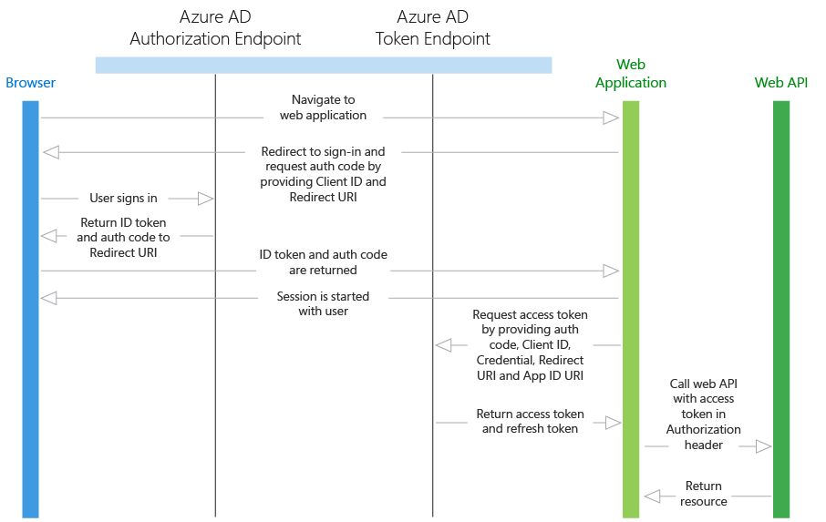

# Web API

[!INCLUDE [active-directory-azuread-dev](../../../includes/active-directory-azuread-dev.md)]

Web API apps are web applications that need to get resources from a web API. In this scenario, there are two identity types that the web application can use to authenticate and call the web API:

- **Application identity** - This scenario uses OAuth 2.0 client credentials grant to authenticate as the application and access the web API. When using an application identity, the web API can only detect that the web application is calling it, as the web API does not receive any information about the user. If the application receives information about the user, it will be sent via the application protocol, and it is not signed by Azure AD. The web API trusts that the web application authenticated the user. For this reason, this pattern is called a trusted subsystem.
- **Delegated user identity** - This scenario can be accomplished in two ways: OpenID Connect, and OAuth 2.0 authorization code grant with a confidential client. The web application obtains an access token for the user, which proves to the web API that the user successfully authenticated to the web application and that the web application was able to obtain a delegated user identity to call the web API. This access token is sent in the request to the web API, which authorizes the user and returns the desired resource.

Both the application identity and delegated user identity types are discussed in the flow below. The key difference between them is that the delegated user identity must first acquire an authorization code before the user can sign in and gain access to the web API.

## Diagram

## Protocol flow

### Application identity with OAuth 2.0 client credentials grant

1. A user is signed in to Azure AD in the web application (see the **Web apps** section for more info).
1. The web application needs to acquire an access token so that it can authenticate to the web API and retrieve the desired resource. It makes a request to Azure AD's token endpoint, providing the credential, application ID, and web API's application ID URI.
1. Azure AD authenticates the application and returns a JWT access token that is used to call the web API.
1. Over HTTPS, the web application uses the returned JWT access token to add the JWT string with a "Bearer" designation in the Authorization header of the request to the web API. The web API then validates the JWT token, and if validation is successful, returns the desired resource.

### Delegated user identity with OpenID Connect

1. A user is signed in to a web application using Azure AD (see the Web Browser to Web Application section above). If the user of the web application has not yet consented to allowing the web application to call the web API on its behalf, the user will need to consent. The application will display the permissions it requires, and if any of these are administrator-level permissions, a normal user in the directory will not be able to consent. This consent process only applies to multi-tenant applications, not single tenant applications, as the application will already have the necessary permissions. When the user signed in, the web application received an ID token with information about the user, as well as an authorization code.
1. Using the authorization code issued by Azure AD, the web application sends a request to Azure AD's token endpoint that includes the authorization code, details about the client application (Application ID and redirect URI), and the desired resource (application ID URI for the web API).
1. The authorization code and information about the web application and web API are validated by Azure AD. Upon successful validation, Azure AD returns two tokens: a JWT access token and a JWT refresh token.
1. Over HTTPS, the web application uses the returned JWT access token to add the JWT string with a "Bearer" designation in the Authorization header of the request to the web API. The web API then validates the JWT token, and if validation is successful, returns the desired resource.

### Delegated user identity with OAuth 2.0 authorization code grant

1. A user is already signed in to a web application, whose authentication mechanism is independent of Azure AD.
1. The web application requires an authorization code to acquire an access token, so it issues a request through the browser to Azure AD's authorization endpoint, providing the Application ID and redirect URI for the web application after successful authentication. The user signs in to Azure AD.
1. If the user of the web application has not yet consented to allowing the web application to call the web API on its behalf, the user will need to consent. The application will display the permissions it requires, and if any of these are administrator-level permissions, a normal user in the directory will not be able to consent. This consent applies to both single and multi-tenant application. In the single tenant case, an admin can perform admin consent to consent on behalf of their users. This can be done using the `Grant Permissions` button in the [Azure portal](https://portal.azure.com). 
1. After the user has consented, the web application receives the authorization code that it needs to acquire an access token.
1. Using the authorization code issued by Azure AD, the web application sends a request to Azure AD's token endpoint that includes the authorization code, details about the client application (Application ID and redirect URI), and the desired resource (application ID URI for the web API).
1. The authorization code and information about the web application and web API are validated by Azure AD. Upon successful validation, Azure AD returns two tokens: a JWT access token and a JWT refresh token.
1. Over HTTPS, the web application uses the returned JWT access token to add the JWT string with a "Bearer" designation in the Authorization header of the request to the web API. The web API then validates the JWT token, and if validation is successful, returns the desired resource.

## Code samples

See the code samples for Web Application to Web API scenarios. And, check back frequently -- new samples are added frequently. Web [Application to Web API](sample-v1-code.md#web-applications-signing-in-users-calling-microsoft-graph-or-a-web-api-with-the-users-identity).

## App registration

To register an application with the Azure AD v1.0 endpoint, see [Register an app](../develop/quickstart-register-app.md?toc=/azure/active-directory/azuread-dev/toc.json&bc=/azure/active-directory/azuread-dev/breadcrumb/toc.json).

* Single tenant - For both the application identity and delegated user identity cases, the web application and the web API must be registered in the same directory in Azure AD. The web API can be configured to expose a set of permissions, which are used to limit the web application's access to its resources. If a delegated user identity type is being used, the web application needs to select the desired permissions from the **Permissions to other applications** drop-down menu in the Azure portal. This step is not required if the application identity type is being used.
* Multi-tenant - First, the web application is configured to indicate the permissions it requires to be functional. This list of required permissions is shown in a dialog when a user or administrator in the destination directory gives consent to the application, which makes it available to their organization. Some applications only require user-level permissions, which any user in the organization can consent to. Other applications require administrator-level permissions, which a user in the organization cannot consent to. Only a directory administrator can give consent to applications that require this level of permissions. When the user or administrator consents, the web application and the web API are both registered in their directory.

## Token expiration

When the web application uses its authorization code to get a JWT access token, it also receives a JWT refresh token. When the access token expires, the refresh token can be used to reauthenticate the user without requiring them to sign in again. This refresh token is then used to authenticate the user, which results in a new access token and refresh token.

## Next steps

- Learn more about other [Application types and scenarios](app-types.md)
- Learn about the Azure AD [authentication basics](v1-authentication-scenarios.md)
