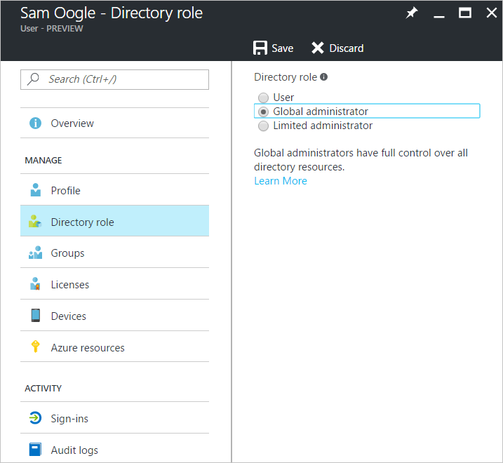

---

title: Add a B2B collaboration user to a role - Azure Active Directory
description: Add a guest user to a role in Azure Active Directory

services: active-directory
ms.service: active-directory
ms.subservice: B2B
ms.topic: conceptual
ms.date: 05/08/2018

ms.author: mimart
author: msmimart
manager: celestedg
ms.reviewer: mal
ms.custom: "it-pro, seo-update-azuread-jan"                 
ms.collection: M365-identity-device-management
---

# Grant permissions to users from partner organizations in your Azure Active Directory tenant

Azure Active Directory (Azure AD) B2B collaboration users are added as guest users to the directory, and guest permissions in the directory are restricted by default. Your business may need some guest users to fill higher-privilege roles in your organization. To support defining higher-privilege roles, guest users can be added to any roles you desire, based on your organization's needs.

## Default role

## Global Administrator Role

## Limited Administrator Role

## Next steps

- [What is Azure AD B2B collaboration?](what-is-b2b.md)
- [B2B collaboration user properties](user-properties.md)
